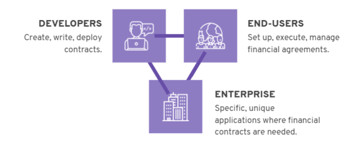

# Tài chính ngang hàng với Marlowe

### **Marlowe phi tập trung các công cụ tài chính cho phép mọi người tạo và thực hiện các thỏa thuận tài chính ngang hàng**

 Ngày 26 tháng 5 năm 2021[ Shruti Appiah](tmp//en/blog/authors/shruti-appiah/page-1/) bài đọc 6 phút

### [**Shruti Appiah**](tmp//en/blog/authors/shruti-appiah/page-1/)

Head of Product

Engineering

- 
- 

Một thời gian trước, tôi đã đăng nhập vào nền tảng giao dịch chứng khoán của mình để mua một số quỹ giao dịch hoán đổi (ETF). Than ôi, nền tảng đã bị sập! Hóa ra là sự gia tăng của cổ phiếu GameStop đã buộc khá nhiều nền tảng giao dịch phải đóng cửa tạm thời. Chúng ta đã không ở trong một cuộc khủng hoảng tài chính và tôi không bao giờ mong đợi rằng ngân hàng hoặc công ty môi giới sẽ chặn tôi sử dụng tiền của chính tôi mà không có cảnh báo. Tôi đã tin rằng tôi sẽ luôn có thể truy cập vào tiền của mình, thực hiện các giao dịch và thu về lợi nhuận hoặc thua lỗ - một dịch vụ mà tôi phải trả một khoản phí cao.

Trong những ngày tiếp theo, một số nhà môi giới chứng khoán và nền tảng giao dịch khác đã bắt đầu chặn người dùng của họ thực hiện các giao dịch không có lợi cho chương trình của nhà môi giới. Robinhood - tự coi mình là nền tảng dân chủ hóa tài chính - đã kiểm duyệt hoàn toàn việc người dùng mua cổ phiếu của GameStop. Chúng ta có bao giờ thực sự kiểm soát được tiền bạc của mình không?

Hầu như tất cả chúng ta đã trao quyền giám sát các khoản tiền của mình cho bên thứ ba, để họ toàn quyền quyết định khi nào các khoản tiền đó có thể được truy cập, sử dụng hoặc thậm chí là giám sát. Điểm chung giữa các ngân hàng và nhà môi giới bên thứ ba này là có một điểm kiểm soát trung tâm. Trong trường hợp của Robinhood và GameStop, chúng ta đã thấy việc tập trung hóa này có thể dẫn đến thất bại như thế nào. Điểm kiểm soát trung tâm có thể bị tác động, tấn công hoặc thao túng bởi một cá nhân tư lợi bên ngoài, điều này chống lại nền tài chính *dân chủ hóa*.

Đây là động lực cốt lõi cho tài chính phi tập trung, thường được gọi là DeFi. DeFi cung cấp một bộ công cụ tài chính tương tự được cung cấp bởi Phố Wall như cho vay, ký quỹ, phái sinh, hoán đổi và chứng khoán. Điều làm cho các nền tảng DeFi nổi bật là khả năng cung cấp các công cụ tài chính này mà không cần các nhà tạo lập thị trường trung tâm, ngân hàng hoặc nhà môi giới. Mỗi thỏa thuận tài chính được thể hiện như một hợp đồng thông minh trên blockchain và được giải quyết theo thuật toán. Bản chất phi tập trung của chúng khiến chúng có khả năng chống chọi tốt hơn với sự thao túng thị trường hoặc sự thất bại của một hệ thống tập trung.

Chúng tôi hiện đang phát triển một bộ sản phẩm Marlowe để dân chủ hóa tài chính và cho phép dễ dàng tiếp cận các thỏa thuận tài chính. Trong đó, **Marlowe Run**, một sản phẩm mới sẽ cho phép người dùng thực hiện liền mạch các thỏa thuận tài chính có sẵn với bạn bè hoặc khách hàng theo cách an toàn và theo cách riêng của họ. Với các tính năng tự động hóa được bổ sung và không cần bên thứ ba, giải pháp ngang hàng này sẽ tiết kiệm chi phí và quan trọng hơn là *dân chủ hóa*.

## **Bộ sản phẩm Marlowe là gì?**

Với Marlowe, chúng tôi đặt mục tiêu phi tập trung tài chính bằng cách tạo điều kiện cho các thỏa thuận ngang hàng chạy trên blockchain. Chúng tôi tìm cách trao quyền cho mọi người tạo ra các công cụ tài chính của riêng họ và thiết lập các thỏa thuận với bất kỳ ai mà họ muốn tương tác. Marlowe sẽ cung cấp một bộ sản phẩm, mỗi sản phẩm phục vụ một chức năng và nhóm người dùng khác nhau. Chiến lược sản phẩm tổng thể của Marlowe bao gồm ba luồng - *Marlowe cho nhà lập trình* , *Marlowe cho người dùng cuối* và *Marlowe cho doanh nghiệp*.

## **Marlowe cho nhà lập trình**

Marlowe dành cho nhà lập trình bao gồm **Marlowe Build** và **Marlowe Play** (còn được gọi là [Marlowe Playground](https://alpha.marlowe.iohkdev.io/#/)) cũng như đầu vào cho  **Thư viện Marlowe**. Marlowe Build và Marlowe Play cho phép phát triển hợp đồng thông minh tài chính từ đầu đến cuối.

Các nhà phát triển có thể soạn mã hợp đồng thông minh trên *Marlowe Build*. Sau đó, họ có thể thực hiện thiết kế lặp đi lặp lại sơ bộ bằng cách sử dụng mô phỏng và chính thức xác minh và thử nghiệm các hợp đồng thông minh trên *Marlowe Play*. Những khả năng này - được kết hợp với ngôn ngữ miền (DSL) dành riêng cho tài chính - đảm bảo rằng các hợp đồng được xây dựng dễ dàng và đơn giản, cũng như được bảo mật, có thể xác minh và được kiểm tra nghiêm ngặt. Sau khi được xây dựng và thử nghiệm, các nhà lập trình có thể đóng góp chúng vào thư viện mẫu hợp đồng thông minh mã nguồn mở của chúng tôi, *Thư viện Marlowe*.

## **Marlowe cho người dùng cuối**

Marlowe dành cho người dùng cuối sẽ mang đến một giao diện trực quan, đơn giản và liền mạch để người dùng thực hiện các thỏa thuận tài chính với bạn bè, đồng nghiệp hoặc khách hàng của họ trên blockchain. Điều này bao gồm **Marlowe Run** và cung cấp quyền truy cập vào nhiều mẫu khác nhau cho các công cụ tài chính từ Thư viện Marlowe. Chúng tôi đang thiết kế những sản phẩm này với tâm thế là người dùng. Để thực hiện các thỏa thuận tài chính trên Marlowe Run, người dùng không cần phải biết thông tin chi tiết về blockchain hoặc cách viết các hợp đồng thông minh. Mọi bước của hợp đồng được giải thích bằng ngôn ngữ phi kỹ thuật và mỗi hành động chỉ được thực hiện khi có sự ủy quyền rõ ràng của người dùng. Đội ngũ của chúng tôi đã xây dựng một bộ công cụ tài chính đã được kiểm tra và xác minh nghiêm ngặt bao gồm ký quỹ, chứng khoán nợ và hoán đổi có thể được sử dụng trên Marlowe Run. Những hợp đồng này - và nhiều hợp đồng mã nguồn mở đã được xác minh khác - được cung cấp thông qua Thư viện Marlowe.

## **Marlowe cho doanh nghiệp**

Marlowe cho doanh nghiệp nhằm mục đích mở rộng DeFi cho người dùng cá nhân, giúp doanh nghiệp tiếp cận những lợi ích hữu hình của hợp đồng thông minh. Điều này sẽ bao gồm một bộ khả năng và thỏa thuận tài chính có thể tùy chỉnh, được thiết kế riêng, được điều chỉnh cho phù hợp với trường hợp sử dụng thương mại, với việc cung cấp các mẫu hợp đồng thông minh áp dụng tiêu chuẩn thống nhất các loại hợp đồng [(Actus)](https://www.actusfrf.org/) cho các hợp đồng tài chính

## **Triển khai Marlowe trên Cardano**

Vào năm 2020, chúng tôi đã triển khai [Marlowe Playground Alpha](https://alpha.marlowe.iohkdev.io/#/). Điều này cung cấp khả năng viết hợp đồng bằng JavaScript, ngoài Haskell hoặc trực tiếp bằng chính Marlowe. Điều này cũng bao gồm các oracle proof-of-concept, với khả năng truy cập dữ liệu bên ngoài như giá cả, trực tiếp từ 'mã' của thị trường chứng khoán hoặc nguồn cấp dữ liệu như Coinbase trong tương lai. Để hỗ trợ việc triển khai, chúng tôi đã xuất bản các bài hướng dẫn để hướng dẫn các nhà lập trình. Kể từ đó, chúng tôi đã xây dựng dựa trên công việc này, tiếp tục cải thiện trải nghiệm người dùng và xây dựng, thử nghiệm và xác thực nhiều mẫu hợp đồng thông minh hơn.

Là một phần trong việc triển khai kỷ nguyên Goguen, chúng tôi hiện đang trong quá trình hoàn thành việc triển khai Marlowe trên Cardano, mang đến cho người dùng và tổ chức cơ hội thực hiện các hợp đồng DeFi mà họ đã tự viết hoặc tải xuống từ kho lưu trữ hợp đồng. Trước hết, Marlowe sẽ chạy trên blockchain Cardano, nhưng nó là blockchain-agnostic nên có thể chạy trên các blockchain khác để tiếp cận nhiều đối tượng hơn nữa trong tương lai.

## **Điều gì sẽ diễn ra tiếp theo đó?**

Marlowe dành cho người dùng cuối sẽ triển khai theo từng giai đoạn trong suốt năm 2021. Đầu tiên, là các bộ mẫu của Marlowe Run, nơi người dùng có thể demo và thử nghiệm các thỏa thuận tài chính của riêng họ. Điều này sẽ bao gồm một bộ các mẫu hợp đồng tài chính thông minh  mà người dùng có thể tùy chỉnh theo nhu cầu của họ. Các mẫu này sẽ cho phép người dùng khám phá trải nghiệm thực hiện các thỏa thuận tài chính theo cách phi tập trung, tất cả đều theo cách ngang hàng mà không yêu cầu bên thứ ba trích xuất giá trị. Để sử dụng các mẫu Marlowe Run, người dùng không cần sở hữu bất kỳ token thực nào, vì vậy họ có thể thử bản demo trước khi bắt đầu. Đợt triển khai này sẽ bao gồm một bộ công cụ tài chính mẫu, do các nhà lập trình nội bộ của chúng tôi xây dựng. Các mẫu này có thể được sử dụng để thực thi các thỏa thuận thử nghiệm trên Marlowe Run.

Chúng tôi cam kết cung cấp bộ sản phẩm này cho hệ sinh thái Marlowe nhằm trao quyền cho mọi người trên toàn cầu xây dựng, kiểm soát và thực thi các công cụ tài chính của riêng họ theo các điều kiện của họ.

*Chúng tôi đang lên kế hoạch cho một loạt hội thảo trên web về tài chính phi tập trung với Marlowe (bắt đầu từ ngày 3 tháng 6), bạn có thể [đăng ký trên trang web](https://webinar.marlowe-finance.io/) của chúng tôi để tham gia các hội thảo trên website ngay bây giờ!   Bài này được dịch bởi Thanhtintran, soát xét bởi Brit Nguyễn, <a>với bài gốc https://iohk.io/en/blog/posts/2021/05/26/reimagining-peer-to-peer-finance-with-marlowe/</a> <em>Dự án này được tài trợ bởi Catalyst.</em>*
