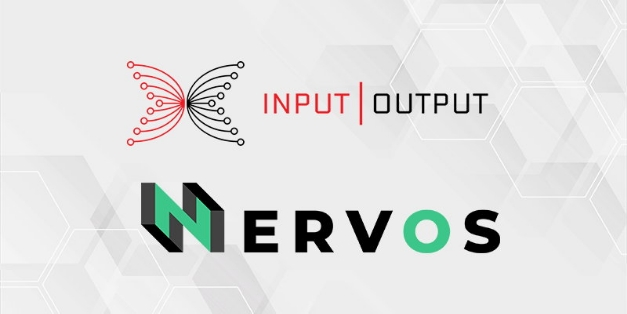

# Nervos hợp tác xây dựng cầu nối crosschain đầu tiên với Cardano

### **Sự hợp tác mới của chúng tôi cho phép những người nắm giữ token Cardano và Nervos giao dịch tài sản của họ trên cả hai nền tảng đồng thời xây dựng khả năng tương tác trên không gian tiền mã hóa**

 Ngày 2 tháng 6 năm 2021[ Eric Czuleger](tmp//en/blog/authors/eric-czuleger/page-1/) bài đọc 3 phút

### [**Eric Czuleger**](tmp//en/blog/authors/eric-czuleger/page-1/)

Senior Content Editor

Marketing &amp; Communications

- 
- 
- 

IOHK và Nervos đang hợp tác để xây dựng một cầu nối về khả năng tương tác giữa Cardano và mạng lưới Nervos. Sau khi hoàn thành, cầu nối crosschain tiên phong này sẽ cho phép người dùng giao dịch tài sản giữa hai blockchain. Mục tiêu cuối cùng là thúc đẩy khả năng tương tác tốt hơn trong quá trình mở rộng phạm vi tiếp cận toàn cầu và tính thiết thực của cả Nervos và Cardano.

Nervos Common Knowledge Base (CKB) là một giao thức blockchain layer 1, mã nguồn mở, proof of work, không cần cấp phép, tập trung vào việc tạo nền tảng cho một mạng công cộng có thể tương tác. Nó cho phép mọi tài sản tiền mã hóa được lưu giữ trong một môi trường an toàn, bất biến và không cần sự cho phép với lợi ích bổ sung của các hợp đồng thông minh và mở rộng quy mô layer 2.

Nervos đang phát triển mạng lưới mạnh mẽ này thông qua ba thành phần chính. Những thành phần này tạo ra một giấy thông hành phổ cập để Nervos tiếp cận khả năng tương tác thế hệ tiếp theo.

- **PW Core** - cho phép các nhà phát triển xây dựng các ứng dụng trên tất cả các chuỗi
- **Nervos Polyjuice**- một layer tương thích với Ethereum cho phép các nhà phát triển chuyển một hợp đồng thông minh từ Ethereum sang Nervos
- **Force Bridge** - một cầu nối không cần tin cậy cho phép các giao dịch crosschain giữa Nervos với một loạt các blockchain khác. Nervos sẽ sử dụng Force Bridge để kết nối trực tiếp với Cardano, có nghĩa là người dùng sẽ có thể giao dịch bằng ví Cardano hiện có của họ.

## **Kết nối các blockchains với các tokens có thể vận chuyển**

Vậy điều này có ý nghĩa gì trong thực tế? Người nắm giữ Nervos CKByte (CKB) và ada sẽ có thể giao dịch hoán đổi cả hai loại tiền tệ cho nhau. Người dùng Nervos cũng sẽ có thể tận dụng tiêu chuẩn tài sản gốc của Cardano để tạo token có thể được chuyển và sử dụng trên cả hai mạng. Trên hết, cầu nối cho phép các nhà phát triển trên cả hai chuỗi có quyền truy cập vào các dịch vụ và tính năng để mở rộng hệ sinh thái DApp và cơ sở người dùng của họ.

[Mousebelt](https://www.mousebelt.com/), một công cụ tăng tốc blockchain đầy đủ dịch vụ, sẽ xây dựng cầu nối với sự hỗ trợ tài chính từ Nervos. Đội ngũ Cardano sẽ đóng góp chuyên môn và nguồn lực để kết nối Cardano với cầu nối. Công việc phát triển đang được tiến hành và dự kiến ​​sẽ hoàn thành trong sáu tuần tới.

Kevin Wang, đồng sáng lập của Nervos, cho biết: 'Việc sử dụng Force Bridge để liên kết mạng lưới Nervos với Cardano đặc biệt thú vị nhờ mối quan hệ mà chúng tôi đã xây dựng với IOHK'. 'Chúng tôi đã và đang phát triển quan hệ đối tác nghiên cứu và phát triển, nhưng chúng tôi sẽ sớm có một cầu nối hữu hình để thể hiện sức mạnh của Force Bridge và thúc đẩy chúng tôi tiến xa hơn trên con đường tiến tới một mạng lưới chức năng và tương tác.'

Cầu nối này chỉ là một phần trong sự hợp tác của chúng tôi với Nervos. Romain Pellerin, Giám đốc công nghệ tại Input Output cho biết: 'Romain Pellerin, CTO tại Input Output cho biết: “Chúng tôi chia sẻ tầm nhìn về một thế giới hoạt động dựa trên một 'chòm sao' các chuỗi khối tương tác với nhau. 'Chúng tôi tin rằng nghiên cứu học thuật là nền tảng để thúc đẩy toàn bộ không gian tiền mã hóa. Cùng nhau, chúng tôi cũng sẽ là đồng tác giả của các bài báo học thuật để đi tiên phong trong việc cải tiến mô hình UTXO, khám phá các tiêu chuẩn kế toán tiêu chuẩn và đóng góp vào sự phát triển trong tương lai của công nghệ phi tập trung thông qua nghiên cứu mã nguồn mở.

Công nghệ blockchain sẽ chỉ đạt được sự chấp nhận chính thống khi những người dùng cuối không bị khóa vào một blockchain hoặc một tiêu chuẩn, nhưng có thể truy cập giá trị và tiện ích liền mạch , bất kể họ đang sử dụng blockchain nào. Pellerin tiếp tục: 'Những cầu nối như thế này là điều cần thiết để đảm bảo rằng người dùng có trải nghiệm liền mạch. Bằng cách kết nối các cộng đồng của chúng tôi và tìm ra những cách thức mới sáng tạo để làm việc cùng nhau, như chúng tôi đã làm với Nervos, chúng tôi có thể đảm bảo rằng blockchain hoạt động theo sứ mệnh của nó là tạo ra một hệ thống điều hành tài chính toàn cầu công bằng và hiệu quả hơn.'

*Hãy xem [trang web của Nervos](https://www.nervos.org/) để biết thêm thông tin về quan hệ đối tác và các sáng kiến ​​nghiên cứu sắp tới. Bài này được dịch bởi Lê Nguyên, Review bởi Quang Pham, Biên tập bởi ...Nguồn bài viết [tại đây] ( https://iohk.io/en/blog/posts/2021/06/02/nervos-partnership-to-build-the-first-cross-chain-bridge-with-cardano/) *Dự án này được tài trợ bởi Catalyst**
