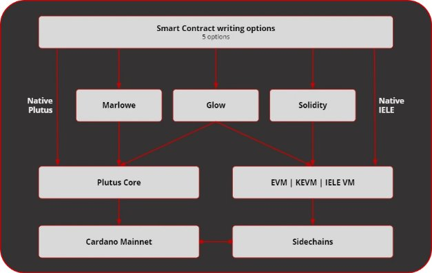

# Cận cảnh phần mềm trên Cardano

### **Tìm hiểu về các thành phần tương tác để chạy nền tảng blockchain**

 8 tháng 6 năm 2021  [Niamh Ahern](tmp//en/blog/authors/niamh-ahern/page-1/)  5 phút đọc

### [**Niamh Ahern**](tmp//en/blog/authors/niamh-ahern/page-1/)

Education Manager

Education

- 
- 
- 
- 

Cardano đã được thiết kế ở dạng các mô-đun, với các thành phần liên kết có thể được sử dụng theo nhiều cách khác nhau. Các thành phần này tạo thành 'ngăn xếp nền tảng' (platform stack) của Cardano. Họ làm việc cùng nhau để hỗ trợ việc xây dựng và sử dụng blockchain Cardano trực tiếp.

Chúng tôi hiện đang ở trong giai đoạn đầu testnet (mạng thử nghiệm) từng bước đến hard fork Alonzo, điều này sẽ mang lại khả năng hợp đồng thông minh đầy đủ cho Cardano. Quá trình này rất phức tạp, đòi hỏi phải nâng cấp ổn định các yếu tố khác nhau tạo nên nền tảng Cardano, cũng như tích hợp và thử nghiệm chúng thật kỹ lưỡng. Vì vậy, đây là thời điểm tốt để xem lại các thành phần này, giải thích một số thuật ngữ và khám phá cách chúng tương tác trong 'platform stack'.

## **Các thành phần của Cardano**

**Hình 1. Các thành phần giao tiếp với nút Cardano**

Platform stack cho Cardano bao gồm các thành phần cốt lõi sau:

- Cardano node (và các quy trình liên quan)
- Ví Cardano
- Giao diện dòng lệnh ví (CLI)
- DB Sync (đồng bộ hóa dữ liệu blockchain với cơ sở dữ liệu quan hệ)
- Cơ sở dữ liệu PostgreSQL (tương tác với GraphQL, REST API và Smash)
- Máy chủ Smash
- Rosetta API (giao thức truyền thông blockchain)

Lưu ý rằng ví Daedalus không phải là một phần của stack lõi, nhưng giao tiếp với các thành phần trên (Hình 1).

### **Node và lớp mạng**

Đầu tiên, chúng ta hãy xem xét [Cardano node](https://github.com/input-output-hk/cardano-node). Phần mềm này chạy trên máy tính của bạn và làm nền tảng cho mạng, cho phép mọi người tham gia vào blockchain phi tập trung. Node tích hợp sự đồng thuận, sổ cái và các thành phần phụ của mạng, cung cấp cấu hình cấp cao nhất, API, CLI, khả năng ghi nhật ký, quản lý bộ nhớ và giám sát có thể được sử dụng bởi các thành phần Cardano khác hoặc bởi những người dùng có kỹ năng. Daedalus là một ví đầy đủ các node, vì vậy nếu bạn đang chạy ví đó trên máy cục bộ của mình, bạn đang giúp chạy mạng một cách hiệu quả.

*Lớp mạng*

Tiếp theo, chúng ta có lớp mạng. Điều này liên kết mỗi nút Cardano thành một hệ thống phân tán quản lý blockchain và các dịch vụ liên quan. Mạng bao gồm một tập hợp các node giao tiếp với nhau để duy trì sổ cái phân tán, hỗ trợ gửi giao dịch và tương tác với ví của người dùng và các dịch vụ khác. Cốt lõi của mạng được xây dựng xung quanh các node phi tập trung - các nhóm cổ phần - xác nhận chung các block và thêm các block mới vào chuỗi. Chúng được hỗ trợ bởi các node chuyển tiếp chuyên dụng quản lý các kết nối mạng và thiết lập cấu trúc của mạng nói chung. Các node dành riêng cho người tiêu dùng chạy trên ví Daedalus và các dịch vụ khác kết nối với mạng này để theo dõi và gửi các giao dịch trên chuỗi.

Các node Cardano duy trì kết nối với các node ngang hàng. Một tập hợp các giao thức nhỏ cho phép giao tiếp giữa các node. Mỗi giao thức nhỏ thực hiện một yêu cầu trao đổi thông tin cơ bản, chẳng hạn như thông báo cho các node khác về block mới nhất, chia sẻ block khi cần thiết hoặc chia sẻ các giao dịch mới xung quanh mạng Cardano. Đối với mục đích kết nối, các giao thức nhỏ được xác định bởi phiên bản của giao thức mạng.

### **Chương trình phụ trợ của ví Cardano**

[Cardano wallet backend](https://github.com/input-output-hk/cardano-wallet) hỗ trợ giao diện người dùng đồ họa của ví Daedalus. Nó được sử dụng để gửi và nhận ada. Đằng sau chuỗi, ví chạy một Cardano node đầy đủ. Không giống như ví nhẹ của khách hàng, nó tải toàn bộ sổ cái được chia sẻ và xác thực tất cả các giao dịch, do đó tăng cường bảo mật của blockchain cho mọi người.

### **Giao diện dòng lệnh của ví (CLI)**

Giao diện dòng lệnh của ví (CLI) hỗ trợ các tương tác với blockchain thực tế. Người dùng có kiến thức cao hơn có thể sử dụng CLI kết hợp làm việc với các công cụ để tạo khóa, xây dựng giao dịch, tạo chứng chỉ và thực hiện các tác vụ khác. Nó được tổ chức theo một hệ thống phân cấp các lệnh con và mỗi cấp đi kèm với tài liệu tích hợp riêng về cú pháp lệnh và các tùy chọn.

### **DB Sync**

[DB Sync](https://github.com/input-output-hk/cardano-db-sync) là một thành phần tuân theo các hoạt động trên chuỗi Cardano và lưu trữ các block và giao dịch trong PostgreSQL. Là một thành phần 'phần mềm trung gian', nó cung cấp năng lượng cho [cardano-graphql](https://github.com/input-output-hk/cardano-graphql). DB Sync lưu trữ dữ liệu blockchain được lấy từ [cardano-node](https://github.com/input-output-hk/cardano-node) trong cơ sở dữ liệu trung gian để cho phép các giao diện cấp cao hơn cho việc khám phá blockchain. Nó cũng cung cấp một số truy vấn để lấy dữ liệu blockchain Cardano từ PostgreSQL và hỗ trợ các dịch vụ như [Cardano Explorer](https://explorer.cardano.org/en.html), một giao diện người dùng đồ họa lấy dữ liệu blockchain một cách đơn giản. Cardano GraphQL là một API đa nền tảng cho ngôn ngữ truy vấn dữ liệu GraphQL.

### **Rosetta API**

Giao diện lập trình ứng dụng Rosetta cung cấp giao diện cấp cao nhằm mục đích làm cho quá trình tích hợp dễ dàng hơn, nhanh hơn và đáng tin cậy hơn để bạn có thể xây dựng một lần và tích hợp blockchain của mình ở mọi nơi. Chúng tôi đã triển khai tạo một [cardano-rosetta](https://github.com/input-output-hk/cardano-rosetta) duy nhất để đơn giản hóa quá trình tích hợp với Cardano. Giao diện này đặc biệt hữu ích cho các sàn giao dịch, vì họ có thể tương tác với chuỗi Cardano bằng cách sử dụng cùng một giao diện mà họ sử dụng với các blockchain khác.

### **Nhìn về tương lai**

Với các [hợp đồng thông minh](https://iohk.io/en/blog/posts/2021/04/08/smart-contracts-%E2%80%93-here-we-come/) sắp có mặt trên Cardano, điều này có nghĩa là [Plutus](https://iohk.io/en/blog/posts/2021/04/13/plutus-what-you-need-to-know/), ngôn ngữ hợp đồng thông minh native và các ngôn ngữ phát triển hợp đồng thông minh khác như [Marlowe](https://iohk.io/en/blog/posts/2021/05/26/reimagining-peer-to-peer-finance-with-marlowe/) cho tài chính và [Glow](https://glow-lang.org/) cho DApps sẽ được tích hợp vào stack Cardano. Các kỹ sư của IO Global sẽ cung cấp các thành phần mới và mở rộng để biên dịch các tập lệnh Plutus, Marlowe và Glow, gửi chúng trên chuỗi và tương tác với chúng (Hình 2).

**Hình 2. Plutus, Marlowe, Glow, Solidity và IELE đều có thể được sử dụng để viết các hợp đồng thông minh Cardano**

Bản [nâng cấp giao thức Alonzo](https://iohk.io/en/blog/posts/2021/04/08/smart-contracts-%E2%80%93-here-we-come/) sẽ được xây dựng dựa trên các bản nâng cấp token gần đây và đang được triển khai cho mạng chính thông qua một số mạng thử nghiệm. Các đối tác Plutus của chúng tôi và Plutus Pioneers sẽ giúp chúng tôi kiểm tra Plutus Core và sẽ là một phần của giai đoạn chấp nhận người dùng trước khi triển khai mạng chính. Tại thời điểm này, chúng tôi sẽ chính thức thêm các thành phần Plutus và Marlowe, chẳng hạn như cả hai trình thông dịch, vào stack nền tảng của Cardano.

*Để cập nhật thông tin giới thiệu Alonzo, vui lòng kiểm tra các kênh xã hội và trang blog của chúng tôi.*

Bài này được dịch bởi LinhPool, Review bởi tienna và đăng bài bởi Nguyễn Hiệu.

 Nguồn bài dịch [tại đây](https://iohk.io/en/blog/posts/2021/06/08/a-close-look-at-the-software-running-cardano/) 
 
 *Dự án này được tài trợ bới Catalyst*
