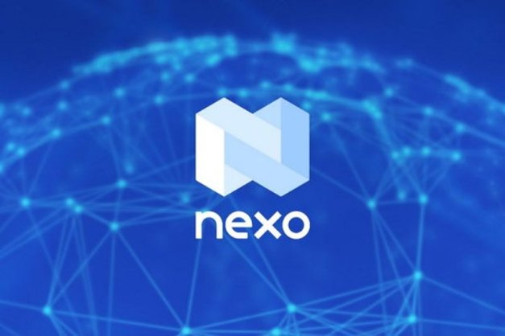

# Nền tảng cho vay kỹ thuật số Nexo tích hợp vào Cardano
Cho phép chủ sở hữu ada vay và kiếm tiền từ danh mục đầu tư tiền mã hóa đa dạng.

### **Mối quan hệ hợp tác gần đây nhất với một công ty tiền mã hóa hàng đầu thế giới đã mở rộng hơn nữa hệ sinh thái Cardano và đưa người dùng mới đến với ada**

 Ngày 30 tháng 6 năm 2021[ Eric Czuleger](tmp//en/blog/authors/eric-czuleger/page-1/) bài đọc 3 phút

### [**Eric Czuleger**](tmp//en/blog/authors/eric-czuleger/page-1/)

Senior Content Editor

Marketing &amp; Communications

- 
- 
- 

Nexo bắt đầu sự hợp tác mang tính bước ngoặt với IOHK để tích hợp hoàn toàn Cardano vào nền tảng của họ. Điều này sẽ cho phép chủ sở hữu ada mua, vay, cho vay và bán tiền mã hóa trên Nexo Exchange, đồng thời kiếm được lãi suất lên đến 8% trên số tiền nắm giữ của họ hoặc truy cập vào tín dụng được thế chấp bởi ada. Sự hợp tác này làm tăng tiện ích của ada và nâng cao giá trị cũng như phạm vi tiếp cận của Cardano.

Khi chúng tôi tiến tới việc nâng cấp Alonzo, IOHK đang thiết lập quan hệ đối tác chiến lược với các tổ chức như [Orion](https://iohk.io/en/blog/posts/2021/06/23/orion-to-bring-one-stop-crypto-marketplace-to-cardano/) và [Nervos](https://iohk.io/en/blog/posts/2021/06/02/nervos-partnership-to-build-the-first-cross-chain-bridge-with-cardano/) để mở rộng hệ sinh thái Cardano. Giờ đây, chúng tôi đang thêm Nexo vào danh sách cộng tác viên ngày càng mở rộng của mình. Nexo là một tổ chức hàng đầu để xây dựng giá trị trong không gian tài chính phi tập trung (DeFi). Việc tích hợp Cardano xuất phát từ nhu cầu ngày càng tăng từ cả khách hàng Nexo và chủ sở hữu ada. Việc thêm Cardano vào Nexo khiến lợi nhuận trên [Crypto &amp; Fiat Suite](https://nexo.io/earn-crypto) và Instant Crypto Credit Linesâ tăng lên, nâng tổng số tài sản có thể sử dụng của người tham gia lên 20.

Đây chỉ là lần thứ hai Nexo đưa một tài sản lên sàn thông qua hệ thống tích hợp mới của họ. Mục tiêu là để đáp ứng nhu cầu của khách hàng trong khi vẫn đáp ứng nhu cầu ngày càng tăng về tiền mã hóa. Sự quan tâm ngày càng tăng đối với công nghệ blockchain đã khiến Nexo hợp tác chặt chẽ với các dự án như Cardano, đồng thời giúp mọi người dễ dàng đầu tư vào cả tài sản kỹ thuật số và tài sản truyền thống.

Antoni Trenchev, đồng sáng lập và là quản lý của Nexo, cho biết:

Các tổ chức blockchain như Nexo và Cardano có rất nhiều tiềm năng để hỗ trợ nhau một cách nghiêm túc trong lĩnh vực tài chính kỹ thuật số và tôi thực sự xúc động khi thấy điều đó xảy ra. Hoạt động kinh doanh của Nexo tạo ra tiện ích bổ sung cho ada, giảm áp lực bán, nâng cao giá trị của nó và tạo ra một lượng lớn người dùng, bao gồm cả những người có thể mới bắt đầu tiếp cận tiền mã hóa. Có qua có lại, Cardano mở rộng tổng thị trường của chúng tôi đồng thời cũng mở rộng tệp khách hàng hiện tại khi đầu tư vào các quỹ thông qua nền tảng của chúng tôi.

Điều này phù hợp với tầm nhìn của Giám đốc kỹ thuật IOHK, Romain Pellerin, người coi khả năng tương thích là điều cần thiết để áp dụng tiền mã hóa và công nghệ blockchain một cách chính thống. Ông nói:

Đưa Nexo vào hệ sinh thái đang phát triển của chúng tôi sẽ mang lại cho cộng đồng Cardano nhiều lựa chọn và tiện ích hơn nữa cho ada. Làm việc cùng với Nexo để giúp quá trình này thân thiện với người dùng, đặc biệt đối với những người mới sử dụng tiền mã hóa, điều này sẽ khuyến khích việc áp dụng tiền mã hóa rộng rãi hơn, đồng thời những tính năng độc đáo của Nexo là hoàn toàn phù hợp với IOHK.

Nexo là một doanh nghiệp tài sản kỹ thuật số hàng đầu được quản lý với sứ mệnh tối đa hóa giá trị và tiện ích của tiền mã hóa. Họ cung cấp khả năng trao đổi, giao dịch, mua bán tức thì và một loạt các dịch vụ khác được giám sát và bảo mật tuyệt đối từ công nghệ của Ví Nexo. Hãy tìm hiểu thêm về Nexo tại [trang web](https://nexo.io) chính thức của họ.

Bài này được dịch bởi Thanhtintran, review bởi Brit Nguyễn và đăng bài bởi Nguyễn Hiệu.

Nguồn bài viết [tại đây](https://iohk.io/en/blog/posts/2021/06/30/digital-lending-platform-nexo-integrates-cardano)

*Dự án này được tài trợ bởi Catalyst*
