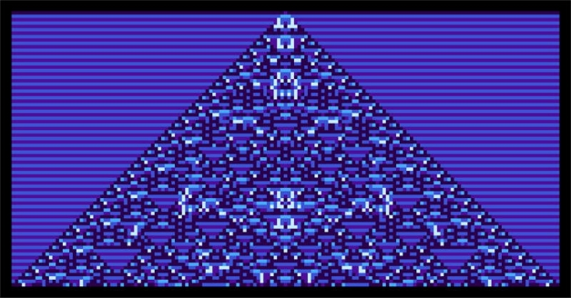

# Wolfram và Cardano xây dựng cộng đồng với NFT và Liveminting

### **Một góc nhìn đầy cảm hứng về vai trò của NFT từ Giám đốc điều hành Jon Woodard của Wolfram Blockchain Labs**

 22 tháng 7 năm 2021  [Jon Woodard](tmp//en/blog/authors/jon-woodard/page-1/)  5 phút đọc

### [**Jon Woodard**](tmp//en/blog/authors/jon-woodard/page-1/)

CEO (Wolfram Blockchain Labs)

Guest author

- 

Khi ảnh hưởng của đại dịch đã giảm, chúng ta có thể kết nối lại với cộng đồng và tập trung vào một tầm nhìn chung cho tương lai. Chúng ta đang ở đỉnh cao của thời kỳ phục hưng công nghệ, báo trước những cách thức mới để tạo ra các kết nối bền vững. Ở Wolfram Blockchain Labs (WBL), chúng tôi nhìn thấy trước một tương lai nơi những khoảnh khắc quan trọng có thể được tạo ra, lưu trữ và chia sẻ trong thời gian thực để gắn kết cộng đồng với nhau nhiều hơn. Nguồn cảm hứng đến từ chuyến đi gần đây của tôi đến Bitcoin Miami 2021, ở đó tôi đã tham dự Cardano Meetup.

Một trong những phần tốt nhất trong công việc của tôi với tư cách là Giám đốc điều hành của [Wolfram Blockchain Labs](https://www.wolframblockchainlabs.com/) là tương tác với các thành viên cộng đồng của các cộng tác viên Blockchain của chúng tôi. Khi xem xét cách hệ sinh thái WBL có thể trở nên toàn cầu và phi tập trung, tôi nhận ra rằng phi tập trung không chỉ là thay đổi công nghệ. Đó là về việc thay đổi cách chúng ta tương tác với các cộng đồng trong khi vẫn cho phép các kiểu cộng tác mới.

Giờ đây, chúng tôi có thể kết nối cộng đồng thông qua mạng toàn cầu, đồng thời làm việc độc lập và tập thể hướng tới một tương lai chung. Điều này đã được thể hiển đầy đủ tại Cardano Meetup ở Miami. Tại đó, tôi thấy những người ủng hộ Cardano đoàn kết với nhau bằng một niềm tin chung. Các cộng đồng như thế này sẽ trở thành vững chắc hơn trong tương lai.

Tôi rất xúc động trước sự nhấn mạnh của mọi người vào việc xây dựng một hệ thống toàn cầu để giúp các cá nhân đạt được sự độc lập về tài chính cho gia đình và cộng đồng của họ. Sau khi chứng kiến sức mạnh cộng đồng toàn cầu của Cardano, tôi nhận ra rằng cảm giác “bên nhau” này được kết tinh bởi các Token không thể thay thế (NFT). Hãy để tôi giải thích ý của tôi về điều này và những gì chúng tôi sẽ làm với nó:

**Trải nghiệm NFT**

NFT đã khơi dậy trí tưởng tượng toàn cầu theo cách mà các đợt phát hành Coin lần đầu (ICO) chưa làm được. Mặc dù chủ yếu tập trung vào đầu cơ và cash value, cuộc thảo luận đã thúc đẩy thế giới có cái nhìn khác về các hệ thống, dịch vụ và ứng dụng phi tập trung. NFT có thể giống như một ham mê, một bong bóng giống như hoa Tulip. Nhưng có một điều quan trọng, chúng là những đại diện bất biến, không thể thay đổi của giá trị và một bản sắc riêng.

Bộ sưu tập là một cách đáng chú ý để thể hiện những gì một người coi là có giá trị trong khi kết nối cá nhân với cộng đồng toàn cầu, giống như cách mà tất cả mọi người tại Cardano Meetup đã được kết nối. Điều này cực kỳ mạnh mẽ. Trong khi nhiều mô hình hiện đang tôn vinh sự phù du và nhất thời, thì NFT là thứ vượt thời gian. Khi cho phép cộng đồng ghi lại và kỷ niệm các sự kiện quan trọng như sinh nhật, tốt nghiệp hoặc đám cưới, chúng tôi có thể thu hút mọi người lại với nhau xung quanh các mục tiêu chung và hướng tới một tương lai chung.

**Liveminting với Ngôn ngữ Wolfram và Cardano**

Kể từ tháng 1 năm 2021, WBL đã học về các sắc thái của Cardano và tích hợp Cardano Blockchain vào Ngôn ngữ Wolfram. Một trong những điều thú vị nhất mà chúng tôi đang hợp tác với IOHK là triển khai các công cụ và đấu giá NFT để đưa [LiveMinting.com](https://www.liveminting.com/) vào cuộc sống, được cung cấp bởi Cardano.

Trong một [sự kiện phát trực tiếp](https://youtu.be/pMfrRFNCKhE) sắp tới diễn ra vào ngày 27 tháng 7 lúc 1:00 PM CT, Stephen Wolfram (Giám đốc điều hành của Wolfram Research) và một nhóm các nhà phê bình văn hóa sẽ đưa trải nghiệm NFT vào cuộc sống tại một trong những sự kiện "Liveminting" đầu tiên trên thế giới - quá trình đúc (hoặc xử lý) NFT trong thời gian thực trên Cardano Blockchain. Liveminting sẽ biến Hệ tự hành dạng tế bào của Wolfram (các vật phẩm từ vũ trụ điện toán) thành các tác phẩm nghệ thuật đặt làm riêng được chứng nhận thành NFT trong thời gian thực. Điều này sẽ tạo ra một NFT đầu tiên của loại hình này.

Đây chỉ là bước khởi đầu của các giải pháp từ công việc của WBL và IOHK. WBL sẽ sớm đưa hàm MintNFT vào Ngôn ngữ Wolfram, sử dụng tích hợp Cardano Blockchain. Bạn có thể nhận được lời giải thích chi tiết hơn về công việc thú vị mà chúng tôi đã thực hiện trong Ngôn ngữ Wolfram bằng cách đọc [bài đăng trên Blog Wolfram](https://blog.wolfram.com/2021/07/21/liveminting-nfts-with-the-wolfram-language-on-the-cardano-blockchain/) của tôi.

**Phân tích NFT, cộng đồng, người sáng tạo và thương hiệu**

Chúng tôi tin rằng các nhà sản xuất NFT và thị trường sẽ bắt đầu phát triển mạnh khi chúng trở nên dễ tiếp cận và có những hiểu biết chung. Vì vậy, chúng tôi đang làm việc để chính thức hóa các chỉ số và chức năng cụ thể. Chúng sẽ làm nổi bật các phân tích như hiệu suất NFT và doanh số bán hàng trong một cộng đồng cụ thể. Những phân tích này sẽ không chỉ cung cấp góc nhìn sâu sắc về mức độ phổ biến của một loại NFT mà còn cho thấy cách các loại NFT khác nhau có thể phục vụ để thu hút các thành viên cộng đồng lại với nhau thông qua việc chia sẻ kinh nghiệm.

Chúng tôi nhìn thấy một tương lai nơi những người sáng tạo thuộc mọi loại hình sẽ có thể tổ chức các sự kiện Liveminting hấp dẫn để làm nổi bật những trải nghiệm tuyệt vời cho cộng đồng. Trong khi đó, các thương hiệu truyền thống tăng cường kết nối và cảm giác thân thuộc trong cộng đồng hình thành xung quanh sản phẩm. Tất cả điều này sẽ được cung cấp bởi  Cardano Blockchain và Ngôn ngữ Wolfram.

**Một động lực thân thuộc**

Trải nghiệm NFT và cảm giác thân thuộc vốn có chắc chắn sẽ thúc đẩy các thành viên cộng đồng Cardano tạo ra trải nghiệm NFT cho những người bên ngoài Cardano. Giống như những gì chúng ta đã thấy với tác động tức thì của NFT đối với văn hóa đại chúng, những trải nghiệm này sẽ giúp thu hút nhiều người hơn vào cộng đồng của chúng ta.

Tôi rất vui vì WBL là một trong những tổ chức đầu tiên tạo ra những trải nghiệm mới về NFT. Tôi cũng rất vui khi thấy điều gì sẽ diễn ra khi chúng tôi dân chủ hóa các công cụ NFT để mọi người có thể tham gia vui vẻ. Chúng tôi tin rằng điều này sẽ thúc đẩy kết nối toàn cầu và xã hội, người dùng có nhiều quyền kiểm soát hơn đối với các sáng tạo của họ. Điều này sẽ tiếp tục khi chúng tôi dân chủ hóa các dịch vụ tài chính. Bài này được dịch bởi Nguyễn Văn Tú, Review và đăng bài bởi Nguyễn Hiệu. Bài viết nguồn [tại đây](https://iohk.io/en/blog/posts/2021/07/22/wolfram-and-cardano-build-communities-with-nfts-and-liveminting). *Dự án này được tài trợ bởi Catalyst*.
