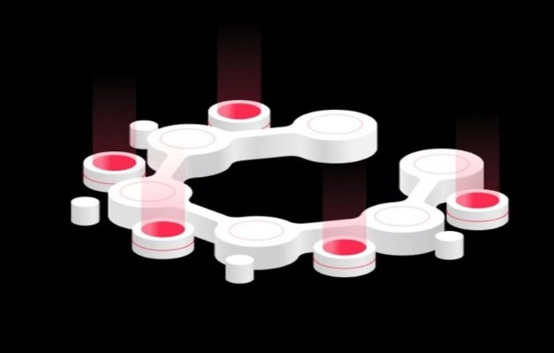
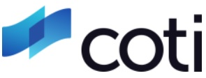
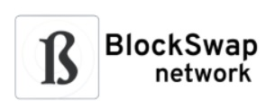
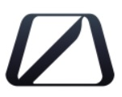

# Chi tiết hơn về cFund

### **Được công bố lần đầu tiên tại hội nghị thượng đỉnh Shelley năm ngoái, cFund là một quỹ đầu tư giai đoạn đầu tập trung vào các công ty đổi mới chủ yếu sử dụng Cardano Blockchain và công nghệ của nó.**

28 tháng 7 năm 2021 [Fernando Sanchez](tmp//en/blog/authors/fernando-sanchez/page-1/) 5 phút đọc

### [**Fernando Sanchez**](tmp//en/blog/authors/fernando-sanchez/page-1/)

Người viết kỹ thuật

Tiếp thị và Truyền thông

- 
- 

Khi chúng tôi tiến gần hơn đến các hợp đồng thông minh trên Cardano, hoạt động quỹ hiện đang được tăng tốc. Chúng tôi đã nói chuyện với Giám đốc David Roebuck của Wave Financial để tìm hiểu thêm về quỹ và các mục tiêu của quỹ.

### **CFund là gì?**

CFund là một quỹ đầu tư tiền mã hoá được quản lý bởi Wave Financial, hợp tác với IOG. Quỹ áp dụng chiến lược mạo hiểm giai đoạn đầu và đầu tư vào các công ty công nghệ sáng tạo đang phát triển các ứng dụng, doanh nghiệp và sản phẩm đang được triển khai trên Cardano và trong các dự án R&amp;D khác mà IOG đang thực hiện.

### **Tại sao lại đặt tên là *c*Fund?**

Chữ “c” trong tên là tham chiếu đến thuật ngữ toán học “Coefficient" (hệ số) dùng để chỉ số nhân của một biến. Tận dụng cả kiến thức chuyên môn về lĩnh vực của IOG, Wave Financial và các kết nối trong ngành, cFund được định vị để tạo ra hiệu ứng cấp số nhân cho các công ty trong danh mục đầu tư về tốc độ tăng trưởng và phạm vi tiếp cận.

### **Cơ sở lý luận cho việc giới thiệu cFund là gì?**

IOG tập trung vào việc hoàn thành hai mục tiêu. Một là cho phép các nhà phát triển xây dựng giải pháp dựa trên Blockchain có khả năng mở rộng, tương tác và bền vững. Mục tiêu thứ hai là thúc đẩy sự hòa nhập tài chính cho những người chưa được phục vụ trên thế giới. Cuối cùng, IOG nhằm mục đích tạo ra một cơ sở hạ tầng tài chính mới cho các nền kinh tế mới nổi bằng cách xây dựng một cộng đồng DApp và các giao thức được triển khai trên Cardano và các Blockchain khác.

Để đạt được tầm nhìn này, IOG đã hợp tác với Wave Financial, một nhà quản lý tài sản kỹ thuật số có tài sản trị giá ~ 500 triệu USD được quản lý thông qua nhiều chiến lược và sản phẩm khác nhau để tạo ra **cFund**.

### **Làm thế nào để cFund phù hợp với toàn bộ hệ sinh thái (Cardano, Project Catalyst, v.v.)?**

Trong khi cFund, IOG và Cardano Foundation đều hoạt động độc lập, họ tìm kiếm cơ hội để cộng tác. Đặc biệt cFund đánh giá và cung cấp lời khuyên chiến lược cho các công ty có danh mục đầu tư muốn triển khai trên Cardano Blockchain.

### **Hãy cho chúng tôi biết thêm về cách tiếp cận đầu tư**

cFund được tài trợ bởi bên thứ ba, các cá nhân có giá trị ròng cao, các văn phòng gia đình và các nhà đầu tư tổ chức (bao gồm cả IOG). cFund mong muốn đầu tư và hợp tác với các dự án và doanh nghiệp ngay từ giai đoạn đầu mà chủ yếu tập trung vào hệ sinh thái Cardano và công nghệ liên quan. Quỹ hiện đang tích cực triển khai vốn và tạo quan hệ đối tác trên toàn bộ hệ sinh thái Cardano.

Khi phân tích các cơ hội đầu tư, cFund thực hiện một cách tiếp cận có kỷ luật, xem xét nhiều yếu tố khi đánh giá một cơ hội. Thứ nhất, quỹ đánh giá xem có nhu cầu rõ ràng trên thị trường đối với sản phẩm mà một công ty cung cấp hay không và xác định xem các đối thủ cạnh tranh khác có thể thực hiện được hay không. Trong kinh doanh, chúng tôi gọi là *thời điểm thị trường*. Tiếp theo, quỹ đánh giá nền tảng nhân sự để xác định xem liệu những người sáng lập có kiến thức, kỹ năng, nguồn lực và khả năng mở rộng quy mô công ty hoặc dự án của họ hay không. Quỹ cũng xem xét các kịch bản rút lui có thể xảy ra.

Vì một trong những mục tiêu chính của cFund là giúp Cardano xây dựng các liên minh trong lĩnh vực Blockchain. Một trong những yếu tố quan trọng nhất mà cFund xem xét trong quá trình thẩm định là liệu công ty có mang lại giá trị gia tăng cho hệ sinh thái Cardano hay không.

Một thị trường mà cFund đang triển khai vốn là Tài chính phi tập trung (DeFi), hay rộng hơn là *Tài chính mở*. Khoản đầu tư đầu tiên của cFund vào thị trường này là COTI, một mạng lưới thanh toán phi tập trung và có thể mở rộng cho thị trường thương mại điện tử toàn cầu. COTI mang lại giá trị gia tăng vì nó có kế hoạch cung cấp cầu nối cho các ứng dụng DeFi muốn triển khai trên Cardano Blockchain. Công ty hiện đang phát triển ADA Pay, một cổng giải pháp cho phép người bán chấp nhận thanh toán bằng ADA (Token gốc của giao thức Cardano) với khả năng thanh toán gần như ngay lập tức. Công ty cũng đang phát triển một Stablecoin sẽ chạy trên Cardano.

Một khoản đầu tư khác trong danh mục đầu tư DeFi là Blockswap. Đây là một giao thức thanh khoản tự động cho chuỗi bằng chứng cổ phần, cho phép người dùng uỷ thác lại tài sản đã uỷ thác của họ. Blockswap mang lại tính thanh khoản cho các hoạt động uỷ thác, cung cấp lợi ích DeFi cho mạng lưới. Người dùng sẽ có thể uỷ thác lại tài sản mà họ đã uỷ thác một cách đầy đủ, thu được lợi nhuận mà không cần sử dụng tài sản tổng hợp.

Khoản đầu tư gần đây nhất của cFund vào lĩnh vực này là Occam.Fi, một bộ giải pháp DeFi được thiết kế riêng cho Cardano. Sản phẩm đầu tiên của công ty là một nền tảng huy động vốn phi tập trung. Thông qua Launchpad này, thế hệ tiếp theo của các ứng dụng DeFi đột phá sẽ có thể huy động vốn bằng cách sử dụng Cardano Blockchain. Nhìn chung, DeFi là một trong số các thị trường mà cFund đầu tư vào, nhưng lý tưởng nhất là các công ty trong danh mục đầu tư phải có khả năng xây dựng dựa trên hệ sinh thái Cardano ở một mức độ nào đó.

### **Ngoài đầu tư, quỹ còn cung cấp những gì?**

cFund vừa là nhà cung cấp vốn, cố vấn, vừa là đối tác của các công ty trong danh mục đầu tư và hệ sinh thái Cardano mở rộng. Tận dụng nguồn lực, danh tiếng, chuyên môn, mạng lưới của IOG và Wave Financial, cFund cung cấp quyền truy cập và hướng dẫn cho các dự án trong danh mục đầu tư của mình. cFund tin tưởng chắc chắn vào việc trở thành một nhà đầu tư giá trị gia tăng. cFund mong muốn trở thành quỹ đầu tư đầu tiên mà các đội dự án muốn tiếp xúc.

### **Nếu có doanh nghiệp biết đến cfund và muốn được xem xét để rót vốn, họ phải làm gì?**

Các dự án và doanh nghiệp tiềm năng có thể liên hệ với [email phân phối](mailto:venture@wavegp.com) giai đoạn đầu của Wave Financial hoặc nhắn tin trực tiếp và/hoặc theo dõi tôi trên [Twitter](https://twitter.com/@DavidMRoebuck).

### **Kế hoạch dài hạn cho cFund là gì?**

cFund đặt mục tiêu trở thành công ty mạo hiểm hàng đầu, đầu tư vào các dự án trong giai đoạn sớm, chủ yếu vào các công nghệ dựa trên Cardano Blockchain, bên cạnh việc trở thành một phần không thể thiếu của hệ sinh thái Cardano. Theo nguyên tắc sáng lập của IOG về *sự phân phối theo tầng*, *&nbsp;ý tưởng cho rằng hầu hết các cấu trúc hình thành nên hệ thống tài chính, quản trị và xã hội toàn cầu vốn không ổn định. Do đó những lo lắng nhỏ có thể gây ra hiệu ứng gợn sóng về cơ bản cấu hình lại toàn bộ hệ thống.* Mục tiêu của cFund là xác định và hỗ trợ các công nghệ để loại bỏ những lo lắng này, cùng nhau thúc đẩy một trật tự công bằng và minh bạch cho tất cả các bên liên quan.

*Cảm ơn vì thời gian của bạn, David.*

#### **Tài nguyên bổ sung**

- [Trang Web của cFund](https://cfund.vc/)
- [Trang Web của Wave Financial](https://wavegp.com/)
- [Trang Web của Cardano](https://cardano.org/)

 Bài này được dịch bởi Nguyễn Văn Tú, soát xét bởi Brit Nguyễn và đăng bài bởi Nguyễn Hiệu
 
 Bài viết nguồn [tại đây](https://iohk.io/en/blog/posts/2021/07/28/a-closer-look-at-the-cfund).
 
  *Dự án này được tài trợ bởi Catalyst*.*
