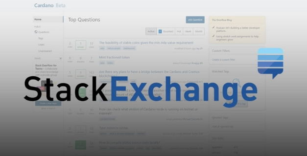

# Cardano Stack Exchange: một tài nguyên dành cho cộng đồng nhà phát triển đang được phát triển và hoạt động sôi nổi

### **Tìm hiểu về trung tâm cộng đồng dành riêng hỗ trợ các nhà phát triển Cardano này**

 19 tháng 8 năm 2021  [Neil Burgess](tmp//en/blog/authors/neil-burgess/page-1/)  4 phút đọc

### [**Neil Burgess**](tmp//en/blog/authors/neil-burgess/page-1/)

Technical Writer

Marketing &amp; Communications

- 
- 

Hệ sinh thái Cardano cam kết hỗ trợ và phát triển cộng đồng nhà phát triển của chúng tôi. Một cộng đồng hoạt động sôi nổi, đầy đủ thông tin là điều cần thiết để phát triển một hệ sinh thái chức năng, phi tập trung với cơ sở người dùng đa dạng. Phù hợp với phương pháp tiếp cận nguồn mở của chúng tôi, khi chúng tôi cùng nhau phát triển Cardano, mọi người đều có thể hưởng lợi từ các giải pháp tài chính phi tập trung của nó trong khi cung cấp công nghệ blockchain tốt nhất.

Để đạt được các mục tiêu chung của chúng ta, điều cần thiết là mọi người đều tham gia vào quá trình phát triển và luôn có thể nhận được thông tin, hướng dẫn và hỗ trợ mà họ cần.

Để hỗ trợ sứ mệnh này, chúng tôi đang khuyến khích các tài năng phát triển và các chuyên gia từ khắp nơi trên toàn cầu tập trung tại một nơi - [Cardano Stack Exchange](https://cardano.stackexchange.com/). Trung tâm nhà phát triển này là nơi lý tưởng để chia sẻ kinh nghiệm, hỏi và trả lời câu hỏi về tất cả các luồng phát triển và hoạt động của Cardano cũng như chia sẻ tài nguyên. Trang web này - được thúc đẩy bởi các thành viên của cộng đồng Cardano - là một trong những tài nguyên giúp bạn tìm hiểu cách phát triển các ứng dụng phi tập trung (DApps) và viết các hợp đồng thông minh.

### **Stack Exchange là gì?**

Cardano Stack Exchange có nguồn gốc từ [Stack Overflow](https://en.wikipedia.org/wiki/Stack_Overflow) , trang web cộng đồng miễn phí dành cho các nhà phát triển được tạo ra bởi [Jeff Atwood](https://en.wikipedia.org/wiki/Jeff_Atwood) và [Joel Spolsky](https://en.wikipedia.org/wiki/Joel_Spolsky) vào năm 2008. Tên này được chọn bởi một quá trình bỏ phiếu vào tháng 4 năm 2008 bởi độc giả của Coding Horror, blog lập trình nổi tiếng của Atwood. Kể từ khi bắt đầu, phong trào đã phát triển để tổ chức nhiều [Stack Exchange](https://stackexchange.com/sites) chuyên biệt.

Một trong những ứng dụng mới nhất dành riêng cho các nhà phát triển Cardano. Hiện đang trong giai đoạn thử nghiệm, đây là một trang web câu hỏi và câu trả lời được cộng đồng kiểm duyệt, nơi tất cả các nhà phát triển Cardano, bao gồm cả những người tiên phong của Plutus, có thể nhận được câu trả lời của chuyên gia cho nhiều câu hỏi khác nhau, từ truy vấn cài đặt đến cấu hình và chi tiết triển khai.

Triết lý phân quyền, hướng tới cộng đồng của Stack Overflow này đặc biệt phù hợp với triết lý phân quyền, mã nguồn mở của Cardano.

### **Nó hoạt động như thế mào**

Nếu bạn đang gặp khó khăn về một vấn đề trong Cardano hoặc tò mò về một yếu tố công nghệ của nó, thì Stack Exchange là một nguồn tài nguyên tuyệt vời. Nó phục vụ nhiều hơn như một nơi cho các câu hỏi cụ thể về các vấn đề thực tế hơn là một trang web thảo luận như [Diễn đàn Cardano](https://forum.cardano.org/) . Định dạng này có nghĩa là bạn có thể dễ dàng tìm thấy các câu hỏi bạn đang tìm kiếm mà không bị lạc vào các chủ đề thảo luận dài dòng. Khi bạn đã tham gia, bạn sẽ có cơ hội tìm kiếm tất cả các câu hỏi trước đó và các giải pháp được đề xuất.

Ví dụ về các câu hỏi hiện đang được trả lời trên trang web bao gồm:

[Điều gì xảy ra với ada đã đặt cọc sau khi chuyển ada sang ví khác?](https://stackoverflow.com/questions/67611246/what-happens-to-staked-ada-after-tranfering-ada-to-another-to-wallet)

[Số lượng địa chỉ tối đa trong ví Cardano là bao nhiêu?](https://cardano.stackexchange.com/questions/2337/cardano-wallet-maximum-amount-of-addresses)

[Làm thế nào để tạo một giao dịch được tuần tự hóa mà không có nút đầy đủ cục bộ?](https://cardano.stackexchange.com/questions/2335/how-can-i-create-a-serialized-transaction-that-can-be-submitted-to-the-blockchai)

Câu hỏi của bạn có thể đã được trả lời; trong trường hợp này, bạn có thể xem nó đã hoạt động bao nhiêu lần đối với một người nào đó. Mặt khác, nếu bạn có một câu hỏi mới, người khác có thể sẽ gặp phải vấn đề tương tự, và câu hỏi hoặc câu trả lời của bạn sẽ hữu ích cho họ.

Các nhà phát triển Cardano và nhân viên hỗ trợ sẽ thường xuyên vào trang web và sẽ cung cấp câu trả lời khi họ có thể. Bạn cũng có thể kiểm tra các câu hỏi mới và có thể cung cấp câu trả lời cho người khác. Cộng đồng [bầu chọn người kiểm duyệt](https://stackoverflow.com/help/site-moderators) và bình chọn các câu hỏi và câu trả lời để thể hiện sự đánh giá cao.

Bạn càng tương tác nhiều trên trang web, nó càng trở nên có giá trị. Người dùng nhận được [điểm danh tiếng](https://meta.stackexchange.com/questions/7237/how-does-reputation-work) bằng cách đặt câu hỏi, ủng hộ câu hỏi và câu trả lời, đồng thời cung cấp câu trả lời cho các nhà phát triển đồng nghiệp. Điểm danh tiếng làm tăng điểm tổng thể của bạn và giúp bạn kiếm được nhiều đặc quyền hơn trên trang web. Nhiều người nhận thấy rằng giải thích điều gì đó với một nhà phát triển khác là một trong những cách tốt nhất để hiểu sâu hơn sự hiểu biết của họ. Cách tốt nhất để học, như họ nói, là thông qua giảng dạy.

### **Làm thế nào để tham gia**

Chúng tôi rất muốn thiết lập và phát triển sự hiện diện của Stack Exchange. Trang web hiện đang trong giai đoạn thử nghiệm và chỉ có thể phát triển với việc sử dụng và hỗ trợ của cộng đồng. Đây là nơi bạn đến. Chúng tôi muốn khuyến khích bạn đặt một câu hỏi - hoặc một loạt câu hỏi nếu bạn muốn!

Trang web hoàn toàn miễn phí để sử dụng. Chỉ cần cung cấp địa chỉ email, đặt mật khẩu của bạn và bạn đã sẵn sàng để sử dụng!

Khi ai đó trong cộng đồng trả lời câu hỏi của bạn, bạn có thể đáp lại sự ủng hộ bằng cách giúp các nhà phát triển đồng nghiệp của bạn đưa ra các giải pháp và đề xuất khả thi cho câu hỏi của họ. Khi bạn nhận được câu trả lời phù hợp với mình, hãy nhớ chấp nhận và tán thành nó. Xem xét các cụm từ tìm kiếm mà người khác có thể sử dụng sẽ giúp bạn viết [một câu hỏi hay](https://stackoverflow.com/help/how-to-ask) .

Với trang web hiện vẫn đang trong giai đoạn thử nghiệm, nó cần được sử dụng rộng rãi hơn và hoạt động với đầy đủ các thành phần. Chúng tôi khuyến khích bạn đăng nhập, tham gia và giúp làm cho trang web trở thành tài nguyên có giá trị cho mọi người trong cộng đồng.

*Sáng kiến Stack Exchange thực sự là một nỗ lực của cộng đồng Cardano. Vì vậy, đặc biệt cảm ơn [tất cả những người đóng góp](https://area51.stackexchange.com/proposals/125174?phase=beta&users=reputation#tab-top) làm việc để thúc đẩy dự án này phát triển.*
 **Tôi muốn ghi nhận sự đóng góp của Neil Burgess cho bài viết này.**
 
 Bài này được dịch bởi LinhPool, Review và đăng bài bởi Nguyễn Hiệu.
 
 Nguồn bài dịch [tại đây](https://iohk.io/en/blog/posts/2021/08/19/cardano-stack-exchange-a-growing-and-vibrant-community-developer-resource/) 
 
 *Dự án này được tài trợ bới Catalyst*
