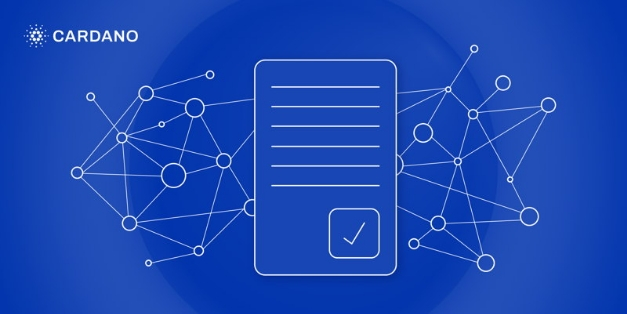

# Xác thực giao dịch trên Cardano

### **Mô hình EUTXO của Cardano cho phép xác định rõ việc thực thi tập lệnh Plutus**

 6 tháng 9 năm 2021  [Polina Vinogradova](tmp//en/blog/authors/polina-vinogradova/page-1/)  12 phút đọc

### [**Polina Vinogradova**](tmp//en/blog/authors/polina-vinogradova/page-1/)

Research Engineer

Engineering

- 
- 
- 
- 

Khi hard fork Alonzo mang lại cho Cardano khả năng tạo lập hợp đồng thông minh (smart contract) với cốt lõi là ngôn ngữ lập trình Plutus, sổ cái sẽ phát triển để đáp ứng nhu cầu ngày càng tăng về việc triển khai các giải pháp phi tập trung. Thiết kế sổ cái của Cardano tập trung vào sự đảm bảo, tính bảo mật cao và chứng minh rõ nét trong việc xác minh. Để phù hợp với chiến lược này, điều quan trọng là phải đảm bảo được quá trình xử lý giao dịch được *xác định*, có nghĩa là người dùng có thể dự đoán tác động và kết quả của nó trước khi áp dụng vào thực tế.

Các blockchain dựa trên [đầu ra giao dịch chưa chi tiêu (UTXO)](https://iohk.io/en/blog/posts/2021/03/11/cardanos-extended-utxo-accounting-model/) như Cardano, có khả năng đảm bảo chi phí thực hiện giao dịch và cách giao dịch hoạt động trên sổ cái *trước khi* được gửi đi, thậm chí nó còn nổi bật hơn nữa với sự ra đời của việc hỗ trợ hợp đồng thông minh. Các blockchain dựa trên tài khoản như Ethereum, là *không xác định*, có nghĩa là chúng không thể đảm bảo khả năng dự đoán về tác động của giao dịch trên chuỗi. Điều này dẫn đến rủi ro mất tiền, phí giao dịch cao bất thường và các nguy cơ gây hại cho hệ thống.

Trong bài này, chúng tôi xem xét kỹ hơn những lợi ích về thiết kế của Cardano cho phép đánh giá tập lệnh và sự an toàn của giao dịch trước khi thực hiện. Ở bài sau, vào cuối tuần này, chúng ta sẽ thảo luận về hai giai đoạn xác thực giao dịch trên Cardano.

## **Xác định giao dịch là gì và tại sao nó lại quan trọng?**

Tính xác định, trong bối cảnh giao dịch và xử lý tập lệnh được coi là giống với *khả năng dự đoán*. Điều này có nghĩa là người dùng có thể dự đoán cục bộ (ngoài chuỗi) rằng giao dịch của họ sẽ ảnh hưởng như thế nào đến trạng thái trên chuỗi của sổ cái mà không cần phải bận tâm tới:

- Kết quả xác thực tập lệnh
- Mức hao tổn kinh phí
- Loại sổ cái hoặc cập nhật trạng thái tập lệnh

Một giao dịch trong hệ thống xác định vẫn có thể bị từ chối, ngay cả khi được thực hiện chính xác. *Bị từ chối* nghĩa là giao dịch hoàn toàn không thể được áp dụng cho sổ cái, do đó không ảnh hưởng đến trạng thái của nó, chính vì vậy nên không có chi phí nào được thanh toán. Điều này xảy ra khi các giao dịch được xử lý vào giữa thời điểm giao dịch ban đầu được thực hiện. Điều này cũng có thể xảy ra ngay cả với các giao dịch đơn giản. Ví dụ: một giao dịch khác có thể sử dụng UTXO mà một người cũng đang dự định dùng tới. Tính xác định đảm bảo rằng, bất cứ khi nào một giao dịch được chấp nhận, nó sẽ chỉ tác động tới trạng thái sổ cái (có thể dự đoán được).

## **Giải quyết vấn đề của <em>tính không xác định</em>**

*Tính không xác định* nghĩa là chúng ta không thể dự đoán những ảnh hưởng của một giao dịch trên sổ cái trước khi thực hiện. Khi thiết kế sổ cái, cũng như hợp đồng thông minh, điều quan trọng là phải thấy trước các điều kiện mà tính không xác định *có thể* xảy ra và đưa ra quyết định thiết lập để né tránh chúng. Một trong những nguy cơ là quyền truy cập vào dữ liệu sổ cái có thể thay đổi, tức là dữ liệu có thể tự thay đổi hoặc bị thay đổi. Tính không xác định có thể là vấn đề khi các thay đổi mà giao dịch hoặc hợp đồng thông minh thực hiện dựa trên sổ cái phụ thuộc vào trạng thái của nó tại thời điểm xử lý, thay vì chỉ phụ thuộc vào nội dung của giao dịch

Ethereum rất dễ bị ảnh hưởng bởi vấn đề này. Ví dụ: phí gas hoặc các sàn giao dịch phi tập trung (DEX) có thể dao động trong khoảng thời gian người dùng gửi giao dịch và thời gian giao dịch được xử lý. Điều này dẫn đến phí gas trở nên bất thường hoặc tài sản bị thay đổi giá. Hoặc một tập lệnh có thể bị lỗi, dẫn đến chi phí cao (hàng trăm USD) và không đem lại tác dụng nào khác. Điều này có thể xảy ra, khi khoản tiền dùng để trả phí gas bị hết khi đang trong quá trình thực hiện. Thiết kế sổ cái xác định loại bỏ những khả năng này.

Các nguồn không xác định có thể bao gồm việc cho phép các tập lệnh chứa:

- Dữ liệu trong block chứa giao dịch, nhưng không bao gồm trong bất kỳ giao dịch nào, ví dụ: tính ngẫu nhiên của hệ thống, tiêu đề block hoặc số vị trí hiện tại
- Dữ liệu bị thay đổi hoặc bị thay thế, điều này có thể thay đổi kết quả xác thực tập lệnh, trong khi giao dịch đó vẫn có thể xử lý được.

Trên các hệ thống, có nhiều cách để giảm thiểu những vấn đề này bằng phương pháp cải tiến lập trình hoặc giải pháp trên Layer 2. Cardano được thiết kế để đảm bảo kết quả có thể dự đoán cho tất cả các tập lệnh và giao dịch.

## **Tính xác định và lợi ích mô hình UTXO mang lại**

Sổ cái Cardano được xây dựng trên mô hình UTXO, nghĩa là tài sản được lưu trữ trên sổ cái dưới dạng *kết quả đầu ra chưa* chi tiêu , thay vì nằm trong *tài khoản*. Mỗi đầu ra này chứa số lượng tài sản được lưu trữ, cùng địa chỉ của nó. Đầu ra chưa được chi tiêu là *bất biến* , vì vậy một giao dịch có thể tiêu thụ toàn bộ đầu ra, nhưng nó không thể tự thay đổi tính vốn có của nó.

Để chuyển giao tài sản, một giao dịch chi tiêu một hoặc nhiều đầu ra và tạo nên những đầu ra mới, về tổng thể, chứa cùng số lượng tài sản với những đầu ra đã chi tiêu. Những số lượng này - và địa chỉ UTXO - được chỉ định trong đầu ra của giao dịch. Cách duy nhất mà một giao dịch có thể ảnh hưởng đến  giao dịch khác (được áp dụng cho sổ cái) là sử dụng trên cùng một UTXO, điều này khiến node phải từ chối. Đây là đặc điểm chính mà mô hình UTXO duy trì tính xác định.

Mô hình sổ cái UTXO có cả ưu điểm và nhược điểm so với mô hình dựa trên tài khoản. Không giống như UTXO, mô hình sổ cái dựa trên tài khoản chứa dữ liệu có thể thay đổi. Ví dụ, một giao dịch chứa các số lượng tài sản khác nhau trong một tài khoản, tùy thuộc vào việc nó được xử lý trước hay sau một giao dịch khác cập nhật cùng tài khoản đó. Trường hợp này có thể không khiến giao dịch bị từ chối, nhưng nó có thể dẫn đến những thay đổi "không thể đoán trước" trong sổ cái.

Việc sử dụng UTXO chỉ là một ví dụ về hành động mà một giao dịch có thể thực hiện. Tiếp theo, chúng tôi giải thích các hành động diễn ra trong giao dịch là gì và cách chúng được xác thực. Tập hợp các thay đổi quan trọng nhất được giới thiệu trong hard fork Alonzo là những thay đổi đối với quá trình xác thực hành động.

## **Xác thực các hành động bằng chữ ký và tập lệnh**

Điều quan trọng của việc xử lý giao dịch là xác thực các hành động mà nó thực hiện. Một giao dịch được *thực hiện* khi nó chứa dữ liệu cụ thể của hành động đó. Ví dụ: một giao dịch đang *sử dụng UTXO U* khi nó chứa tham chiếu U trong đầu vào và nó *tạo token X* khi bản thân nó chứa X.

Khi node xử lý một giao dịch, nó sẽ xác minh xem có thể thực hiện được hay không. Về việc này, người tiến hành giao dịch phải cung cấp các phần dữ liệu có liên quan, ví dụ: tập lệnh, trình xác nhận hoặc chữ ký. Một ví dụ phổ biến về hành động yêu cầu xác thực là sử dụng UTXO bị khóa bằng public key. Giao dịch phải cung cấp chữ ký từ private key tương ứng để thực hiện hành động này.

Cardano sử dụng các tập lệnh để xác thực các hành động. Các tập lệnh này là các đoạn mã dùng để triển khai các chức năng với đầu ra *Đúng* hoặc *Sai* . *Xác thực tập lệnh* là quá trình kết nối để chạy một tập lệnh nhất định trên các đối số thích hợp.

Xác thực tập lệnh có thể thực hiện các hành động sau:

- Sử dụng UTXO bị khóa bởi địa chỉ tập lệnh: tập lệnh được xử lý là tập lệnh có hàm băm tạo nên địa chỉ.
- Tạo ra token: tập lệnh được xử lý là tập lệnh có hàm băm tạo nên ID của token từ trước đó.
- Rút tiền thưởng: tập lệnh được xử lý là tập lệnh có hàm băm tạo thành địa chỉ staking.
- Áp dụng chứng chỉ: tập lệnh được xử lý là tập lệnh có hàm băm tạo thành thông tin đăng nhập của người khởi tạo.

Bên cạnh việc báo cho node biết tập lệnh nào sẽ được xử lý, tất cả các hành động giao dịch đều chỉ ra cách tập hợp các đối số được truyền tải cho tập lệnh đó.

Sổ cái đa tài sản của Cardano (hard fork Mary) hỗ trợ *đa chữ ký và khóa thời gian (timelock) * *đơn giản. Những điều này cho phép người dùng chỉ định chữ ký cần thiết để thực hiện một hành động (chẳng hạn như sử dụng UTXO hoặc tạo token không thể thay thế (NFT)) và khoảng thời gian mà hành động đó có thể được thực hiện. Một tập lệnh timelock không bao giờ thấy được vị trí thực tế trong giao dịch chứa nó. Timelock chỉ có thể xem *khoảng thời gian hiệu lực* của giao dịch. Việc cho phép tập lệnh timelock xem vị trí hiện tại (tức là dữ liệu đến từ block, chứ không phải từ người tạo) sẽ phá vỡ tính xác định. Điều này được đảm bảo bởi thực tế là người dùng không thể biết chính xác vị trí mà giao dịch được xử lý và do đó họ không thể dự đoán tập lệnh sẽ hoạt động như thế nào.*

Các tập lệnh của hard fork Mary, không giống trong các hợp đồng của Plutus ở hard fork Alonzo, nó bị hạn chế nhiều về khả năng diễn giải. Hard fork Alonzo mở ra một kỷ nguyên mới của các hợp đồng có tính hiệu quả rõ ràng mà không làm ảnh hưởng đến tài sản sổ cái.

## **Tập lệnh Plutus**

Hard fork Alonzo giới thiệu cách tiếp cận mới để xác thực giao dịch trên Cardano do việc triển khai các tập lệnh Plutus. Mô hình [đầu ra giao dịch chưa chi tiêu mở rộng](https://iohk.io/en/blog/posts/2021/03/12/cardanos-extended-utxo-accounting-model-part-2/) (EUTXO), được triển khai như một phần của Alonzo, cung cấp cơ sở hạ tầng sổ cái để hỗ trợ các hợp đồng Plutus. Sau đây, chúng tôi trình bày một cách tổng quan về những thay đổi trong sổ cái và giao dịch. Để biết thêm chi tiết về cách làm việc với sổ cái và tập lệnh Plutus, hãy xem [chương trình Plutus Pioneer](https://www.youtube.com/watch?v=IEn6jUo-0vU&list=PLK8ah7DzglhhJzuiz7X33UCHSTYPB-8Jt) !

Alonzo thay đổi dữ liệu trên sổ cái dựa theo các yếu tố sau:

1. Tập lệnh Plutus có thể khóa các UTXO.
2. Phần nội dung mới được bổ sung tại các đầu ra của UTXO, cho phép chức năng giống như trạng thái tập lệnh. Ngoài nội dung và địa chỉ, UTXO bị khóa bởi tập lệnh Plutus cũng chứa một *datum*. Datum là một phần dữ liệu được diễn giải của trạng thái tập lệnh.
3. Có các tham số giao thức mới được sử dụng để áp đặt các yêu cầu xác thực bổ sung cho các giao dịch. Chúng bao gồm các giới hạn phía trên về tài nguyên tính toán mà các tập lệnh có thể sử dụng.

Để hỗ trợ tập lệnh Plutus, các giao dịch đã được nâng cấp như sau:

1. Đối với mỗi hành động, giao dịch hiện mang một đối số do người dùng chỉ định, được gọi là *redeemer*. Tùy thuộc vào tập lệnh, redeemer có thể được dành cho các mục đích khác nhau. Ví dụ: Một trong số những chức năng là nó có thể hoạt động ở mức giá mà người dùng đặt ra trong một cuộc đấu giá hoặc kết quả mà người dùng dự đoán ở các trò chơi.
2. Giao dịch xác định ngân sách thực thi tính toán cho mỗi tập lệnh.
3. Để đảm bảo rằng một giao dịch có thể tự trả phí, Alonzo giới thiệu các phần dữ liệu bổ sung mà chúng ta sẽ thảo luận trong bài tiếp theo.
4. Các giao dịch chứa một hàm băm đầy đủ, cần thiết để đảm bảo rằng nó không bị tấn công, quá hạn, v.v.

Ngoài ra còn có một số thay đổi trong các chi tiết cụ thể của xác thực giao dịch hard fork Alonzo so với hard fork Mary. Đối với mỗi hành động, node tập hợp các đối số tập lệnh, bao gồm:

- Datum
- Redeemer
- Ngân sách thực thi tập lệnh
- Bản tóm tắt của giao dịch.

Node thực hiện các phần việc mới, dành riêng cho Alonzo để đảm bảo giao dịch được tạo lập chính xác. Ví dụ: nó không được vượt quá ngân sách tối đa. Nó cũng kết hợp cùng Plutus để chạy các tập lệnh.

**Datum so với trạng thái tập lệnh**

Giống như các tài khoản có thể thay đổi, trạng thái tập lệnh có thể thay đổi được xếp chung vào danh mục "dữ liệu sổ cái có thể thay đổi". Chúng tôi thấy rằng mô hình UTXO tránh được vấn đề không xác định tài khoản có thể thay đổi. Nó cũng có thể giúp chúng ta hình dung lại khái niệm trạng thái theo cách duy trì tính xác định. Nếu một UTXO bị khóa bởi tập lệnh Plutus, thì mã tập lệnh của UTXO đó được liên kết với địa chỉ của nó. Tương tự trạng thái của tập lệnh này là dữ liệu được lưu trữ trong UTXO. Khi một giao dịch sử dụng UTXO đó, nó và dữ liệu sẽ bị xóa khỏi sổ cái. Tuy nhiên, nội dung của tập lệnh Plutus bắt buộc giao dịch chứa nó cũng phải tạo ra một UTXO chứa dữ liệu cụ thể được xem như trạng thái tập lệnh được cập nhật.

**Ngân sách thực thi tập lệnh**

Mô hình phí gas không xác định có thể tính một lượng phí lớn không thể lường trước. Trong tập lệnh Cardano, vấn đề này được giải quyết bằng cách yêu cầu một khoản ngân sách có sẵn, như một khoản phí có sẵn trong giao dịch để dùng vào việc này. Trong hark fork Alonzo, người dùng có thể dự đoán riêng từng phần khi thực hiện giao dịch. Việc thực thi tập lệnh nhất thiết phải trả về *True* hoặc *False* và sẽ không lặp lại. Bởi vì mọi hoạt động mà một tập lệnh thực hiện đều sử dụng một lượng ngân sách nhất định (được theo dõi). Nếu vượt quá ngân sách do giao dịch chỉ định, quá trình thực thi tập lệnh sẽ kết thúc và trả về giá trị *False* .

## **Xác thực giao dịch ở Alonzo**

Đối với việc giải quyết các nguồn không xác định, các điểm sau khiến kết quả của xác thực tập lệnh và giao dịch có thể dự đoán được:

- Quá trình thông dịch tập lệnh sẽ kết thúc và trả về cùng một kết quả xác thực khi được áp dụng cho các đối số giống nhau
- Một giao dịch nhất thiết phải sửa tất cả các đối số sẽ được chuyển đến trình thông dịch tập lệnh trong quá trình xác thực
- Một giao dịch chỉ định tất cả các hành động mà nó đang thực hiện yêu cầu xác thực tập lệnh
- Đảm bảo khi giao dịch được thực hiện, chữ ký bắt buộc không thể bị thay đổi bởi một ai khác
- Áp dụng một giao dịch trong mô hình sổ cái EUTXO là xác định.

Điểm cuối cùng được kế thừa hầu hết từ mô hình UTXO, vì phần lớn các bản cập nhật giao thức sổ cái hard fork Alonzo vẫn còn, nhất quán với các bản cập nhật trong các kỷ nguyên trước (bao gồm cả chương trình ủy quyền, v.v.). Sau khi nâng cấp Alonzo, việc xác thực tập lệnh không thành công sẽ ảnh hưởng đến cách xử lý giao dịch (xem thêm về điều này trong phần 2!). Tuy nhiên, kết quả *True* hay *False* , cũng như những thay đổi trên sổ cái liên quan đến một trong hai kết quả, đều có thể dự đoán được cho một giao dịch nhất định.

Hành vi xác định của tập lệnh Cardano và xác thực giao dịch không phải là kết quả tự nhiên của việc sử dụng mô hình EUTXO. Để đảm bảo thuộc tính này, nhóm IOG đã phải theo dõi cẩn thận nguồn của mọi dữ liệu mà tập lệnh được phép xem.

*Thuộc tính đánh giá xác định được thể hiện trong [đặc điểm kỹ thuật của Alonzo](https://hydra.iohk.io/build/7172824/download/1/alonzo-changes.pdf) và nhóm IOG cũng đã phác thảo bằng chứng rằng trình thông dịch chỉ nhận được những đối số không phá vỡ thuộc tính.*

*Trong bài tiếp theo, chúng tôi sẽ xem xét kỹ hơn quy trình xác thực 2 giai đoạn của các giao dịch Cardano. Vì vậy, hãy chú ý theo dõi phần hai vào cuối tuần này.   Bài này được dịch bởi Max Long, Review bởi Quang Pham, biên tập bởi .... <a>với bài gốc</a>(https://iohk.io/en/blog/posts/2021/09/06/no-surprises-transaction-validation-on-cardano/) <em>Dự án này được tài trợ bởi Catalyst</em>*
