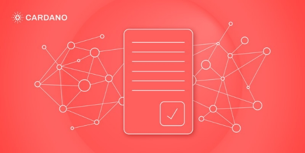

# Xác thực giao dịch: phần 2

### **Xác thực giao dịch của Alonzo được thực hiện trong hai giai đoạn để đảm trả thù lao công bằng cho công việc xác thực**

 7 tháng 9 năm 2021  [Polina Vinogradova](tmp//en/blog/authors/polina-vinogradova/page-1/)  7 phút đọc

### [**Polina Vinogradova**](tmp//en/blog/authors/polina-vinogradova/page-1/)

Research Engineer

Engineering

- 
- 
- 
- 

Trong [bài đăng trước trên Blog](https://iohk.io/en/blog/posts/2021/09/06/no-surprises-transaction-validation-on-cardano/), chúng tôi đã thảo luận về bản chất xác định của giao dịch và xác thực tập lệnh trên sổ cái Alonzo, cung cấp sự đảm bảo rằng kết quả của ứng dụng giao dịch trên chuỗi và xác thực tập lệnh có thể được dự đoán chính xác cục bộ, trước khi giao dịch được gửi đi.

Dựa trên những đảm bảo được cung cấp bởi thiết kế xác định của sổ cái Alonzo, chúng tôi đã triển khai một kế hoạch xác thực gồm hai giai đoạn cụ thể. Nó được thiết kế để giảm thiểu tài nguyên mà các node sử dụng để xác thực các giao dịch trên mạng lưới, đồng thời loại bỏ các chi phí không mong muốn cho người dùng. Trong bài đăng trên Blog này, chúng tôi đi sâu hơn vào cách hoạt động của xác thực hai giai đoạn.

Trong kỷ nguyên Shelley, Allegra và Mary, xác thực giao dịch là quy trình một bước. Ảnh hưởng của một giao dịch hợp lệ trên sổ cái hoàn toàn có thể dự đoán trước khi nó được áp dụng. Nếu một giao dịch hợp lệ, nó sẽ được đưa vào một block và được thêm vào sổ cái. Nếu không, một node sẽ từ chối nó sau khi thử xác thực không thành công và giao dịch sẽ không được đưa vào một block. Tuy nhiên, các node xác thực giao dịch được gửi đến đã tiêu tốn thời gian và tài nguyên, bất kể giao dịch có kết thúc trong một block hay không.

Alonzo giới thiệu các tập lệnh Plutus, có thể yêu cầu nhiều tài nguyên hơn đáng kể để xác thực so với những tập lệnh đơn giản trong các kỷ nguyên trước. Để giải quyết vấn đề các node sử dụng tài nguyên để xác thực các tập lệnh của các giao dịch bị từ chối, Alonzo giới thiệu phương pháp xác thực hai giai đoạn. Chiến lược này duy trì một kết quả có thể dự đoán được của việc áp dụng các giao dịch vào sổ cái và cũng đảm bảo sự đền bù công bằng cho các node đối với công việc và việc sử dụng tài nguyên của chúng.

## **Xác thực giao dịch hai giai đoạn**

Xác thực giao dịch trên Cardano được chia thành hai giai đoạn. Lý do chính để giới thiệu xác thực hai giai đoạn là để hạn chế số lượng công việc xác thực không được trả thù lao của các node. Mỗi giai đoạn phục vụ một mục đích trong việc đạt được mục tiêu này. Nói một cách tổng quan, giai đoạn đầu tiên kiểm tra xem giao dịch có được xây dựng chính xác hay không và có thể trả phí xử lý hay không. Giai đoạn thứ hai chạy các tập lệnh có trong giao dịch. Nếu giao dịch hợp lệ ở giai đoạn 1, các tập lệnh giai đoạn 2 sẽ chạy. Nếu giai đoạn 1 không thành công, không có tập lệnh nào chạy và giao dịch sẽ bị hủy ngay lập tức.

Do đó, các node dự kiến sẽ thêm các giao dịch có thể xử lý vào một block ngay cả khi các giao dịch không hợp lệ ở giai đoạn 2. Điều này có nghĩa là:

- Một số lượng nhỏ công việc không được trả thù lao được thực hiện bởi một node để phát hiện ra một giao dịch không thể xử lý được, nhưng không có xác thực giai đoạn 2 tốn chi phí nào được thực hiện hoặc
- Giao dịch có thể xử lý được. Sau đó, node có thể thực hiện xác thực giai đoạn 2 của các tập lệnh, gắn thẻ giao dịch tương ứng là giai đoạn 2 hợp lệ hoặc không hợp lệ và thêm nó vào một block. Trong cả hai trường hợp, sau đó node sẽ được trả thù lao cho cả hai giai đoạn xác thực thông qua phí hoặc tài sản thế chấp thu được từ giao dịch này.

Kỳ vọng là trường hợp thất bại giai đoạn 2 sẽ hiếm khi xảy ra, bởi vì người dùng gửi một giao dịch với các tập lệnh không thành công sẽ mất ADA trong khi không đạt được gì. Điều này có thể dự đoán được một cách cục bộ, vậy nên nó là một sự kiện có thể ngăn ngừa được. Giai đoạn này là một biện pháp bảo vệ bắt buộc để đảm bảo trả thù lao cho các tập lệnh có khả năng sử dụng nhiều tài nguyên.

Chúng ta hãy xem xét cụ thể hơn các chi tiết của từng giai đoạn.

**Giai đoạn 1**

Giai đoạn xác thực đầu tiên phải đơn giản. Nếu giai đoạn này không thành công, một node sẽ không được trả thù lao cho công việc mà nó đã thực hiện, vì nó không thể nhận phí xử lý từ các giao dịch không thể thực hiện.

Xác thực giai đoạn 1 xác minh hai điều: một giao dịch được xây dựng chính xác và có thể thêm nó vào sổ cái. Việc xác thực này bao gồm các kiểm tra sau và một số kiểm tra bổ sung:

- Nó thanh toán đúng số phí và cung cấp số tiền, tài sản thế chấp chính xác (tức là ADA được thu lại trong trường hợp tập lệnh bị lỗi, được giải thích bên dưới).
- Nó bao gồm tất cả dữ liệu cần thiết để thực thi các tập lệnh Plutus.
- Nó không vượt quá bất kỳ giới hạn nào được đặt trong các tham số giao thức (về kích thước đầu ra, v.v.).
- Đầu vào của nó đề cập đến các UTXO hiện có trên sổ cái.
- Ngân sách tính toán đã nêu không vượt quá giới hạn tài nguyên tối đa cho mỗi giao dịch.
- Kiểm tra tính toàn vẹn của hàm băm. v.v.

Trước khi thêm một giao dịch vào Mempool (và cuối cùng là vào một block), một node phải thực hiện tất cả các kiểm tra xác thực giai đoạn 1. Nếu bất kỳ lần kiểm tra nào trong số này không thành công, giao dịch sẽ bị từ chối mà không được đưa vào một block và không bị tính phí. Trong các kỷ nguyên trước, đây là giai đoạn xác thực duy nhất và Cardano đã xử lý tất cả các lỗi xác thực theo kiểu này.

Các node trung thực và không bị xâm phạm sẽ không cố tình tạo ra các giao dịch không thể xử lý. Các node cũng có thể ngắt kết nối với kẻ tấn công cố tình thực hiện giao dịch không hợp lệ ở giai đoạn 1.

**Giai đoạn 2**

Giai đoạn xác thực thứ hai chạy các tập lệnh Plutus có thể tốn kém hơn về mặt tính toán. Do đó, phí được tính sau khi thành công hoặc thất bại trong giai đoạn thứ hai. ADA thu được đi vào ngăn chứa phí (Fee pot). Do đó nó sẽ bù đắp cho cho các tài nguyên được sử dụng trong quá trình xác thực của các node.

Việc xác thực giai đoạn 1 thành công không đảm bảo rằng tất cả các hành động của giao dịch đều có thể xử lý được, chỉ có thể thu được tài sản thế chấp. Giai đoạn 2 thực hiện xác thực tập lệnh Plutus và quyết định thực hiện toàn bộ quá trình xử lý hay chỉ thu lại tài sản thế chấp được đưa ra dựa trên kết quả của việc xác thực:

- Áp dụng đầy đủ giao dịch (khả năng duy nhất trước Alonzo) - nếu các tập lệnh Plutus xác thực **tất cả** các hành động của giao dịch, hoặc
- Thu được ADA tài sản thế chấp và bỏ qua phần còn lại của giao dịch - nếu một trong các tập lệnh Plutus không thành công.

Hãy nhớ rằng kết quả xác thực tập lệnh có thể dự đoán cục bộ và được đảm bảo hoàn thành. Người dùng có thể kiểm tra cục bộ kết quả xác thực tập lệnh và sẽ không có bất đồng giữa các node trung thực về cách xử lý một giao dịch nhất định và các tập lệnh trong đó.

**Tài sản thế chấp**

Nếu các tập lệnh không được xác thực, chúng tôi vẫn cần trả thù lao cho công việc của các node. Nhưng chúng tôi không thể chỉ lấy tiền từ các đầu vào giao dịch, bởi vì những đầu vào đó có thể đã bị khóa bằng các tập lệnh - những tập lệnh không thành công! Vì vậy, thay vào đó, Alonzo giới thiệu một điều khoản đặc biệt cho việc này. *Tài sản thế chấp* của một giao dịch là số ADA sẽ được thu lại dưới dạng phí trong trường hợp xác thực tập lệnh giai đoạn 2 không thành công. Trong một giao dịch có thể xử lý, số tiền này ít nhất phải bằng một tỷ lệ phần trăm nhất định của phí giao dịch, được xác định trong một tham số giao thức.

Số tiền này được xác định tại thời điểm xây dựng giao dịch. Không phải trực tiếp, mà bằng cách thêm *đầu vào tài sản thế chấp vào* giao dịch. Tổng số dư trong các UTXO tương ứng với các đầu vào được đánh dấu đặc biệt này là số tiền thế chấp của giao dịch. Các UTXO này phải có địa chỉ khóa công khai (thay vì tập lệnh) và không chứa Token nào khác ngoài ADA.

Các đầu vào tài sản thế chấp chỉ bị xóa khỏi sổ cái UTXO *nếu bất kỳ tập lệnh nào không được xác thực được giai đoạn 2*. Nếu tất cả các tập lệnh được thông qua, số tiền phí giao dịch đã xác định sẽ được thu lại, như trong các kỷ nguyên trước. Đặc biệt, số tiền đến từ các yếu tố đầu vào thông thường, không có tài sản thế chấp, và các yếu tố đầu vào tài sản thế chấp chỉ đơn giản là bị bỏ qua. Tin tốt là được phép sử dụng các đầu vào giống nhau như tài sản thế chấp và thông thường, vì chỉ một trong hai tập hợp được xóa khỏi UTXO.

Các chữ ký cần thiết để xác nhận việc chi tiêu các đầu vào tài sản thế chấp cũng đóng một vai trò quan trọng trong việc duy trì tính toàn vẹn của một giao dịch. Họ làm như vậy bằng cách ngăn chặn kẻ tấn công thay đổi nội dung để nó tiếp tục có thể xử lý được nhưng không xác nhận được giai đoạn 2. Ví dụ về điều này sẽ là một kẻ tấn thay thế một Redeemer. Cần có chữ ký của người nắm giữ khóa tài sản thế chấp để thực hiện thay đổi như vậy. Những người nắm giữ khóa tài sản thế chấp cũng là những người dùng duy nhất chịu mất bất kỳ ADA nào nếu quá trình xác thực tập lệnh không thành công.

Vì đánh giá tập lệnh là xác định, người nắm giữ khóa tài sản thế chấp có thể kiểm tra cục bộ xem giao dịch có vượt qua xác thực giai đoạn 2 trên chuỗi hay không trước khi họ ký nó. Nếu có, thì họ có thể chắc chắn rằng nó cũng sẽ hoạt động trên chuỗi và họ sẽ không bị mất tài sản thế chấp. Người dùng có thiện chí sẽ không bao giờ bị mất tài sản thế chấp. Điều đó cũng có nghĩa là họ có thể tái sử dụng cùng một đầu vào tài sản thế chấp cho nhiều giao dịch và đảm bảo tài sản thế chấp không bị thu lại.

*Bây giờ chúng tôi đã khởi chạy Testnet công khai cho Alonzo, chúng tôi hoan nghênh tất cả người dùng và nhà phát triển đánh giá nó bằng cách xây dựng và thực thi các tập lệnh Plutus. Bạn có thể tìm hiểu thêm thông tin trong [kho lưu trữ Testnet chuyên dụng của Alonzo](https://github.com/input-output-hk/Alonzo-testnet) hoặc [thảo luận về các chủ đề Plutus và Alonzo](https://discord.com/channels/826816523368005654/826829738156621895) với cộng đồng rất đa dạng. Bài này được dịch bởi Nguyễn Văn Tú, review bởi Quang Pham, biên tập bởi .... Bài viết nguồn [tại đây](https://iohk.io/en/blog/posts/2021/09/07/no-surprises-transaction-validation-part-2). *Dự án này được tài trợ bởi Catalyst.**
