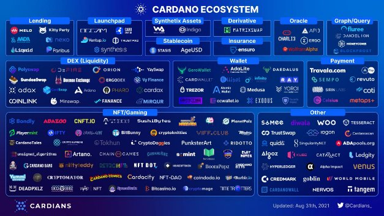

# Hard fork Alonzo một hành trình mới thú vị được bắt đầu ...

### **Nâng cấp Alonzo là một thời điểm quan trọng trong sự ra đời của một hệ sinh thái mới**

 12 tháng 9 năm 2021  [Tim Harrison](tmp//en/blog/authors/tim-harrison/page-1/)  10 phút đọc

### [**Tim Harrison**](tmp//en/blog/authors/tim-harrison/page-1/)

VP of Community &amp; Ecosystem

Communications

- 
- 
- 
- 

Cuối ngày hôm nay, chúng tôi sẽ triển khai các khả năng chạy hợp đồng thông minh Plutus trên mạng chính Cardano thông qua sự kiện nâng cấp giao thức hard fork combinator (HFC).

Bản nâng cấp *Alonzo* sẽ mang lại những khả năng rất được mong đợi cho Cardano thông qua việc tích hợp các tập lệnh Plutus vào blockchain. Những điều này sẽ cho phép triển khai các hợp đồng thông minh trên Cardano, lần đầu tiên cho phép chạy một loạt các ứng dụng phi tập trung (DApps) mới.

Đây mới chỉ là sự khởi đầu. Nhưng sự kiện này vẫn là một khoảnh khắc để ăn mừng. Là một cộng đồng, chúng tôi đã cùng nhau trải qua một hành trình đáng kinh ngạc. Đúng vậy, chúng ta nên ghi nhận những nỗ lực to lớn của rất nhiều người để đạt được kết quả này. Đây cũng sẽ là thời gian để suy ngẫm về những thách thức mà chúng ta đã cùng nhau vượt qua.

Mặc dù chúng tôi có thể cho phép bản thân dừng lại một chút, nhưng đây không phải là thời điểm để nghỉ ngơi. Và chắc chắn không có chỗ cho sự kiêu ngạo. Đây là nơi sứ mệnh thực sự bắt đầu khi chúng tôi - cả cộng đồng - bắt đầu thực hiện tầm nhìn mà tất cả chúng tôi đã hướng tới trong suốt thời gian dài. Xây dựng một hệ thống phi tập trung mở ra cơ hội kinh tế cho mọi người, ở mọi nơi.

## **Con đường để đến được đây**

Sau nhiều năm nghiên cứu và phát triển để chuẩn bị nền móng, thì lần [khởi động lại Byron](https://iohk.io/en/blog/posts/2020/03/30/what-the-byron-reboot-means-for-cardano/) vào tháng 3 năm 2020 đã thực sự đặt nền móng cho mạng mà chúng ta có ngày nay, bằng cách cung cấp một cơ sở mã code mạnh mẽ và có thể mở rộng để xây dựng. Vào tháng 7 cùng năm, [nâng cấp Shelley](https://cryptoslate.com/cardano-has-launched-the-shelley-mainnet-heres-what-you-need-to-know/) đã chuyển Cardano từ mô hình tập trung sang mô hình phi tập trung.

Kể từ cuối tháng 3 năm 2021, khi chúng tôi điều chỉnh tham số phân cấp mạng thành D = 0, mọi block đã được tạo ra bởi một [mạng phi tập trung](https://iohk.io/en/blog/posts/2021/03/31/decentralization-to-d-0-day-and-beyond/) từ cộng đồng gồm 2.868 stake pool

Đó là một hệ sinh thái staking được chú ý để tiếp tục phát triển nhanh chóng. Theo thống kê từ công cụ tổng hợp dữ liệu Cardano [Pooltool](https://pooltool.io/), số lượng ví ada staking hiện nay là 825.755. Điều này thể hiện mức tăng + 35%  kể từ tháng sáu. Tại thời điểm viết bài, tổng số ada được ủy quyền cho các stake pool trị giá 59,86 tỷ đô la, chiếm 71,4% tổng nguồn cung ada (83,9 tỷ đô la).

Bản nâng cấp [Mary](https://iohk.io/en/blog/posts/2021/02/04/native-tokens-to-bring-new-utility-to-life-on-cardano/) đã tạo ra một mạng đa tài sản và giới thiệu các  tài sản gốc (native token). Cùng với việc cung cấp một giải pháp thay thế cho định dạng ERC20, bản cập nhật Mary đã tạo nên sự bùng nổ sáng tạo như Cambrian Explosion. Với phí khai thác và giao dịch thấp, đặc biệt là không cần hợp đồng thông minh cho Cardano NFT, chúng tôi đã thấy sự nở rộ của một hệ sinh thái NFT đáng kinh ngạc. Theo dữ liệu từ [pool.pm](https://pool.pm/tokens) (được cung cấp bởi Smaug pool), cho đến nay, Cardano đã chứng kiến 780.436 token được đúc (minted) và 19.419 policies. Tất cả được thực hiện mà không cần hợp đồng thông minh.

## **Bước vào kỷ nguyên Alonzo**

Nâng cấp Alonzo (được đặt theo tên của nhà toán học tiên phong người mỹ [Alonzo Church](https://en.wikipedia.org/wiki/Alonzo_Church) ), đã xây dựng thành công này. Được triển khai sử dụng cùng một [công nghệ HFC](https://iohk.io/en/blog/posts/2020/05/07/combinator-makes-easy-work-of-shelley-hard-fork/) đã được sử dụng trong các bản nâng cấp trước đây, điều này sẽ đánh dấu sự khởi đầu mới của một thời kỳ tăng trưởng nhanh. Bằng cách cho phép các tập lệnh Plutus được viết và thực thi on-chain, chúng tôi sẽ có xương sống cho một nền tảng ứng dụng phi tập trung mới, cho phép nhiều trường hợp sử dụng DApp và tài chính phi tập trung (DeFi) - từ các loại ứng dụng sàn giao dịch đơn giản đến các sàn giao dịch phi tập trung (DEX) và các chương trình tính toán phức tạp hơn như Oracles và các stablecoin được hỗ trợ bởi thuật toán.

Vì vậy, chúng tôi có một trong những nền tảng blockchain phi tập trung, bền vững, mạnh mẽ và tiên tiến nhất trên thế giới, được điều hành bởi một cộng đồng có kỹ năng gồm các nhà điều hành pool cổ phần (SPO). Chúng tôi tận hưởng một cộng đồng những người ủy quyền có đầy đủ thông tin và nhiệt huyết. Chúng tôi có một hệ sinh thái NFT đang phát triển mạnh, thu hút bởi sự dễ dàng và chi phí thấp của việc đúc tiền. Và chúng tôi có một lộ trình quản trị trong tương lai thông qua kỷ nguyên *Voltaire* và khả năng mở rộng tối ưu thông qua *Basho* và Hydra mở rộng quy mô. Tương lai tươi sáng và vươn xa; chúng ta sẽ tiếp tục đi trên con đường dài cùng nhau.

## **Sự ra đời của một hệ sinh thái nhà phát triển mới**

Tất cả các khối xây dựng cốt lõi đã được đặt ra. Nền tảng. Tầm nhìn. Sứ mệnh. Cộng đồng. Vẫn còn rất sớm cho các hợp đồng thông minh và DeFi, nhưng chúng tôi đã đạt được những tiến bộ vượt bậc.

Hàng nghìn nhà phát triển đã tham gia vào [khóa học Plutus Pioneer](https://testnets.cardano.org/en/plutus-pioneer-program/), tìm hiểu các nguyên tắc cơ bản về khung phát triển gốc của Cardano. Các dự án bền vững đã bắt đầu được phát triển ở Plutus và đang ở các giai đoạn chuyên môn và sẵn sàng khác nhau. Hàng trăm dự án đã và đang tích cực làm việc trên các testnet Cardano khác nhau và các giải pháp được lưu trữ riêng. Khoảng 150 dự án đang phát triển ý tưởng của họ thông qua chương trình đổi mới [Project Catalyst](https://iohk.io/en/blog/posts/2021/02/12/our-million-dollar-baby-project-catalyst/) của Cardano, quỹ đổi mới phi tập trung lớn nhất thế giới. Trong vòng cấp vốn mới nhất, vâng có 800 dự án đã đăng ký tài trợ trị giá 4 triệu đô la. Với quỹ hiện tại rất lớn 1 tỷ đô la theo giá trị hiện nay và [ hơn 33 nghìn thành viên](https://cardano.ideascale.com/), tương lai để xây dựng trên Cardano không thể tươi sáng hơn.

Để có ảnh chụp nhanh về số lượng dự án và tổ chức trong hệ sinh thái, hãy truy cập kho giao dịch [Essential Cardano](https://github.com/input-output-hk/essential-cardano/blob/main/essential-cardano-list.md) của chúng tôi. Hoặc xem các bản đồ hệ sinh thái tuyệt vời khác nhau (đây là những bản đồ đại diện, mặc dù không có gì là toàn diện) như bản đồ của [Cardians](https://twitter.com/Cardians_/status/1432534228890124294?s=20) (xem Hình 1). Những điều này không đại diện cho những dự án sẽ chạy ngay lập tức. Nhưng họ cung cấp một không gian tuyệt đẹp.

Hình 1. Bản đồ hệ sinh thái của @Cardians_

Chúng tôi mong muốn được thấy những dự án này phát triển khi chúng hướng tới việc triển khai. Một số ở gần bệ phóng, số khác ở xa hơn. Sau khi phát hành mạng thử nghiệm công khai đầy đủ đầu tiên của chúng tôi vào đầu tháng này và bây giờ là mạng chính, chúng tôi hy vọng sẽ thấy nhiều người bắt đầu tăng cường hoạt động phát triển của họ.

## **Chúng ta vẫn còn sớm**

Hãy để chúng tôi nói rõ hơn. Sẽ có những va chạm trên đường. Trải nghiệm người dùng ban đầu có thể không hoàn hảo. Một số DApps đầu tiên sẽ có vấn đề. Chúng ta sẽ thấy một số nhóm phát triển tuyệt vời và một số nhóm kém. Đây là một blockchain phi tập trung, không cần cấp phép can thiệp, vì vậy điều này là không thể tránh khỏi. Và một số DApp có thể không an toàn. Nền tảng bảo mật layer 1 của Cardano mang lại sự mạnh mẽ và đảm bảo cao - và Plutus được thiết kế để giảm thiểu khả năng bị khai thác. Nhưng thực hành viết mã kém luôn có thể gây ra rủi ro cho người dùng DApp. Đó là điều không thể tránh khỏi, chúng ta có thể thấy những kẻ xấu tìm cách lợi dụng thông qua hack, khai thác và những thứ tương tự.

Là một cộng đồng, chúng ta cần phải thận trọng khi hệ sinh thái của chúng ta trưởng thành. Trên thực tế, chúng tôi tin rằng để phát triển toàn ngành nói chung, việc chứng nhận cần phải được coi trọng hơn. Tại [hội nghị thượng đỉnh](https://summit.cardano.org/), chúng tôi sẽ công bố kế hoạch về cách thức - cùng với một số đối tác chiến lược - chúng tôi sẽ hỗ trợ việc tạo ra các tiêu chuẩn và giải pháp mới.

## **Thực hiện nghiên cứu của riêng bạn**

Như mọi khi, chúng tôi khuyến khích mọi người thực hiện nghiên cứu của riêng bạn (DYOR). Hãy tìm đến các thành viên cộng đồng đồng nghiệp của bạn để được “thẩm định bởi nguồn lực cộng đồng” và cung cấp các đóng góp của riêng bạn. Tìm kiếm các dự án có lịch sử tích cực về giao tiếp cởi mở và minh bạch, các kênh / trang web xã hội được duy trì thích hợp và hồ sơ theo dõi kỹ thuật. Hãy nhận thức rõ khi ở ngoài đó, đặc biệt là trong những ngày đầu này. Cùng với sự tự tin về bảo mật DApp và ý định của dự án, khám phá DApp cũng sẽ là chìa khóa cho sự phát triển lành mạnh của hệ sinh thái Cardano. Vì vậy, cũng mong đợi được nghe nhiều hơn về điều đó tại hội nghị thượng đỉnh.

Hội nghị thượng đỉnh cũng sẽ là thời gian để ăn mừng, mặc dù sẽ có những người tìm cách hạ thấp điều này. Mặc dù cộng đồng của chúng tôi luôn sẵn sàng để được thử thách một cách thiện chí, nhưng chúng tôi đã quá quen với sự sợ hãi, không chắc chắn và nghi ngờ (FUD) của Twitter và Reddit từ những người thiên vị và cố tình không biết gì. Mọi dự án đều nhận được phần nào độc tính này, và mức độ lớn hơn là không thể tránh khỏi xung quanh các bản phát hành lớn.

Đây là một yếu tố đáng thất vọng của ngành công nghiệp non trẻ của chúng ta. Chúng tôi cần phải làm tốt hơn nếu chúng tôi muốn đẩy nhanh việc áp dụng rộng rãi hơn. FUD đã đặc biệt nguy hiểm trong tuần qua. Đối với tôi, đó là một phần công việc hàng ngày. May mắn thay, hầu hết các đồng nghiệp của tôi đều tập trung vào việc xây dựng và không quan tâm quá nhiều đến CryptoTwitter ™.

Chúng ta sẽ thấy nhiều FUD hơn và những điều vô nghĩa trong những tuần tới. Mọi thứ có thể sẽ trở nên xấu hơn trước khi chúng trở nên tốt hơn. Sao cũng được. Điều này sẽ chỉ củng cố quyết tâm của chúng tôi để chứng minh những người phản đối sai. Chúng tôi cũng có một cộng đồng sôi nổi và đầy nhiệt huyết, không ngừng ủng hộ dự án và phản hồi bằng sự thật và lịch sự. Điều đó tiếp tục khiến mọi người làm việc trên Cardano đặc biệt tự hào. Cảm ơn bạn.

## **Chúng ta vẫn còn sớm**

Hãy vững vàng vượt qua sóng gió. Và tiếp tục tập trung vào một chân trời tươi sáng. Chúng tôi hy vọng sẽ thấy các tập lệnh hợp đồng thông minh đơn giản đầu tiên được triển khai trên Cardano trong vòng vài giờ sau sự kiện HFC. Sẽ mất một thời gian nữa để các DApps phức tạp hơn bắt đầu triển khai thông qua testnet công khai. Với hàng trăm dự án đang được xây dựng ở hậu trường, chúng tôi kỳ vọng sẽ thấy các dự án triển khai trong suốt tháng 9 và tháng 10, và tăng tốc trong quý 4. Đặc biệt là với các bản khởi chạy chính thức, công cụ và các thư viện phần mềm, bao gồm Phần phụ trợ ứng dụng Plutus (PAB) và các API do cộng đồng tạo ra đang trở nên khả dụng.

Có nhiều kỳ vọng vào bản nâng cấp này. Bên canh đó là một số đòi hỏi vô lý. Những người theo dõi Cardano có thể đang mong đợi một hệ sinh thái phức tạp gồm các DApps sẵn sàng cho người dùng có sẵn ngay sau khi nâng cấp. Kỳ vọng cần được quản lý ở đây. Chúng ta nên nhớ rằng một [dự án blockchain nổi tiếng](https://www.coindesk.com/tech/2020/07/31/ethereum-history-in-5-charts/) khác được khởi chạy vào tháng 7 năm 2015 đã phải đợi hơn hai năm trước khi DApp đầu tiên của nó thu hút được người dùng thực sự.

## **Tích hợp ổn định và cải tiến**

Trong những tháng tới, chúng tôi sẽ tiếp tục chu kỳ phát hành hai tuần một lần mã mới, nâng cấp bảo trì thường xuyên và các sự kiện HFC lớn mỗi quý. Chúng tôi sẽ tiếp tục điều chỉnh và tối ưu hóa nền tảng, điều chỉnh hiệu suất và tinh chỉnh các thông số kỹ thuật khi chúng tôi theo dõi và giám sát các mô hình sử dụng. Chỉ việc sử dụng thực tế mới tiết lộ cách chúng tôi cần điều chỉnh nền tảng linh hoạt và có thể mở rộng của mình trong những tháng phát triển sắp tới. Chúng tôi cũng sẽ tìm kiếm cộng đồng nhà phát triển đang phát triển và quy trình Đề xuất Cải tiến Cardano (CIP) để mang lại năng lực hơn nữa dựa trên các yêu cầu và nhu cầu chính.

Sự kiện Alonzo HFC sẽ triển khai Plutus 1.0, nền tảng cốt lõi mà bản thân nó sẽ tiếp tục phát triển và mang lại nhiều chức năng hơn trong những tháng tới. Plutus là ngôn ngữ mẹ đẻ của chúng tôi, nhưng tất nhiên, nó cũng mới chỉ là bắt đầu ở đây. Những thứ mới như Bridge, sidechains và các giải pháp layer 2 khác sẽ mang lại các tùy chọn mới và cơ sở các nhà phát triển rộng lớn hơn bao giờ hết. Các nâng cấp trong tương lai bắt nguồn từ công việc đang được thực hiện trên Hydra. Các tài liệu nghiên cứu như stablecoin, Babel coin và phí ổn định cũng sẽ kịp thời bắt đầu chuyển sang giai đoạn mẫu thử, mang lại sự đổi mới hơn nữa cho lộ trình dài hạn.

Vì vậy, trong khi chúng tôi vẫn tập trung vào việc tiếp tục nghiên cứu và phát triển tiện ích lâu dài hơn cho nền tảng, hệ sinh thái sẽ phát triển nhanh chóng trong những tháng tới. Nó sẽ là một chuyến đi thú vị, với một lượng lớn hoạt động trong cộng đồng.

## **Thời gian thú vị phía trước**

Bản nâng cấp Alonzo là một bản nâng cấp mạng chuyển đổi sẽ thúc đẩy một hệ sinh thái đang nở rộ của các nhà phát triển, người sáng tạo và nhà đổi mới. Cuối tháng này, chúng ta sẽ có [hội nghị thượng đỉnh Cardano](https://summit.cardano.org/) . Tuần này, chúng tôi đã hoàn thành các phiên họp. Với hơn 100 phiên và hơn 40 giờ nội dung trải dài trên nhiều nội dung trong suốt hai ngày, đây sẽ là sự kiện quan trọng nhất trong lịch sử của Cardano. Đây sẽ là một lễ kỷ niệm xuyên suốt thế giới ảo và các cuộc gặp gỡ ngoài đời thực, giới thiệu vị trí của chúng ta ngày nay và một diễn đàn để nói về nơi chúng ta đang hướng tới. Sự phản ánh của một hệ sinh thái mới chớm nở, trong khi còn non trẻ, luôn cho thấy sự trưởng thành về mục đích. Và một nền tảng cho các thông báo mới thú vị.

Vì vậy, khi chúng ta vượt qua ranh giới kỷ nguyên ngày hôm nay, hãy tận dụng khoảnh khắc đó. Chúng ta có thể tự thưởng cho mình một hoặc hai ly whisky kỷ niệm (ngay cả khi đó chỉ là một ly cà phê buổi sáng cho bạn bè của chúng ta ở Châu Á và Nam bán cầu).

Hãy tự hào về những gì chúng ta đã đạt được. Nhưng đây là nơi công việc thực sự bắt đầu.

Let’s go. Bài này được dịch bởi LinhPool, Review bởi Quang Pham, Biên tập bởi ... Bài viết nguồn [tại đây](https://iohk.io/en/blog/posts/2021/09/12/today-will-feel-like-a-destination-yet-a-new-exciting-journey-begins/) *Dự án này được tài trợ bới Catalyst*
