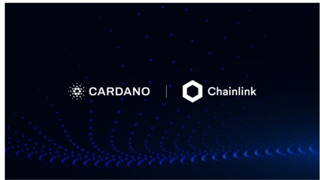

# Cardano tích hợp oracle của Chainlink để cập nhật dữ liệu thị trường theo thời gian thực

### **Sự hợp tác mới của chúng tôi sẽ bổ sung thêm hỗ trợ cho các nhà lập trình xây dựng hợp đồng thông minh cho các ứng dụng DeFi trên Cardano**

  Ngày 25 tháng 9 năm 2021[ Tim Harrison](tmp//en/blog/authors/tim-harrison/page-1/) bài đọc 4 phút

### [**Tim Harrison**](tmp//en/blog/authors/tim-harrison/page-1/)

VP of Community &amp; Ecosystem

Communications

- 
- 
- 
- 

Trọng tâm tiềm năng của DeFi và RealFi là việc sử dụng công nghệ ngang hàng dựa trên blockchain để xây dựng các sản phẩm tài chính minh bạch và đáng tin cậy bằng cách sử dụng oracle và hợp đồng thông minh. Trong Hội nghị thượng đỉnh Cardano ngày hôm nay, chúng tôi đã công bố sự hợp tác chiến lược mới thú vị với Chainlink Labs, điều này sẽ hỗ trợ các nhà lập trình xây dựng các hợp đồng thông minh cho các ứng dụng Cardano DeFi.

Quyền truy cập vào cơ sở dữ liệu trong thế giới thực sẽ được cung cấp thông qua mạng lưới 'oracle' phi tập trung của Chainlink, cung cấp dữ liệu bên ngoài chất lượng cao, chống giả mạo cho các blockchain, cho phép 'hợp đồng thông minh' thực thi xung quanh các tập dữ liệu như kết quả bầu cử, thống kê thể thao và tỷ giá tiền mã hóa. Một ví dụ khác có thể khá hữu ích là cung cấp dữ liệu thời tiết. Chainlink Labs làm việc với một số công ty khởi nghiệp FinTech đang cung cấp các hợp đồng bảo hiểm rủi ro thiên tai ở châu Phi gần Sahara. Dữ liệu thời tiết an toàn, có thể xác minh và vững chắc là điều quan trọng cần thiết cho các hợp đồng bảo hiểm rủi ro thiên tai.

Chainlink cung cấp các dịch vụ oracle để cung cấp sức mạnh cho các hợp đồng thông minh kết hợp trên bất kỳ blockchain nào. Mạng oracle của Chainlink cho phép các hợp đồng thông minh kết nối với bất kỳ API đáng tin cậy nào, tận dụng các tính toán off-chain an toàn cho các ứng dụng nhiều tính năng. Chainlink hiện bảo đảm hàng chục tỷ đô la trên DeFi, bảo hiểm, trò chơi và các ngành công nghiệp chính khác, cung cấp cho các doanh nghiệp toàn cầu và các nhà cung cấp dữ liệu hàng đầu một cổng kết nối chung cho tất cả các blockchain.

Là giải pháp oracle ưu tiên cho Cardano, các nhà lập trình blockchain sẽ có thể sử dụng dữ liệu từ Chainlink vào các hợp đồng thông minh của họ - các thỏa thuận kỹ thuật số dựa trên blockchain sẽ tự động thực thi khi một số điều kiện xác định trước được đáp ứng.

Ngoài việc cấp dữ liệu giá thị trường, Chainlink cũng cung cấp các dịch vụ hỗ trợ phi tập trung khác như: dữ liệu thể thao cho thị trường dự đoán, dữ liệu thời tiết cho các sản phẩm bảo hiểm rủi ro thiên tai, xác minh ngẫu nhiên cho trò chơi và các bộ sưu tập kỹ thuật số như token không thể thay thế (NFTs).

Sự hợp tác này giữa IOHK và Chainlink Labs sẽ cung cấp quyền truy cập vào vô số dữ liệu an toàn, giúp DeFi xây dựng một hệ thống kinh tế toàn cầu ít tốn kém hơn và bao trùm hơn. Ban đầu, nguồn cấp thông tin về giá thị trường theo thời gian thực sẽ được liên kết với Cardano. Theo thời gian, nguồn cấp dữ liệu bổ sung về thể thao và thời tiết sẽ diễn ra, để sử dụng với bảo hiểm, trò chơi và NFTs.

Người sáng lập IOHK Charles Hoskinson cho biết: “Oracle là điều cần thiết để làm cho dữ liệu trong thế giới thực có thể truy cập được trên Cardano và chúng hỗ trợ các hợp đồng thông minh tiên tiến, chẳng hạn như các ứng dụng DeFi."

IOHK cam kết cung cấp cho các nhà lập trình công cụ an toàn và mạnh mẽ nhất để xây dựng các giải pháp hữu ích trên Cardano, giúp dễ dàng tích hợp các giải pháp oracle hàng đầu thị trường của Chainlink vào.

Ông nói thêm: “Việc tích hợp nguồn cấp dữ liệu của Chainlink không chỉ giúp giảm thời gian truy cập thị trường cho các nhà lập trình Cardano mà còn thiết lập một nền tảng an toàn cho hệ sinh thái DeFi của Cardano, giúp Cardano được người dùng trên toàn thế giới tin tưởng hơn.”

Sergey Nazarov, người đồng sáng lập Chainlink, cho biết: “Chúng tôi rất vui khi tận dụng kinh nghiệm và chuyên môn sâu rộng của mình bằng cách thiết lập hỗ trợ gốc của Chainlink trên blockchain Cardano và hỗ trợ giai đoạn phát triển tiếp theo vào các thị trường như DeFi và hơn thế nữa.

“Tương tự như giao diện lập trình trong phát triển ứng dụng web, các nhà lập trình xây dựng ứng dụng DeFi trên Cardano sẽ có thể cắm và chạy nguồn cấp dữ liệu của Chainlink vào các hợp đồng thông minh của họ để nhanh chóng có quyền truy cập vào dữ liệu thời gian thực, chất lượng cao trên phạm vi rộng của tài sản trong khi vẫn duy trì bảo mật và thời gian hoạt động mạnh mẽ. Cuối cùng, điều này sẽ trao quyền cho các nhà lập trình trên Cardano để xây dựng các ứng dụng thế hệ tiếp theo nhanh hơn và an toàn hơn.”

Niki Ariyasinghe, người đứng đầu quan hệ đối tác blockchain tại Chainlink Labs, cho biết: “Chúng tôi vô cùng tôn trọng hệ sinh thái Cardano. Không những là đối với đội ngũ kỹ thuật đằng sau Cardano – IOG, mà còn đối với sự hợp tác của cộng đồng."

Ariyasinghe nói thêm: "Khả năng tương thích crosschain là một mục tiêu dài hạn khác. Đây thực sự là một khuôn khổ để tạo cầu nối giữa các chuỗi khác nhau và tạo điều kiện cho một thế giới đa chuỗi. Vì vậy, đây là điều mà chúng tôi hy vọng sẽ hợp tác với hệ sinh thái Cardano. 

Bài này được dịch bởi Lê Nguyên, Review bởi Quang Pham, Biên tập bởi Nguyễn Hiệu.

Bài viết nguồn [tại đây](https://iohk.io/en/blog/posts/2021/09/25/cardano-to-integrate-chainlink-oracles-for-real-time-market-data/) 

*Dự án được tài trợ bởi Catalyst*
