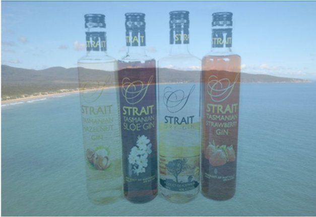

# Mang Rượu mạnh cao cấp đến blockchain Cardano

### **Nâng cao trải nghiệm khách hàng với xác thực chuỗi cung ứng dựa trên blockchain**

 Ngày 22 tháng 10 năm 2021[ Neil Burgess](tmp//en/blog/authors/neil-burgess/page-1/) 2 phút đọc

### [**Neil Burgess**](tmp//en/blog/authors/neil-burgess/page-1/)

Technical Writer

Marketing &amp; Communications

- 
- 

Hãy tưởng tượng bạn mua một chai rượu mạnh siêu cao cấp. Quét nó bằng một ứng dụng trên điện thoại của bạn và bạn biết chắc chắn rằng đó là sản phẩm chính hãng, chưa từng được khui ra hoặc giả mạo và mọi thành phần đều có thể được truy xuất nguồn gốc. Tất cả điều này có thể thực hiện được mà không cần tin tưởng vào nhà bán lẻ hoặc bất kỳ ai trong chuỗi cung ứng.

Đó là bảo mật xác thực và nó sẽ sớm trở thành hiện thực đối với khách hàng của [Strait Brands](https://www.foodandbeveragetasmania.com/partner/strait-brands/), một nhà sản xuất rượu mạnh từng đoạt giải thưởng quốc tế của Úc kể từ năm 2006.

Tại [Hội nghị thượng đỉnh Cardano 2021](https://summit.cardano.org/), [Dan Friedman](https://iohk.io/en/team/daniel-friedman) của IOG đã nói chuyện với [Philip Ridyard](https://iohk.io/en/enterprise/#product-authentication), người sáng lập Strait Brands và MD, về việc sử dụng [Atala SCAN](https://iog.io/) để kiểm định chuỗi cung ứng dựa trên blockchain. Có trụ sở tại Thung lũng Tamar ở Tasmania, Strait Brands đang hợp tác với [Input Output](https://summit.cardano.org/sessions/no-longer-a-luxury-blockchain-backed-product-authentication) để đưa Atala SCAN vào quy trình sản xuất và phân phối của họ. Xem [toàn bộ cuộc phỏng vấn ở đây](https://summit.cardano.org/sessions/no-longer-a-luxury-blockchain-backed-product-authentication).

Kinh nghiệm của Philip khi xuất khẩu sang các nước Châu Á đã cho anh ta thấy sự phổ biến của hàng giả và hàng thay thế ở các thị trường đó. Chỉ riêng trong ngành công nghiệp rượu, các sản phẩm bị làm giả, dán nhãn sai, bị thay thế hoặc pha loãng trị giá lên tới 40 tỷ đô la một năm và hiện đang tìm đường đến tay người tiêu dùng. Sau mười năm tìm kiếm, Philip đã tìm ra giải pháp lý tưởng về tính bất biến và khả năng kiểm toán của công nghệ blockchain và đối tác đầu ngành lý tưởng là Dan Friedman của công ty Input Output .

Như Philip nói, 'Để ra mắt một thương hiệu siêu cao cấp, việc xác thực và truy xuất nguồn gốc là điều rất quan trọng.'Việc xác thực này cho phép Strait Brands không chỉ cung cấp hương vị và kết cấu của sản phẩm mà còn cung cấp trọn bộ giá trị của sản phẩm. Điều đó bao gồm vị trí địa lý của Strait Brands ở Tasmania, nguồn nước suối nguyên sơ, các thỏa thuận với những người trồng trọt địa phương, các thành phần có nguồn gốc và những chai rượu tùy chỉnh'. Sẽ có bốn triệu chai có nút đậy tương thích với Atala được sản xuất trong nước và phân phối trên toàn thế giới.

Sự hợp tác này được sắp xếp trùng với sự ra mắt sắp tới của dòng sản phẩm siêu cao cấp được gọi là Badger Head. Tên này xuất phát từ con đường Badger Head Road, nơi đặt nhà máy chưng cất, và thuật ngữ này cũng được người Anh sử dụng để mô tả những con gấu túi địa phương. Bao bì bao gồm một họa tiết gấu túi.

Strait Brands thậm chí còn đang lên kế hoạch cho một phiên bản giới hạn theo chủ đề Cardano đặc biệt phù hợp với CNFTs. Thông tin chi tiết về điều này sẽ sớm được công bố!    Bài này được dịch bởi Lê Nguyên. <a class="_active_edit_href" href="https://iohk.io/en/blog/posts/2021/10/22/bringing-premium-spirits-to-the-cardano-blockchain/">với bài gốc</a> <em>Dự án này được tài trợ bởi Catalyst</em>
