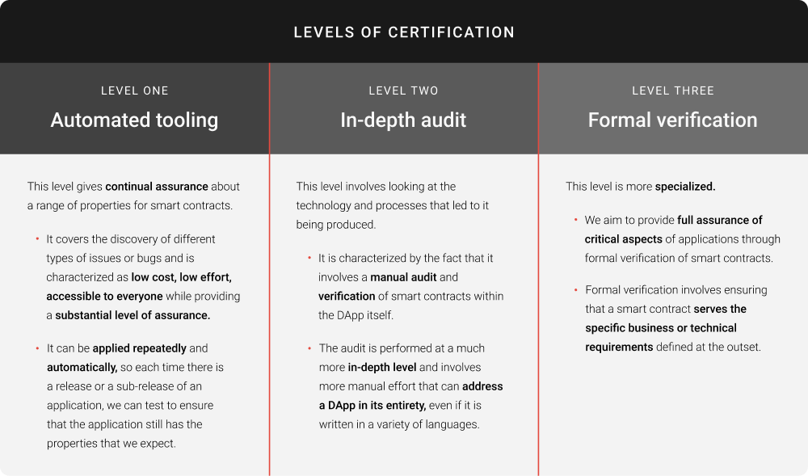

# Các cấp độ chứng nhận Hợp đồng thông minh trên Cardano

### **Chứng nhận sẽ mang lại mức độ đảm bảo cao cho sự phát triển của ứng dụng phi tập trung (DApp) trên Cardano**

 25 tháng 10 năm 2021  [Niamh Ahern](tmp//en/blog/authors/niamh-ahern/page-1/)  5 phút đọc

### [**Niamh Ahern**](tmp//en/blog/authors/niamh-ahern/page-1/)

Education Manager

Education

- 
- 
- 
- 

Mức độ đảm bảo cao là điều rất quan trọng khi phát triển và làm việc với hợp đồng thông minh. Bạn muốn tự tin rằng mã nguồn có chất lượng cao, hợp đồng được bảo mật và sẽ hoạt động bình thường. Đồng thời nó sử dụng các thuộc tính và hành vi tốt trong quá trình này. Chứng nhận đảm bảo rằng kiểm tra bảo mật được thực hiện trước khi triển khai bất kỳ thứ gì. Các hợp đồng thông minh có thể được kiểm tra liên tục khi chúng được cập nhật. Nó cung cấp lợi ích cho cả nhà phát triển hợp đồng thông minh và người dùng. Nó sẽ giúp bảo vệ tiền của người dùng và danh tiếng của dự án cũng như tránh khỏi lỗi lập trình hoặc khai thác.

Tại [Hội nghị thượng đỉnh Cardano vào tháng 9 năm 2021](https://summit.cardano.org/), chúng tôi đã đưa ra kế hoạch về việc giới thiệu các cấp độ chứng nhận mới cho ứng dụng phi tập trung (DApp) chạy trên Cardano. Chương trình chứng nhận sẽ cung cấp các mức độ chất lượng cho DApp và Hợp đồng thông minh nội bộ.

Sáng kiến này được dẫn dắt bởi [Giáo sư Simon Thompson](https://iohk.io/en/team/simon-thompson), Giám đốc kỹ thuật của dự án tại IOG, và [Shruti Appiah](https://iohk.io/en/team/shruti-appiah), Trưởng bộ phận sản phẩm tại IOG. Nó sẽ giúp chúng tôi tuân thủ các phương pháp hay nhất mà chúng tôi đã thấy trong ngành. Chúng tôi đang làm việc với [Runtime Verification](https://runtimeverification.com/), [Tweag](https://www.tweag.io/), [Well Typed](https://well-typed.com/), [Certik](https://www.certik.io/) và các công ty khác để triển khai chương trình chứng nhận mới này, sẽ liên kết với dAppStore mới, đã được công bố ở dạng nguyên mẫu tại hội nghị. Điều này sẽ được phát hành cùng với Ví nhẹ mới.

## **Các cấp độ chứng nhận khác nhau là gì?**

Có *ba* cấp độ chứng nhận, mỗi cấp độ chứng nhận bổ sung cho các cấp độ khác, chứ không phải là cấp độ tiến bộ về mặt đảm bảo và mục đích đánh giá.

### **Cấp độ một: Công cụ tự động**

Cấp độ chứng nhận này cung cấp sự đảm bảo liên tục về các thuộc tính cho các Hợp đồng thông minh. Nó bao gồm việc phát hiện ra các vấn đề hoặc lỗi khác nhau. Đặc trưng của nó là chi phí thấp, nỗ lực thấp, có thể truy cập được cho tất cả mọi người trong khi cung cấp mức độ đảm bảo đáng kể.

Nó có thể được áp dụng nhiều lần và tự động. Vì vậy mỗi khi có bản phát hành chính thức hoặc bản phát hành phụ của một ứng dụng, chúng ta có thể kiểm tra để đảm bảo rằng ứng dụng vẫn có các thuộc tính như mong đợi.

### **Cấp độ hai: Kiểm toán chuyên sâu**

Cấp độ này liên quan đến việc xem xét công nghệ và quy trình dẫn đến việc sản xuất. Đặc trưng là trong thực tế nó liên quan đến việc kiểm toán thủ công và xác minh các Hợp đồng thông minh trong chính DApp.

Việc kiểm tra được thực hiện ở mức độ chuyên sâu hơn và đòi hỏi nhiều nỗ lực thủ công hơn để có thể giải quyết toàn bộ DApp, ngay cả khi nó được viết bằng nhiều ngôn ngữ.

### **Cấp độ ba: Xác minh chính thức**

Cấp độ này chuyên biệt hơn. Chúng tôi hướng tới việc cung cấp sự đảm bảo đầy đủ về các khía cạnh quan trọng của ứng dụng thông qua việc xác minh chính thức các Hợp đồng thông minh. Xác minh chính thức liên quan đến việc đảm bảo rằng Hợp đồng thông minh phục vụ các yêu cầu kinh doanh hoặc kỹ thuật cụ thể được xác định ngay từ đầu.

## **Chúng ta có thể mong đợi sự đảm bảo nào?**

Chứng nhận sẽ đảm bảo tính đúng đắn, tuân thủ và nhất quán trong các yêu cầu của nhà phát triển ứng dụng và kiểm toán viên. Nó cũng sẽ đảm bảo không có các lỗ hổng bảo mật phổ biến và cung cấp mức độ mạnh mẽ, độ tin cậy và khả năng bảo trì của các DApp được triển khai trên Cardano. Mặc dù chứng nhận sẽ được khuyến khích mạnh mẽ và cửa hàng sẽ được sắp xếp phù hợp. Tuy nhiên, nó sẽ không bắt buộc hoặc hoạt động như bất kỳ "Người gác cổng" nào. Do đó nó duy trì sự cân bằng giữa nhu cầu đảm bảo người dùng và các nguyên tắc phi tập trung.

Bằng cách kiểm toán các thông số kỹ thuật, các giai đoạn thiết kế và ý tưởng. Bạn có thể trình bày bằng chứng cho cộng đồng và đảm bảo rằng mọi thứ sẽ hoạt động như mong đợi. Bằng chứng bao gồm tài liệu về các yêu cầu ở mức độ chi tiết, do đó tạo ra một điểm tham chiếu cho tương lai.

## **Trạng thái chứng nhận trong dAppStore**

Chúng tôi có kế hoạch tích hợp chứng nhận với dAppStore mới mà chúng tôi đang xây dựng để cung cấp Token không thể thay thế (NFT) an toàn bằng mật mã, cung cấp bằng chứng về các cấp độ chứng nhận mà chúng tôi sẽ đảm bảo. DAppStore sẽ là một phần của Ví nhẹ mà IO đang phát triển. Người dùng sẽ có thể truy cập Ví nhẹ và dAppStore bằng trình duyệt Web. Người dùng có thể vào trong cửa hàng để xem trạng thái chứng nhận của từng DApp khi họ duyệt qua các danh mục và các ứng dụng riêng lẻ. Việc hiển thị trạng thái chứng nhận liên quan cho người dùng trong quá trình lựa chọn sẽ mang lại sự yên tâm về chất lượng và sự an toàn cho người dùng khi lựa chọn DApp.

Để tìm hiểu thêm về kế hoạch phát triển dAppStore của chúng tôi, bạn có thể xem hướng dẫn khái niệm trên [Video hội nghị về dAppStore](https://summit.cardano.org/sessions/redefining-dapp-discovery-bringing-dapps-to-the-mass-market).

## **Điều gì tiếp theo cho chứng nhận?**

Giáo sư Thompson nói:

Chúng tôi muốn xây dựng sự hỗ trợ từ ngành công nghiệp đối với các tiêu chuẩn chứng nhận mới nổi. Về lâu dài, chúng tôi sẽ làm việc với các đối tác và những người khác để nêu rõ các phương pháp hay nhất. Điều này có thể liên quan đến việc thành lập một cơ quan công nghiệp bảo trợ để xác định các tiêu chuẩn và thông lệ mới cho lĩnh vực này.

Chúng tôi cũng có kế hoạch làm việc với hệ sinh thái các đối tác để hỗ trợ chứng nhận DApp đầu tiên trên Cardano. Một trong số các DEX muốn ra mắt trên Cardano trong năm nay là [SundaeSwap](https://sundaeswap.finance/) cũng đã công bố kế hoạch của họ tại Hội nghị thượng đỉnh để được chứng nhận.

Chứng nhận vẫn còn đang ở giai đoạn đầu. Có một số thách thức kỹ thuật cần phải giải quyết về cách chúng tôi hỗ trợ phiên bản DApp, cách chúng sẽ được đóng gói và cách cung cấp chứng nhận cho công cụ tự động. Tuy nhiên, chúng tôi rất vui mừng về hành trình này cùng với các đối tác và cộng đồng nói chung để cung cấp một nền tảng an toàn và các ứng dụng an toàn được xây dựng trên nền tảng đó.

Để tìm hiểu thêm về các cấp độ chứng nhận và gặp gỡ một số đối tác trong chương trình, bạn hãy xem ([https://summit.cardano.org/sessions/smart-contract-certification-the-why-and-how](https://summit.cardano.org/sessions/smart-contract-certification-the-why-and-how)) từ Hội nghị thượng đỉnh Cardano.  Bài này được dịch bởi Nguyễn Văn Tú [với bài gốc](https://iohk.io/en/blog/posts/2021/10/25/new-certification-levels-for-smart-contracts-on-cardano/) *Dự án này được tài trợ bởi Catalyst*
