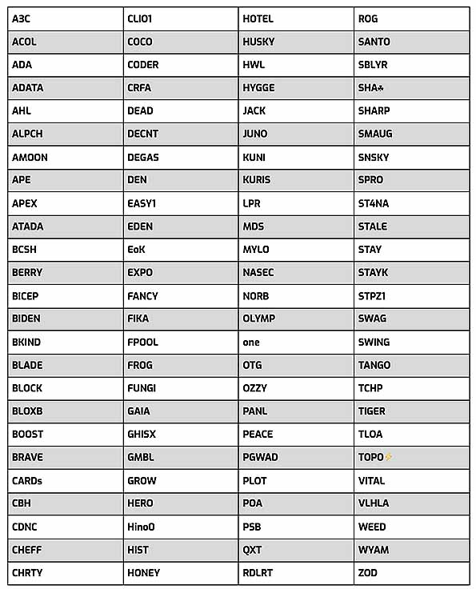

# Công bố các SPO được nhận ủy quyền vòng thứ 3 của IOG

### **Chọn 100 pool cổ phần nhận ủy quyên dựa trên những đề cử**

  Ngày 27 tháng 10 năm 2021[ Dominic Swords](tmp//en/blog/authors/dominic-swords/page-1/) 4 phút đọc

### [**Dominic Swords**](tmp//en/blog/authors/dominic-swords/page-1/)

Writer and editor

Marketing &amp; Communications

- 

IOG đã công bố 100 pool cổ phần được nhận ủy quyền của vòng thứ 3. Họ được chọn từ 520 đề cử do các nhà điều hành pool cổ phần (SPO) đưa ra, dựa trên những đóng góp cho cộng đồng Cardano.

Tất cả các pool được chọn sẽ nhận được cổ phần ủy quyền khoảng 3 triệu ada từ IOG, trong một [chiến dịch khuyến khích một hệ sinh thái pool sôi động](https://iohk.io/en/blog/posts/2021/01/22/our-new-delegation-strategy-announcing-the-pools-we-are-supporting/). Bằng cách ủy quyền số lượng lớn cổ phần này cho một pool trong vài tháng, IOG giúp pool đó tăng cơ hội tạo ra block dữ liệu mới nhất trên blockchain. Khi một block được tạo ra, pool đó sẽ kiếm được phần thưởng được chia giữa những người điều hành pool và những người nắm giữ ada đã ủy quyền cho pool.

Hầu hết các nhà điều hành pool đã tham gia - 84% đã đề cử một pool khác và 7% tham gia chỉ để quảng bá cho một pool khác và không đăng ký ủy quyền cho chính pool của họ. Tất cả các pool nhận được ủy quyền đều do các nhà điều hành pool khác đề cử.

Ben O'Hanlon, người đứng đầu cộng đồng của IOG, cho biết: 'Mặc dù, quá trình lựa chọn được thúc đẩy bởi sự đề cử của tất cả 520 pool đã tham gia, quá trình lựa chọn là tùy ý. 'Nhưng chúng ta rõ ràng nhận thấy rằng 100 pool được chọn phản ánh tiếng nói của cộng đồng.'

Ông nói thêm: 'Một sự khác biệt chính giữa bằng chứng công việc (POW) và bằng chứng cổ phần (POS) là POW trích xuất giá trị từ mạng lưới. Trong khi ở POS, các nhà điều hành pool phải thu hút sự ủy quyền, để họ có mối quan hệ chặt chẽ hơn với các bên liên quan khác trong hệ sinh thái. Đây là lý do tại sao các đề cử rất thú vị.'

Tham gia cùng với những người khác để xây dựng, sáng tạo và giáo dục là một trong những đặc điểm nổi bật của những người được chọn. Hơn 30 công cụ và tài nguyên do do các nhà điều hành Pool cổ phần (SPO) tạo ra hoặc đang được phát triển đã được thêm vào trang [Essential Cardano](https://github.com/input-output-hk/essential-cardano/blob/main/essential-cardano-list.md) trên GitHub. Điều này giúp mọi người tìm hướng đi dễ dàng hơn trong hệ sinh thái và người dùng [GitHub có thể thêm đề xuất của họ.](https://github.com/input-output-hk/essential-cardano#want-to-contribute)

Đây là bảng liệt kê 100 pool được chọn.

Trong khi hai vòng ủy quyền đầu tiên là về việc trao quyền cho các pool nhỏ hơn, hay còn gọi là 'vườn ươm', còn vòng này, các pool được yêu cầu đề cử là những pool của những nhà điều hành có đóng góp xuất sắc. Các nhà điều hành pool cổ phần (SPO) cũng được đặt câu hỏi về các vấn đề môi trường như sử dụng năng lượng xanh. (Câu trả lời của họ sẽ được công bố trong một bài đăng tiếp theo.)

O'Hanlon cho biết: 'Một vài điều mà hai vòng ủy quyền đầu tiên đã tiết lộ là: các SPO muốn làm tốt tất cả những công việc mà họ thực hiện một cách âm thầm để được công nhận. Đây là phản hồi mà chúng tôi đã nhận được, vì vậy chúng tôi đã hành động và cho các SPO cơ hội được đề cử.'

Mặc dù không phải tất cả mọi người đều sẽ đồng ý với mọi quyết định ủy quyền, nhưng điều quan trọng cần nhớ là bạn đã đạt được bao nhiêu tiến bộ kể từ đầu năm và chiến lược đã đạt được thành công như thế nào. Khi quá trình đặt cọc được thiết lập,IOG đã chạy 20 pool công khai mà nó được nhận ủy quyền cổ phần từ chính ada của mình. Tất cả, trừ một pool trong số này đã  ngừng hoạt động vào tháng 12 năm ngoái và một phần cổ phần đã được chuyển đến các pool tư nhân thông qua quy trình ủy quyền. "Vòng ủy quyền" đầu tiên bắt đầu ngày 10 tháng 12 (sinh nhật của Ada Lovelace) (sinh nhật của Ada Lovelace).

Trong vòng thứ hai, tập trung nhiều hơn vào các pool theo định hướng sứ mệnh, phân bổ theo địa lý (để giảm thiểu sự cố kết nối), hoạt động xã hội và cộng đồng (để tiếp tục 'kể câu chuyện' về blockchain Cardano) và hỗ trợ cho các nhóm trung bình thấp cốt lỗi của mạng lưới.

Vòng thứ ba này mở ra khi Cardano đạt được một trong những mục tiêu chính của mình - 100% sản lượng block nằm trong tay các pool. Điều hành một pool cổ phần là một hoạt động kinh doanh cạnh tranh và không có kết quả đảm bảo nào, nhưng IOG cho đến nay đã hỗ trợ trực tiếp bằng cách ủy quyển cho 300 pool như một phần của chiến lược này!

Bạn có thể khám phá 100 pool được chọn ở vòng 3 này và hơn 3000 pool đã hoạt động, tại [Adapools](https://adapools.org/) hoặc [Pooltool](https://pooltool.io/). Trên các nền tảng do cộng đồng xây dựng này, bạn có thể tìm kiếm bằng tên biệt danh của từng pool để biết thêm thông tin. Các chức năng tìm kiếm của chúng hoạt động khác nhau và bạn nên dành một chút thời gian để xem xét sự khác biệt này.
Bài này được dịch bởi ThanhtintranReview bởi Pham Quang, biên tập bởi Nguyễn Hiệu. Bài viết nguồn [tại đây](https://iohk.io/en/blog/posts/2021/10/27/iogs-third-round-of-ada-delegation-gives-voice-to-cardano-stake-pool-operators)

*Dự án này được tài trợ bởi Catalyst*
