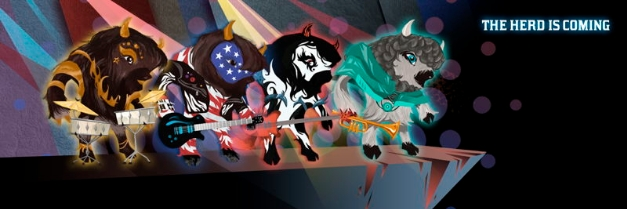

# Những chiến binh bò rừng tham gia vào thế giới blockchain

### **Crypto Bisons là một trò chơi NFT âm nhạc được công bố tại hội nghị thượng đỉnh 2021 - và có ý nghĩa sâu rộng đối với hàng loạt các ứng dụng khác nhau**

 Ngày 28 tháng 10 năm 2021[ Dominic Swords](tmp//en/blog/authors/dominic-swords/page-1/) bài đọc 4 phút

### [**Dominic Swords**](tmp//en/blog/authors/dominic-swords/page-1/)

Writer and editor

Marketing &amp; Communications

- 

Bạn muốn thể hiện sự kết hợp độc đáo các chức năng của blockchain, mang các yếu tố trong thế giới thực lại với nhau thông qua các bộ sưu tập và hợp đồng thông minh (smart contract). Tất nhiên, bạn muốn có một nhóm thuần tập đông đảo gồm những người sẵn sàng tham gia sáng tạo và chờ phát triển nó.

Thực sự đã đến lúc những chú bò rừng chơi guitar trình diễn.

*Crypto Bisons*, một trò chơi NFT được hỗ trợ trên blockchain đã được công bố tại Hội nghị thượng đỉnh Cardano 2021, dựa trên ý tưởng ban đầu của Charles Hoskinson. Ông là người sáng lập Cardano, một game thủ và cũng là nhà thiết kế trò chơi nhiều kinh nghiệm. Ông cũng là chủ nhân của một đàn bò rừng 500 con. Tại sao lại nói như vậy?

Với mục đích xem ý tưởng này sẽ đi đến đâu, Hoskinson đã tranh thủ sự giúp đỡ của sáu sinh viên tại [Enjmin](https://enjmin.cnam.fr/cnam-enjmin/presentation/ecole-nationale-du-jeu-et-des-medias-interactifs-numeriques-1036162.kjsp)*, trường quốc gia chuyên về các trò chơi kỹ thuật số của Pháp ở Angoulême. Hoskinson kể "Chúng tôi nói với họ, "Hãy vui vẻ với nó và xem các bạn có thể làm gì." Và thật sự đáng chú ý khi thấy mức độ sáng tạo và sự hội tụ của cơ chế trò chơi rất thực tế.'' 

Karim Sellami, người quản lý nhóm sinh viên Pháp cho biết: 'Câu hỏi đầu tiên mà chúng tôi gặp khi còn là sinh viên không phải là về trò chơi, mà là điều gì sẽ xảy ra trên cánh đồng của bạn khi có quá nhiều bò rừng! Một ngày nọ, một trong những con bò rừng bị ngã, nó tạo ra một tiếng ồn và tiếng ồn này rất thú vị, sau đó âm nhạc được sinh ra. Điều gì sẽ xảy ra nếu tất cả những chú bò cùng tạo ra âm nhạc, chúng tôi thực sự háo hức về nó.'

Nhưng tại sao lại ở dưới dạng một trò chơi? Romain Pellerin, giám đốc công nghệ IOG cho biết: 'Trò chơi cho nhiều người chơi là một trường hợp ứng dụng blockchain tuyệt vời. Bạn có những người chơi và họ cần kết nối với một hệ thống dưới hình thức đăng nhập tại một nơi nào đó. Với blockchain, thông tin đăng nhập đó là ví của bạn.'

Người chơi thành lập ban nhạc với thành viên là những con bò rừng. Mỗi con bò mang tính cách riêng và những đặc điểm này sẽ thay đổi khi thế giới trò chơi phát triển. Một tấm hình đại diện cho một con bò sẽ chưa hoàn chỉnh nếu không có kèn saxophone, hoặc một cây đàn guitar, phải không? Và những chiến binh bò rừng sẽ rất ngầu nếu có thêm kiểu tóc bện thừng. Chà, bạn sẽ có một bộ sưu tập thú vị.

Âm nhạc mà các ban nhạc bò rừng chơi là một chức năng khác trong thế giới kỹ thuật số: nó được tạo ra dựa trên thuật toán. Hoskinson cho biết: “Bản thiết kế ban đầu thực sự phác thảo một vài điều mà chúng tôi đã muốn làm, bằng cách kết hợp NFT, âm nhạc được tạo ra bằng thuật toán và blockchain cùng với một thành phần định vị địa lý.

'Đây là một thử nghiệm tuyệt vời để đưa NFT lên cấp độ tiếp theo. Cho đến gần đây, NFT đã được coi là một thứ gì đó cố định. Chúng là hình ảnh, video... - việc này giống như sở hữu một lá thư hoặc một đồ vật nào đó. NFT không thể thay đổi được; nó chỉ đơn giản nằm ở đó và, như bạn biết đấy, chúng ta có thể giao dịch được hay làm những việc khác.'

Ngược lại, trong *Crypto Bisons*, đối tượng trò chơi được sử dụng theo thời gian, từ trò chơi này sang trò chơi khác và thậm chí, trên các nền tảng khác bên ngoài trò chơi. Những nền tảng này có ảnh hưởng đến khả năng sử dụng NFT. 'Và đó thực sự là một thử nghiệm tuyệt vời để tiếp tục tiến hành. Bạn biết đấy, điều này cũng có ý nghĩa thiết thực về cơ sở hạ tầng đối với Cardano’, Hoskinson nói.

Khi con bò đầu đàn đi đâu, những con khác chắc chắn sẽ đi theo. 'Cầu nối giữa thế giới thực với thế giới blockchain - điều mà trước đây vẫn chưa thực sự làm được. Sau khi hoàn tất, bạn có thể sử dụng nó làm khuôn mẫu cho bất kỳ thứ gì trong thế giới thực. Đó có thể là một tác phẩm nghệ thuật, một loại động vật khác, người, địa điểm hay những thứ đại loại như vậy.'

Pellerin nói thêm: 'Các đối tượng trò chơi có thể được chia sẻ trong trò chơi, thậm chí cả bên ngoài trò chơi này. Bạn có thể sử dụng lại chúng trong các trò chơi khác nhau, đồng thời có thể hỗ trợ cho việc giải trí, âm nhạc, trò chơi điện tử khác, nền tảng và mạng xã hội. Cuối cùng, tính logic và kịch bản có thể được biểu thị như một hợp đồng thông minh để không chỉ phát triển cốt truyện mà còn phát triển đối tượng trò chơi. Vì vậy, chúng tôi có niềm tin lớn với trò chơi này. Nó sẽ mang lại sự đổi mới đáng kể khi tạo thành các tiêu chuẩn, do chúng tôi phải thiết kế đối tượng trò chơi trên tiêu chuẩn của NFT. Như vậy, nhiều phiên bản của trò chơi tiêu chuẩn sẽ được hình thành. Việc này sẽ cần nhiều thời gian nghiên cứu hơn.'

Một điều khác mà Hoskinson thích ở trò chơi này là người chơi cạnh tranh với nhau theo hướng sáng tạo chứ không phải tiêu diệt nhau. Những con bò chỉ muốn chơi theo cách của chúng trong hội trường âm nhạc danh tiếng.

(* Trường quốc gia chuyên về trò chơi và phương tiện tương tác kỹ thuật số)

Hãy cập nhật tất cả các thông tin từ trang web [Cardano Summit 2021](https://summit.cardano.org/) và [IOHK’s Twitter](https://twitter.com/InputOutputHK).

Bài này được dịch bởi Chitk, review bởi Quang Pham, đăng bài bởi Nguyễn Hiệu

Nguồn bài viết [tại đây](https://iohk.io/en/blog/posts/2021/10/28/buffalo-soldiers-march-to-the-heart-of-the-blockchain)

*Dự án này được tài trợ bởi Catalyst*
