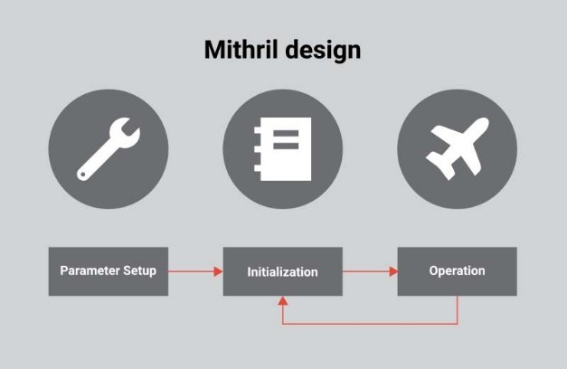
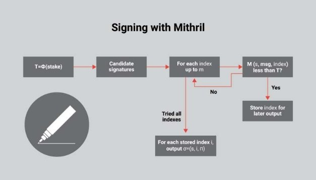
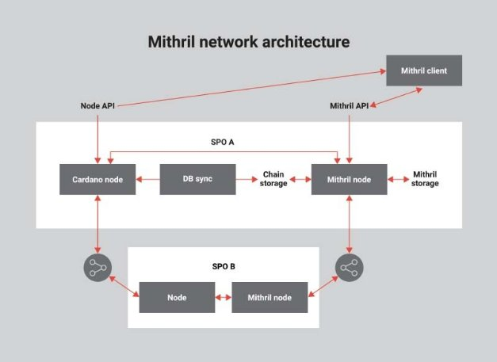

# Mithril: Một Blockchain Mạnh và nhẹ hơn để đạt hiệu qua hơn.

### **Một giao thức mới do IOHK phát triển hoạt động như một sơ đồ chữ ký ngưỡng dựa trên cổ phần cho phép tận dụng cổ phần minh bạch, an toàn và nhẹ**
 29 October 2021[ Olga Hryniuk](tmp//en/blog/authors/olga-hryniuk/page-1/) 10 mins read

### [**Olga Hryniuk**](tmp//en/blog/authors/olga-hryniuk/page-1/)
Technical Writer

Marketing & Communications

- 
- 

Tại [Cardano Summit 2021](https://summit.cardano.org/), các nhà nghiên cứu của IOHK Pyrros Chaidos và Roman Oliynykov đã trình bày thiết kế và mục tiêu của Mithril - nghiên cứu mới và nỗ lực kỹ thuật được thực hiện bởi IOHK.
Mithril sẽ cung cấp một sơ đồ chữ ký ngưỡng dựa trên cổ phần có thể được thực hiện dưới dạng giao thức để giải quyết đồng bộ hóa chuỗi, bootstrapping trạng thái và các vấn đề tin cậy trong các ứng dụng blockchain.

Mithril là cái tên được sử dụng cho một kim loại hư cấu trong trung bình-một vật liệu dễ uốn, rất nhẹ có trọng lượng nhưng mạnh mẽ như 'thép ba', không bị làm mờ hoặc mờ.
Do đó, tên tượng trưng cho sức mạnh về mặt bảo mật và cách tiếp cận nhẹ liên quan đến giao thức được phát triển.

## ** Tận dụng cổ phần cho tập hợp chữ ký **

Hãy bắt đầu với một số thông tin cơ bản để hiểu lợi ích của Mithril cho sự phát triển của các giải pháp blockchain.

Cardano là một blockchain bằng chứng cổ phần POS, vì vậy thuật toán đồng thuận chọn ngẫu nhiên các nút để trở thành nhà sản xuất khối theo cổ phần mà họ nắm giữ. Đối với một số tin nhắn hoặc hành động nhất định, điều quan trọng là một số lượng các bên liên quan cụ thể cung cấp chữ ký mật mã của họ. Giao thức đồng thuận xác định cách các nút riêng lẻ đánh giá trạng thái hiện tại của hệ thống sổ cái và có ba trách nhiệm chính:

- Thực hiện kiểm tra người lãnh đạo và quyết định xem có nên sản xuất một khối

- Lựa chọn chuỗi xử lý

- Xác minh các khối đã sản xuất.

Để đạt được khả năng mở rộng lớn hơn trong blockchain, điều cần thiết là phải giải quyết sự phức tạp của các hoạt động quan trọng phụ thuộc vào logarit vào số lượng người tham gia.
Điều này có nghĩa là số lượng người tham gia càng cao (được giả định là rất nhiều), nó càng phức tạp hơn để ** hiệu quả ** tổng hợp chữ ký của họ. Trong một kịch bản cơ sở, để cho rằng một chữ ký nói chuyện cho phần lớn các bên liên quan, mọi bên liên quan cần phải ký vào thông điệp cá nhân thích hợp. Mặc dù điều này là có thể, nhưng nó không hiệu quả về khả năng mở rộng và tốc độ.

Đưa ra thời gian cần thiết để xác nhận một thông điệp cụ thể và việc sử dụng tài nguyên trong quá trình đồng bộ hóa chuỗi, điều quan trọng là cung cấp một giải pháp giúp tập hợp đa chữ ký nhanh chóng và hiệu quả mà không ảnh hưởng đến các tính năng bảo mật.

## ** Thiết kế giao thức Mithril **

Mithril là một giao thức được thiết kế để:

- Tận dụng cổ phần để đạt được hiệu quả cao hơn

- Đảm bảo thiết lập trong khi không yêu cầu cài đặt tin cậy 

- Tận dụng sự đánh đổi giữa kích thước và hiệu quả, được đảm bảo bởi thiết kế thành phần mô-đun.

Mithril làm việc trong một môi trường công cộng nơi người ký không cần phải tương tác với những người ký khác để tạo ra một chữ ký hợp lệ. Bộ tổng hợp kết hợp tất cả các chữ ký thành một và quá trình này là logarit đối với số lượng chữ ký, dẫn đến hiệu suất thăng hoa cho tập hợp mithril.
Ví dụ, khi được áp dụng cho các máy khách nút đầy đủ như Daedalus, Mithril có thể tăng cường đồng bộ hóa dữ liệu nút đầy đủ đảm bảo tốc độ và giảm mức tiêu thụ tài nguyên.

Để thể hiện một phần đáng kể của tổng cổ phần, Mithril sử dụng cài đặt * ngưỡng * dựa trên cổ phần.
Hành vi này khác với cài đặt tiêu chuẩn trong đó số lượng người tham gia nhất định được yêu cầu để xác nhận một thông báo cụ thể. Trong cài đặt ngưỡng dựa trên cổ phần, giao thức yêu cầu một phần của tổng cổ phần để xác thực một thông báo đã cho để tạo ra một chữ ký chính xác.

Mithril cũng chứng nhận sự đồng thuận trong một môi trường không đáng tin cậy. Điều này có nghĩa là nó không bao gồm bất kỳ giả định tin cậy bổ sung. Có thể đạt được chứng nhận đồng thuận mà không bao gồm bất kỳ giả định bổ sung nào, ngoài những giả định đã có trong bằng chứng cổ phần.
Ví dụ, nó có thể hoạt động trong ví dụ như một dịch vụ và máy khách di động sẽ sử dụng chứng chỉ thu được từ nút Mithril. Với các cài đặt bảo mật nâng cao, một quy trình như vậy có khả năng hiệu quả hơn so với xác minh blockchain SPO.

Cuối cùng, để đảm bảo sự khởi động trạng thái chuỗi nhanh, sơ đồ chữ ký cho phép các bên liên quan khác nhau chỉ xác thực một điểm kiểm tra nhất định của chuỗi. Các bên liên quan không cần phải trải qua toàn bộ lịch sử giao dịch của Nhà nước đã cho - Họ chỉ cần đi qua các trạm kiểm soát để xác minh rằng cổ phần cuối cùng là hợp lệ. Điều này có lợi cho các ứng dụng khách hàng nhẹ như ví nhẹ cần làm việc nhanh mà không cần đồng bộ hóa chuỗi đầy đủ. Chữ ký Mithril cũng có thể hữu ích để xác minh kiểm đếm nhẹ hoặc ra quyết định quản trị tiền điện tử.

## **Làm thế nào nó hoạt động**

Mithril cho phép một chữ ký nhiều bên bằng cách giữ một số xổ số riêng lẻ (*m*) và xem xét một thông điệp có hiệu lực nếu nó được ký bởi một số người chiến thắng khác nhau (*k*) so với xổ số đó. Do đó, mỗi người dùng cố gắng ký tin nhắn và sau đó chuyển chữ ký của nó thông qua những gì được coi là chức năng xổ số. ng này cho phép người dùng cá nhân kiểm tra xem chữ ký của họ có đủ điều kiện là người trúng xổ số và xuất những người không chờ đợi. Điều này khác với một cài đặt tiêu chuẩn, trong đó các nhà lãnh đạo khe cần phải đợi cho đến khi khe của họ hoạt động để tham gia. Khi có chữ ký trường hợp trên các loại xổ số khác nhau, chúng có thể được tổng hợp thành một chữ ký mithril duy nhất.

** Các giai đoạn **

Thiết kế của Mithril liên quan đến ba giai đoạn:

Hình 1. Các giai đoạn hoạt động của Mithril

** Cài đặt tham số **

Để thiết lập giao thức Mithril, người dùng cần:

- Khắc phục cài đặt nhóm nơi mật mã sẽ diễn ra

- Chọn phạm vi chỉ mục *m *, là số lượng bầu cử họ sẽ nắm giữ

- Đặt kích thước đại biểu *K *, là số người chiến thắng bầu cử cần ký một chữ ký để nó được chấp nhận.

Nó cũng quan trọng để cung cấp một chuỗi tham chiếu cho hệ thống chứng minh.
Điều này là có thể một cách minh bạch và không yêu cầu bất kỳ giả định tin cậy cao nào.

** Khởi tạo **

Trong giai đoạn này, người dùng nên * cập nhật phân phối trạng thái. * Điều này cho phép mọi bên liên quan biết từ những gì họ đang nắm giữ. Sau đó, mỗi bên liên quan chịu trách nhiệm *đăng ký khóa của họ *. Điều này có thể xảy ra hoặc trên hoặc ngoài chuỗi.

Cuối cùng, người dùng cần *phân phối cổ phần và nén các khóa thử nghiệm của họ *, được thực hiện bằng cách sử dụng [cây Merkle](https://docs.cardano.org/glossary/#merkletree). Chức năng này cho phép các chữ ký mithril được xác minh đối với một hàm băm duy nhất đại diện cho cây Merkle đó. Vì vậy, kích thước của trạng thái cần thiết để xác minh một chữ ký có thể được giữ ở mức thấp.

**Hoạt động**

Trong khi làm việc với chuỗi, người dùng có thể sản xuất, tổng hợp và xác minh chữ ký Mithril.
Sản xuất chữ ký liên quan đến những nỗ lực của người dùng để kiểm tra xem chữ ký mà họ tạo ra có thực sự là người chiến thắng trên một trong những xổ số được giữ song song hay không.
Nếu đúng, người dùng sẽ phát sóng chữ ký của họ.
Nếu có đủ chữ ký hỗ trợ một thông điệp cụ thể trên các loại xổ số khác nhau, chúng có thể được tổng hợp thành một chữ ký mithril duy nhất.
Sau đó, nó có thể được phát và xác minh bởi bất kỳ ai chỉ sử dụng chuỗi tham chiếu cho hệ thống chứng minh và băm cây Merkle rất ngắn của phân phối cổ phần.

Ví dụ: một người dùng có thể tạo một chữ ký với Mithril như sau:

Hình 2. Tạo chữ ký Mithril

Đầu tiên, người dùng sẽ kiểm tra lượng cổ phần họ giữ và chuyển nó qua hàm điểm để có được ngưỡng điểm của họ *t*. Sau đó, họ sẽ cố gắng tạo ra một chữ ký ứng cử viên *s*. Đối với mỗi chỉ mục, họ sẽ đánh giá xem chữ ký của ứng viên mà họ tạo ra kết hợp với thông điệp mà họ vừa ký hay không. Số chỉ số của xổ số họ đang kiểm tra cũng sẽ tạo ra giá trị điểm số thấp hơn ngưỡng của chúng *t *. Nếu đó là sự thật, thì chữ ký ứng cử viên mà họ sản xuất đã thực sự trúng xổ số trên số chỉ mục cụ thể đó.
Nếu không, họ sẽ thực hiện nỗ lực tiếp theo.

Sau khi thử tất cả các chỉ mục có thể, người dùng sẽ có khả năng có một hoặc nhiều chỉ mục mà chữ ký * s * của họ hợp lệ. Đối với mỗi chỉ mục đó, họ có thể xuất ra một chữ ký riêng lẻ bao gồm chữ ký ứng cử viên của họ, số chỉ mục có giá trị và bằng chứng xác minh rằng điểm số của chúng phù hợp với cổ phần đã đăng ký.

## **Kiến trúc mạng**

Triển khai Mithril trên Cardano, chúng ta có thể biểu thị tương tác phần mềm như sau:

Hình 3. Kiến trúc mạng Mithril

Đại diện cấp cao của phần mềm xung quanh toán tử nhóm cổ phần (SPO) bao gồm kết nối của nó với mạng Cardano Peer-To-Peer (P2P), Mạng P2P của Node Mithril và máy khách MITHRIL được kết nối với nút chạy bằng một spo.

Nút Mithril tại nền tảng SPO truy cập vào blockchain đã được xác minh của nó tại bộ lưu trữ cục bộ và chạy giao thức để tạo các chứng chỉ Mithril được giữ tại bộ lưu trữ Mithril. Chứng chỉ Mithril được sản xuất có thể được đồng bộ hóa một cách rõ ràng trên toàn bộ mạng. Do đó, SPO có thể chia sẻ cả blockchain Cardano đầy đủ * và * danh sách các chứng chỉ mithril hợp lệ cho nó. Khi máy khách Mithril kết nối với mạng, nó yêu cầu một danh sách các chứng chỉ Mithril và chỉ yêu cầu chuỗi dài nhất của blockchain Cardano.

Several SPOs can also participate in such a setting. The Mithril client will then verify that certificates fully confirm the obtained Cardano blockchain. The whole procedure is lightweight and will not require the involvement of significant network storage or computational resources. Moreover, Cardano full node sync and fast sync with Mithril procedures are not mutually exclusive – they can be run in parallel. Mithril fast sync will be later confirmed by the full node sync. 

Một số SPO cũng có thể tham gia vào một cài đặt như vậy. Sau đó, máy khách Mithril sẽ xác minh rằng các chứng chỉ xác nhận đầy đủ blockchain Cardano thu được. Toàn bộ quy trình là nhẹ và sẽ không yêu cầu sự tham gia của lưu trữ mạng hoặc tài nguyên tính toán quan trọng. Hơn nữa, Cardano Full Node Sync và đồng bộ hóa nhanh với các quy trình Mithril không loại trừ lẫn nhau - Chúng có thể được chạy song song. Mithril Fast Sync sau đó sẽ được xác nhận bằng cách đồng bộ hóa nút đầy đủ.

## **Trường hợp sử dụng**

Hãy xem xét các trường hợp sử dụng trong đó khả năng áp dụng Mithril rất có lợi.

Mithril tăng hiệu quả của * khách hàng nút đầy đủ * hoặc các ứng dụng như [Daedalus](https://www.google.com/url?q=https://docs.cardano.org/cardano-components/daedalus-wallet&sa=D&source=editors&ust=1633506174851000&usg=AOvVaw1TSia4xDEiu6-d-ClvqO6a). Nó đảm bảo đồng bộ hóa nhanh chóng và an toàn của dữ liệu nút đầy đủ, cải thiện đáng kể thời gian và các tài nguyên cần thiết bao gồm tính toán, trao đổi mạng và lưu trữ cục bộ trong khi vẫn bảo đảm bảo mật cấp cao.

Mithril cũng có thể áp dụng cho *khách hàng nhẹ và ứng dụng di động *, đảm bảo cách tiếp cận không đáng tin cậy. Một lợi thế đáng kể khác là sử dụng chữ ký Mithril để chạy *sidechains *.
Blockchain chính có thể kết nối với các sidechain khác nhau thậm chí có thể có các giao thức đồng thuận khác nhau. Mithril có lợi ích trong việc xác minh trạng thái blockchain nhẹ, và do đó, chứng chỉ có thể xác nhận trạng thái hiện tại của blockchain cụ thể cũng như tính chính xác của chuyển tiếp theo và lùi một cách an toàn.

Cuối cùng, các ứng dụng bỏ phiếu dựa trên cổ phần và các giải pháp quản trị có thể sử dụng Mithril bất kể độ phức tạp của giao thức bỏ phiếu. Chữ ký Mithril có thể được sử dụng để xác minh kiểm đếm an toàn và nhẹ. Điều này cũng hữu ích trong quản trị khi các bên liên quan trải qua quá trình ra quyết định phi tập trung và cung cấp kết quả cuối cùng theo một cách dễ dàng và có thể kiểm chứng.

## ** Triển khai **

Một số công ty đã quan tâm đến việc triển khai Mithril trong các giải pháp blockchain của họ.[Galois](https://galois.com/research-development/),một công ty R&D tiên tiến tập trung vào các phương pháp chính thức, mật mã và phần cứng, sẽ triển khai nguyên mẫu Mithril đầu tiên dựa trên nghiên cứu do IOHK thực hiện. Galois sẽ triển khai Mithril trong ngôn ngữ lập trình rỉ sét do các tính năng tạo mẫu nhanh của nó. Họ có kế hoạch trước tiên để trình bày các chữ ký nhỏ hơn với Bulletproofs, sau đó tiếp theo là triển khai sẵn sàng sản xuất và cuối cùng là bằng chứng chính thức về tính đúng đắn.

[Idyllic Vision](https://www.google.com/url?q=https://idyllicvision.com/%23/&sa=D&source=editors&ust=1633533919267000&usg=AOvVaw1sXpYwItx-H5CX6OgJ-wzT) là giao thức nhận dạng có chủ quyền dựa trên bằng chứng không hiểu biết, một hệ thống quản lý thông tin xác thực cho các tổ chức và ví di động cho người dùng cuối hỗ trợ khả năng tương tác giữa các giải pháp xã hội khác nhau. Họ đang lên kế hoạch thực hiện bằng chứng về khái niệm của nút Mithril. Trong những tháng tiếp theo, họ sẽ bắt đầu với việc tạo ra một kế hoạch chi tiết về kiến trúc giải pháp, xác định một số thành phần hệ thống cần được phát triển và tích hợp hữu cơ vào cơ sở hạ tầng hiện có. Điều này bao gồm tích hợp với thư viện tiền điện tử Mithril và nút Cardano và lớp mạng để liên lạc giữa các nút. Kết quả của giai đoạn này nên được tích hợp vào Cardano để cho phép bootstrapping nhanh của nút và hỗ trợ cho các chức năng bổ sung như các máy khách nhẹ như những người khác.

Để tìm hiểu thêm, hãy đọc [Mithril research paper](https://iohk.io/en/research/library/papers/mithrilstake-based-threshold-multisignatures/) và xem [Cardano Summit presentation](https://summit.cardano.org/sessions/mithril-linking-together-a-stronger-and-lighter-blockchain).
