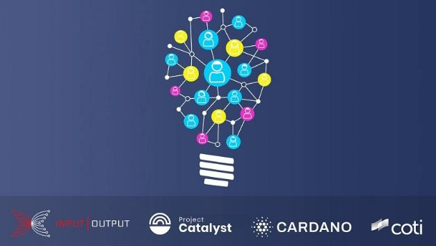

# Giới thiệu về Catalyst Natives - Cách thức để mọi doanh nghiệp có thể tận dụng được công cụ đổi mới của Cardano

### **Là một phần của dự án Catalyst, chương trình Catalyst Natives mở ra tiềm năng của công nghệ blockchain cho các trường hợp sử dụng mới để phục vụ việc kinh doanh hàng ngày thuộc mọi quy mô**

 10 tháng 11 năm 2021  [Fernando Sanchez](tmp//en/blog/authors/fernando-sanchez/page-1/)  5 phút đọc

### [**Fernando Sanchez**](tmp//en/blog/authors/fernando-sanchez/page-1/)

Technical Writer

Marketing and Communications

- 
- 

Chúng tôi rất vui mừng được thông báo về chương trình thử nghiệm Catalyst Natives đầu tiên-một phần của [Project Catalyst](https://iohk.io/en/blog/posts/2021/02/12/our-million-dollar-baby-project-catalyst/), một công cụ đổi mới hướng tới cộng đồng của Cardano. Catalyst Natives cho phép bất kỳ tổ chức nào tận dụng sức mạnh của tập thể để giải quyết các vấn đề kinh doanh và thuê nguồn lực bên ngoài để thực hiện các giải pháp. Dự án này mở ra tiềm năng của công nghệ blockchain cho các trường hợp sử dụng mới để phục vụ việc kinh doanh hàng ngày, bao gồm các giao dịch lớn và nhỏ.

Chúng tôi đang triển khai một loạt các thử nghiệm, trước hết là kết hợp với [COTI](https://coti.io/)-một công ty công nghệ tài chính cấp doanh nghiệp để trao quyền cho các tổ chức xây dựng các giải pháp thanh toán của họ. COTI đã hợp tác với Cardano phát triển một giải pháp thanh toán ada rất thân thiện với người dùng và có thể mở rộng cho cộng đồng. Do đó, từ những người bán hàng trực tuyến, hay một khách sạn nhỏ ở châu Âu đến một trang web thương mại điện tử lớn ở châu Á đều có thể dễ dàng chấp nhận hàng trăm hoặc hàng nghìn giao dịch ada bằng cách tích hợp [adaPay](https://adapay.finance/) vào trang web của họ.

Khi được hỏi về quan hệ đối tác, Shahaf Bar-Geffen, Giám đốc điều hành của COTI cho biết:

Chúng tôi rất vui mừng trở thành công ty đầu tiên ra mắt quỹ Catalyst Natives. Là những đối tác thân thiết, nên COTI, IOHK và Cardano Foundation tiếp tục hợp tác để cho phép các nhóm từ khắp nơi trên thế giới tham gia vào quá trình phát triển adaPay và tham gia vào thử thách của chúng tôi. Việc tìm kiếm những cách thức sáng tạo mới để làm phong phú thêm adaPay sẽ không chỉ đem lại giá trị cho cộng đồng Cardano và COTI mà còn cho toàn bộ thế giới bằng cách cho phép rất nhiều người bán hàng chấp nhận ada làm phương tiện thanh toán

### **Project Catalyst**

Trong vòng chưa đầy một năm, Project Catalyst đã phát triển trở thành quỹ đổi mới phi tập trung lớn nhất thế giới. Đây là một trung tâm sẽ phát triển và đổi mới bền vững trong tương lai, nhờ sự thúc đẩy của cộng đồng Cardano và dành cho cộng đồng Cardano. Trong lần thử nghiệm ban đầu này của Catalyst Natives, chúng tôi đang mở cửa cho các tổ chức bên ngoài hệ sinh thái Cardano để khai thác sức mạnh của công cụ đổi mới Project Catalyst.

Tại mỗi vòng tài trợ, Project Catalyst đã đưa ra một số thách thức cho cộng đồng trong việc hợp tác và đưa ra các giải pháp. Giờ đây, với sự ra mắt của [Fund 7](https://bit.ly/3qzYYP8), với tổng quỹ 8 triệu đô la bằng ada, 80% trong số đó dùng để tài trợ dự án và 20% dành cho các phần thưởng khuyến khích cho cử tri và cố vấn cộng đồng. Fund 7 bao gồm 24 thử thách, trong đó 21 thử thách là do cộng đồng đề xuất và bình chọn, hai thử thách do [IOG](https://iohk.io/) đề xuất và chương trình thí điểm Catalyst natives phối hợp với COTI. Cộng đồng Catalyst bỏ phiếu cho các giải pháp được trình bày và những người chiến thắng trong cuộc bỏ phiếu đó sẽ nhận được tài trợ để hoàn thành dự án của họ.

### **Catalyst Natives**

Catalyst Natives mở rộng quyền truy cập vào chức năng Project Catalyst giống như [native tokens](https://docs.cardano.org/native-tokens/learn) Cardano mở rộng phạm vi của tokens trên Cardano blockchain.

Với sự ra đời của Catalyst Natives, các tổ chức bên ngoài hệ sinh thái Cardano/Catalyst cũng có thể đưa ra các thử thách và đưa ra các ưu đãi cũng như phần thưởng cho những người đáp ứng thành công thử thách với các đổi mới được đề xuất của họ.

Trong thử nghiệm này, COTI đưa ra một thử thách kỹ thuật sáng tạo cho cộng đồng của chúng tôi. Tất cả các doanh nghiệp vừa và nhỏ hiện đang sử dụng các nền tảng như Shopify và WooCommerce có thể hưởng lợi từ những cách làm mới và sáng tạo nhằm chấp nhận phương thức thanh toán bằng ada thông qua việc tích hợp liền mạch và thêm phần mềm hỗ trợ vào trang web của họ.

Sau khi thử nghiệm, chúng tôi sẽ mở Catalyst Natives để tiếp nhận thêm những thử thách từ các tổ chức bên ngoài khác, những thử thách này trong giai đoạn đầu sẽ được IOG sắp xếp để đảm bảo tăng thêm giá trị cho hệ sinh thái Cardano. Thông qua Natives các tổ chức gửi thử thách sẽ được tài trợ cho các đề xuất đó, có nghĩa là Catalyst Natives không sử dụng nguồn tài trợ của kho bạc Cardano để thanh toán cho các dự án đã được bình chọn thành công. Trong Fund 7, COTI cung cấp thêm một trăm nghìn đô la bằng tokens COTI, do đó tổng quỹ sẽ cao hơn 8 triệu đô la bằng ada hiện có.

Catalyst Natives là một đề xuất tuyệt vời dành cho các tổ chức thuộc mọi mô hình và quy mô để tiếp cận với kho ý tưởng thực sự và cho những người có kỹ năng hiện thực hóa chúng. Catalyst Natives hiện đang tìm cách giúp các đối tác và các dự án tokens gốc trong hệ sinh thái Cardano giải quyết các điểm khó khăn cụ thể mà họ không có nguồn lực để giải quyết hoặc đơn giản là không có giải pháp và thuê nguồn lực bên ngoài giống như những người đề xuất phương án giải quyết thử thách của Catalyst

Khi tương lai đến với chúng ta với tốc độ ngày càng nhanh, các tổ chức phải thích ứng với việc thị trường và các hệ thống thay đổi liên tục giống như Catalyst có thể tạo ra sự gián đoạn trong cách mọi người cộng tác và đưa ra quyết định ngoài cộng đồng Cardano. Các thị trường mới nổi khiến việc lập kế hoạch trở nên đặc biệt khó khăn. Sự không chắc chắn này là lý do khiến khả năng thâm nhập vào nhóm tư vấn và nhóm nguồn lực thuê ngoài khi cần thiết có hiệu quả cao và có thể là yếu tố khác biệt trong thị trường cạnh tranh.

### **Cách đăng ký Catalyst Natives**

Bạn có một vấn đề kinh doanh cụ thể và muốn tham gia vào chương trình thử nghiệm Catalyst Natives tiếp theo không? Vui lòng đăng ký [tại đây](https://forms.gle/BA8LmtrAWWmHHcY59) và thực hiện các bước tiếp theo để tiếp cận tiềm năng chưa được khai thác.

### **Tìm hiểu thêm về Project Catalyst ở đâu?**

- [Catalyst Newsletter](https://bit.ly/3dSZJvx)
- [Catalyst Announcements Channel](https://t.me/cardanocatalyst)
- [Catalyst Community Chat](https://t.me/ProjectCatalystChat)
- [Catalyst Fund 7 Launch Guide](https://bit.ly/3qzYYP8)
- [Browse Projects](https://cardano.ideascale.com)

*Tim Richmond, giám đốc truyền thông tại IOG, cũng đóng góp cho bài viết này.* 

Bài này được dịch bởi LinhPool Review và đăng bài bởi Nguyễn Hiệu. Nguồn bài viết [tại đây](https://iohk.io/en/blog/posts/2021/11/10/introducing-catalyst-natives-how-any-business-can-leverage-the-cardano-innovation-engine)

*Dự án này được tài trợ bới Catalyst*
