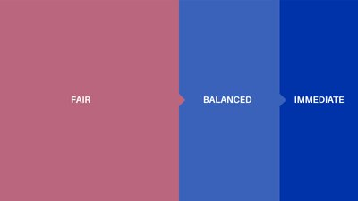

# Lưu lượng mạng lưới và hệ thống phí phân cấp

### **Tài chính phi tập trung (DeFi) sẽ tiếp tục thúc đẩy nhu cầu trên Cardano. Dự án nghiên cứu của chúng tôi đang tìm cách duy trì quyền truy cập và thông lượng công bằng cho mọi người dùng**

 Ngày 26 tháng 11 năm 2021 [Philip Lazos](tmp//en/blog/authors/philip-lazos/page-1/) 7 phút đọc

### [**Philip Lazos**](tmp//en/blog/authors/philip-lazos/page-1/)

Research Fellow

Academic Research

- 

Một bài đăng trên blog gần đây đã tóm lược một số cách mà mạng lưới Cardano sẽ [phát triển và điều chỉnh linh hoạt](https://iohk.io/en/blog/posts/2021/11/22/slow-and-steady-wins-the-race-network-evolution-for-network-growth/) để đáp ứng nhu cầu toàn cầu của các hợp đồng thông minh và DeFi. Tương tự như vậy, việc nâng cấp hệ thống phí giao dịch sử dụng cho Cardano cũng trở nên cần thiết.

Hệ thống hiện tại hoạt động một cách đơn giản và công bằng: mọi giao dịch đều được đối xử như nhau và người dùng không thể thay đổi mức độ ưu tiên của giao dịch bằng cách trả phí cao hơn. Miễn là năng lực thông lượng mạng đáp ứng được nhu cầu, thì cách tiếp cận này vẫn hoạt động tốt.

Tuy nhiên, hệ thống này tồn tại những hạn chế. Khi việc sử dụng Cardano tăng lên, đến một lúc nào đó, không phải tất cả các giao dịch đều có thể được đưa vào blockchain, ngay cả khi đã thực hiện điều chỉnh các tham số hệ thống. Mặc dù việc gia tăng năng lực của chuỗi chính và/hoặc chuyển hướng giao dịch sang [Hydra](https://iohk.io/en/blog/posts/2021/09/17/hydra-cardano-s-solution-for-ultimate-scalability/) hoặc các giải pháp layer 2 khác có thể giúp giảm bớt mối lo ngại này, tuy nhiên hệ thống cốt lõi vẫn phải hoạt động một cách nhẹ nhàng trong mọi trường hợp có thể và mọi lúc.

Vấn đề này có sự liên quan đặc biệt đến tình huống tấn công từ chối dịch vụ (DoS). Kẻ tấn công có thể lợi dụng sự đối xử bình đẳng của hệ thống hiện tại để chuyển các giao dịch rác độc hại của họ thành các giao dịch hợp pháp, làm tăng thời gian chờ đợi của những người khác. Đã có các biện pháp phòng ngừa được đưa ra (ví dụ: liên quan đến việc phát tán giao dịch thông qua mạng ngang hàng) khiến một cuộc tấn công như vậy trở nên khó khăn hơn về mặt kỹ thuật. Tuy nhiên, để tăng thêm khả năng bảo vệ, chúng tôi muốn có thể gia tăng chi phí của các cuộc tấn công mà không gây nguy hiểm đến tính công bằng và hiệu quả về phí của toàn hệ thống.

Đây là một chủ đề mà các thành viên trong nhóm nghiên cứu của IO Group đang xem xét trong năm nay. Cách tiếp cận được đưa ra trong bài đăng này giúp duy trì các trụ cột trong quy trình xử lý giao dịch trên Cardano (khả năng dự đoán, sự công bằng và truy cập ít tốn kém) đồng thời giảm thiểu các vấn đề có thể phát sinh khi nhu cầu sử dụng lớn hơn. Cách tiếp cận của chúng tôi đưa ra một cơ chế phí giao dịch mới cho các blockchain. Điểm mấu chốt của thiết kế là phân chia giao dịch trong mỗi block thành ba 'cấp độ' tùy theo tình huống sử dụng. Mỗi cấp chiếm một tỷ lệ phần trăm xác định so với kích thước tối đa của block và được thiết kế phù hợp với các loại giao dịch khác nhau (Hình 1). Các cấp độ, cùng với sự phân chia dự kiến mà chúng tôi hiện đang phân tích sẽ gồm:

- Công bằng (50%)
- Cân bằng (30%)
- Ngay lập tức (20%)

#### **Hình 1. Mỗi block sẽ được chia thành ba cấp độ.**

Chúng ta sẽ thảo luận về phân cấp 'công bằng' sau cùng, vì nó hoạt động khác với hai phân cấp còn lại. Cấp 'cân bằng' và 'ngay lập tức' làm việc dựa trên 'ngưỡng phí', ngưỡng này sẽ khác nhau cho từng loại. Để được thêm vào một block, người tạo giao dịch sẽ chỉ định cấp dịch vụ mà họ cần. Việc này được thực hiện bằng cách đặt mức phí tối đa cho giao dịch. Sau đó, mỗi block sẽ được lấp đầy bắt đầu với cấp 'ngay lập tức', sau đó là 'cân bằng' và cuối cùng là 'công bằng'. Các giao dịch trong cùng một cấp sẽ phải trả mức phí như nhau. Để việc lựa chọn trở nên đơn giản, mỗi giao dịch sẽ chỉ bị tính mức phí thấp nhất để đảm bảo việc tham dự block. Sau mỗi block, phí cho cấp 'ngay lập tức' và 'cân bằng' sẽ được cập nhật liên tục và xác định (phản ánh mức độ của nhu cầu trong các block trước đó) để đảm bảo rằng mỗi phân cấp sử dụng đúng tỷ lệ phần trăm mục tiêu của block.

Sự khác biệt giữa cấp 'ngay lập tức' và cấp 'cân bằng' là cách mà phí được cập nhật, cụ thể là 'tốc độ' điều chỉnh phí căn cứ theo lượng tải mạng hiện tại. Ngưỡng phí cho dịch vụ 'ngay lập tức' sẽ luôn cao hơn mức 'cân bằng' và sẽ phản ứng mạnh hơn với nhu cầu, đảm bảo rằng giao dịch yêu cầu sẽ được phục vụ càng sớm càng tốt. Ngưỡng phí 'cân bằng' sẽ chậm thích ứng hơn và ổn định hơn: điều này khiến nó không phù hợp với các giao dịch nhạy cảm về thời gian, nhưng sẽ cung cấp mức phí thấp hơn, độ tin cậy cao hơn, đổi lại là thời gian chờ nhiều hơn.

Trong khi cấp 'cân bằng' và 'ngay lập tức' xử lý các giao dịch có mức độ cấp thiết khác nhau, thì cấp 'công bằng' xử lý các giao dịch thông thường. Phân cấp 'công bằng' nhằm mục đích cải thiện hệ thống hiện tại của Cardano, giữ phí ở mức thấp (hoặc thậm chí ổn định trong tương lai, bằng cách neo vào một rổ hàng hóa/tiền pháp định, như được giải thích trong [bài đăng về stablefees](https://iohk.io/en/blog/posts/2021/06/10/stablefees-and-the-decentralized-reserve-system/)) và loại bỏ bất kỳ yếu tố nào không thể dự đoán trước từ góc độ người dùng. Miễn là nhu cầu ở mức thấp (và kích thước các giao dịch không quá một nửa block) thì phân cấp này sẽ hoạt động như Cardano hiện tại.

Tuy nhiên, khi nhu cầu tăng lên, một cơ chế đặc biệt sẽ được kích hoạt cho các giao dịch cấp 'công bằng'. Cơ chế này sẽ lọc các giao dịch một cách độc lập với mức phí và dựa trên hàm xác định mức độ ưu tiên. Ví dụ, xác định mức ưu tiên của giao dịch dựa vào độ tuổi và giá trị các đầu vào UTXO của chúng. Cụ thể, mức độ ưu tiên của một giao dịch nhất định sẽ bằng tổng số của giá trị mỗi đầu vào nhân với tuổi của nó và sau đó chia cho kích thước tổng thể của giao dịch tính theo byte. Mức độ ưu tiên này có thể được sử dụng kết hợp cùng với một ngưỡng phí (được cập nhật liên tục sau mỗi block) giúp lọc ra các giao dịch có mức độ ưu tiên quá thấp. Cách tiếp cận như vậy đảm bảo tính tồn tại (liveness) cho mỗi giao dịch ở mức phí thấp và có thể dự đoán được, đồng thời hạn chế sự ảnh hưởng mà kẻ tấn công ác ý (hoặc nhu cầu tăng cao) có thể gây ra đối với giá cả, bằng cách luôn cung cấp một cách ít tốn kém để đưa giao dịch vào mỗi block.

Ý tưởng phí phân cấp được trình bày ở đây cũng mở rộng và làm rõ khái niệm về cấp số nhân mà chúng tôi đã giới thiệu trong bài đăng của stablefees. Theo đó, mỗi cấp trong ba cấp được liên kết với một cấp số nhân được tính toán xác định (luôn bằng 1 với cấp 'công bằng') có giá trị phụ thuộc vào độ tắc nghẽn của cấp tương ứng trong các block trước đó.

Cơ chế này khác với các phương thức tính phí hiện tại, như đang được sử dụng bởi Bitcoin hoặc Ethereum (ngay cả với Đề xuất cải tiến Ethereum 1559), trong đó có một khoản phí biến đổi mà mỗi giao dịch phải vượt lên trên để được đưa vào trong một block. Nhược điểm của phương pháp này là mức phí mà người dùng cần trả do những người tiêu dùng 'giàu nhất' quyết định. Tệ hơn nữa, đây là khoản phí được trả bởi những người giàu nhất để đưa nó vào một block 'ngay lập tức'. Ngoài ra, mặc dù phí hầu hết là hàm của cung và cầu, nhưng các loại cơ chế phí giao dịch đặc trưng này có thể vô tình 'định hình' nhu cầu, hoặc vô tình làm tăng giá do chiến lược đặt giá thầu tối ưu không rõ ràng cho người dùng. Hãy tưởng tượng nếu phí giao dịch của Bitcoin đột ngột giảm một nửa và mọi người quên mất chúng đã từng là bao nhiêu, liệu chúng có còn tăng lên mức hiện tại hay không? Câu trả lời 'không' cho câu hỏi này minh họa những nhược điểm của các cơ chế đó và vấn đề đã biết này được hệ thống phí phân cấp ngăn chặn từ trong thiết kế.

Cách tiếp cận theo cấp được tinh chỉnh hơn. Nó hiểu rằng không phải mọi giao dịch đều có nhu cầu giống nhau, đảm bảo rằng các tình huống sử dụng khác nhau có thể xảy ra đồng thời và giúp người dùng dễ dàng lựa chọn loại dịch vụ mong muốn. Theo cách này, phí phân cấp giúp có các khoản phí hợp lý và có thể đoán trước được trong khi kiểm soát được các giai đoạn tắc nghẽn trên chuỗi chính. Kết hợp với các cải tiến trong thiết kế sẽ được tiết lộ trong các bài đăng sau, tập trung vào việc tăng năng lực thông lượng thô và sức mạnh xử lý của chuỗi chính, hệ thống phí phân cấp cho thấy Cardano sẽ có thể đáp ứng bất kỳ tình huống nào về nhu cầu xử lý giao dịch.

*Tôi muốn ghi nhận những đóng góp của Giorgos Panagiotakos, Aggelos Kiayias và Elias Koutsoupias cho bài đăng này. Chúng tôi cùng nhau thành lập nhóm nghiên cứu về thiết kế của cơ chế này. Sẽ sớm có bài báo kỹ thuật.*

Bài này được dịch bởi Hoàng Tâm, Review bởi Pham Quang, biên tập bởi Nguyễn Hiệu. Bài viết nguồn [tại đây](https://iohk.io/en/blog/posts/2021/11/26/network-traffic-and-tiered-pricing)

*Dự án này được tài trợ bởi Catalyst*
