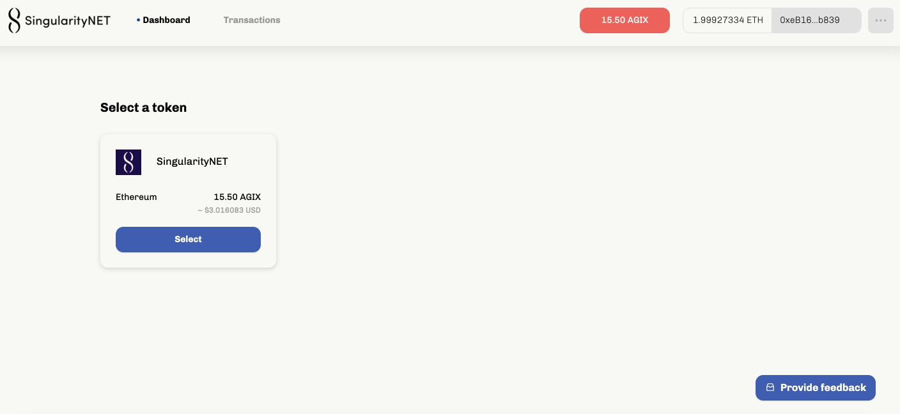
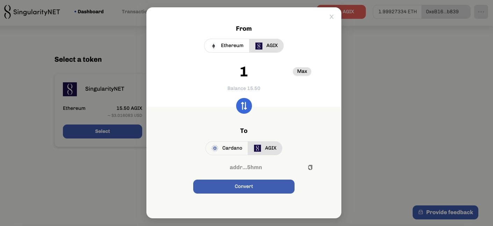
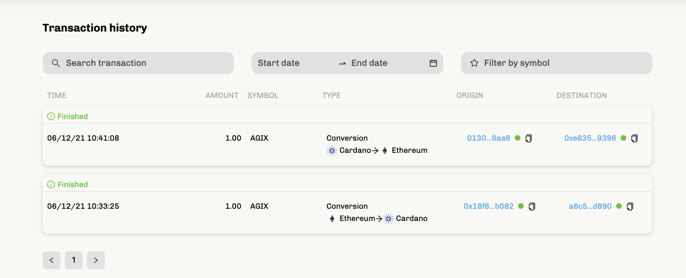

# Bộ chuyển đổi ERC20 hiện đang hoạt động trên Testnet

### **Mang Testnet công khai hiện đang sẵn sàng để bạn di chuyển token AGIX sang hệ sinh thái Cardano**

 Ngày 7 tháng 12 năm 2021[ Olga Hryniuk](tmp//en/blog/authors/olga-hryniuk/page-1/) bài đọc 6 phút

### [**Olga Hryniuk**](tmp//en/blog/authors/olga-hryniuk/page-1/)

Technical Writer

Marketing &amp; Communications

- 
- 

Trong [bài blog trước đó](https://iohk.io/en/blog/posts/2021/05/17/bringing-erc20-to-cardano/) của chúng tôi vào đầu mùa hè này, chúng tôi đã chia sẻ cách Cardano hỗ trợ việc di chuyển token chuẩn ERC20 từ Ethereum sang, hoạt động ban đầu là làm việc với SingularityNET và token AGIX của họ. Hôm nay, chúng tôi có thể thông báo rằng mạng testnet của bộ chuyển đổi AGIX ERC20 đang hoạt động và sẵn sàng để cộng đồng đánh giá.

[S](https://singularitynet.io/)[ingularityNET](https://singularitynet.io/) là đối tác đầu tiên của chúng tôi trong sáng kiến ​​này. Và công cụ chuyển đổi là một bước quan trọng trong hành trình chung của chúng tôi hướng tới sự hợp tác sâu rộng hơn nhiều với cộng đồng SingularityNET.

Tiến sĩ Ben Goertzel, Giám đốc điều hành và là nhà khoa học đại diện tại SingularityNET cho biết:

Tôi cực kỳ phấn khích trước sự xuất hiện của bộ chuyển đổi AGIX-ADA / AGIX-ETH trên Cardano testnet và ngay sau đó là trên mainnet. Mỗi cuộc cách mạng được thực hiện từng bước một và đây là bước đầu tiên trong một loạt các bước mà kết quả của nó sẽ là việc chuyển toàn bộ nền tảng AI phi tập trung SingularityNET lên Cardano. Tầm quan trọng của quá trình chuyển đổi này đối với SingularityNET và toàn bộ hệ sinh thái blockchain và AI là không thể cân đo đong đếm được - nó sẽ mang lại không chỉ mạng lưới AI nhanh hơn và kinh tế hơn, mà còn là nền tảng vượt trội để thêm các chức năng mới tiên tiến vào SingularityNET và tiến tới hiện thực hóa tầm nhìn phi tập trung của AGI.

Trong lần [testnet đầu tiên này](https://testnet.agix-converter.iohk.io/), người dùng có thể di chuyển token AGIX của SingularityNET sang Cardano và quay lại Ethereum thông qua cầu nối được cấp phép. Điều này đánh dấu một bước tiến quan trọng trong việc thúc đẩy khả năng tương thích giữa các blockchain để thiết lập một môi trường chức năng cho tài chính phi tập trung (DeFi). Người dùng có thể đánh giá khả năng của testnet và thí điểm việc chuyển các token AGIX để hưởng lợi từ khả năng giao dịch cao hơn, phí thấp hơn và các lợi ích bảo mật đã được chứng minh của Cardano.

## **Cầu nối Blockchain sức mạnh của khả năng tương thích**

Khả năng tương thích của blockchain là chìa khóa để thúc đẩy sự chấp nhận và tăng trưởng cho toàn bộ không gian. Cùng với cách tiếp cận mã nguồn mở của chúng tôi, đây luôn là một trong những ưu tiên của chúng tôi - để làm cho các giải pháp blockchain có thể truy cập được cho tất cả mọi người, bất kể giao thức đã chọn là gì. Tuy nhiên, tốc độ xử lý giao dịch, đặc tính bảo mật và khả năng mở rộng là rất quan trọng để đáp ứng nhu cầu của cộng đồng tiền mã hóa.

Chúng tôi hiện đang xây dựng và hợp tác trên nhiều cầu nối để kết nối Cardano với các blockchain khác và công cụ chuyển đổi đầu tiên này là một động mạch quan trọng trong hệ thống này. Các kết nối này càng phát triển, hiệu ứng mạng lưới càng cao để thúc đẩy dòng chảy thanh khoản trong hệ sinh thái Cardano.

Vì vậy, chúng ta hãy xem xét kỹ hơn cách hoạt động chính xác của công cụ chuyển đổi AGIX ERC20.

## **Làm việc với bộ chuyển đổi**

Bộ chuyển đổi cho phép di chuyển token AGIX dựa trên chuẩn ERC20 từ mạng lưới nguồn sang mạng lưới Cardano. Người dùng có thể truy cập trình chuyển đổi thông qua URL và di chuyển token của họ chỉ trong vài cú nhấp chuột. Bộ chuyển đổi 'chuyển' token chuẩn ERC20 thành token gốc trên Cardano có cùng giá trị và chức năng, có thể được chuyển vào ví Daedalus hoặc Yoroi để thực hiện thanh toán hoặc các giao dịch khác. Hệ thống chuyển đổi tích hợp cho phép các token được chuyển đổi lại thành định dạng ERC20, nếu muốn.

Người dùng không cần có chuyên môn kỹ thuật hoặc kinh nghiệm viết mã để sử dụng bộ chuyển đổi. Họ chỉ cần truy cập công cụ thông qua một URL và sau đó tiến hành bằng cách tạo tài khoản mới hoặc định cấu hình tài khoản Metamask hiện có.

Điều cần thiết là phải điều chỉnh cấu hình địa chỉ Cardano được liên kết, tương ứng với [ví testnet Daedalus](https://testnets.cardano.org/en/testnets/cardano/get-started/wallet/) hoặc [ Yoroi Nightly](https://chrome.google.com/webstore/detail/yoroi-nightly/poonlenmfdfbjfeeballhiibknlknepo)  để lưu trữ các token đã di chuyển. Sau thiết lập ban đầu, người dùng được khuyến khích sử dụng một số token mạng testnet AGIX và Ethereum Kovan (KETH) để bắt đầu testnet công cụ.

Công cụ chuyển đổi phản ánh số dư token và giá trị tương đương của nó bằng đô la Mỹ trên thẻ token ở  trang tổng quan:

Hình 1. Bảng điều khiển của bộ chuyển đổi ERC20

**Di chuyển token**

Để di chuyển token testnet sang Cardano, người dùng cần chọn thẻ token, chọn số lượng và nhấp vào nút Convert :

Hình 2. Quá trình di chuyển token từ Ethereum sang Cardano

Người dùng sẽ được thông báo sau khi giao dịch được xử lý trên cả hai mạng testnet Cardano và Ethereum Kovan, và số dư sẽ cập nhật tương ứng.

Đối với quy trình ngược lại, người dùng cần nhấp vào mũi tên chuyển đổi để trỏ đến blockchain mục tiêu. Hệ thống sẽ thông báo cho người dùng về việc thực hiện hợp đồng thông minh và các bước cần làm theo.

Bộ chuyển đổi cung cấp giao diện thân thiện với người dùng, có các mẹo, thông báo và thông tin bổ sung để hướng dẫn người dùng trong suốt quá trình di chuyển token của họ. Ví dụ: phiên bản testnet của bộ chuyển đổi sử dụng mạng testnet Kovan. Nếu người dùng ở một môi trường khác, hệ thống sẽ thông báo người dùng đổi mạng. Điều tương tự cũng áp dụng cho thiết lập địa chỉ của Cardano hay gửi các giá trị vượt quá số dư thực tế,...

Cuối cùng, tất cả các hoạt động có thể được theo dõi trên cả hai trình khám phá blockchain:

- [Kovan Etherscan](https://kovan.etherscan.io/) và
- [Cardano testnet explorer](https://explorer.cardano-testnet.iohkdev.io/en)

Chúng ta cũng có thể kiểm tra các giao dịch gần đây trong phần *Transaction history* của trình chuyển đổi:

Hình 3. Lịch sử giao dịch của bộ chuyển đổi ERC20

## **Điều gì sẽ diễn ra tiếp theo?**

Nhóm thương mại của chúng tôi hiện đang chạy quy trình để cho phép di chuyển token an toàn và liền mạch từ các blockchains và sidechains khác sang Cardano. Các dự án muốn khởi tạo việc chuyển đổi có thể [liên hệ tại đây](https://iohk.io/en/contact-commercial). Chúng tôi sẽ tiếp tục theo đuổi sứ mệnh tương thích của Cardano trên nhiều phạm vi được cấp phép và không cần cấp phép, tạo ra một mạng lưới các sidechains được kết nối với nhau với các ứng dụng phi tập trung (DApps) được viết bằng Solidity, Glow và hơn thế nữa. Điều này sẽ mở rộng hệ sinh thái cơ sở của DApp được viết bằng Plutus trên Cardano.

Theo triết lý của chúng tôi, bảo mật là trên hết, chúng tôi đang xử lý việc triển khai bộ chuyển đổi với sự giám sát chặt chẽ nhất để luôn đảm bảo an toàn cho tiền của các cá nhân. Đó là lý do tại sao chúng tôi mời cộng đồng thử nghiệm các bước trên testnet trong khi mã code được giám sát và kiểm tra liên tục để đảm bảo rằng mọi thứ hoạt động bình thường. Mặc dù luồng người dùng và giao diện người dùng cho bộ chuyển đổi testnet có thể sẽ rất giống nhau trên mainnet, nhưng bản thử nghiệm hiện tại vẫn chưa được tối ưu hóa cho hiệu suất. Giai đoạn testnet là một phần thiết yếu của quá trình này, thu thập dữ liệu người dùng - đặc biệt là vào thời điểm mạng lưới bão hòa - sẽ giúp chúng tôi giải quyết vấn đề này và cải thiện lưu lượng khi chúng tôi tiến gần đến thời điểm ra mắt mainnet.

Bạn đã sẵn sàng dùng thử công cụ chuyển đổi AGIX chưa? Trước tiên, hãy đảm bảo truy cập [trang testnet chuyên dụng với hướng dẫn từng bước](https://testnets.cardano.org/en/testnets/erc20-converter/erc20-overview/). Và nếu bạn đã sẵn sàng để bắt đầu, thì hãy chuyển đến [bộ chuyển đổi ERC20](https://testnet.agix-converter.iohk.io/) - testnet hiện đã hoạt động và đang chờ bạn dùng thử!

Bài này được dịch bởi Thanhtintran, Review bởi Pham Quang, biên tập bởi Nguyễn Hiệu. Bài viết nguồn [tại đây](https://iohk.io/en/blog/posts/2021/12/07/the-agix-erc20-converter-testnet-is-now-live)

*Dự án này được tài trợ bởi Catalyst*
