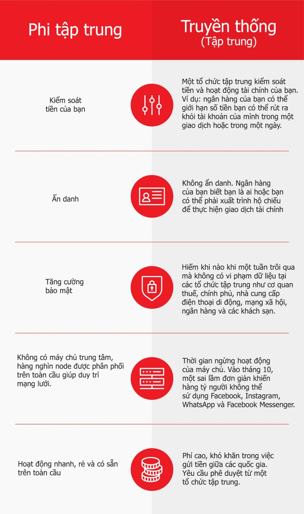
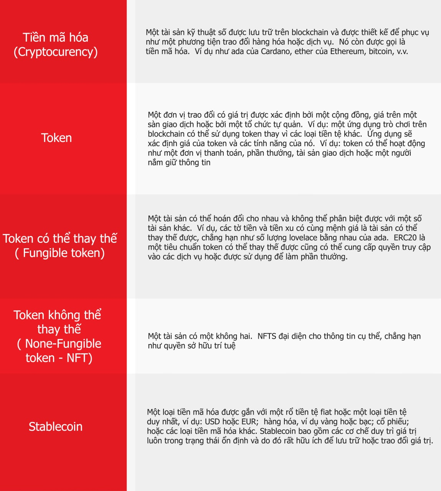

# Giải mã tài chính phi tập trung (DeFi)

### **Hệ sinh thái Cardano được thiết lập để phát triển theo cấp số nhân vào năm 2022, bây giờ là lúc để nắm bắt một số nguyên tắc cơ bản - và biệt ngữ phía sau của Tài chính phi tập trung (DeFi)**

10 tháng 1 năm 2022 [Olga Hryniuk](/en/blog/authors/olga-hryniuk/page-1/) 11 phút đọc

### [**Olga Hryniuk**](/en/blog/authors/olga-hryniuk/page-1/)

Technical Writer

Marketing &amp; Communications

- 
- 

Số lượng người dùng Ada và các nhà phát triển phần mềm xây dựng trên blockchain Cardano tiếp tục tăng. Với các dự án hiện đang trong giai đoạn thử nghiệm cuối cùng và bắt đầu triển khai, các trang web như [Cardano Cube](https://www.cardanocube.io/) , [Built on Cardano](https://buildingoncardano.com/#/) , [Building On Cardano](https://buildingoncardano.com/#/) , [Essential Cardano](https://github.com/input-output-hk/essential-cardano) và [Developers.cardano.org](https://developers.cardano.org/showcase/) đang bận rộn lập bản đồ một hệ sinh thái thú vị. Cardano đã được tạo ra như một nền tảng an toàn, mạnh mẽ để xây dựng các sản phẩm, dịch vụ và hệ thống dựa trên blockchain. Với lộ trình rõ ràng để phát triển ổn định, giờ đây chúng tôi nhận thấy nó đang mở rộng để phục vụ trên quy mô toàn cầu.

DeFi (Decentralized Finance) - tài chính phi tập trung - đã bùng nổ trong những năm gần đây, mở ra một loạt các công cụ tài chính mới - từ hữu ích đến đầu cơ điên cuồng. Cuối cùng khi thị trường này trưởng thành, mục tiêu của DeFi là giúp các cá nhân và công ty tham gia vào hoạt động tài chính mà không cần thông qua các trung gian đắt đỏ như ngân hàng hoặc để đạt được lợi nhuận cao hơn từ tài sản của họ trong thời đại lạm phát và lãi suất âm .

Cardano đã mở rộng ý tưởng này. Mục đích là mang lại các dịch vụ ngân hàng và bảo hiểm rẻ cho hàng triệu người trên toàn thế giới, những người không thể tiếp cận các sản phẩm đó. Điều này sẽ giúp phá bỏ các rào cản giữa các quốc gia phát triển và đang phát triển. Chúng tôi gọi tầm nhìn này là ' [RealFi](https://iohk.io/en/blog/posts/2021/11/25/welcome-to-the-age-of-realfi/) '.

Bất chấp sự gia tăng này đối với Cardano, mức độ hiểu biết và chấp nhận blockchain tổng thể vẫn còn thấp. Không kém phần quan trọng, vì hàng núi thuật ngữ mà mọi người tò mò về tiền mã hoá cần phải đối mặt. Vì vậy, với dự đoán về làn sóng quan tâm mới tiếp theo đến Cardano - và đặc biệt là để chào đón những độc giả *mới* đến với blog này - chúng tôi nghĩ rằng sự đơn giản có thể là một nơi tuyệt vời để bắt đầu!

Vì vậy, chúng tôi sẽ cố gắng giải thích sự phức tạp của một số khái niệm mà chúng tôi thường đọc về blockchain. Các thuật ngữ như DeFi, RealFi, DApp, DEX, liquidity, v.v. đi đôi với các sản phẩm blockchain mới nhất. Chúng ta hãy xem những thuật ngữ này có nghĩa là gì và hãy bắt đầu với các thành phần cơ bản.

## **DeFi bắt đầu từ đâu?**

Tất cả đều bắt đầu với [blockchain](https://docs.cardano.org/new-to-cardano/what-is-a-blockchain) . Vì vậy, nói một cách đơn giản, blockchain là một 'cuốn sổ' kỹ thuật số gồm các bản ghi - cái mà các kế toán viên gọi là *sổ cái* - về các giao dịch. Điều đặc biệt về cuốn sổ này là nó không được kiểm soát bởi một cá nhân, công ty hoặc quan chức chính phủ nào. Thay vào đó, các bản ghi được thực hiện theo cách *phi* tập trung. Với phi tập trung, chúng tôi muốn nói rằng hàng nghìn máy tính của mọi người giao tiếp với nhau để thống nhất xem một giao dịch có hợp lệ hay không. Họ đạt được sự đồng thuận này dựa trên các quy tắc được tích hợp trong blockchain mà họ đang chạy. Dữ liệu trên blockchain không thể thay đổi và có thể được kiểm tra bởi tất cả mọi người - Nó không thể xóa một giao dịch, giả mạo số tiền hoặc ẩn bất kỳ chi tiết nào trong hồ sơ. Tính năng này đảm bảo sự minh bạch và tin cậy giữa người dùng. Điều thú vị là mặc dù blockchain hiển thị thông tin như vậy, nhưng người dùng được 'hiển thị' dưới dạng địa chỉ. Vì vậy, mặc dù bất kỳ ai cũng có thể xem những giao dịch nào đã được thực hiện đến và đi từ một địa chỉ kể từ khi blockchain đã bắt đầu, nhưng không ai có thể xác định được người ở địa chỉ blockchain đó.

Những ưu điểm của hệ thống phi tập trung được tóm tắt trong Hình 1.

Nhưng làm thế nào để chúng ta sử dụng blockchain trong cuộc sống hàng ngày, và tại sao nó lại quan trọng? Câu trả lời rằng, blockchain sử dụng vào giao dịch hoặc trao đổi tiền tệ trong các điều kiện cụ thể, về ứng dụng có thể là vô hạn. Hiện tại, các công ty trong lĩnh vực chăm sóc sức khỏe, nghệ thuật, bán lẻ, thu thập, đồ uống, quần áo thể thao và game đã sử dụng công nghệ blockchain.

Hình 1. So sánh tài chính phi tập trung với tài chính truyền thống

## **Tài chính phi tập trung là gì?**

Tài chính phi tập trung hay **DeFi** là một hình thức tài chính dựa trên blockchain nhằm giải quyết các nhu cầu tương tự như tài chính truyền thống. Bạn có thể gửi và nhận các khoản thanh toán, thanh toán cho các sản phẩm hoặc dịch vụ hoặc đầu tư vào các dự án tiền mã hoá thay vì trái phiếu hoặc cổ phiếu. Tuy nhiên, DeFi không phụ thuộc vào bất kỳ trung gian nào và sử dụng các hợp đồng thông minh để giải quyết các giao dịch một cách công bằng. Bằng cách thêm một thành phần nhận dạng như [Atala Prism](https://atalaprism.io/app) - và do đó là 'cầu nối' với thế giới thực - Cái đó gọi là *RealFi* .

**Tiền (Money)**

Trong bối cảnh truyền thống, chúng tôi sử dụng tiền để thanh toán cho các sản phẩm và dịch vụ. Phương tiện trao đổi này thường được biểu thị dưới dạng tiền xu hoặc tiền giấy do các ngân hàng trung ương phát hành. Người dùng tiền mã hoá đã phổ biến việc sử dụng thuật ngữ fiat để mô tả tiền trong thế giới thực. Đô la Mỹ, bảng Anh và yên Nhật đều là tiền **fiat** . Từ này đã được sử dụng kể từ khi các chính phủ ngừng bảo trợ tiền tệ của họ bằng vàng. Thay vào đó, họ ban hành một sắc lệnh chính thức - một luật lệ - rằng tiền tệ của họ là hợp pháp.

Trên blockchain, mọi người sử dụng **tài sản** tiền mã hoá thay vì tiền pháp định. Chúng ta hãy xem xét các loại khác nhau (Hình 2).

Hình 2. Các loại tài sản tiền mã hoá

## **DeFi hoạt động như thế nào**

Trước khi chúng ta đi sâu vào các đặc thù của thuật ngữ DeFi, trước tiên chúng ta hãy xem nó hoạt động như thế nào. Vì vậy, động lực của các thỏa thuận bảo mật và công bằng nằm trong các hợp đồng thông minh. Giả sử bạn tải xuống một ứng dụng DeFi và bạn muốn cho Alice mượn 10 ADA. Chúng tôi cần được đảm bảo rằng Alice sẽ trả lại số tiền đó và chúng tôi cũng muốn kiếm một số tiền lãi nếu cô ấy trả lại chậm hơn so với thỏa thuận. Theo truyền thống, người dùng ký các thỏa thuận và chỉ định các điều kiện như vậy. Điều đó cũng được thực hiện trên blockchain, nhưng dưới dạng hợp đồng thông minh.

- [**Hợp đồng thông minh**](https://docs.cardano.org/new-to-cardano/what-is-a-smart-contract) (Smart contract) l một thỏa thuận kỹ thuật số tự động, được viết bằng ngôn ngữ lập trình, theo dõi, xác minh và thực hiện các phần ràng buộc của một thỏa thuận giữa các bên khác nhau. Các giai đoạn hợp đồng được lập trình thực hiện tự động khi đáp ứng các điều kiện xác định trước.

Một thực tế thú vị là các hợp đồng thông minh không tự tìm thấy dữ liệu cụ thể. Ví dụ: chúng tôi đồng ý với Alice rằng cô ấy sẽ trả lại tiền trước ngày 20 tháng 1. Để hợp đồng thông minh được thực thi, nó cần biết ngày, liệu Alice có xử lý giao dịch hay không và số tiền đã gửi có khớp với số tiền được chỉ định hay không. Đối với điều này, các hợp đồng thông minh sử dụng oracles.

- **Oracle** là một cách giao tiếp với dữ liệu trong thế giới thực. Oracles kết nối với các nguồn dữ liệu bên ngoài đáng tin cậy cho phép các hợp đồng thông minh thực thi bằng cách tham khảo các bộ dữ liệu như thời gian chính xác, thời tiết, kết quả bầu cử, thống kê thể thao và giá tiền mã hoá. Oracles đảm bảo tin tưởng vào dữ liệu kịp thời, chính xác và chưa được can thiệp.

Với Cardano, người dùng có thể làm việc với các hợp đồng **Plutus** hoặc **Marlowe** :

- [**Plutus**](https://iohk.io/en/blog/posts/2021/04/13/plutus-what-you-need-to-know/) là một bộ công cụ lập trình để viết các hợp đồng thông minh trên Cardano. Được triển khai từ tháng 9 năm 2021 trên Cardano, nó bao gồm Plutus Core - phần mềm chạy các giao dịch Plutus và các hợp đồng. Ngôn ngữ lập trình Plutus, dựa trên Haskell, một ngôn ngữ được thiết kế để viết các chương trình cực kỳ đáng tin cậy. Ngoài ra còn có [ Plutus Playground](https://iohk.io/en/blog/posts/2021/01/25/introducing-the-new-plutus-playground/) - nơi mà các nhà phát triển có thể kiểm tra mã của họ trước khi sử dụng nó trên chuỗi chính.
- [**Marlowe**](https://iohk.io/en/blog/posts/2020/10/06/marlowe-industry-scale-finance-contracts-for-cardano/) là một ngôn ngữ lập trình được thiết kế đặc biệt để viết các hợp đồng thông minh tài chính. Nó được giới hạn trong các ứng dụng tài chính và dành cho các chuyên gia trong lĩnh vực tài chính hơn là trong lập trình. Ngoài ra còn có [Marlowe Playground](https://play.marlowe-finance.io/#/) , nơi người dùng có thể tạo, chỉnh sửa, mô phỏng và phân tích các hợp đồng Marlowe trong trình duyệt web. Marlowe sẽ được triển khai tới Cardano vào cuối năm nay.

## **Hệ sinh thái DeFi**

Người dùng truy cập các nền tảng và ứng dụng tài chính phi tập trung khác nhau cho các mục đích khác nhau. Ví dụ: các sản phẩm quản lý tài sản (hoặc đơn giản là [wallets](https://docs.cardano.org/new-to-cardano/types-of-wallets) ) lưu trữ, gửi và nhận tiền mã hoá giữa những người dùng. Có nhiều ứng dụng phi tập trung (DApps):

- **DApp** là một ứng dụng kỹ thuật số chạy trên blockchain. Có nhiều loại DApp khác nhau, chẳng hạn như các sản phẩm tài chính phi tập trung, thị trường NFT, ví, sàn giao dịch, trò chơi và hơn thế nữa.

Giờ đây, hệ sinh thái Cardano đang phát triển nhanh chóng, ngày càng có nhiều sản phẩm tài chính phi tập trung đến với Cardano. Người dùng sẽ sớm có thể sử dụng DApp và nền tảng mới cho nhu cầu tài chính của họ. Do đó, để đảm bảo rằng người dùng và cộng đồng nhà phát triển có thể cung cấp và tiêu thụ các sản phẩm có chất lượng tốt nhất, chúng tôi đang nỗ lực:

- **DAppStore** là một thị trường thân thiện với người dùng cho tất cả các DApp của Cardano. Đây cũng là nơi mà những người dùng có kiến thức về blockchain hạn chế sẽ có thể khám phá những cách mà công nghệ này có thể hữu ích cho họ.
- [**Chứng nhận DApp**](https://iohk.io/en/blog/posts/2021/09/22/bringing-certified-dapps-to-cardano/) là chứng nhận và giúp đảm bảo rằng sản phẩm đáp ứng các kiểm tra chất lượng nhất định. Mặc dù là tự nguyện (Cardano là mã nguồn mở và phi tập trung) nhưng chứng nhận dAPP mang lại lợi ích cho cả nhà phát triển và người dùng vì nó bao gồm các kiểm tra bảo mật giúp kiểm tra các hợp đồng thông minh. Có [ba cấp độ chứng nhận](https://iohk.io/en/blog/posts/2021/10/25/new-certification-levels-for-smart-contracts-on-cardano/), mỗi cấp độ bổ sung cho các cấp độ khác.

Nền tảng DeFi và DApp chủ yếu giải quyết các hoạt động tài chính. Bên cạnh việc gửi và nhận tiền, chúng có thể được sử dụng để đầu tư, cho vay và đi vay.

Trên thực tế, người dùng có thể vay tiền mã hoá trên blockchain mà không phải trả lãi suất:

- **Flash loan** hoạt động như một khoản vay tức thì không yêu cầu tài sản thế chấp (số tiền cần thiết để đảm bảo khoản vay bằng các loại tiền mã hoá hoặc token khác) hoặc xác minh danh tính (KYC). Tuy nhiên, Flash loan yêu cầu hoàn trả trong cùng một block mà nó được cho vay tới người đi vay. Nếu khoản vay không được trả lại, giao dịch ban đầu sẽ bị từ chối và nhà phát hành giữ lại tiền của họ.

Chúng ta hãy xem xét thêm một vài thuật ngữ phổ biến nhất mà bạn sẽ gặp trong Tài chính phi tập trung:

- **Sàn giao dịch** (Exchange) là nơi người dùng có thể mua hoặc bán tiền mã hoá. Có hai loại sàn giao dịch. **CEX** (sàn giao dịch tập trung) được duy trì bởi một tổ chức hoặc cấu trúc cụ thể, tuân theo các quy định hoặc quy tắc. **DEX** (sàn giao dịch phi tập trung) là một loại sàn giao dịch tiền mã hoá không có trung gian và người dùng có thể mua và bán tài sản của họ một cách an toàn, ngang hàng.

**Liquidity** (Thanh khoản) là một thuật ngữ khác mà bạn thường nghe. Nó đo lường nguồn cung luân chuyển và hoạt động giao dịch trong một DEX, CEX nhất định hoặc một mạng lưới khác. Nguồn cung luân chuyển là điều cần thiết để đáp ứng nhu cầu mua bán của người dùng. Ví dụ: Alice muốn bán một số bitcoin mà cô ấy sở hữu và thay vào đó mua một số ada, và giả sử, một số token cần thiết cho ứng dụng mua sắm mới của cô ấy. Mặc dù giao dịch bitcoin rất phổ biến cô ấy sẽ không gặp bất kỳ khó khăn nào. Cô ấy có thể cũng sẽ mua ada nếu sàn giao dịch đã hỗ trợ nó. Nhưng nếu không có token nào mà cô ấy đang tìm kiếm thì sao? Hoặc, giả sử, cô ấy muốn nhận được 100 token cho ứng dụng của mình và chỉ có 30? Đây là những gì về tính thanh khoản - có đủ nguồn cung cấp coin hoặc token để đáp ứng yêu cầu của người dùng.

Tính thanh khoản bao gồm các hoạt động và khái niệm có liên quan song hành với chúng:

- **Khai thác thanh khoản** (Liquidity mining) là quá trình tạo hoặc thêm coin hoặc token mới để hỗ trợ nhu cầu giao dịch. Những người khai thác thanh khoản (nhà cung cấp) thường nhận được phần thưởng khuyến khích họ hỗ trợ cơ sở người dùng và phát triển nhóm thanh khoản. Khai thác thanh khoản còn được gọi là yield farming.
- **Pool thanh khoản** (Liquidity pool) là một nhóm các loại tiền mã hoá được ký gửi cung cấp tính thanh khoản cho mạng lưới, nơi có nhu cầu về các loại tiền tệ.
- **AMM** (nhà tạo lập thị trường tự động) là một nhóm tiền mã hoá cung cấp tính thanh khoản giữa các 'cặp giao dịch'. Một cặp giao dịch là một trận đấu giữa Alice, người muốn bán bitcoin của mình và Bob, người muốn mua nó, chẳng hạn. AMM được phân cấp và phụ thuộc vào tính thanh khoản do người dùng cung cấp.

Các sàn giao dịch phi tập trung không chỉ là thị trường thuận tiện cho giao dịch tiền mã hoá. Chúng cũng đóng vai trò là công cụ để kiếm lợi nhuận. Vì vậy, hãy thảo luận về một số điều khoản có liên quan:

- **ROI** (lợi tức đầu tư): lãi hoặc lỗ của một khoản đầu tư, thường được biểu thị bằng phần trăm.
- **Yield farming** như đã đề cập ở trên, đây còn được gọi là khai thác thanh khoản. Bởi vì phần thưởng thu được khi cung cấp quỹ, một quá trình như vậy được gọi là Farming.
- **Yield** là phần thưởng kiếm được khi đặt cược tiền mã hoá hoặc khai thác thanh khoản.
- **Đòn bẩy** (Leverage) là hành vi sử dụng vốn đi vay, kỳ vọng lợi nhuận lớn hơn lãi phải trả.

**Xin lưu ý rằng chúng tôi không đưa ra bất kỳ lời khuyên tài chính nào. Bài đăng này giải thích một số điều khoản tài chính phi tập trung chỉ dành cho mục đích cung cấp thông tin.**

Và trong khi chúng ta đang thảo luận về một số thuật ngữ 'kiếm lợi nhuận', chúng ta cũng hãy nhớ lại cách người sở hữu ada có thể an toàn hưởng lợi và nhận được phần thưởng từ ada của họ:

- [**Đặt cược (Staking) và ủy quyền (Delegating) vào Cardano**](https://docs.cardano.org/new-to-cardano/how-to-delegate): mọi người nắm giữ ada đều sở hữu một khoản tiền cược dựa trên số lượng ada mà họ có. Một nhà phát triển hoặc một người hiểu biết về công nghệ có thể thiết lập một nhóm cổ phần và điều hành nó để giúp xác minh các giao dịch Cardano, nhận phần thưởng cho việc này. Mọi người đều có thể ủy thác tiền của mình cho một nhóm cổ phần để kiếm được một phần của những phần thưởng này. Không có rủi ro cho điều này và không có ada nào rời khỏi ví của bạn. Ada có thể được ủy quyền từ ví của bạn hoặc chi tiêu bất kỳ lúc nào.

*Trong khi đây là những thời điểm thú vị, chúng tôi tiếp tục nhấn mạnh tầm quan trọng của [việc nghiên cứu của riêng bạn](https://iohk.io/en/blog/posts/2021/12/09/when-it-comes-to-defi-do-your-own-research/) và tiếp cận các sản phẩm mới một cách thận trọng. Theo dõi blog và [Twitter](https://twitter.com/InputOutputHK/status/1475107377775099910?s=20) của chúng tôi để biết các thông báo mới không bỏ lỡ điều gì. Và trong suốt năm nay, chúng tôi sẽ có nhiều nội dung hơn theo cách của bạn để giúp bạn điều hướng hệ sinh thái đang phát triển này.

Bài này được dịch bởi Quang Pham. Bài viết nguồn [tại đây](https://iohk.io/en/blog/posts/2022/01/10/defi-demystified/)
*Dự án này được tài trợ bởi Catalyst*
