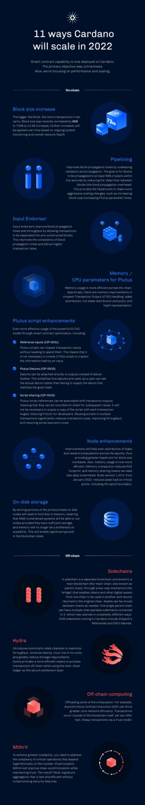

# Cách chúng tôi mở rộng quy mô Cardano trong năm 2022

### **Với cốt lõi hợp đồng thông minh đã được triển khai, giai đoạn tiếp theo của Cardano tập trung vào tối ưu hóa hiệu suất và mở rộng quy mô. Và nó bắt đầu ngay từ bây giờ…**

 14 tháng 1 năm 2022 [Tim Harrison](/en/blog/authors/tim-harrison/page-1/)5 phút đọc

### [**Tim Harrison**](/en/blog/authors/tim-harrison/page-1/)

Phó Chủ tịch Cộng đồng &amp; Hệ sinh thái

Thông tin liên lạc

- 
- 
- 
- 

Dự án Cardano luôn cam kết giải quyết vấn đề tưởng chừng như nan giải của thế hệ blockchain cũ đó là rất khó để vừa mở rộng quy mô, vừa đảm bảo sự an toàn và tính phi tập trung (quan trọng nhất). IOG là tổ chức được giao nhiệm vụ tạo ra nền tảng cốt lõi, chúng tôi luôn xác định một lộ trình để có thể phát huy hết khả năng của Cardano và phát huy hết tiềm năng lâu dài của nó.

Sử dụng các phương pháp phát triển chính thức và ngôn ngữ lập trình Haskell - với nguồn gốc từ phương pháp tiếp cận học thuật peer reviewed - chúng tôi đã cung cấp một nền tảng mạnh mẽ, an toàn và phù hợp cho tương lai. Được xây dựng một cách đúng đắn. Chúng tôi đặt tên cho giai đoạn này là kỷ nguyên Byron.

Một cộng đồng lớn đã phát triển đáng kinh ngạc nhờ những nỗ lực của chúng tôi và thông qua mạng lưới khoảng 3000 nhà vận hành pool ủy thác, chúng tôi hiện có một trong những mạng dPOS (bằng chứng cổ phần) phi tập trung lớn nhất trên thế giới. Kỷ nguyên phân quyền và pool ủy thác này được chúng tôi đặt tên là Shelley, theo tên nhà thơ và nhà chính trị cấp tiến, Percy Bysshe Shelley.

Kỷ nguyên Goguen (bao gồm sự kiện Alonzo HFC) mang đến khả năng cho hợp đồng thông minh cốt lõi, mở đường cho DeFi và DApps. Chúng tôi tiếp tục phát triển ngôn ngữ Plutus (hiện đang được triển khai) và đề xuất tổng thể, phối hợp với cộng đồng các nhà phát triển đang lớn mạnh.

Hiện nay, khi bước vào kỷ nguyên Basho, chúng tôi đang đầu tư thêm nguồn lực vào việc tối ưu hóa và mở rộng quy mô. Việc xây dựng được dựa trên những nền tảng này, đồng thời tăng đều đặn dung lượng và thông lượng để đáp ứng với sự phát triển trong hệ sinh thái DApp, trước hết là hàng trăm nghìn, sau đó là hàng triệu người dùng mới. Từ những người tham gia vào DeFi đến công dân của các quốc gia đang phát triển.

Trong năm nay, chúng tôi sẽ tiếp tục thực hiện sứ mệnh của mình. Các điều chỉnh về thông số, cải tiến, nâng cao và đổi mới đều sẽ góp phần để hiệu suất và thông lượng của Cardano được tăng lên đều đặn trong năm 2022. Chúng ta đang ở trong một hành trình thú vị khi vẫn duy trì phương pháp tiếp cận an toàn đã đồng hành cùng chúng tôi từ trước đến nay, chúng tôi dự đoán sẽ có các giai đoạn bị tắc nghẽn mạng do nhu cầu sử dụng cao. Mặc dù đôi khi chúng ta thấy mất kiên nhẫn, nhưng đây là cách chúng tôi tối ưu hóa và mở rộng quy mô để phát triển.

## **Các giải pháp On-chain**

**Tăng kích thước khối (block size)**

Kích thước Block càng lớn thì càng có nhiều giao dịch. Kích thước block gần đây đã tăng thêm 8KB lên 72KB (tăng 12,5%); các mức tăng thêm sẽ được áp dụng theo thời gian dựa trên việc giám sát hệ thống đang diễn ra và tình trạng mạng tổng thể.

**Pipelining**

Cải thiện thời gian truyền tải giữa các block bằng cách kết hợp xác thực và lan truyền. Mục tiêu là để các block được truyền cho ít nhất 95% các đối tượng ngang hàng trong vòng năm giây bằng cách giảm 'thời gian chết' giữa các block (giảm chi phí truyền tải). Điều này cung cấp khoảng trống để thực hiện các thay đổi tỷ lệ tích cực hơn, chẳng hạn như tăng kích thước block / tăng giới hạn tham số Plutus.

**Input Endorsers**

Input Endorsers cải thiện thời gian truyền tải giữa các block và thông lượng bằng cách cho phép các giao dịch được tách thành các khối xây dựng trước,  Điều này cải thiện tính nhất quán của thời gian truyền tải giữa các block và cho phép tỷ lệ giao dịch cao hơn.

**Cải thiện thông số bộ nhớ/CPU cho tập lệnh Plutus**

Sử dụng bộ nhớ hiệu quả hơn trên toàn bộ chuỗi. Cụ thể, có những cải tiến về bộ nhớ trong việc xử lý UTXO (Unspent Transaction Output), phân phối cổ phần, phân phối cổ phần trực tiếp và các pool, thể hiện hàm băm (hash).

**Cải tiến tập lệnh Plutus**

Sử dụng hiệu quả, mạnh mẽ hơn nữa mô hình EUTXO thông qua tối ưu hóa hợp đồng thông minh, bao gồm:

- Đầu vào tham chiếu (CIP-0031) - Tập lệnh Plutus có thể kiểm tra đầu vào giao dịch mà không cần phải sử dụng chúng. Điều này có nghĩa là không cần thiết phải tạo UTXO chỉ để kiểm tra thông tin do đầu vào nắm giữ.
- Plutus Datums (CIP-0032) - Datums có thể được gắn trực tiếp vào đầu ra thay vì được xử lý bởi hàm băm. Điều này đơn giản hóa cách sử dụng dữ liệu, vì người dùng có thể thấy dữ liệu thực tế thay vì phải cung cấp dữ liệu khớp với hàm băm đã cho.
- Chia sẻ tập lệnh Plutus (CIP-0033) - Các tham chiếu tập lệnh Plutus có thể được liên kết với các đầu ra của giao dịch, có nghĩa là chúng có thể được ghi lại trên chuỗi để sử dụng lại sau này. Sẽ không cần thiết phải cung cấp một bản sao của tập lệnh với mỗi giao dịch, giảm đáng kể nguồn lực không mong muốn cho các nhà phát triển. Việc sử dụng lại các tập lệnh trong nhiều giao dịch làm giảm đáng kể kích thước giao dịch, cải thiện thông lượng và giảm chi phí thực thi tập lệnh.

**Cải tiến của node**

Các cải tiến của node sẽ giúp phân bổ đồng đều sự ủy thác và phần thưởng qua các epoch, từ đó cung cấp khoảng trống lớn hơn để tăng kích thước block. Ngoài ra, việc sử dụng bộ nhớ cũng trở nên hiệu quả hơn. Việc nén bộ nhớ làm giảm "RSS footprint" và việc chia sẻ bộ nhớ đồng nghĩa với việc cần ít hơn dữ liệu được khởi tạo. Từ tháng 1 năm 2022, phiên bản Node 1.33.0 giảm tải cao tại các phần quan trọng, bao gồm cả phần ranh giới chuyển giao giữa các epoch.

**Lưu trữ trên ổ đĩa**

Bằng cách lưu trữ trên ổ đĩa, các node sẽ cần ít bộ nhớ hơn, có nghĩa là các thiết bị hạn chế RAM có thể chạy node, miễn là chúng có đủ bộ nhớ và bộ nhớ sẽ không còn là rào cản đối với khả năng mở rộng của blockchain. Điều này sẽ giúp trạng thái của blockchain tăng trưởng đáng kể.

## **Các giải pháp Off-chain**

**Sidechains**

Sidechain là một blockchain riêng biệt được kết nối với một blockchain chính (chuỗi 'chính' - mainchain, còn được gọi là chuỗi mẹ - parent chain), thông qua cơ chế hai chiều ('cầu nối' - bridge) cho phép sử dụng token và các tài sản kỹ thuật số khác từ một chuỗi này sang một chuỗi khác và kết quả được trả về chuỗi ban đầu. Tài sản có thể được di chuyển giữa các chuỗi khi cần thiết. Một mainchain duy nhất có thể có nhiều sidechains tương tác và kết nối với nó, có thể hoạt động theo những cách hoàn toàn khác nhau. Các sidechain EVM sắp có mặt trên mạng Cardano bao gồm Milkomeda của dcSpark và 'Mamba' của IOG

**Hydra**

Giới thiệu các giao thức Layer 2 bao gồm các kênh để tối đa hóa thông lượng, giảm thiểu độ trễ, chi phí thấp hoặc không tốn kém và giảm đáng kể yêu cầu lưu trữ. Hydra cung cấp một phương tiện hiệu quả hơn để xử lý các giao dịch ngoài chuỗi (off-chain) trong khi sử dụng sổ cái chuỗi chính (main-chain) làm lớp thanh toán an toàn.

**Sự tính toán ngoài chuỗi**

Việc giảm tải một số phép tính, ví dụ như với Thực thi hợp đồng không đồng bộ (ACE) có thể thúc đẩy hiệu quả cao hơn của mạng chính. Các giao dịch xảy ra bên ngoài blockchain nhưng có thể cung cấp một cách nhanh chóng các giao dịch với giá rẻ thông qua mô hình trust.

**Mithril**

Để blockchain đạt được khả năng mở rộng lớn hơn, cần phải giải quyết được sự phức tạp của các hoạt động có tính quan trọng, phụ thuộc phần lớn vào số lượng người tham gia. Mithril sẽ cải thiện điều này bằng cách đồng bộ hóa các chuỗi trong khi đó vẫn duy trì được sự tin cậy. Kết quả là? Tổng hợp đa chữ ký nhanh chóng và hiệu quả mà không ảnh hưởng đến tính năng an toàn bảo mật của blockchain.

*infographic: Mikki Pham / Fernando Sanchez.* 

Bài này được dịch bởi Max Long [với bài gốc ](https://iohk.io/en/blog/posts/2022/01/14/how-we-re-scaling-cardano-in-2022/) 

*Dự án này được tài trợ bới Catalyst*
