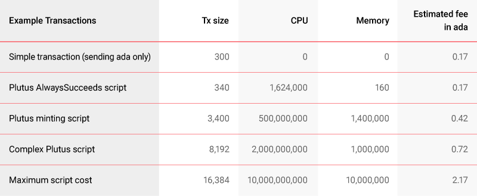

# Công cụ ước tính phí Plutus trên Cardano

### **Công cụ ước tính phí mới của chúng tôi - được phát hành hôm nay - sẽ giúp các nhà phát triển ước tính chi phí của các tập lệnh hợp đồng thông minh để đạt hiệu quả tối đa và giảm tối thiểu chi phí.**

 Ngày 21 tháng 1 năm 2022[ Kevin Hammond](/en/blog/authors/kevin-hammond/page-1/) bài đọc 6 phút

### [**Kevin Hammond**](/en/blog/authors/kevin-hammond/page-1/)

Software Engineer

Engineering

- 

[Việc nâng cấp hợp đồng thông minh 'Alonzo'](https://iohk.io/en/blog/posts/2021/09/12/today-will-feel-like-a-destination-yet-a-new-exciting-journey-begins/) được triển khai cho mạng chính Cardano vào tháng 9 năm 2021 đã biến Cardano thành một nền tảng chức năng để phát triển các ứng dụng phi tập trung (DApps) được tích hợp sẵn trong Plutus .

Với hệ sinh thái Cardano đang phát triển ổn định, một số lượng lớn [ DApp đang được xây dựng](https://twitter.com/InputOutputHK/status/1475107377775099910?s=20)  và sẵn sàng để ra mắt trên Cardano. Hoặc là trong quá trình thử nghiệm triển khai cuối cùng hoặc là trong quá phát triển tích cực, Cardano sẽ sớm lưu trữ nhiều DApp khác nhau bao gồm các dịch vụ [DeFi](https://iohk.io/en/blog/posts/2022/01/10/defi-demystified/), thị trường NFT, ví, sàn giao dịch, trò chơi và hơn thế nữa.

Nhờ vào thiết kế sổ cái Cardano cho phép các nhà phát triển dự đoán số tiền họ sẽ trả cho việc thực hiện hợp đồng và không bị mất phí khi hợp đồng thực hiện không thành công. Xử lý giao dịch xác định, chi phí thấp và bảo mật - tất cả những điều này là những lợi ích chính của việc giao dịch và xây dựng trên Cardano. Ở đây, chúng tôi sẽ xem xét kỹ hơn về giá Cardano và giới thiệu một công cụ ước tính phí Plutus mới được phát triển để cung cấp rõ ràng hơn về chi phí xử lý.

## **Lợi ích của việc xây dựng trên Cardano**

Nhiều yếu tố ảnh hưởng đến khả năng cạnh tranh về giá của blockchain: chức năng, chất lượng, bảo mật và tất nhiên, tính thanh khoản.

Các nguyên tắc thiết kế làm nền tảng cho sổ cái Cardano đảm bảo hiệu suất cao trong khi tôn trọng các đặc tính bảo mật nghiêm ngặt. Cardano sử dụng mô hình [Extended Unspent Transaction Output (EUTXO)](https://iohk.io/en/blog/posts/2021/03/12/cardanos-extended-utxo-accounting-model-part-2/), điều này đóng góp phần rất nhiều vào [thiết kế xác định của nó](https://iohk.io/en/blog/posts/2021/09/06/no-surprises-transaction-validation-on-cardano/). Thuyết tất định đề cập đến khả năng dự đoán của các kết quả. Điều này có nghĩa là các giao dịch và tập lệnh Cardano có thể được xác thực cục bộ (ngoài chuỗi), do đó, nó cho người dùng biết liệu giao dịch có hợp lệ hay không trước khi thực hiện trên chuỗi và không phải trả bất kỳ khoản phí nào. Hơn nữa, phí giao dịch là cố định và có thể dự đoán được. Để so sánh, chi phí thực hiện hợp đồng thông minh trên Ethereum khác nhau tùy thuộc vào tải lượng của mạng lưới, với phí dao động từ 5 đô la đến hàng trăm đô la (hãy xem bài báo [The ridiculously high cost of Gas on Ethereum](https://coingeek.com/the-ridiculously-high-cost-of-gas-on-ethereum/)). Hơn nữa, ngay cả các giao dịch Ethereum thất bại cũng có thể phải trả phí, tạo thêm sự không chắc chắn về giá cả.

Ngược lại, trên Cardano, người dùng có thể tính toán trước các khoản phí tiềm năng để xử lý giao dịch. Bởi vì người dùng biết trước liệu giao dịch có hợp lệ hay không, nên không cần phải trả tiền cho một giao dịch có khả năng thất bại. Điều này giúp tiết kiệm ngân quỹ sách phí và loại bỏ các lỗi trên dây chuyền. Ví dụ: phí thực thi của Cardano trong ada luôn ổn định vì nó phụ thuộc vào các thông số giao thức mạng được thiết lập trước hơn là phụ thuộc vào các yếu tố tắc nghẽn mạng lưới khác nhau.

## **Mô hình định giá của Cardano dựa vào nhu cầu so với nguồn cung.**

Phương pháp thiết lập giá của Cardano chủ yếu dựa vào nhu cầu thị trường so với nguồn cung thực tế. Với sự hỗ trợ hợp đồng thông minh trên Cardano, hiện nay có nhiều hơn một loại nhu cầu cạnh tranh so với nguồn cung chung. Do đó, điều quan trọng là phải xem xét cả định giá tương đối và tuyệt đối. Có một cách để làm điều này là kiểm tra tác động của việc định giá hợp đồng thông minh, những hoạt động của token không thể thay thế (NFT),... liên quan đến một số giá trị chung - trong trường hợp của chúng tôi là mức tiêu thụ sức mạnh xử lý của Cardano.

Với Cardano, mô hình định giá hợp đồng thông minh dựa trên chi phí cố định, dựa trên việc định giá các tài nguyên đã sử dụng (kích thước UTXO hoặc việc tính toán/bộ nhớ được sử dụng khi chạy).

Phí phải được trả để bù đắp một cách công bằng cho công việc vận hành nhóm cổ phần (SPO) và cho các tài nguyên được sử dụng để xác thực các giao dịch mạng. Ngoài ra, đảm bảo rằng bất kỳ cách sử dụng Cardano cụ thể nào về cơ bản không rẻ hơn cách khác, điều này sẽ giúp giảm thiểu toàn bộ các loại tấn công đối thủ (ví dụ như một cuộc tấn công DDoS cổ điển).

Tính linh hoạt cũng là chìa khóa và là một tính năng quan trọng của giao thức Cardano vì nó cung cấp khả năng thay đổi các thông số và thích ứng với sự biến động giá cả. Ví dụ: nếu ada tăng đáng kể về giá trị, các tham số giao thức, nếu được yêu cầu, có thể được điều chỉnh để ngăn người dùng trả quá nhiều cho việc thực hiện hợp đồng thông minh.

## **Công cụ ước tính phí Plutus**

Công cụ ước tính phí Plutus đã được IOG phát triển để so sánh và đo điểm chuẩn về giá. Hôm nay chúng tôi đang cung cấp nó cho các nhà phát triển hoặc những người dùng Cardano tò mò trên [trang web testnet công khai của chúng tôi](https://testnets.cardano.org/en/testnets/cardano/tools/2021-09-06__12-00-00_plutus-fee-estimator.md/). Công cụ ước tính sử dụng thông tin từ các giao dịch Plutus trong thế giới thực để dự đoán các khoản phí sẽ được tính cho một giao dịch. Công cụ ước tính có thể được sử dụng để tính toán phí cho các giao dịch thực tế (ví dụ: để xác định phí sẽ được tính nếu các thông số mạng thay đổi) và cũng để ước tính phí cho các giao dịch tập lệnh riêng lẻ, hoặc hoàn thành DApp trước hoặc trong quá trình phát triển. Nó cũng có thể hữu ích để xác định ảnh hưởng của các thay đổi hoặc tối ưu hóa tập lệnh đối với chi phí.

Công cụ ước tính sử dụng công thức tính phí tương tự như node Cardano thực tế. Với đầu vào đủ chính xác, nó có thể đưa ra ý tưởng chính xác về mức phí cần thiết. Bằng cách kết hợp chi phí từ nhiều giao dịch, người dùng có thể dễ dàng dự đoán chi phí của toàn bộ DApp. Điều này sẽ có giá trị cho các nhà phát triển, nhà phân tích kinh doanh,... Công cụ ước tính bao gồm một số ví dụ dựa trên các giao dịch thực đã được xác minh so với phí thực tế.

Việc tính phí yêu cầu ba mẫu thông tin:

- **Tổng kích thước giao dịch trên chuỗi tính bằng byte**: ví dụ một giao dịch đơn giản là khoảng 300 byte, một giao dịch có siêu dữ liệu là khoảng 650 byte và tập lệnh Plutus thường là 4.000-8.000 byte (các tối ưu hóa trong tương lai sẽ giảm điều này).
- **Số bước tính toán (CPU)** mà tập lệnh sử dụng: mỗi bước đại diện cho 1 picosecond của thời gian thực thi trên máy chuẩn. Các tập lệnh điển hình nên tiêu thụ ít hơn 1.000.000.000 đơn vị CPU (1 milisecond).
- **Số lượng đơn vị bộ nhớ** mà tập lệnh sử dụng: điều này thể hiện số byte mà tập lệnh cấp phát. Các tập lệnh điển hình nên tiêu thụ ít hơn 1.000.000 đơn vị bộ nhớ (1MB phân bổ bộ nhớ).

Chúng ta hãy xem ví dụ các tập lệnh Plutus để hiểu chi phí thực thi của chúng (hình 1):

Hình 1. Phí ước tính cho việc xử lý tập lệnh trên Cardano

Công cụ ước tính cho thấy rằng việc gửi một giao dịch đơn giản sẽ tốn chi phí rẻ khoảng 0,17 ada, trong khi chi phí tối đa có thể có cho một tập lệnh duy nhất sẽ là 2,17 ada.

Việc tính toán có thể được mở rộng cho việc thực thi DApp (xem hình 2). Ví dụ: một DApp sử dụng ba giao dịch (một giao dịch đơn giản và hai giao dịch tập lệnh) có thể có giá ~ 1,50 ada.

Hình 2. Phí ước tính cho việc thực thi DApp trên Cardano

## **Lời cuối cùng**

Sự kiện Alonzo HFC cho phép thực thi tập lệnh Plutus trên Cardano mainnet. Đây thực sự chỉ là bước khởi đầu của hành trình dành cho các hợp đồng thông minh của Cardano. Giờ đây, với sự ra mắt của các dự án hợp đồng thông minh lớn, chúng tôi có thể bắt đầu quá trình [tối ưu hóa và mở rộng quy mô](https://iohk.io/en/blog/posts/2022/01/14/how-we-re-scaling-cardano-in-2022/). Điều này bao gồm đánh giá liên tục về việc sử dụng hợp đồng thông minh thực tế, trong thế giới thực.

Chúng ta cần cân bằng giữa nhu cầu của người dùng và những gì tốt cho mạng lưới, tốc độ so với tính đúng đắn và hơn bao giờ hết, là đạt được sự cân bằng giữa bảo mật, khả năng mở rộng và phi tập trung.

Tối ưu hóa mã/tập lệnh trong tương lai và cải tiến hiệu suất hệ thống sẽ giúp tinh chỉnh mô hình phí Cardano theo thời gian. Cùng với các cộng đồng nhà phát triển và nhà điều hành cổ phần pool của chúng tôi, chúng tôi sẽ theo dõi sự phát triển của các hợp đồng thông minh, tối ưu hóa node Cardano và triển khai trình thông dịch Plutus cũng như thực hiện các điều chỉnh khác để hỗ trợ tốt nhất cơ sở người dùng của chúng tôi về phí giao dịch công bằng và có thể dự đoán được.

Hãy xem công cụ ước tính phí Plutus trên [testnets.cardano.org](https://testnets.cardano.org/en/testnets/cardano/tools/2021-09-06__12-00-00_plutus-fee-estimator.md/) và hãy chắc chắn rằng - bạn có thể dễ dàng ước tính phí xử lý mà không bị mất tiền trong trường hợp giao dịch thất bại.

Bài này được dịch bởi Lê Nguyên, Review bởi Tienna, biên tập bởi Nguyễn Hiệu. Bài viết nguồn [tại đây](https://iohk.io/en/blog/posts/2022/01/21/plutus-fee-estimator-find-out-the-cost-of-transacting-on-cardano/) 

*Dự án này được tài trợ bởi Catalyst*
