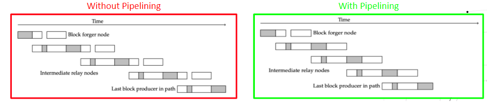

# Giới thiệu pipelining (phát tán đồng thời)

Giải pháp mở rộng layer đồng thuận của Cardano

### **Pipelining là một trong những cải tiến mở rộng quan trọng sẽ được triển khai vào năm 2022. Dưới đây là cách nó hoạt động và tại sao nó lại quan trọng**

 Ngày 1 tháng 2 năm 2022[ John Woods](/en/blog/authors/john-woods/page-1/)  bài đọc 4 phút

### [**John Woods**](/en/blog/authors/john-woods/page-1/)

Director of Cardano Architecture

Engineering

- 
- 

Bạn thể nghĩ rằng pipelining nghe có vẻ như một quá trình tu sửa mà một thợ sửa ống nước sẽ thực hiện quá trình này. Theo một khía cạnh nào đó, điều này không quá khác biệt với quá trình tu sửa ống nước. Pipelining thực sự là một bước tiến trong 'hệ thống ống nước' của Cardano. Đây là yếu tố quan trọng trong kế hoạch mở rộng quy mô của chúng tôi trong năm nay, một trong chuỗi các bước [đã được công bố](https://iohk.io/en/blog/posts/2022/01/14/how-we-re-scaling-cardano-in-2022/#modal=https://ucarecdn.com/fc644130-c13d-43f9-a966-14290687d190/)  bao gồm cách tiếp cận có phương pháp của chúng tôi để linh hoạt năng lực của Cardano khi hệ sinh thái phát triển.

Mở rộng quy mô và lưu lượng là những cân nhắc quan trọng đối với bất kỳ blockchain nào nếu sự tăng trưởng và khả năng cạnh tranh được duy trì. Khi Cardano bước vào giai đoạn phát triển Basho, chúng tôi tập trung vào việc đảm bảo rằng Cardano mở rộng quy mô để đáp ứng nhu cầu ngày càng tăng của hệ sinh thái. Nói cách khác, chúng tôi cần đảm bảo rằng giao thức cơ bản - Ouroboros Praos - hoạt động đủ nhanh để đáp ứng việc rất nhiều ứng dụng phi tập trung hiện đang triển khai hoặc sắp khởi chạy trên Cardano.

Cardano sẽ tiếp tục được tối ưu hóa đều đặn theo một loạt các bước được đo lường, mở rộng quy mô #Cardano một cách cẩn thận và có phương pháp để phục vụ sự tăng trưởng trong tương lai khi nhu cầu ngày càng tăng lên. Những thay đổi được giới thiệu bởi việc phát hành node 1.33.0 vào đầu tháng 1 đã cho chúng tôi thêm khoảng trống để sửa đổi một số thông số mạng lưới, bao gồm kích thước block và đơn vị bộ nhớ. Các điều chỉnh ở đây có ảnh hưởng trực tiếp đến cách Cardano xử lý lưu lượng mạng về khối lượng và chúng tôi tiếp tục theo dõi chặt chẽ hiệu suất mạng lưới.

Tiếp tục theo dõi chặt chẽ hiệu suất mạng lưới trong thế giới thực và - quan trọng là - tác động tích lũy của các thay đổi tham số sẽ là chìa khóa trong suốt quá trình này. Sau mỗi bản cập nhật, chúng tôi theo dõi và đánh giá cẩn thận trong ít nhất một epoch (5 ngày) trước khi tiếp tục điều chỉnh thêm. Khi công việc nghiên cứu và kỹ thuật mở rộng được thực hiện để thiết kế và triển khai hệ thống, thì một kiến ​​trúc mạng phi tập trung cần được mở rộng dựa trên các hành vi và cách sử dụng của người dùng trong thế giới thực.

## **Giới thiệu pipelining**

Pipelining - hay chính xác hơn là khuếch tán pipelining - là một cải tiến đối với layer đồng thuận để tạo điều kiện cho việc truyền block nhanh hơn. Nó cho phép tăng nhiều hơn nữa về khoảng trống, điều này sẽ giúp tăng thêm hiệu suất và khả năng cạnh tranh của Cardano.

Để hiểu cách kỹ thuật này đạt được mục tiêu đã định, hãy tóm tắt lại cách các block lan truyền trong hiện tại.

Hiện tại, một block trải qua sáu bước khi nó di chuyển trong chuỗi:

1. Truyền tiêu đề block
2. Xác thực tiêu đề block
3. Yêu cầu nội dung và truyền tải block
4. Xác thực nội dung block và tiện ích mở rộng chuỗi cục bộ
5. Truyền tiêu đề block đến các node dưới
6. Truyền nội dung block đến các node dưới

Hành trình của một block là một hành trình rất trình tự. Tất cả các bước xảy ra theo cùng một trình tự mọi lúc, mọi nơi. Xem xét khối lượng các node và số lượng block ngày càng tăng, quá trình truyền block mất một khoảng thời gian đáng kể.

Cộng nghệ pipelining sẽ giúp chồng một số bước lên trên nhau vì thế chúng được xử lý đồng thời. Điều này giúp tiết kiệm thời gian và tăng lưu lượng dữ liệu.

 Việc tiết kiệm thời gian nhờ kỹ thuật này mang lại sẽ dẫn đến nhiều khoảng trống hơn nữa để mở rộng quy mô Cardano hơn nữa, bao gồm các thay đổi đối với:

- Kích thước block - block càng lớn thì càng có nhiều giao dịch và tập lệnh mà nó có thể mang theo
- Giới hạn bộ nhớ Plutus - số lượng bộ nhớ có sẵn để chạy tập lệnh Plutus
- Giới hạn CPU Plutus - có thể phân bổ nhiều tài nguyên tính toán hơn để tập lệnh chạy hiệu quả hơn

## **Triển khai pipelining**

Một trong những nguyên tắc thiết kế đằng sau pipelining khuếch tán là đạt được sự lan truyền block nhanh hơn trong khi tránh những thay đổi 'phá hoại' đối với chuỗi. Chúng tôi không muốn xóa bất kỳ giao thức, tình trạng nguyên thủy hoặc tính tương tác nào đã xảy ra trong Cardano, vì các node dựa trên các cơ chế đã thiết lập này. Chúng tôi muốn có khả năng tương thích ngược hoàn toàn, vì vậy thay vì thay đổi cách mọi thứ hiện đang hoạt động, chúng tôi đang thêm một giao thức nhỏ mới có công việc là thông báo trước cho các thực thể đã đăng ký khi nhìn thấy một block mong muốn mới, trước khi xác thực đầy đủ.

Thay đổi quan trọng được pipelining đưa ra là khả năng thông báo trước cho các node và cung cấp cho chúng một block trước khi nó được xác thực, cho phép node phía dưới tìm nạp trước nội dung block mới. Điều này tiết kiệm rất nhiều thời gian vì chúng tôi giảm đáng kể thời gian xác thực một block qua nhiều bước nhảy.

## **Kết luận**

Pipelining chỉ là một trong những trụ cột hỗ trợ Cardano mở rộng quy mô trong năm nay. Kết hợp lại, tất cả những thay đổi này sẽ đưa Cardano đến một vị trí nơi mà nó tiến nhanh hơn các đối thủ cạnh tranh và là một nền tảng có tính cạnh tranh cao cho tài chính phi tập trung (DeFi) trong năm nay.

## **Một số điều quan trọng**

![- Xem xét khối lượng các node và số lượng block ngày càng tăng, quá trình truyền block có thể mất một khoảng thời gian đáng kể.  - Pipelining khuếch tán tăng tốc sự lan truyền khối bằng cách cung cấp cho các node khả năng thông báo trước các node cuối cùng của một khối đến, cho phép khối ngang hàng tìm nạp trước phần thân khối mới. - Điều này tiết kiệm thời gian có thể được sử dụng để truyền các khối lớn hơn hoặc thực thi các tập lệnh Plutus có thể cần nhiều tài nguyên tính toán hơn do kích thước,... - Pipelining có thể được triển khai với bản phát hành node thông thường, nó không yêu cầu hard fork](img/2022-02-01-introducing-pipelining-cardanos-consensus-layer-scaling-solution.009.png)

**Fernando Sanchez đã đóng góp cho bài viết này**

Bài này được dịch bởi Lê Nguyên [với bài gốc](https://iohk.io/en/blog/posts/2022/02/01/introducing-pipelining-cardanos-consensus-layer-scaling-solution/)

*Dự án này được tài trợ bởi Catalyst*
