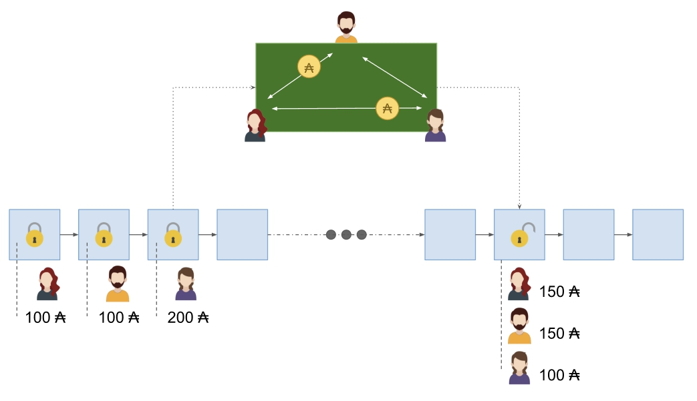

# Triển khai Hydra Heads
 Bước đầu hướng tới tầm nhìn giao thức Hydra hoàn thiện

### **Hydra Head - công cụ đầu tiên trong bộ giao thức, là một yếu tố quan trọng trong hành trình mở rộng quy mô của Cardano. Hãy cùng xem giao thức Hydra Head phù hợp với bức tranh tổng thể lớn hơn như thế nào. Công cụ này có thể sẽ phá vỡ một số quan điểm.**

 3 Tháng Hai 2022[ Matthias Benkort](/en/blog/authors/matthias-benkort/page-1/) 12 phút đọc

### [**Matthias Benkort**](/en/blog/authors/matthias-benkort/page-1/)

Software Engineering Lead

Engineering

- 
- 
- 

Chúng tôi đã hoàn thành việc nghiên cứu khoa học cũng như về lý thuyết, đặt nền móng cho một blockchain có quy mô về khả năng mở rộng (scalable), tính linh hoạt (versatile) và thông lượng cao (high-throughput). Giờ là lúc để tăng trưởng ổn định và cải tiến hệ thống. Cardano đang ở kỷ nguyên Basho, với mục tiêu tạo ra một hệ sinh thái được tối ưu hóa để hỗ trợ và thúc đẩy phát triển các ứng dụng phi tập trung (DApps). Các hợp đồng thông minh đã sẵn sàng, toàn bộ kỷ nguyên Basho là hoàn thành việc [mở rộng quy mô](https://iohk.io/en/blog/posts/2022/01/14/how-we-re-scaling-cardano-in-2022/) và tối ưu hóa mạng lưới. Giao thức [Hydra](https://iohk.io/en/blog/posts/2021/09/17/hydra-cardano-s-solution-for-ultimate-scalability/) là một phần quan trọng cho việc này.

Chúng ta đã nói về Hydra trước đây. Hydra là một tổ hợp các giải pháp của Layer 2 được thiết kế để giải quyết vấn đề bảo mật mạng lưới và khả năng mở rộng. Ban đầu Layer 2 được hình thành trong phần việc của nhóm nghiên cứu Ouroboros, nhưng trên thực tế, điều này đã tạo ra một hành trình độc lập kể từ khi xuất bản báo cáo đầu tiên. Hydra cung cấp thông lượng tăng lên, giảm thiểu độ trễ và các giải pháp tiết kiệm chi phí mà không cần yêu cầu lưu trữ lượng dữ liệu lớn hơn. Giao thức Hydra Head được định hình vào [năm 2020](https://eprint.iacr.org/2020/299) và kể từ đó, tư duy của chúng tôi đã được phát triển - đặc biệt là trong suốt giai đoạn triển khai và chứng minh khái niệm ban đầu này. Dựa trên ý tưởng ban đầu đó, **giao thức Hydra Head ** đã phát triển thành [một bằng chứng về mặt  khái niệm](https://iohk.io/en/blog/posts/2021/09/17/hydra-cardano-s-solution-for-ultimate-scalability/) và tiếp tục như vậy khi chúng tôi hướng tới việc triển khai rõ hơn cho testnet MVP.

Chúng tôi đã thấy rất nhiều sự phấn khích (tuyệt vời!) Cùng với đó là những quan niệm sai lầm và hiểu lầm (không quá tuyệt vời). Hầu hết những điều này phát sinh từ việc thông báo về ý tưởng, thay vì triển khai giao thức *thực* tế và một số blog trước đây của chúng tôi có lẽ đã góp phần vào những hiểu lầm này. Giao thức Hydra Head không chỉ triển khai về SPO nhiều như lý thuyết '1 triệu TPS' - điều này cần được cảnh báo và giải thích rõ hơn.

Trong bài viết này, chúng tôi - nhóm kỹ sư Hydra - phác thảo tiến trình hiện tại, cách tiếp cận cũng như lộ trình ngắn và dài hạn. Chúng tôi sẽ làm sáng tỏ một số quan niệm sai lầm và những lợi ích cũng như phản ánh những thách thức phát triển.

## **Tóm tắt về Hydra Head**

Trước tiên, chúng ta hãy nói lại một chút về Hydra Heads, đây không chỉ liên quan đến một Layer mạng mạnh mẽ ngang hàng và một sổ cái Cardano tích hợp, mà còn liên quan đến một số tập lệnh trên chuỗi (hợp đồng thông minh) nhằm thúc đẩy vòng đời của Hydra Head.

Một Hydra Head là một [kênh trạng thái đẳng hình](https://www.google.com/url?q=https://eprint.iacr.org/2020/299.pdf&sa=D&source=docs&ust=1643024354663393&usg=AOvVaw2qBMRPzWu0H_7oIkQZkQX-) an toàn có thể chứng minh được. Nói một cách đơn giản, nó là một sổ cái mini off-chain giữa một nhóm hạn chế những người tham gia hoạt động tương tự (mặc dù nhanh hơn đáng kể) với sổ cái chính on-chain.

Điều đầu tiên cần hiểu rằng kênh trạng thái là một đường dẫn giao tiếp giữa hai hoặc nhiều mạng ngang hàng. Trở thành một phần của Hydra Head nghĩa là trở thành một trong những mạng ngang hàng đó. Các kênh tạo thành các mạng riêng biệt có thể phát triển song song với mạng chính. Trên các mạng thay thế này, những người tham gia tuân theo một thuật toán đồng thuận khác, đơn giản hơn: mọi người cần đồng thuận về tất cả các giao dịch. Một hệ quả của điều này, với tư cách là một người tham gia, rõ ràng tôi không thể mất số  tiền mà tôi đã không đồng thuận. Tại sao? Bởi vì bất kỳ giao dịch hợp lệ nào đều cần có sự chấp thuận *rõ ràng* của tôi.

Khi thành lập một Head, những người tham gia có thể cam kết chuyển tiền cho nó. Điều này có nghĩa là chuyển tiền trên chuỗi đến một địa chỉ tập lệnh rồi khóa chúng theo các quy tắc cụ thể. Tập lệnh đảm bảo thực thi an toàn giao thức trên chuỗi và đặc biệt, những người tham gia không thể gian lận lẫn nhau. Tuy nhiên, bất kỳ người tham gia nào cũng có thể quyết định rời bỏ Head bằng cách đóng nó bất cứ lúc nào. Trong trường hợp này, tất cả những người tham gia bỏ đi với trạng thái mới nhất mà họ đã đồng thuận với off-chain, trên mạng song song của họ.

Hãy coi Head là 'bàn chơi poker riêng' nơi người tham gia mang theo chip của riêng họ để chơi trò này. Người tham gia có thể chơi bao lâu tùy thích. Nếu ai đó không chơi nữa, thì trò chơi sẽ không tiến triển thêm. Tuy nhiên, những người tham gia vẫn có thể tự do sử dụng chip của họ. Nếu họ làm như vậy, trò chơi kết thúc với sự phân bổ tài sản hiện tại.

**Hình 1** . Vòng đời Hydra Head (đơn giản hóa)

Người chia bài tại bàn (tập lệnh trực tuyến) đảm bảo rằng mọi người chơi đúng luật và không gian lận. Cuối cùng, có bao nhiêu chip được tung ra thì có bấy nhiêu chip được thu vào, nhưng chúng có thể đã được phân phối lại trong quá trình của trò chơi. Mặc dù kết quả cuối cùng được biết đến bên ngoài bàn poker nhưng chỉ có những người tham gia mới biết lịch sử của tất cả các hành động đã xảy ra trong trò chơi.

Giao thức này là một trong toàn bộ bộ giao thức mà chúng tôi thường gọi là 'Hydra'. Nỗ lực kỹ thuật hiện tại tập trung vào việc triển khai giao thức Hydra Head như được xuất bản trong bài nghiên cứu [Hydra: Fast Isomorphic State-Channels](https://eprint.iacr.org/2020/299) của Chakravarty et al.

Khoảng cuối năm 2021, Maxim Jourenko, Mario Larangeira và Keisuke Tanaka đã xuất bản một bản lặp lại trên Hydra Head có tên là [Interhead Hydra: Two Heads are Better than One](https://eprint.iacr.org/2021/1188) . Sự lặp lại này xác định một phương pháp để kết nối hai Head với nhau, về lâu dài cho phép tạo ra một mạng lưới các Hydra Head được kết nối với nhau. Trước đây, đã có đề cập đến các giao thức khác như 'Hydra Tail'. Tuy nhiên, những điều này vẫn đang được nghiên cứu, cùng với những ý tưởng mới đến từ công việc gần đây về giao thức Hydra Head.

## **Những quan niệm sai lầm về Hydra**

Gần đây, chúng tôi đã thấy rất nhiều bình luận định vị Hydra là giải pháp 'tối thượng' cho khả năng mở rộng của Cardano. Hydra Heads chắc chắn tạo ra một nền tảng vững chắc để xây dựng một Layer về khả năng mở rộng cho Cardano. Chúng là một thành phần thiết yếu tận dụng sức mạnh của mô hình [ (EUTXO)](https://iohk.io/en/blog/posts/2021/03/12/cardanos-extended-utxo-accounting-model-part-2/) để cho phép các giải pháp phức tạp hơn ở trên cùng. Chúng là một yếu tố quan trọng của hành trình mở rộng, nhưng chúng không phải là đích đến *cuối cùng* .

**Khả năng mở rộng không phải là gần một triệu TPS**

Trước khi nói về tiêu chuẩn đo lường khả năng mở rộng, hãy làm rõ một vài điều về tốc độ giao dịch mỗi giây (TPS). Trong số tất cả những thứ có sẵn, TPS có lẽ là số liệu ít có ý nghĩa nhất để coi như một tiêu chuẩn so sánh. Các giao dịch có nhiều hình dạng và kích cỡ khác nhau. Mặc dù điều này đúng với Cardano, nhưng nó thậm chí còn cần thiết hơn khi so sánh hai hệ thống khác nhau hoàn toàn.

Hãy nghĩ về đường cao tốc và các phương tiện đi lại. Người ta có thể xem có bao nhiêu 'Xe mỗi giây' (VPS) mà đường cao tốc có thể quản lý giữa hai điểm. Tuy nhiên, nếu không có định nghĩa chung về phương tiện là gì, thì việc so sánh 10 VPS với 100 VPS dường như là vô nghĩa. Nếu 10 chiếc xe trong ví dụ là những chiếc xe tải chở hàng lớn, liệu có hợp lý khi so sánh chúng với 100 chiếc xe tay ga về khả năng giao hàng của chúng không? Điều này cũng áp dụng cho các giao dịch. Một giao dịch mang hàng trăm tài sản gốc và đầu ra chắc chắn không giống như một giao dịch thanh toán ADA đơn lẻ giữa hai diễn viên.

Giống như việc sử dụng TPS làm thước đo trong cùng ngữ cảnh (ví dụ: để so sánh hai phiên bản của node Cardano) là có ý nghĩa. Nó không có ý nghĩa khi sử dụng nó làm phương tiện so sánh giữa các blockchains.

Với ý nghĩ đó, chúng tôi khuyên bạn không chỉ nên xem xét thông lượng mà còn xem xét tính minh bạch và tính đồng thời như là các chỉ số quan trọng để xem xét và thảo luận về khả năng mở rộng:

- **Thông lượng** (Throughput) là khối lượng dữ liệu được hệ thống xử lý trong một khoảng thời gian nhất định.
- [**&nbsp;Tính minh bạch**](https://docs.cardano.org/core-concepts/chain-confirmation-versus-transaction-confirmation) (finality) là thời gian cần thiết để kết quả của một số hành động trở thành bất biến và đúng với mọi người trong hệ thống.
- **Tính đồng thời** (concurrency) là số lượng công việc có thể được thực hiện bởi các tác nhân khác nhau mà không cản trở nhau.

Hydra Heads nổi trội trong việc đạt được kết quả gần như tức thì trong một Head. Quá trình thiết lập và đóng Head có thể mất một vài block, nhưng sau khi được thiết lập, các giao dịch có thể diễn ra nhanh chóng giữa những người tham gia hợp tác. Vì các Hydra Heads cũng sử dụng mô hình EUTXO nên chúng có thể xử lý đồng thời các giao dịch mà không có mâu thuẫn, điều này - đi đôi với việc có mạng lưới tốt - cho phép sử dụng tối ưu các tài nguyên có sẵn. Các mô phỏng đầu tiên của giao thức Hydra Head vào năm 2020 cho thấy '1000 TPS' là rất hứa hẹn. Hiện chúng tôi đang trong quá trình đánh giá việc triển khai thực tế về mặt thông lượng và tính minh bạch.

Có một lưu ý: Hydra Head là một công trình *cục bộ* trong một nhóm nhỏ những người tham gia. Các nhóm này ban đầu sẽ độc lập và do đó, việc xem xét tổng thể các chỉ số riêng lẻ của họ là sai lệch. Vì các nhóm độc lập và có thể được tạo ra độc lập theo ý muốn, nên dễ dàng đạt được bất kỳ con số nào bằng cách cộng chúng thành: mười, một nghìn, một triệu, một tỷ, v.v.

Do đó, mặc dù phiên bản đầu tiên của giao thức Hydra Head sẽ cho phép các nhóm nhỏ người tham gia mở rộng quy mô lưu lượng của họ với chi phí thấp, nhưng nó sẽ không cung cấp ngay giải pháp cho thanh toán (vi mô) từ người tiêu dùng đến người tiêu dùng toàn cầu hoặc bán hàng NFT. Tại sao? Bởi vì sự đồng thuận bên trong một Head yêu cầu mọi thành viên tham gia phản ứng với tất cả các giao dịch. Và một Head riêng lẻ có quy mô giới hạn  số lượng người tham gia, ít nhất là không phải bổ sung một số nỗ lực kỹ thuật. Ví dụ, sự liên kết của các Hydra Head mở đường cho mạng lưới người tham gia lớn hơn, biến các Head riêng lẻ cục bộ thành mạng lưới toàn cầu một cách hiệu quả. Chúng tôi đang khám phá một số ý tưởng khác để mở rộng giao thức Hydra Head nhằm mở rộng tập hợp các trường hợp sử dụng mà nó có thể bao phủ. Chúng tôi sẽ nói nhiều hơn về điều đó trong các phần tiếp theo và trong các bản cập nhật mới nhất.

**Các trường hợp sử dụng và vai trò của SPO**

Vậy khi nào thì Head sẽ hữu ích? Hydra Heads sẽ tỏa sáng khi có một nhóm nhỏ người tham gia cần xử lý nhiều tương tác nhanh chóng. Ví dụ: hãy tưởng tượng dịch vụ API trả tiền cho mỗi lần sử dụng, mạng riêng giữa ngân hàng với ngân hàng hoặc một cuộc đấu giá  nhanh giữa người bán và một nhóm nhỏ người đặt giá thầu. Các trường hợp sử dụng rất nhiều và có nhiều hình thức khác nhau. Một số người trong số họ có thể là Head hoạt động lâu dài trong nhiều tháng, trong khi những người khác có thể ngắn hơn nhiều và chỉ kéo dài vài giờ.

[Nghiên cứu ban đầu về Hydra của chúng tôi vào năm 2020](https://iohk.io/en/blog/posts/2020/03/26/enter-the-hydra-scaling-distributed-ledgers-the-evidence-based-way/) đã đề xuất các nhà điều hành Pool (SPO) *có khả năng* là ứng cử viên để điều hành Hydra Heads. Tuy nhiên, vì giao thức Hydra Head đã được nghiên cứu và xây dựng như một bằng chứng về khái niệm, chúng tôi có thể khẳng định chắc chắn nói rằng *chỉ* các SPO mới nên chạy Hydra Head để đảm bảo khả năng mở rộng sổ cái là một sự hiểu lầm. Trên thực tế, bản thân các SPO không có lợi ích trong việc mở các Head với nhau khi không có lý do để giao dịch (ví dụ: tiền hoa hồng hoặc giao dịch NFT). Theo một cách nào đó, SPO cũng giống như bất kỳ tác nhân nào khác khi nói đến giao thức Hydra Head. Họ có thể là một người tham gia và cởi mở với Head với các tác nhân ngang hàng khác, như bất kỳ những người quan tâm nào cũng vậy.

Phải thừa nhận rằng SPO có cơ sở hạ tầng hoạt động tốt và có thể là một số người dùng đầu tiên chạy các phiên bản của giao thức Hydra Head. Tuy nhiên, điều này chỉ cho phép các SPO tham gia giao dịch với nhau, làm cho các trường hợp sử dụng cho người dùng cuối bị giới hạn. Chỉ những thiết kế hệ thống Layer 2 nâng cao như giao thức Interhead Hydra mới yêu cầu người trung gian chạy cơ sở hạ tầng vì lợi ích của người dùng cuối. Trên thực tế, chúng tôi dự đoán rằng một khả năng điều chỉnh cho Hydra Heads sẽ cung cấp cho những người dùng được quản lý Hydra Heads dưới dạng một dịch vụ (HaaS). Chúng tôi có thể đạt được điều này mà không phải từ bỏ quyền quản lý tiền bằng cách điều hành cơ sở hạ tầng thay mặt cho người dùng cuối, những người thường không có hứng thú cũng như kỹ năng kỹ thuật để duy trì cơ sở hạ tầng đó.

Điều này rất giống với mô hình hoạt động hiện tại của các ví nhẹ và các nhà cung cấp ví nhẹ có nhiều khả năng sẽ chạy Hydra Heads về lâu dài. Hãy tưởng tượng một mạng lưới bao gồm các nhà cung cấp ví nhẹ hàng đầu trong hệ sinh thái Cardano. Các nhà cung cấp đó sau này có thể tạo điều kiện thanh toán ngay lập tức và giá rẻ giữa người dùng của họ trong khi vẫn đảm bảo sự tin tưởng tổng thể.

Chúng tôi cũng hình dung rằng các dịch vụ dành cho nhà phát triển và nhà cung cấp DApp sẽ có khả năng là ứng cử viên để chạy Hydra Heads. Thật vậy, các nhà phát triển DApp yêu cầu quyền truy cập thông tin trên chuỗi. Vì vậy, các nhà phát triển có thể dựa vào các dịch vụ trực tuyến cung cấp giao diện phù hợp và thường tính phí sử dụng hàng tháng. Hydra Heads có thể cải thiện quy trình này cho phép mô hình kinh doanh phi tập trung hơn với các lệnh gọi API trả tiền cho mỗi lần sử dụng giữa các nhà cung cấp dịch vụ và nhà phát triển DApp.

## **Lộ trình**

Là một nhóm các giao thức sẽ được phân phối theo thời gian và liên quan đến các thiết kế hệ thống Layer 2 được trau chuốt hơn trên giao thức Hydra Head, điều quan trọng là chúng tôi phải thường xuyên tham gia cùng các nhà phát triển của hệ sinh thái Cardano. Đây không phải là về một bản phát hành 'lớn' mà là một chu kỳ phát hành lặp đi lặp lại. Chúng tôi cần hiểu những thách thức của nhà phát triển, đảm bảo đáp ứng nhu cầu của họ và cuối cùng đảm bảo rằng chúng tôi đang xây dựng thứ gì đó hữu ích. Đây là lý do tại sao, năm ngoái, chúng tôi đã phát triển Hydra Head như một dự án GitHub có mã nguồn mở, bắt đầu với một bằng chứng về khái niệm ban đầu. Điều này nhằm mục đích hướng tới một chu kỳ phát hành thường xuyên và liên tục, chúng tôi đã phát hành bản xem trước dành cho nhà phát triển ban đầu của mình vào tháng 9 năm 2021 (0.1.0), sau đó là lần lặp thứ hai (0.2.0) trước Giáng sinh. Bản cập nhật tiếp theo (0,3,0) sẽ vào tháng Hai năm 2022. Chúng tôi tuân theo cách lập phiên bản ngữ nghĩa và mỗi bản phát hành trước đó (0.x.0) đều bổ sung các tính năng có sẵn cho các đối tác của chúng tôi và những người chấp nhận sớm để thử nghiệm trên (các) mạng testnet riêng của Cardano và trên mạng công khai của cộng đồng.

Chúng tôi vui mừng thông báo rằng *[lộ trình của chúng tôi hiện cũng có sẵn trên Github](https://github.com/orgs/input-output-hk/projects/21) !* như một phương tiện để tham gia với cộng đồng các nhà phát triển của chúng tôi và để minh bạch về quá trình nỗ lực phát triển của chúng tôi, bạn sẽ tìm thấy [các vấn đề về tính năng](https://github.com/input-output-hk/hydra-poc/labels/feature) , sự [kiện quan trọng](https://github.com/input-output-hk/hydra-poc/milestones) và [bảng dự án](https://github.com/input-output-hk/hydra-poc/projects?type=beta) có sẵn trên [kho lưu trữ Hydra Head.](https://github.com/input-output-hk/hydra-poc/)

Mặc dù trọng tâm của chúng tôi là tạo ra các bản phát hành có ý nghĩa và đầy đủ tính năng khi chúng tôi bám theo testnet và sau này là sự phát triển của mainnet với phiên bản 1.0.0, lộ trình cũng bao gồm các ngày dự kiến. Những dự báo này dựa trên các công việc chúng tôi đã hoàn thành cho đến nay và ước tính về công việc còn lại săp tới. Chúng tôi sẽ thường xuyên thông báo nội dung và thời gian một cách nhanh chóng để giữ cho lộ trình chính xác nhất có thể.

**Phản hồi của cộng đồng là điều cần thiết**

Thành công của chúng tôi được đo lường bằng số lưu lượng truy cập sẽ chạy trong Hydra Heads so với mạng chính Cardano. Điều này có nghĩa là chúng tôi không thể đạt được mục tiêu của mình nếu không có cộng đồng và Hydra chỉ có thể thành công nếu nó hữu ích cho người dùng Cardano hiện tại và tương lai.

Tùy thuộc vào thời gian, kỹ năng và chuyên môn của bạn, chúng tôi hoan nghênh bạn tham gia cùng chúng tôi để chia sẻ câu hỏi, đưa ra các phản hồi hoặc đóng góp vào nỗ lực phát triển. Đây là cơ hội tuyệt vời để cùng nhau xây dựng toàn bộ hệ sinh thái gồm các giải pháp Layer 2 cho Cardano. Giao thức Hydra Head sẽ là thành phần đầu tiên của nhiều giải pháp tiên tiến ra đời. Tại IOG, chúng tôi đã bắt đầu làm việc với một trong số đó, mong rằng một số chắc chắn sẽ thành công (và may mắn thay!) Được xây dựng bởi các thành viên trong cộng đồng, nơi mà chúng tôi luôn mong muốn được hỗ trợ.

Chúng tôi sẽ nói chi tiết hơn về Hydra Heads trong bản cập nhật phát triển giữa tháng Hai. Đăng ký [kênh Youtube](https://www.youtube.com/c/IohkIo) của chúng tôi và tham gia cùng chúng tôi!

Tôi muốn cảm ơn Sebastian Nagel, Olga Hryniuk, Mark Irwin và Tim Harrison vì những ý kiến đóng góp và hỗ trợ của họ trong việc chuẩn bị bài đăng trên blog này.

Bài này được dịch bởi minh-hieu-102 [với bài gốc](https://iohk.io/en/blog/posts/2022/02/03/implementing-hydra-heads-the-first-step-towards-the-full-hydra-vision/)

*Dự án này được tài trợ bới Catalyst*
