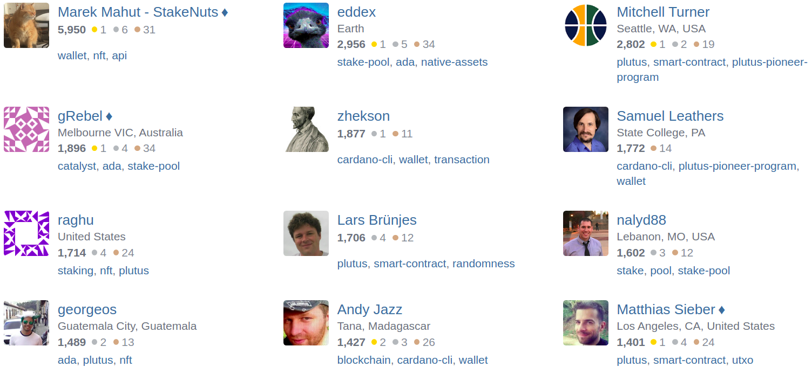

# Cardano Stack Exchange nền tảng kiến ​​thức về Cardano đang tăng trưởng.

### **Trang web hỏi và đáp mới sẽ tạo điều kiện chia sẻ kiến ​​thức về tất cả các chủ đề liên quan đến Cardano**

 Ngày 7 tháng 2 năm 2022[ Ignacio Calderon de la Barca](/en/blog/authors/gonzalo-ignacio-calderon-de-la-barca-rodo/page-1/) 4 phút đọc

### [**Ignacio Calderon de la Barca**](/en/blog/authors/gonzalo-ignacio-calderon-de-la-barca-rodo/page-1/)

Technical Community Manager - Plutus

Marketing &amp; Communication

- 
- 
- 
- 

[Cardano Stack Exchange (CSE)](https://cardano.stackexchange.com/), một cơ sở kiến ​​thức dựa trên cộng đồng dành cho Cardano, Stack Exchange hiện được công nhận là một cộng đồng học tập trưởng thành và nó được xếp vào hàng ngũ những trang web quản lý kiến ​​thức lớn nhất hiện nay trên internet.

Nhu cầu về kiến ​​thức kỹ thuật chuyên sâu về Cardano liên tục tăng lên khi ngày càng có nhiều người đầu tư thời gian vào việc [xây dựng dự án trên Cardano](https://twitter.com/InputOutputHK/status/1488131603691884550). Nhu cầu như vậy không thể (và không nên) được đáp ứng bởi bất kỳ tổ chức riêng lẻ nào và do đó đã dẫn đến cách tiếp cận dựa vào cộng đồng của CSE.

Các nhà phát triển Plutus, các nhà nghiên cứu, các nhà điều hành nhóm cổ phần, các thành viên trong nhóm dự án Cardano và các tổ chức sáng lập - các chuyên gia của tất cả các lĩnh vực từ khắp nơi trong hệ sinh thái - đã cùng nhau đáp ứng nhu cầu này. Thực tế là CSE đã hoàn thành giai đoạn thử nghiệm – ra mắt 'Beta' - xác nhận rằng nó đã đạt đến khối lượng *kiến ​​thức phi tập trung và hữu ích*.

## **Từ 'Area 51' đến toàn bộ trang web: là hành trình Stack Exchange**

Cộng đồng Cardano đã dự đoán giá trị của việc có một trang web  Stack Exchange từ rất sớm. Đã 10 tháng kể từ khi một nhóm những người có tầm nhìn CSE trên trang web 'Area 51' ra mắt cộng đồng, Stack Exchange là một sáng kiến ​​được thành viên cộng đồng [raghu](https://cardano.stackexchange.com/users/12/raghu) sáng lập.

Kể từ đó, một nhóm đa dạng các thành viên trong cộng đồng đặt niềm đam mê và kiến ​​thức của họ vào công việc quản lý thông tin và lập hồ sơ các giải pháp cho hệ sinh thái Cardano.

Công ty đứng sau Stack Exchange tạo điều kiện thuận lợi và tham khảo việc ra mắt các cộng đồng mới, và quá trình này không hề dễ dàng. Để khởi chạy hoàn toàn sáng kiến ​​Stack Exchange, nó phải trải qua sáu bước: thảo luận, đề xuất, cam kết cộng đồng, phiên bản Beta giới hạn, phiên bản Beta công khai và phiên bản cuối cùng.

Chinh phục được tất cả bước trên là một thành tựu lớn. Sự thành công liên tục của dự án này sẽ không thể thực hiện được nếu không có sự giúp đỡ của nhiều người đóng góp; chúng tôi đặc biệt ghi nhận công việc của những người điều hành CSE [Marek Mahut](https://cardano.stackexchange.com/users/28/marek-mahut-stakenuts), [Matthias Sieber](https://cardano.stackexchange.com/users/934/matthias-sieber)  [Glenn Rieger](https://cardano.stackexchange.com/users/281/grebel); Các thành viên nhóm IOG là [Lars Brünjes](https://cardano.stackexchange.com/users/186/lars-br%c3%bcnjes) và [Samuel Leathers](https://cardano.stackexchange.com/users/382/samuel-leathers); và nỗ lực của những người dùng hàng đầu như [eddex](https://cardano.stackexchange.com/users/1142/eddex), [Mitchell Turner](https://cardano.stackexchange.com/users/1130/mitchell-turner), [zhekson](https://cardano.stackexchange.com/users/4302/zhekson), [nalyd88](https://cardano.stackexchange.com/users/62/nalyd88), [gorgeos](https://cardano.stackexchange.com/users/1231/georgeos), &amp; [Andy Jazz](https://cardano.stackexchange.com/users/4023/andy-jazz). Ngoài ra, chúng tôi cũng cảm ơn Hassan Khalil với công việc về phân tích trang web Beta của anh ấy.

Tham khảo hình ảnh bên dưới, những người dùng hàng đầu, danh tiếng của họ và các chủ đề được trả lời nhiều nhất được kèm theo.

## **Tầm nhìn tương lai**

[Stack Exchange](https://stackexchange.com/) là một mô hình quản lý kiến ​​thức tập trung vào việc hỏi và đáp, cũng như là một liên đoàn các cộng đồng học tập được trao quyền thông qua quyền biên tập dựa trên thành tích và việc bầu cử người kiểm duyệt. Tầm quan trọng của nền tảng này trở nên rõ ràng (đặc biệt là trong bối cảnh của các dự án mã nguồn mở) bằng cách lưu ý ví dụ về đại diện mang tính biểu tượng nhất là: [Stack Overflow](https://stackoverflow.com/). Stack Overflow từ lâu đã trở thành một trung tâm cộng đồng quan trọng cho các nhà phát triển, mở đường cho sự thành công và áp dụng tất cả các ngôn ngữ lập trình phổ biến nhất.

Chiến lược chiến thắng trong lĩnh vực công nghệ là thúc đẩy một cộng đồng tự quản, tự duy trì.

Vậy, điều này có ý nghĩa gì đối với hành trình của CSE? Chúng tôi vừa đánh dấu một cột mốc quan trọng; tuy nhiên, đây chỉ là bước khởi đầu của một tầm nhìn dài hạn cho nền tảng. Như đã gợi ý ở trên, CSE có tiềm năng làm để củng cố sự phát triển của [Plutus](https://iohk.io/en/blog/posts/2021/04/13/plutus-what-you-need-to-know/) và [Marlowe](https://iohk.io/en/blog/posts/2020/10/06/marlowe-industry-scale-finance-contracts-for-cardano/), tương tự như cách mà Stack Overflow đã củng cố cho Python, Javascript và C.

## **Hãy tham gia**

Đây đã là nơi mà các nhà phát triển gặp gỡ và chia sẻ kiến ​​thức. Bước tiếp theo là tăng chất lượng tương tác và nâng cao phạm vi sáng tạo của cơ sở người dùng cho các ngôn ngữ lập trình gốc của hệ sinh thái, giao thức và toàn bộ Cardano.

Đối với cộng đồng Kỹ thuật: Discord Stage về CSE là sự kiện đáng mong đợi, tại đây chúng tôi sẽ nêu bật các câu hỏi và câu trả lời hàng đầu về CSE và thảo luận về các khái niệm thú vị của nhiều chủ đề liên quan đến việc xây dựng trong Cardano.

Nếu bạn là nhà phát triển hoặc người đam mê Cardano, hãy tham gia. Khi bạn làm như vậy, hãy nhớ duy trì [các phương pháp tốt nhất](https://cardano.stackexchange.com/help) khi bạn bỏ phiếu, nhận xét, hỏi và giúp đỡ người khác. Nếu bạn chưa quen với nền tảng này, đây là những điểm nổi bật về những gì bạn có thể đạt được:

- Đạt được danh tiếng bằng cách hỏi và trả lời câu hỏi.
- Thu thập các huy hiệu để hướng dẫn nâng cấp bản thân trong nền tảng.

- Nhận thông tin chuyên biệt, bằng cách lọc các câu hỏi dưới các thẻ (ví dụ: plutus, plutustx, cardano-node, ...).

Câu hỏi hoặc câu trả lời hay thì trông như thế nào? Chúng tôi đã lấy một ví dụ cho bạn từ CSE với các điểm chính được lưu ý.

- Trích dẫn các nguồn quan trọng và trích dẫn những đoạn có liên quan nhất.
- Bao gồm định dạng (ví dụ: danh sách, in đậm hoặc nghiêng) để nhấn mạnh thông tin chính.
- Chia thành các đoạn văn dễ hiểu.
- Chức năng nhận xét dành để cải thiện chất lượng của bài đăng.

Chuyển từ phiên bản beta không chỉ là một cột mốc quan trọng. Đây cũng là một lời nhắc nhở hay về sức mạnh của hành động cộng đồng để tăng thêm giá trị theo cấp số nhân và 'tích lũy' kiến ​​thức có được khi chúng ta làm việc cùng nhau. Tất cả chúng ta đã là một phần của cuộc hành trình này, và bây giờ chúng ta cần phải tiếp tục làm tốt công việc.

*Tôi muốn cảm ơn Matthew Capps vì những ý kiến và đóng góp của anh ấy trong việc chuẩn bị bài blog này.*

Bài này được dịch bởi Lê Nguyên [với bài gốc](https://iohk.io/en/blog/posts/2022/02/07/the-knowledge-base-for-cardano-is-growing-cardano-stack-exchange-graduates-from-beta-version)

*Dự án này được tài trợ bởi Catalyst*
