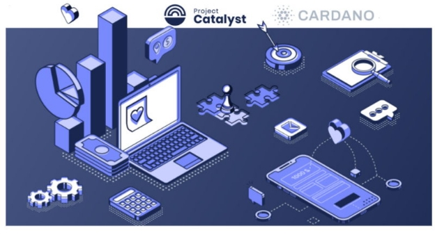
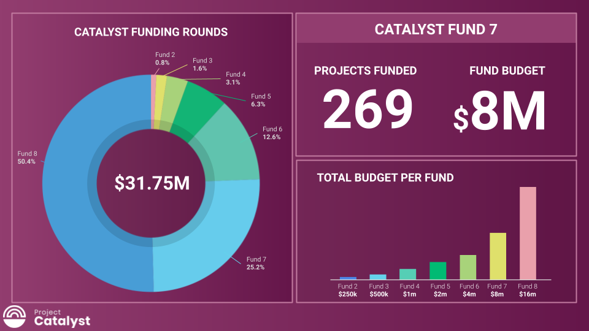

# Project Catalyst, công cụ đổi mới của Cardano, khởi chạy Fund8!

### **Project Catalyst là một công cụ mạnh mẽ của Cardano, thúc đẩy sự phát triển của hệ sinh thái và biến ước mơ thành hiện thực**

 2 tháng 3 năm 2022  [Kriss Baird](/en/blog/authors/kriss-baird/page-1/)  4 phút đọc

### [**Kriss Baird**](/en/blog/authors/kriss-baird/page-1/)

Product Manager

Commercial

- 
- 
- 

 

Cứ ba tháng một lần, một chiến dịch quỹ đổi mới Project Catalyst bắt đầu với cơ hội nhận được tài trợ thanh toán bằng ada từ Kho bạc Cardano. Đây là nguồn lực quý giá để xây dựng, sáng tạo và đóng góp nhằm hiện thực hóa những ý tưởng tuyệt vời xứng đáng được tài trợ.

Đã trải qua hơn một năm, bắt đầu từ những thử nghiệm, hợp tác, cạnh tranh và nâng cao tiềm năng của con người. Project Catalyst đã trở thành quỹ đổi mới phi tập trung lớn nhất thế giới. Phiên bản quỹ tiếp theo, Fund8, sẽ có 16 triệu đô la bằng ada, hãy xem [Hướng dẫn khởi chạy Fund8](https://bit.ly/3vFgEvl) .

Một cộng đồng toàn cầu cùng nhau đề xuất, đánh giá và cuối cùng quyết định những đề xuất nào nên được tài trợ. Mọi đề xuất bao gồm các ứng dụng tài chính phi tập trung (DeFi) mới để giải quyết sự bất bình đẳng về  tài chính. Hoặc [RealFi](https://iohk.io/en/blog/posts/2021/11/25/welcome-to-the-age-of-realfi/) , tạo ra một hệ sinh thái gồm các sản phẩm loại bỏ những bất cập của các hoạt động kinh tế trong thế giới thực và cung cấp các sản phẩm tín dụng / tài chính rẻ hơn cho con người trong thế giới thực. Chẳng hạn như [dự án cùng nhau sản xuất](https://wayacollective.com/) do các doanh nhân và công nhân Châu Phi làm chủ.

### **Các mốc quan trọng của dự án**

Trong bảy quỹ Catalyst đã triển khai, các chu kỳ của Catalyst đều mang lại những cột mốc mới, đáng kinh ngạc. Trước khi chúng ta chờ đợi những gì đã có cho Fund8, hãy cùng quan sát những thành tích vừa đạt được trong Fund7 .

 

Trong Fund7, sau khi các phiếu bầu đã được kiểm và đối chiếu, [269 đề xuất mới đã được chọn để được nhận tài trợ bằng ada](https://drive.google.com/file/d/193GZulHuk0zhpTrMiLhcNC4OeEMoRyIa/view) . Một con số đáng kinh ngạc khi mỗi dự án này đều đáp ứng 24 thách thức trong thế giới thực do cộng đồng Cardano đề xuất và một thách thức nữa được đặt ra bởi nhà tiên phong [Catalyst Native](https://iohk.io/en/blog/posts/2021/11/10/introducing-catalyst-natives-how-any-business-can-leverage-the-cardano-innovation-engine/) của Cardano, COTI. Catalyst Native là sáng kiến mới của Cardano nhằm cung cấp dịch vụ quản lý quỹ đổi mới phi tập trung cho các đối tác đang tìm cách phát triển hệ sinh thái của họ bằng cách khuyến khích các nhà đổi mới giúp xây dựng giải pháp cho những thách thức mà các đối tác của Catalyst Native đặt ra.

Hơn 52.500 ví đã đăng ký bỏ phiếu và các cố vấn cộng đồng đã tham gia xem xét hơn 900 đề xuất trong thời gian này để giúp cung cấp thông tin cho người bỏ phiếu đưa ra quyết định.

Trong một khoảng thời gian rất ngắn, số lượng đề xuất được tài trợ từ [Kho bạc Cardano](https://iohk.io/blog/posts/2020/09/10/project-catalyst-voltaire-bring-power-to-the-people/) đã tăng gần gấp đôi lên 575 dự án. Điều quan trọng, chúng tôi hiện đã thấy hơn 1 triệu phiếu bầu kể từ cuộc bỏ phiếu đầu tiên của cộng đồng Project Catalyst trong Fund2.

Tại thời điểm viết bài, Kho bạc Cardano nắm giữ khoảng 800 triệu ada để duy trì và phát triển hệ sinh thái. Nhiều dự án được tài trợ trong các vòng trước hiện đã hoàn thành và đang [chứng minh kết quả của chúng](https://docs.google.com/spreadsheets/d/1bfnWFa94Y7Zj0G7dtpo9W1nAYGovJbswipxiHT4UE3g/edit#gid=416498551) .

Khi các dự án tham gia chiến dịch quỹ mới thì luôn đạt được một cột mốc đầy bất ngờ. Mọi thử thách trong Fund8 đều do cộng đồng Catalyst đặt ra và quyết định. Mục đích? Để tăng tốc nhà phát triển và hệ sinh thái ứng dụng phi tập trung trong khuôn khổ mã nguồn mở của Cardano. 23thách thức trải dài trên các chủ đề như Phát triển nền tảng hệ sinh thái Cardano, Phát triển Cộng đồng, Tiếp cận và lựa chọn nghề nghiệp, Nhận dạng và khả năng tương tác, Cải tiến Project Catalyst.

Năm 2022 được thiết lập để làm lu mờ những thành tựu của 12 tháng trước đó, với những đổi mới và dự án được thúc đẩy bởi những người giống như bạn đang đọc blog này hôm nay. Bạn có một ý tưởng? Tại sao không áp dụng?

### **Làm thế nào để tham gia?**

Vào thứ Năm, ngày 24 tháng 2 năm 2022, vòng nộp đề xuất đã được mở. Những người đề xuất ban đầu có một tuần để gửi đề xuất dự thảo và hai tuần bổ sung, tinh chỉnh và hoàn thiện các đề xuất. Thời hạn gửi dự thảo này hiện đã được dỡ bỏ, không còn thời hạn gửi dự thảo nữa và thay vào đó, chúng tôi sẽ chấp nhận gửi đề xuất cho đến 11 giờ sáng theo giờ UTC vào ngày 17 tháng 3.

Có nhiều cách để tham gia Project Catalyst. Là một nhà đổi mới, người bỏ phiếu, người bình luận, người đánh giá đề xuất hoặc thậm chí là một người cố vấn. Bước đầu tiên là [tạo tài khoản trên nền tảng tương tác của chúng tôi](https://cardano.ideascale.com/) . Một cách khác là tham gia cộng đồng Project Catalyst vào Thứ Tư hàng tuần tại TownHall được phát trực tiếp trên [Kênh YouTube](https://www.youtube.com/c/IohkIo) của chúng tôi. Nếu bạn có ý tưởng hoặc chỉ tò mò muốn khám phá những gì đang diễn ra ở trung tâm Cardano, hãy tham gia với chúng tôi và trở thành một phần của Cộng đồng Project Catalyst.

Để tìm hiểu thêm về [Project Catalyst](https://iohk.io/en/blog/posts/2021/02/12/our-million-dollar-baby-project-catalyst) hoặc tham gia và trả lời các thử thách do những người khác đăng thông qua Project Catalyst, vui lòng đăng ký vào [danh sách gửi thư Catalyst](https://bit.ly/3dSZJvx) và tham gia [cộng đồng Telegram](https://t.me/cardanocatalyst) của chúng tôi, nơi chúng tôi rất vui được chào đón bạn.

Bài này được dịch bởi LinhPool, Review bởi Quang Pham, biên tập bởi Nguyễn Hiệu. Bài viết nguồn [tại đây](https://iohk.io/en/blog/posts/2022/03/02/project-catalyst-cardano-s-innovation-engine-launches-fund8)

*Dự án này được tài trợ bới Catalyst*
