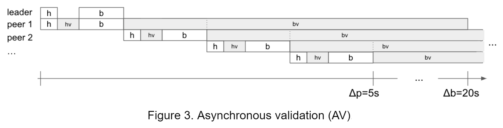

# Tăng thông lượng giao dịch của Cardano

### **Phát tán đồng thời (Diffusion pipelining) - được lên kế hoạch cho mùa hè này - sẽ giam thời gian truyền và xác thực block, cho phép tạo ra các block lớn hơn và tăng thông lượng giao dịch. Đây là một quan điểm nghiên cứu kỹ thuật. (Cùng với phần giới thiệu về AV, thậm chí còn hiệu quả hơn)**

 21 Tháng 3 2022[ Matthias Fitzi](/en/blog/authors/matthias-fitzi/page-1/) 10 phút đọc

### [**Matthias Fitzi**](/en/blog/authors/matthias-fitzi/page-1/)

Research Fellow

Academic Research

- 
- 
- 

Việc cho phép các hợp đồng thông minh trên Cardano gần đây đã dẫn đến sự gia tăng đáng kể trong hoạt động của người dùng. Đồng thời, quy mô giao dịch trung bình đã tăng lên do các giao dịch tập lệnh mang mã code (code-carrying script). Với các ứng dụng tài chính phi tập trung (DeFi) đầu tiên hiện đã được triển khai trên hệ sinh thái Cardano và nhiều hơn thế nữa, chúng tôi hy vọng xu hướng này sẽ tiếp tục. Để bắt kịp với nhu cầu tăng cao này, thông lượng giao dịch hiện tại của hệ thống phải được tăng lên.

Một cách tiếp cận rõ ràng để tăng thông lượng giao dịch là tăng giới hạn kích thước block để có được nhiều giao dịch hơn trên mỗi block. Kích thước block đã được tăng 25% trong năm nay — từ 64kB lên 80kB hiện tại và chúng tôi dự đoán sẽ còn tăng thêm nữa. Tuy nhiên, có một giới hạn về độ lớn của một block có thể đạt được mà vẫn được duy trì an toàn bằng giao thức đồng thuận sổ cái nếu tốc độ sản xuất block được giữ ở mức hiện tại. Để đạt được thông lượng cao mà không ảnh hưởng đến tính bảo mật của hệ thống, cần phải có các biện pháp bổ sung. Để hiểu lý do tại sao, chúng ta cần xem xét kỹ hơn cách hoạt động của đồng thuận sổ cái nói chung:

Các giao thức đồng thuận sổ cái được đặc trưng bởi hai tham số thời gian:

- Δp, độ trễ mạng tối đa để block mới tiếp cận (ví dụ) 95% mạng, và
- Δb, thời gian (dự kiến) giữa việc tạo ra hai block mới

Trong các giao thức điển hình, để lập luận về tính nhất quán cho sự đồng thuận, việc truyền tải block trước đó phải kết thúc trước khi block tiếp theo được tạo — ít nhất là trong hầu hết thời gian. Do đó, Δb được chọn lớn hơn một chút so với Δp. Trong Cardano, chúng ta có Δp = 5s (giây) và Δb = 20s.

Bây giờ, một block có thể vận chuyển bao nhiêu dữ liệu trong những điều kiện này? Để thấy được điều này, chúng ta cần xem xét chi tiết hơn những điều chính xác phải đạt được trong Δp.

Hình 1. Phát tán Block và xác thực mạng trong ngân sách Δp = 5s

Hãy xem Hình 1 ở trên mô tả một cách đơn giản, cách thức block phát tán trong mạng lưới. Nhà sản xuất block (block producer) gửi tiêu đề block ( block header) mới của họ đến Peer 1 (hộp h màu trắng), chiếm các liên kết mạng của cả hai node trong khoảng thời gian được chỉ ra bởi hộp h màu trắng. Peer 1 sau đó xác thực tiêu đề (liên quan đến tính toán cục bộ trong khoảng thời gian được chỉ ra bởi hộp hv màu xám). Nếu tiêu đề hợp lệ, tức là tiêu đề chứng minh block dẫn đầu đủ điều kiện, v.v., nội dung block được tải xuống bởi Peer 1 (hộp b màu trắng), một lần nữa chiếm các liên kết mạng của cả hai node. Cuối cùng, Peer 1 xác thực phần nội dung block (hộp bv màu xám) và chỉ khi phần nội dung block cũng hợp lệ, Peer 1 sẵn sàng truyền tải block cho các peer khác dọc theo dòng của những gì vừa được mô tả.

Một tác dụng phụ đáng tiếc của cơ chế này là liên kết mạng và CPU của một node chỉ được sử dụng trong một phần nhỏ của Δp = 5s trong khi  hầu như (chủ yếu) không hoạt động trong phần còn lại của thời gian (dự kiến) Δb = 20s.

Cụ thể, lượng dữ liệu chúng ta có thể đưa vào một block được xác định bởi độ trễ mạng ngang hàng của block và thời gian xác thực cần thiết. Cả hai đều phát triển gần như tuyến tính về kích thước của block — nhân với số bước nhảy tối đa cần thiết để đạt được 95% tất cả các node. Các phép đo cho thấy, để đảm bảo truyền mạng trong Δp = 5s, kích thước block không được vượt quá 2 MB. Đối với các tập lệnh đòi hỏi nhiều tính toán, thời gian xác thực thậm chí có thể áp đặt một giới hạn thấp hơn nhiều.

Tin tốt là, trong những ràng buộc này, thông lượng giao dịch có thể bị vượt quá bằng cách áp dụng các thay đổi cho mạng ngang hàng và / hoặc các lớp đồng thuận. Chúng tôi giải thích các kỹ thuật này dưới đây.

### **Phát tán đồng thời (Diffusion pipelining)**

Xem lại Hình 1, chúng ta thấy rằng tất cả các hành động của các node được thực hiện theo một trình tự nghiêm ngặt, và do đó Δp cần phải phù hợp với thời gian yêu cầu của một node nhân với số bước nhảy trong đường dẫn ngang hàng. Chúng tôi nhận thấy rằng, mặc dù điều này là cần thiết cho việc truyền mạng, nhưng nó không phải để xác thực block.

Xem xét Hình 2. Bằng cách cho phép các block được truyền trước khi quá trình xác thực đầy đủ diễn ra, chúng ta có thể loại trừ xác thực phần nội dung (lặp lại) khỏi đường truyền. Ngay sau khi Peer 1 nhận được phần nội dung  block (b-box), nó đã có thể bắt đầu truyền tải block đồng thời để xác thực nội dung block, v.v.

Ngược lại với sơ đồ trong Hình 1, ngân sách Δp giờ đây chỉ cần tính đến việc xác thực nội dung một lần. Điều này dẫn đến ngân sách thời gian cao hơn để truyền mạng ngang hàng và / hoặc xác thực nội dung, do đó cho phép thông lượng giao dịch cao hơn (để dễ dàng so sánh với Hình 1, mức tăng này được minh họa bằng xác thực nội dung lớn hơn ('bv' ' ) ngân sách).

Vì những lý do được giải thích bên dưới, điều quan trọng là hai kiểm tra xác thực sau đây vẫn được sao chép đầy đủ trong đường truyền:

1. Tính đúng đắn của tiêu đề (header), tức là block tham chiếu chính xác khối tiền nhiệm của nó và vị trí block dẫn đầu chính xác (chức năng có thể xác minh-ngẫu nhiên (verifiable-random-function-VRF) và xác thực chữ ký khối).
2. Tính đầy đủ của block, tức là phần nội dung đã nhận (nhưng chưa được xác thực) thực sự được tham chiếu bởi phần nội dung hàm băm của phần tiêu đề.

Cách mà phát tán đồng thời (như mô tả ở trên) có thể ảnh hưởng đến bảo mật của các lớp mạng lưới và đồng thuận như thế nào?

Trước tiên, hãy lưu ý rằng lớp đồng thuận vẫn không bị ảnh hưởng bởi thay đổi này:

- Các block trung thực luôn hợp lệ, vì block leader xác thực hoàn toàn chuỗi được thêm vào bởi block mới cũng như chính block mới.
- Các block không hoàn chỉnh không được  phát tán (do Điểm 2 ở trên)
- Các block không hợp lệ (hoàn chỉnh), mặc dù có thể được truyền qua mạng lưới, luôn bị loại bỏ bởi một node trung thực sau khi xác thực phần nội dung.

Thứ hai, liên quan đến các cuộc tấn công Từ chối dịch vụ (DoS) trên lớp mạng, lưu ý rằng kẻ thù có thể cố gắng làm tắc nghẽn hệ thống bằng cách khuếch tán các block không hợp lệ. Tuy nhiên, block dẫn đầu chính xác vẫn được xác minh (do điểm 1), ngụ ý rằng block như vậy sẽ chỉ được phát tán nếu đối thủ được lên lịch làm như vậy, tức là không tạo ra nhiều tải hơn so với trường hợp block leader này trung thực (ngoại trừ block không đóng góp vào thông lượng của hệ thống). Hơn nữa, các nhà điều hành nhóm cổ phần (SPO) tạo ra các block không hợp lệ có thể dễ dàng được xác định và trừng phạt, trên thực tế, một hệ thống quản lý vi phạm hiện đang được phát triển để thực hiện chính xác chức năng này.

Để kết luận, diffusion pipelining làm tăng ngân sách cho việc truyền block và thời gian xác thực trong giới hạn Δp, cho phép các block lớn hơn và do đó tăng thông lượng giao dịch — trong khi vẫn giữ nguyên các quy tắc đồng thuận. Nó hứa hẹn sẽ tăng đáng kể thông lượng trong khi vẫn có thể đạt được bằng những thay đổi xâm nhập tối thiểu đối với hệ thống, và do đó là một ứng cử viên tuyệt vời để triển khai trong thời gian ngắn hạn. Tuy nhiên, tác động của pipelining (một mình) còn hạn chế, và tham vọng của chúng tôi không dừng lại ở đây.

Tiếp theo, chúng tôi sẽ đưa ra một bản tóm tắt về một kỹ thuật mạnh mẽ hơn có thể đạt được thông lượng giao dịch thậm chí cao hơn, nhưng cũng yêu cầu một số thay đổi giao thức ấn tượng hơn.

### **Xác thực không đồng bộ (Asynchronous validation)**

Ý tưởng đằng sau quá trình diffusion pipelining — quá trình xác thực phần nội dung bị trì hoãn — có thể được đưa đến cực điểm: một block mới vẫn được yêu cầu đến trong thời gian Δp, nhưng chúng tôi không yêu cầu quá trình xác thực phần nội dung của nó phải được hoàn thành trong vòng Δp. Chúng tôi gọi đây là xác thực không đồng bộ (AV).

Xem xét Hình 3. Xác thực phần nội dung được phép sử dụng ngân sách Δb (dự kiến) còn lại (bên cạnh quá trình truyền block và xác thực tiêu đề), do đó hầu như đặt CPU của các node ở tải vĩnh viễn. Tuy nhiên, lưu ý rằng liên kết mạng và CPU cũng được chỉ định cho các tác vụ khác (chẳng hạn như đồng bộ hóa mempool), có nghĩa là chúng tôi không muốn sử dụng toàn bộ phần còn lại của Δb để xác thực nội dung, nhưng hãy để một vài giây được gán cho các tác vụ khác các nhiệm vụ.

Điều này có một tác dụng phụ đáng chú ý. Trái ngược với diffusion pipelining, xác thực sổ cái thường chậm hơn phần đầu của chuỗi. Đặc biệt, ngay cả các block leaders trung thực hiện nay cũng có thể tạo ra các block (một phần) không hợp lệ, vì họ có thể chưa hoàn tất việc xác thực lịch sử giao dịch dẫn đến block mới.

Để đối phó với tác dụng phụ này, các quy tắc sổ cái cần phải được điều chỉnh: để đảm bảo rằng các block trung thực luôn đóng góp vào sự bảo mật của sự đồng thuận, các block mang giao dịch không hợp lệ vẫn phải được coi là phần mở rộng chuỗi hợp lệ. Sau đó, các giao dịch không hợp lệ có thể đơn giản bị loại bỏ trong quá trình xác thực sổ cái.

Mặc dù cải thiện đáng kể so với diffusion pipelining, AV thậm chí có thể được cải thiện hơn nữa. Lý do là, nói chung, không có đủ dữ liệu có thể được khuếch tán trong Δp để tạo ra đủ công việc xác thực để tối đa hóa các CPU trong toàn bộ phần còn lại của khoảng thời gian Δb. Để tận dụng đầy đủ các lợi ích của AV, chúng tôi sẽ kết hợp nó với cơ chế xác thực đầu vào (input endorsers), mà chúng tôi sẽ mô tả trong một bài đăng trên blog sắp tới.

### ** Tác Động**

Tác động nào đến thông lượng mà chúng ta có thể mong đợi từ pipelining và AV? Việc tìm kiếm câu trả lời chính xác cho câu hỏi này vẫn đang được mạng lưới và các nhóm nghiên cứu của chúng tôi đang tiến hành, vì việc đưa ra một phân tích chặt chẽ trong trường hợp có kẻ thù độc hại (cố gắng làm gián đoạn tối đa giao thức) có liên quan. Tuy nhiên, để cung cấp ước tính đầu tiên, chúng tôi đưa ra phân tích thông lượng dưới đây cho trường hợp lạc quan trong đó tất cả các SPO đều hoạt động trung thực - với kỳ vọng rằng kết quả cho trường hợp độc hại sẽ không sai lệch đáng kể (kể cả sự hiện diện của hệ thống quản lý vi phạm). Tuy nhiên, lưu ý rằng thông lượng thực của hệ thống có thể sẽ thay đổi so với các ước tính đã cho.

Trong Bảng 1, chúng tôi trình bày các ước tính thông lượng này (tính theo giao dịch mỗi giây, TPS). Nhớ lại rằng thông lượng phụ thuộc cả vào quy mô giao dịch và thời gian xác thực. Đối với lựa chọn các cặp kích thước / thời gian xác thực, chúng tôi giả định rằng tất cả các giao dịch có cùng đặc điểm và đưa ra các số thông lượng tương ứng. Chúng tôi so sánh bốn giao thức khác nhau:

- Praos: Giao thức hiện được triển khai của Cardano (kích thước block 80 kB)
- Praos Max: Praos với kích thước block lớn nhất có thể có thể được duy trì một cách an toàn (theo các giả định ở trên)
- Phát tán đồng thời (Diffusion pipelining)
- AV (được chiết khấu 20% ngân sách Δb và được dành riêng cho các nhiệm vụ khác nhau)

Chúng tôi xem xét bốn loại giao dịch khác nhau với kích thước khác nhau và thời gian cần thiết để xác thực. Một giao dịch thanh toán đơn giản nằm ở đâu đó gần loại 0,5 kB / 0,5 mili giây, trong khi các giao dịch tập lệnh có thể thuộc một trong các loại khác, đòi hỏi cả kích thước lớn hơn và nhiều nỗ lực hơn để xác thực. Cũng lưu ý cột cuối cùng (2 kB / 32 mili giây) nơi thời gian xác thực trở nên đáng kể so với độ trễ của mạng: Việc tăng kích thước block (từ Praos lên Praos Max) không giúp cải thiện thông lượng vì xác thực đã sử dụng hết ngân sách thời gian. Do đó, pipelining và AV mang lại thành tựu tương đối chắc chắn chính xác trong những trường hợp này vì chúng làm tăng ngân sách thời gian xác thực.

### ** Viễn cảnh cho Cardano**

Việc tăng thông lượng của một permissionless blockchain (blockchain không cần cấp phép hay blockchain mở) là rất quan trọng về bảo mật, vì việc chấp nhận nhiều tải hơn vào hệ thống có thể tạo ra các cơ hội tấn công DoS. Do đó, nên thực hiện các thay đổi như vậy theo một trình tự các bước nhỏ trong khi quan sát cẩn thận các tác động lên hệ thống.

Các bước đầu tiên như vậy đã được thực hiện vào tháng 12 năm 2021 và tháng 2 năm 2022 bằng cách nâng giới hạn kích thước block (và các đơn vị bộ nhớ tập lệnh Plutus) từ 64kB lên 80kB (xem thêm [blog gần đây](https://iohk.io/en/blog/posts/2021/11/22/slow-and-steady-wins-the-race-network-evolution-for-network-growth/) của John Woods).

Trong những tháng tới, chúng tôi sẽ tiếp tục theo dõi chặt chẽ và điều chỉnh các thông số này, dựa trên nhu cầu mạng và hạn chế về dung lượng. Những cải tiến hơn nữa sẽ đi kèm với việc thực hiện diffusion pipelining. Các tối ưu hóa đồng thuận khác, bao gồm input endorsers (xác thực đầu vào), vẫn đang trong quá trình phát triển và chi tiết hơn về cách thực hiện các tối ưu hóa này sẽ được thông báo trong thời gian thích hợp.

Lưu ý rằng nỗ lực tối ưu hóa của  kỷ nguyên Cardano Basho vượt ra ngoài mạng lưới và các lớp đồng thuận, và bao gồm các cải tiến tập lệnh Plutus cũng như xử lý ngoài chuỗi (off-chain)— hãy xem [blog gần đây](https://iohk.io/en/blog/posts/2022/01/14/how-we-re-scaling-cardano-in-2022/) này của Tim Harrison. Đặc biệt, [Hydra](https://iohk.io/en/blog/posts/2020/03/26/enter-the-hydra-scaling-distributed-ledgers-the-evidence-based-way) , một bộ giao thức lớp 2 (layer-2 ) đang được phát triển, cung cấp một con đường khác để cải thiện đáng kể tổng thông lượng giao dịch bằng cách cho phép thực hiện các giao dịch ngoài chuỗi.

>Tôi xin cảm ơn Duncan Coutts, Sandro Coretti-Drayton, Neil Davies, Alexander Esgen, Nicolas Frisby, Peter Gaži, Philipp Kant, Aggelos Kiayias, Karl Knutsson, Tim Harrison, Giorgos Panagiotakos, Alexander Russell, Fernando Sanchez, Marcin Szamotulski, Peter Thompson, Spyros Voulgaris và John Woods.

Bài này được dịch bởi Duy Thái, Review bởi Quang Pham, biên tập bởi Nguyễn Hiệu. Bài viết nguồn [tại đây](https://iohk.io/en/blog/posts/2022/03/21/increasing-the-transaction-throughput-of-cardano)

*Dự án này được tài trợ bởi Catalyst*
