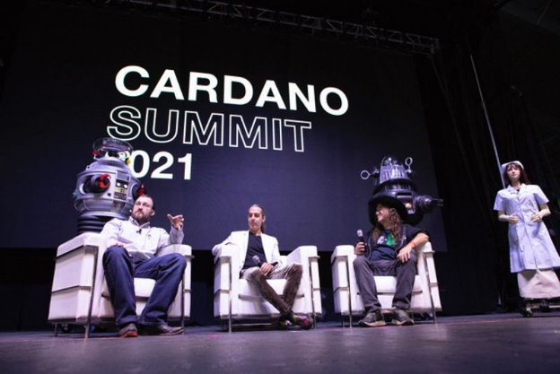

# Vai trò quan trọng của AI/blockchain trong tương lai

### **Một bài guest blog được đăng bởi nhà tiên phong về AI và blockchain, Tiến sĩ Ben Goertzel của SingularityNET**

 Ngày 30 tháng 3 năm 2022[ Dr. Ben Goertzel](/en/blog/authors/ben-goertzel/page-1/) bài đọc 8 phút

### [**Dr. Ben Goertzel**](/en/blog/authors/ben-goertzel/page-1/)

CEO and Chief Scientist at SingularityNET

Guest author

- 
- 

Nền kinh tế toàn cầu đang ngày càng trở nên phức tạp, với các thuật toán AI tinh vi hiện có thể tạo ra nhiều tài sản hơn trong một ngày so với những gì tổ tiên của chúng ta đã thực hiện trong cả cuộc đời của họ. Điều quan trọng là chúng ta phải ngăn chặn mạng lưới AI toàn cầu đang nổi lên khỏi sự kiểm soát tập trung bởi một vài tổ chức. Tính minh bạch và chủ quyền phải được thiết kế thích hợp vào cơ sở hạ tầng của AI. Đây cũng là những nguyên tắc đằng sau kiến ​​trúc blockchain. Đây là một khoảnh khắc thú vị trong lịch sử, nơi mà sự hội tụ của blockchain AI có thể diễn ra, tạo ra một nền kinh tế công nghệ toàn cầu với sự minh bạch và chủ quyền. Các công nghệ của AI và blockchain có thể hoạt động cùng nhau với những ý nghĩa sâu sắc trên tất cả các lĩnh vực, vì tương lai của nhân loại và các hệ thống có tri giác khác mà nhân loại có thể tạo ra.

Sự di chuyển của nền tảng AI phi tập trung SingularityNET từ Ethereum đến Cardano, hiện đang được tích cực triển khai, đánh dấu một cột mốc quan trọng trong sự hội tụ AI / blockchain. SingularityNET bắt đầu hoạt động trên Ethereum vào năm 2017 nhưng chúng tôi luôn có quan niệm và tham vọng đa chuỗi. Với hard fork giữa năm 2021, việc triển khai phiên bản token SingularityNET AGIX và các chức năng liên quan trên nhiều blockchain đã trở thành một khả năng. Giờ đây, khả năng này đang trở thành hiện thực.

Cầu nối chuyển đổi token AGIX / ADA hiện sắp hoàn thành sau một khoảng thời gian trên testnet, sẽ cho phép chuyển đổi giữa các phiên bản ETH và ADA của token AGIX. Đây là bước đầu tiên trong một số bước cuối cùng sẽ dẫn đến một phiên bản Cardano của nền tảng SingularityNET với chiều sâu và nhiều chức năng AI hơn bao giờ hết với so với phiên bản Ethereum ban đầu. Sau khi phát hành cầu nối chuyển đổi trên mainnet, nỗ lực phát triển sẽ tập trung vào việc di chuyển chợ giao dịch SingularityNET, việc đặt cọc và các công cụ khác sang Cardano. Điều này sẽ dẫn đến một nền tảng có tốc độ cao hơn, chi phí thấp hơn và khả năng sử dụng cao hơn những gì có thể có trên Ethereum.

## **Một lộ trình đầy tham vọng**

Sau việc di chuyển ban đầu này, một loạt các tính năng tận dụng sức mạnh độc đáo và sự tinh vi của cơ sở hạ tầng Cardano sẽ được phát hành.

AI-DSL (Ngôn ngữ đặc thù nghành AI), đang được phát triển dưới sự hợp tác tích cực bởi SingularityNET và IOG kể từ cuối năm 2020, sẽ cho phép các dịch vụ AI trên nền tảng SingularityNET / Cardano mô tả các thuộc tính và yêu cầu của chúng với nhau bằng ngôn ngữ chính thức được chuẩn hóa. AI-DSL sẽ hỗ trợ sự kết hợp tự động của các dịch vụ AI thành các dịch vụ siêu tốc đáp ứng nhu cầu của khách hàng.

Việc sử dụng Haskell và Plutus của Cardano hoạt động một cách dễ dàng với các cơ chế lý thuyết kiểu phức tạp hơn được tận dụng trong khuôn khổ AI-DSL. Loại ngôn ngữ này là cần thiết để thực hiện tham vọng của SingularityNET không chỉ là một thị trường phi tập trung của các dịch vụ AI riêng biệt. AI-DSL sẽ cho phép nền tảng SingularityNET trở thành “nồi súp nguyên thủy của AI” trong đó các thành phần AI khác nhau do các tác giả khác nhau tạo ra kết hợp với nhau theo những ngữ cảnh phù hợp để tạo thành các chức năng AI mới nổi lên.

Ví dụ: trong lĩnh vực DeFi, một nhân viên sử dụng AI phân tích giá altcoin, một nhân viên sử dụng NLP phân tích tin tức và một nhân viên thực hiện lý luận tượng trưng trừu tượng có thể kết hợp với nhau để tạo thành một phương pháp tiếp cận đa tác nhân mới để tối ưu hóa danh mục đầu tư altcoin. Tập hợp các quy trình AI này có thể được sử dụng ở một trong các gói DynaSet của Cardano Native Assets của SingularityDAO - cho phép giao dịch token của người dùng bị khóa trong các hợp đồng thông minh SingularityDAO thông qua các thuật toán, không bị giám sát bởi những tác giả của bất kỳ tác nhân AI riêng lẻ nào có liên quan.

Tiềm năng của bộ giao thức [Hydra](https://iohk.io/en/blog/posts/2022/02/03/implementing-hydra-heads-the-first-step-towards-the-full-hydra-vision/) của Cardano hỗ trợ các chức năng AI phức tạp của SingularityNET sẽ trở nên rõ ràng hơn trong suốt năm 2022 và 2023. Giao thức Hydra Head cung cấp một phương pháp dễ dàng và mạnh mẽ để triển khai loại kênh trạng thái được sử dụng trong các hợp đồng ký quỹ nhiều bên của SingularityNET. Các khía cạnh nâng cao hơn của các giao thức Hydra có thể được sử dụng một cách tham vọng hơn. Đối với Cardano sidechain [ HyperCycle](http://hypercycle.ai)  tùy chỉnh sẽ cung cấp cơ sở hạ tầng có khả năng mở rộng chưa từng có cho các hệ thống multi-agent &amp; population-based AI đang chạy trên SingularityNET.

## **Blockchain cần AI**

Để hệ sinh thái blockchain hoàn thành một cách thành công sứ mệnh phi tập trung hóa và dân chủ hóa nền kinh tế thế giới, nó sẽ cần phải tích hợp sâu AI theo nhiều cách khác nhau. Sự hợp tác SingularityNET / Cardano rất phù hợp để dẫn đầu trong quá trình tích hợp này.

Công việc hiện tại tạo ra các stakepool Cardano được phân tán bằng cách sử dụng khung xử lý phi tập trung NuNet, gần đây được tách ra từ SingularityNET, báo trước những gì quan trọng trong tương lai để mở rộng dự án ​​mạng lưới Cardano ra quy mô toàn cầu: các stakepool Cardano được phân phối trên các bộ xử lý đa dạng thông qua NuNet, theo cách được tối ưu hóa bởi neural-symbolic AI được lưu trữ trên SingularityNET-on-Cardano và chạy trên NuNet.

Hydra sẽ cho phép đưa nhiều hình thức sharding khác nhau vào mạng Cardano, nhưng việc quản lý tự động nhanh chóng loại hình sharding này ở quy mô lớn cũng sẽ yêu cầu các hệ thống AI tiên tiến. Các sidechain Cardano được định hướng bởi SingularityNET sẽ được hưởng lợi từ các giải pháp sharding dựa trên AI này và cũng cung cấp cơ sở hạ tầng có thể mở rộng cần thiết để hỗ trợ AI nền tảng cho các giải pháp này.

Khi AGI vượt ra ngoài trình độ con người, mọi mạng lưới phi tập trung trên hành tinh sẽ yêu cầu một số loại hệ thống danh tiếng ở cốt lõi của nó, để mà những người tham gia vào mạng lưới (và những proxy phần mềm và phần cứng của họ) có thể đưa ra các đánh giá thích hợp về mức độ tin cậy để đặt mật mã, các giao dịch và các thiết bị trong mạng lưới. Việc quản lý danh tiếng ngoài quy mô và độ phức tạp nhất định cũng đòi hỏi trí tuệ nhân tạo tinh vi. Tôi dự đoán rằng các kỹ thuật “bằng chứng danh tiếng” dựa trên SingularityNET sẽ tìm thấy cách tham gia vào các mạng lưới khác nhau được triển khai trên nền tảng Cardano và có lẽ cuối cùng là vào chính phần mềm Cardano cốt lõi.

Các mạng xã hội phi tập trung, sẽ rất quan trọng đối với các giai đoạn tiến hóa tiếp theo của nhân loại về mặt văn hóa, chính trị và theo nhiều cách khác, rõ ràng là chúng là một trong những mạng lưới sẽ dựa rất nhiều vào các hệ thống danh tiếng do AI điều khiển. Các nhà phân tích con người, các hệ thống học tập thống kê đơn giản và các cơ quan quản lý của chính phủ và công ty đã chứng minh rằng không có khả năng hướng dẫn và điều chỉnh một cách thông minh và đạo đức các tương tác tập thể của con người trong các mạng xã hội trực tuyến hiện đại. AI rõ ràng là câu trả lời - nhưng AI của ai? Câu trả lời cần phải là, AI của mọi người.

Blockchain có tiềm năng rõ ràng để thực hiện điều này. Nhưng điều này cần AI phi tập trung chạy trên các mạng phi tập trung được quản lý bởi các hệ thống danh tiếng phi tập trung. Chúng tôi có tất cả những thành phần này trong hệ sinh thái SingularityNET / Cardano ngay bây giờ, nhưng làm cho chúng hoạt động trên quy mô lớn theo cách mà mọi người có thể sử dụng được sẽ là một thách thức thú vị trong vài năm tới.

## **AI cần blockchain**

AI không cần blockchain để thống trị nền kinh tế thế giới - tại thời điểm này, nó đang nhanh chóng tiến tới vai trò thống trị trên tất cả các ngành công nghiệp, theo cách được thúc đẩy chủ yếu bởi các công ty công nghệ và chính phủ mang tính tập trung. Tuy nhiên, nếu chúng ta muốn sự thống trị kinh tế gần như không thể tránh khỏi của AI mang lại lợi ích rộng rãi cho con người thay vì chủ yếu phục vụ một khu vực nhỏ của xã hội, thì điều quan trọng là kiến ​​trúc của hệ thống AI toàn cầu mới nổi phải mang tính phi tập trung và dân chủ về bản chất. Con đường thực tế, cụ thể, duy nhất để đạt được điều này vào lúc này là công nghệ blockchain.

Mọi khía cạnh của hệ sinh thái AI cần phải được blockchain hóa một cách cơ bản và triệt để, và tất cả các mạng blockchain liên quan cần phải được tạo ra có khả năng mở rộng hơn, dễ sử dụng và có thể tương tác phong phú và trơn tru. Tin tốt là chúng tôi đã có các phiên bản hoạt động sớm ở hầu hết mọi khía cạnh quan trọng cần thiết cho việc này. Kho dữ liệu phi tập trung với Ocean và (đối với dữ liệu y tế) Rejuve và nhiều kho dữ liệu khác; sức mạnh xử lý phi tập trung với NuNet và Golem và CPUCoin,… ; Xử lý AI đa tác nhân phi tập trung với SingularityNET cộng với các lựa chọn thay thế như Fetch and Matrix; một đồ thị kiến ​​thức phi tập trung bắt đầu bằng Epik; cơ sở hạ tầng Web phi tập trung với Elastos và Dfinity,… , và nhiều hơn nữa. Mã hóa đồng hình và tính toán đa bên cho các thuật toán AI khác nhau, cho phép AI bảo mật và tôn trọng chủ quyền dữ liệu xảy ra ở quy mô toàn cầu, được mô tả trong nhiều tài liệu nghiên cứu - nhưng việc triển khai ở cấp thương mại rất hạn chế.

Nhưng thành thật mà nói, không có công cụ và nền tảng phi tập trung nào - bao gồm tất cả các dự án của tôi - lại hoạt động có quy mô và trơn tru như các sản phẩm tập trung tương ứng do các công ty công nghệ lớn tung ra. Đây không phải là sự lên án đối với công nghệ blockchain, mà bởi vì các đối thủ cạnh tranh là các công ty hàng nghìn tỷ đô la có lịch sử sâu xa trước khi hợp đồng thông minh ra đời. Nhưng điều quan trọng là để thực sự thúc đẩy cuộc cách mạng AI đang diễn ra, thì chúng ta, trong không gian phi tập trung, sẽ cần phải đi một quãng đường khá dài trong một thời gian ngắn. Để làm được điều này, chúng tôi sẽ cần những đội ngũ chất lượng làm việc trên những công nghệ được thiết kế cực kỳ tốt và vững chắc, và đây là lý do tại sao tôi rất vui mừng về mối quan hệ hợp tác giữa SingularityNET và Cardano/IOHK.

## **Nhân loại cần sức mạnh tổng hợp AI/blockchain**

Thế giới của chúng ta ngày nay vào năm 2022 đã được mô tả tốt nhất là một loại Global Brain Network, với trí thông minh nổi bật của mạng giao tiếp máy tính / con người kết hợp lại vượt xa những gì mà bất kỳ bộ óc cá nhân nào của con người có thể hiểu được. Trí thông minh, sự phức tạp và chất lượng tổng hợp của bộ não toàn cầu này sẽ chỉ tăng lên hàng năm khi sự tiến bộ phối hợp của nhiều công nghệ đưa chúng ta tiến tới Technological Singularity. Việc làm chậm tiến độ trong khi chúng ta tìm ra cách tốt nhất để hướng nó đến các mục đích đạo đức dường như không phải là một lựa chọn thực tế - có quá nhiều lợi ích nhóm cho các bên có quyền lực khác nhau trong việc đẩy nhanh tiến độ theo những cách phù hợp, để phục vụ mục tiêu của chính họ. Lựa chọn thực tế duy nhất cho những người trong chúng ta quan tâm đến phúc lợi chung của nhân loại là đảm bảo rằng phi tập trung, dân chủ, sự phát triển có lợi của công nghệ tiên tiến diễn ra nhanh hơn so với các lựa chọn thay thế tập trung, bộ lạc, áp bức hoặc suy thoái. Sự tích hợp chặt chẽ giữa blockchain và AI là một phần quan trọng của việc này và sự hợp tác của SingularityNET và Cardano hiện đang đi đầu trong việc tích hợp này. Sự ra mắt sắp tới của [cầu nối AGIX token Converter](https://www.youtube.com/watch?v=nEOsn7bSp0A) là một phần nhỏ nhưng cần thiết của bức tranh tổng thể cực kỳ quan trọng này!

*Cầu nối chuyển đổi AGIX ERC20 dự kiến ​​sẽ [hoạt động](https://twitter.com/singularity_net/status/1507760834012930049?s=21&t=xyz7o1UlDSjv78ISignbVw) trên mainnet vào ngày 18 tháng 4. Xem cuộc phỏng vấn với Ben Goertzel trên [chương trình Cardano360 vào tháng Ba](https://twitter.com/InputOutputHK/status/1508832692686757896)*

Bài này được dịch bởi Lê Nguyên, Review bởi Tienna, biên tập bởi Nguyễn Hiệu. Bài viết nguồn [tại đây](https://iohk.io/en/blog/posts/2022/03/30/the-critical-role-of-ai-blockchain-synergy-in-humanity-s-future/)

*Dự án này được tài trợ bởi Catalyst*
