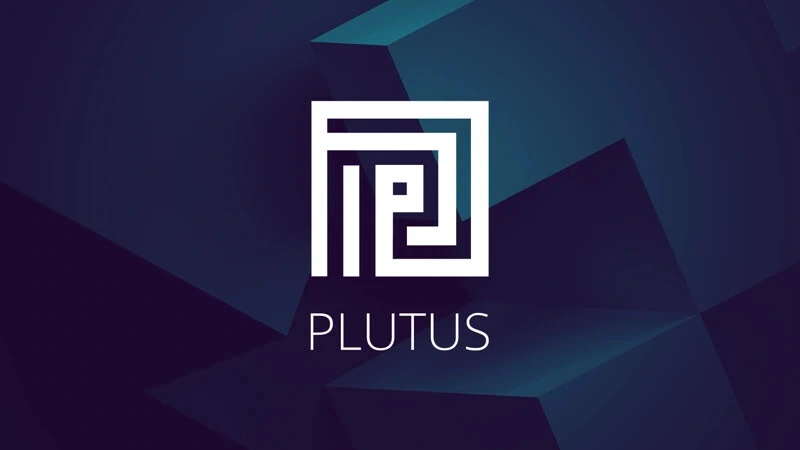

# Tăng cường thông lượng của Cardano với  Tập lệnh tham chiếu

### **Chúng tôi tập trung xem xét kỹ hơn một số cải tiến sẽ diễn ra với Cardano vào tháng 6**

 13 tháng 4 năm 2022  [Olga Hryniuk](/en/blog/authors/olga-hryniuk/page-1/)  4 phút đọc

### [**Olga Hryniuk**](/en/blog/authors/olga-hryniuk/page-1/)

Technical Writer

Marketing &amp; Communications

- 
- 

Trong giai đoạn phát triển của kỉ nguyên Basho, sổ cái tiếp tục tối ưu hóa và mở rộng quy mô do nhu cầu ngày càng tăng. Cùng với việc điều chỉnh thông số và nâng cấp node, khả năng của Plutus tiếp tục phát triển với tốc độ ổn định.

Plutus là một ngôn ngữ hợp đồng thông minh đang tồn tại và phát triển. [Các đề xuất cải tiến Cardano](https://cardanofoundation.org/en/news/make-it-even-better-cardanos-improvements-proposals/) - còn được gọi là CIP - đóng một vai trò quan trọng trong quá trình phát triển này. Thông qua cơ chế CIP, bất kỳ ai cũng có thể đề xuất cải tiến cho Cardano. CIP khuyến khích cộng đồng tham gia và đánh giá đề xuất, được duy trì liên tục trên [kho lưu trữ GitHub](https://github.com/cardano-foundation/CIPs) của Cardano Foundation .

Hãy đi sâu vào hai trong số những quá trình này. CIP với [đầu vào tham chiếu](https://github.com/cardano-foundation/CIPs/pull/159) (CIP-31) và [tập lệnh tham chiếu](https://github.com/cardano-foundation/CIPs/pull/161) (CIP-33) đã được đệ trình để triển khai trên Cardano và nằm trong số những tính năng sẽ được triển khai như một phần của đợt hard fork *Vasil* vào tháng sáu. Cùng với [các cải tiến khả năng mở rộng](https://iohk.io/en/blog/posts/2022/01/14/how-we-re-scaling-cardano-in-2022/) khác , những cải tiến này đối với Plutus sẽ thúc đẩy lưu lượng dữ liệu cho các ứng dụng phi tập trung (DApps) tài chính phi tập trung (DeFi), RealFi, các sản phẩm, hợp đồng thông minh và các sàn giao dịch đang xây dựng hoặc đang hoạt động trên Cardano.

Trong bài đăng này, chúng ta sẽ xem xét kỹ hơn các CIP này là gì và chúng mang lại lợi ích như thế nào, cũng như việc tối ưu hóa khả năng mở rộng của Cardano.

## **Đầu vào tham chiếu**

Kết quả đầu ra của giao dịch mang theo dữ liệu, cho phép lưu trữ và truy cập thông tin trên blockchain. Tuy nhiên, các dữ liệu này bị hạn chế theo một số cách. Ví dụ: để truy cập thông tin của dữ liệu, bạn phải sử dụng đầu ra được đính kèm dữ liệu. Điều này đòi hỏi phải tạo lại một đầu ra đã được sử dụng. Bất kỳ người dùng nào muốn xem dữ liệu đều không thể sử dụng đầu ra cũ (đã biến mất), mà phải sử dụng đầu ra mới (mà họ sẽ không biết về nó cho đến khối tiếp theo). Trên thực tế, điều này giới hạn một số ứng dụng tại một 'hoạt động' trên mỗi khối, do đó làm giảm hiệu suất mong muốn.

CIP-31 giới thiệu một cơ chế mới để truy cập thông tin trong các kho dữ liệu - một đầu vào tham chiếu. Đầu vào tham chiếu cho phép xem đầu ra mà không cần sử dụng nó. Điều này sẽ tạo điều kiện thuận lợi cho việc truy cập thông tin được lưu trữ trên blockchain mà không cần triệt tiêu và tạo lại các đầu ra giao dịch chưa được sử dụng (UTXO).

Các đầu vào tham chiếu cũng cho phép những cải tiến quan trọng khác – là các tập lệnh tham chiếu.

## **Các tập lệnh tham chiếu**

Khi bạn sử dụng một đầu ra bị khóa bằng tập lệnh Plutus, bạn phải đưa tập lệnh vào giao dịch để sử dụng. Do đó, kích thước của các tập lệnh góp phần vào kích thước giao dịch, ảnh hưởng trực tiếp đến lưu lượng dữ liệu của Cardano.

Kích thước tập lệnh lớn gây ra vấn đề cho người dùng vì:

1. Các giao dịch lớn hơn dẫn đến phí cao hơn.
2. Các giao dịch có giới hạn về kích thước. Các tập lệnh lớn có thể đạt đến giới hạn. Ngay cả khi một tập lệnh phù hợp, nhiều tập lệnh trong một giao dịch có thể không phù hợp. Điều này gây khó khăn cho việc thực hiện các giao dịch phức tạp dựa vào một số tập lệnh.

CIP-33 đề xuất tham chiếu tập lệnh như một giải pháp khả thi. Đây là khả năng tham chiếu đến một tập lệnh mà không bao gồm nó trong mỗi giao dịch, điều này làm giảm đáng kể sự đóng góp của các tập lệnh vào kích thước giao dịch. Tham chiếu tập lệnh trong nhiều giao dịch có thể giảm đáng kể kích thước giao dịch, cải thiện lưu lượng dữ liệu và giảm chi phí thực thi tập lệnh.

**Tham chiếu tập lệnh hoạt động như thế nào?**

Ý tưởng là sử dụng các đầu vào và đầu ra tham chiếu mang các tập lệnh thực tế (tập lệnh tham chiếu). Đề xuất tham chiếu tập lệnh loại bỏ việc gửi các tập lệnh được sử dụng thường xuyên vào chuỗi mỗi khi chúng được sử dụng. Thay vào đó, các tập lệnh sẽ có sẵn trên chuỗi một cách liên tục. Điều này có nghĩa là giao dịch sử dụng tập lệnh sẽ không cần phải bao gồm chính tập lệnh, miễn là nó tham chiếu đến đầu ra chứa nó.

Cách tiếp cận này tuân theo đề xuất đầu vào tham chiếu ([CIP-31](https://github.com/cardano-foundation/CIPs/pull/159)). CIP-31 xem xét việc cho phép chia sẻ dữ liệu trên chuỗi và kết luận rằng việc tham khảo các UTXO là giải pháp thích hợp nhất. UTXO lưu trữ dữ liệu một cách an toàn và tận dụng các cơ chế hiện có để kiểm soát kích thước.

Đối với các tập lệnh tham chiếu, đầu ra giao dịch phải được mở rộng để mang một loạt tùy chọn bao gồm một tập lệnh. Giá trị UTXO tối thiểu cho các đầu ra như vậy sẽ phụ thuộc vào kích thước của tập lệnh, tuân theo tham số giao thức coinsPerUTxOWord.

## **Sự tham gia của cộng đồng là chìa khóa**

Với các đề xuất đã được đệ trình và thực hiện, tham chiếu tập lệnh Plutus và đầu vào tham chiếu được lên kế hoạch đưa vào đợt hard fork *Vasil* tháng 6. Quy trình CIP cho phép cộng đồng đóng góp vào sự phát triển của Cardano bằng cách đề xuất, thảo luận, xem xét và đóng góp vào các đề xuất cải tiến. Chúng tôi khuyến khích cộng đồng nhà phát triển tham gia các cuộc thảo luận CIP và truy cập [kho lưu trữ CIP của Cardano Foundation](https://github.com/cardano-foundation/CIPs) để biết thêm chi tiết.
