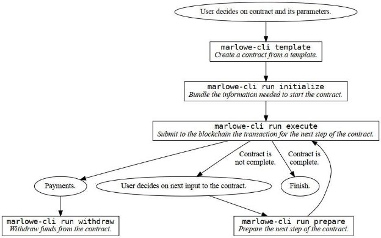

# Giới thiệu công cụ giao diện dòng lệnh (cli) mới cho Marlowe

### **Tìm hiểu cách gửi giao dịch và tương tác với các hợp đồng Marlowe từ CLI**

 Ngày 19 tháng 4 năm 2022[ Niamh Ahern](/en/blog/authors/niamh-ahern/page-1/) bài đọc 5 phút

### [**Niamh Ahern**](/en/blog/authors/niamh-ahern/page-1/)

Education Manager

Education

- 
- 
- 
- 

Marlowe là ngôn ngữ chuyên biệt mã nguồn(DSL) với một bộ sản phẩm dành cho cộng đồng, sẽ thúc đẩy việc áp dụng Cardano trong lĩnh vực tài chính. Nó liên tục được nâng cao và cập nhật, và giao diện dòng lệnh (CLI) là thứ bạn không thể làm mà thiếu nó được. Vì vậy, chúng tôi đã tạo ra một cách thuận tiện hơn để tương tác với Marlowe bằng cách sử dụng công cụ CLI mới. Công cụ mới này hỗ trợ một quy trình làm việc đơn giản cho những người dùng muốn chạy các hợp đồng từ dòng lệnh. Nó cho phép bạn tập trung vào chính hợp đồng Marlowe, trong khi công cụ này quản lý chi tiết đầu vào và trạng thái của hợp đồng. Ngoài ra, nó tự động hóa nhiều khía cạnh của Plutus cũng như tương tác với Cardano node để giảm bớt gánh nặng cho người dùng.

### **Mục đích**

Công cụ [Marlowe CLI](https://github.com/input-output-hk/marlowe-cardano/blob/cli-blog-april2022/marlowe-cli/ReadMe.md) mới tạo điều kiện thuận lợi cho sự phát triển nội bộ và thử nghiệm các hợp đồng Marlowe. Điều này bao gồm việc đo kích thước giao dịch, gửi giao dịch, thử nghiệm tích hợp ví và gỡ lỗi trình xác thực. Nó cũng được tích hợp với quy trình làm việc của nhà phát triển bên ngoài và bộ công cụ cho các hợp đồng Marlowe, tương tự như cách cộng đồng phát triển Cardano đã tích hợp mạnh mẽ công cụ Cardano CLI vào các dịch vụ khác nhau như thư viện, phân phối, đúc token, chợ giao dịch,…

Đây cũng là một bước quan trọng trong lộ trình thử nghiệm căng thẳng việc  mã hóa của chúng tôi trước khi ra mắt chính thức Marlowe, vì nó cung cấp quyền truy cập sớm vào các tính năng và khả năng trên testnet và sau đó trên mainnet.

Ngoài ra, công cụ CLI mới này sẽ trở thành một công cụ hữu ích để đào tạo người dùng về cách bắt kịp tốc độ sử dụng Marlowe. Chúng tôi sẽ trình bày cách sử dụng nó trong chương trình những người tiên phong sử dụng Marlowe sắp ra mắt trong vài tuần tới! Hãy theo dõi [ kênh Marlowe Discord](https://discord.com/channels/826816523368005654/936295815926927390/936316494042779698)  của chúng tôi để biết chi tiết về thời điểm bắt đầu khóa học này và cách bạn có thể tham gia.

## **Thực thi các hợp đồng Marlowe**

Lệnh marlowe-cli hỗ trợ một số quy trình công việc chi tiết và cấp cao để thực thi các hợp đồng Marlowe, nhưng ở đây chúng ta sẽ tập trung vào một quy trình làm việc tóm tắt các chi tiết cụ thể về việc sử dụng ngôn ngữ Plutus của Marlowe. Công cụ này được cài đặt tương tự như các công cụ Cardano khác, sử dụng các lệnh Cabal hoặc Nix tiêu chuẩn. Việc sử dụng cơ bản chỉ bao gồm một số lệnh:

- Tạo một hợp đồng ví dụ từ một khuôn mẫu
- Khởi tạo hợp đồng để có thể gửi giao dịch đã tạo
-  Áp dụng đầu vào cho hợp đồng
- Rút tiền từ hợp đồng
- Gửi một giao dịch từ việc tạo, áp dụng đầu vào hoặc rút tiền
- Truy vấn lịch sử của một hợp đồng

Hình 1: Quy trình công việc cấp cao để thực thi các hợp đồng Marlowe với dòng lệnh. Mỗi hình chữ nhật tương ứng với việc thực thi một lệnh marlowe-cli.

Có một số cách để thiết kế hợp đồng Marlowe, nhưng cách dễ nhất là sử dụng khuôn mẫu CLI hoặc [Marlowe Playground](https://iohk.io/en/blog/posts/2022/03/04/diving-deeper-into-the-marlowe-playground/). Người ta cũng có thể tạo hợp đồng bằng cách lập trình với các ngôn ngữ Haskell, JavaScript hoặc bất kỳ ngôn ngữ nào khác có thể xuất ra các tệp JSON cần thiết thể hiện hợp đồng và trạng thái ban đầu của nó. Lệnh của CLI template có thể tạo các hợp đồng thử nghiệm đơn giản, hợp đồng ký quỹ, trái phiếu không giảm giá, hoán đổi token và các cuộc gọi được bảo hiểm. Playground chứa tám hợp đồng mẫu, nhưng bạn cũng có thể thiết kế một hợp đồng Marlowe tùy chỉnh với nó.

Khi một hợp đồng đã được tạo và trạng thái bắt đầu của nó được xác định, lệnh initialize của CLI sẽ bó những thông tin đó lại cùng với các chi tiết của mạng Cardano nơi nó sẽ được chạy. Tệp kết quả .marlowe theo chuẩn JSON duy nhất chứa tất cả thông tin cần thiết để chạy hoặc nghiên cứu hợp đồng Marlowe. Ngoài hợp đồng và trạng thái hiện tại, nó còn chứa địa chỉ của trình xác thực Marlowe, bản sao trình tự hóa của tập lệnh Plutus và các chi tiết mạng. Việc kiểm tra và trích xuất thông tin từ tệp JSON này có thể hữu ích trong việc tìm hiểu về cách hoạt động của Marlowe, nhưng không cần thiết để chạy các hợp đồng Marlowe. Khi thông tin cần thiết này đã được đóng gói, CLI sẽ chạy lệnh execute gửi giao dịch Plutus thực tế đến blockchain Cardano, in số liệu thống kê về giao dịch và chờ xác nhận.

Việc áp dụng các yếu tố đầu vào cho một hợp đồng tuân theo một quy trình đơn giản hơn. Lệnh prepare của CLI cho phép bạn thiết lập một khoản tiền gửi vào hợp đồng, thực hiện lựa chọn hoặc thông báo cho hợp đồng đó. Điều này sẽ lấy tệp .marlowe trước đó dưới dạng đầu vào và tạo một tệp mới dưới dạng đầu ra từ đó bạn có thể gửi tệp này bằng lệnh thực thi. Lệnh prepare sẽ cảnh báo bạn nếu đầu vào là không hợp lệ hoặc không đúng thời gian.

Việc rút tiền được thanh toán bằng hợp đồng Marlowe được thực hiện bằng lệnh withdraw, cho phép bạn chọn địa chỉ nhận tiền. Lựa chọn địa chỉ nhận tiền cung cấp sự linh hoạt trong việc giải ngân vốn, để các địa chỉ đầu ra không bị “mắc kẹt” vào chính hợp đồng.

Truy vấn lịch sử của hợp đồng cũng có thể được thực hiện từ dòng lệnh hoặc bạn có thể sử dụng trình khám phá của blockchain Cardano.

# **Tương lai**

Công cụ dòng lệnh cũng cung cấp các tính năng nâng cao để tạo và thao tác các trình xác nhận, dữ liệu, trình xác nhận lại và hàm băm của Plutus liên quan đến hợp đồng Marlowe. Các hợp đồng cũng có thể được nén (sử dụng hàm băm Merkle), điều này giúp bạn có thể chạy các hợp đồng lớn hơn nhiều so với giới hạn của giao thức Cardano về kích thước giao dịch và bộ nhớ, điều này trái lại với việc cho phép. Bạn cũng có thể sử dụng CLI để chạy các hợp đồng Marlowe trên PAB, loại bỏ nhu cầu quản lý UTxO và thay vào đó là dùng ví  để quản lý điều đó.

Công cụ CLI này được cải tiến định kỳ để đáp ứng những nhu cầu của nhà phát triển khi chúng ra mắt. Ngoài việc đơn giản hóa hơn nữa quy trình làm việc của Marlowe, khả năng kiểm tra hợp đồng của công cụ đang được mở rộng.

*Hãy tham gia với chúng tôi trên [kênh Marlowe Discord](https://discord.com/channels/826816523368005654/936295815926927390/936316494042779698) để tham gia vào các cuộc thảo luận, đặt câu hỏi và nghe tin tức mới nhất về Marlowe.*

*Tôi muốn cảm ơn Brian Bush, kỹ sư phần mềm của Marlowe, vì sự giúp đỡ của anh ấy trong việc viết bài blog này.*

Bài này được dịch bởi Lê Nguyên [với bài gốc](https://iohk.io/en/blog/posts/2022/04/19/introducing-the-new-command-line-interface-tool-for-marlowe/)

*Dự án này được tài trợ bởi Catalyst*
