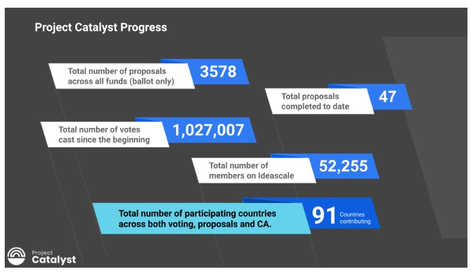

# Project Catalyst - Một chu trình phát triển hệ sinh thái Cardano chuẩn

### **Project Catalyst là phương pháp đổi mới mạnh mẽ của Cardano và là một trong những quỹ đổi mới phi tập trung lớn nhất trên thế giới. Nó là hình mẫu cho sự phát triển và đổi mới hệ sinh thái, được dẫn dắt bởi cộng đồng Cardano**

 10 tháng 5 năm 2022  [Tim Richmond](/en/blog/authors/tim-richmond/page-1/)  4 phút đọc

### [**Tim Richmond**](/en/blog/authors/tim-richmond/page-1/)

Giám đốc Tiếp thị và Truyền thông

Tiếp thị &amp; Truyền thông

- 
- 

Project Catalyst hướng đến mục tiêu xây dựng các hệ thống cho phép blockchain Cardano tự duy trì hoạt động bằng cách tạo ra một hệ sinh thái tăng trưởng và phát triển. Trọng tâm của vấn đề này là ý tưởng quản trị phi tập trung, theo đó cộng đồng Cardano lựa chọn các ý tưởng được đề xuất và ưu tiên để cấp vốn, tạo thành một chu kỳ tăng trưởng bền vững và minh bạch.

Project Catalyst được tổ chức ba tháng một lần, thu hút nhiều dự án về lĩnh vực kỹ thuật, kinh doanh, sáng tạo và các dự án tập trung vào cộng đồng - được tài trợ để triển khai các ý tưởng đề xuất của họ đã được cộng đồng Cardano / Catalyst bình chọn.

Với mỗi vòng tài trợ, cộng đồng đưa ra những thách thức cho các dự án liên quan đến Cardano. Những thách thức này sau đó được phản hồi từ cộng đồng những người đề xuất đưa ra các giải pháp và kế hoạch thực hiện rõ ràng. Cộng đồng bình chọn các đề xuất và lựa chọn các dự án để nhận tài trợ.

Catalyst giúp mọi người tìm và thực hiện những ý tưởng tuyệt vời, nhưng tài trợ chỉ là một phần của hành trình hướng tới thành công. Các yếu tố khác, bao gồm giáo dục, cố vấn, hợp tác và  lộ trình phát triển sản phẩm cũng cần thiết để nuôi dưỡng các dự án và giúp họ chính thức hóa kế hoạch kinh doanh và chiến lược tiếp cận thị trường hiệu quả.

Tái đầu tư các khoản phí thu được từ các giao dịch ada vào việc phát triển các dự án có tác động tích cực đến cả việc ứng dụng Cardano và mở rộng trên thế giới, đồng thời thưởng cho những người tham gia, xây dựng và duy trì hệ sinh thái, do đó thúc đẩy động lực và hỗ trợ trở lại tính bền vững tổng thể của blockchain.

## **Phát triển**

Nghiên cứu là một quá trình học hỏi và khám phá những gì có thể thực hiện và thúc đẩy sự tiến bộ. Project Catalyst khuyến khích mọi người thử nghiệm và tận dụng tối đa tính chất cộng tác và lặp đi lặp lại của dự án, phản hồi và xem xét các ý tưởng được trình bày.

Đến nay, Catalyst đã phát triển từ quy mô 250 nghìn đô la trong quỹ 1 lên hơn 16 triệu đô la trong quỹ 8, phá vỡ tất cả các kỷ lục tham gia trước đó cộng lại. Trên tất cả các quỹ cho đến nay, Catalyst đã nhận và xử lý hơn 3,5 nghìn đề xuất và bỏ ra hơn 1 triệu phiếu bầu. Cộng đồng Catalyst đang hoạt động có hơn 52 nghìn thành viên trên 91 quốc gia!

Tại thời điểm viết bài, có tổng cộng 60 dự án do Catalyst tài trợ đang hoạt động trong hệ sinh thái Cardano. Con số này tăng lên hàng tuần.

Bạn có thể theo dõi tiến độ của từng quỹ và các dự án đã được cấp vốn [tại đây](https://bit.ly/FundedProjectsReporting) .

Vượt qua giới hạn và học hỏi từ những gì làm được hoặc không làm được là chìa khóa cho nền tảng của cả kiến thức và thành công.

Một văn hóa hòa nhập và chấp nhận những ý tưởng, khái niệm mới có thể trái ngược với ý kiến của mỗi người là rất quan trọng đối với sự thành công của dự án, nơi mà tinh thần cộng đồng, sự đổi mới, tôn trọng và cộng tác được đặt lên hàng đầu.

'Nhiều người thất bại trong cuộc sống là những người đã không nhận ra rằng họ đã đến gần với thành công như thế nào khi họ đã từ bỏ. Tôi chưa thất bại. Đơn giản là tôi đã tìm ra 10,000 cách làm không đúng thôi. ' - Thomas Edison

## **Dân chủ và Minh bạch phi tập trung**

Project Catalyst nhằm mục đích dân chủ hóa việc ra quyết định bằng cách cho phép cộng đồng Cardano bỏ phiếu cho cả những thách thức mà họ mong muốn được giải quyết và các đề xuất giải quyết thách thức này.

Cộng đồng Cardano vẫn là trung tâm của dự án, cho phép họ định hướng chung và quyết định hướng tương lai của cả sự phát triển blockchain và tăng trưởng hệ sinh thái - cho phép mọi người từ bất cứ đâu trình bày ý tưởng của họ đồng thời cung cấp phương tiện để hiện thực hóa các ý tưởng này.

Quản trị là một vấn đề then chốt, không chỉ trong bối cảnh của blockchain mà còn trên thế giới. Đây là một cơ hội tuyệt vời để tìm hiểu những gì đã hoạt động tốt hoặc chưa tốt và đề xuất xây dựng một quy trình ra quyết định phi tập trung tránh được các bất cập của các hệ thống chính phủ tập trung truyền thống.

Một khía cạnh quan trọng để thúc đẩy sự tin tưởng và tính toàn vẹn của Project Catalyst là tính minh bạch. Khuyến khích sự cởi mở giữa cộng đồng để đẩy nhanh hơn nữa sự hợp tác về ý tưởng của họ.

Tất cả kết quả và dữ liệu liên quan đến các vòng tài trợ đều được công bố [tại đây](https://docs.google.com/spreadsheets/d/1bfnWFa94Y7Zj0G7dtpo9W1nAYGovJbswipxiHT4UE3g/edit#gid=938310766), cùng với bảng phân tích chi tiết về các phiếu bầu và tiền tài trợ. Hàng tuần có các buổi họp cho toàn bộ cộng đồng, nơi các kế hoạch được truyền đạt để cho phép những người nắm giữ ada nói lên ý kiến của họ và đưa ra giải pháp cho bất kỳ trở ngại nào được xác định. Mọi ý kiến đóng góp đều được lắng nghe và cân nhắc.

## **Làm thế nào để tham gia?**

Có nhiều cách để tham gia với Project Catalyst. Là một người sáng tạo, người bình chọn, người bình luận, người đề xuất, người đánh giá đề xuất, cố vấn cộng đồng hoặc thậm chí là người cố vấn riêng. Bước đầu tiên là [tạo một tài khoản](https://cardano.ideascale.com/) trên nền tảng cộng tác Catalyst, Ideascale. Một cách khác là tham gia cộng đồng Project Catalyst vào Thứ Tư hàng tuần tại TownHall, được phát trực tiếp trên [Kênh YouTube](https://www.youtube.com/playlist?list=PLnPTB0CuBOByRhpTUdALq4J89m_h7QqLk) của Project Catalyst. Nếu bạn có ý tưởng hoặc chỉ tò mò muốn khám phá những gì đang diễn ra trong "trái tim" của Cardano, hãy tham gia TownHall và trở thành một phần của cộng đồng Project Catalyst.

Để tìm hiểu thêm về [Project Catalyst](https://iohk.io/en/blog/posts/2021/02/12/our-million-dollar-baby-project-catalyst) hoặc tham gia và trả lời các thử thách do những người khác đăng thông qua Project Catalyst, vui lòng đăng ký vào [danh sách gửi thư](https://bit.ly/3dSZJvx) Catalyst và tham gia cộng đồng [Discord](https://discord.gg/2RnUtK8) và [Telegram](https://t.me/cardanocatalyst) .

Bài này được dịch bởi LinhPool [với bài gốc](https://iohk.io/en/blog/posts/2022/05/10/project-catalyst-a-virtuous-cycle-of-cardano-ecosystem-development-investing-in-great-ideas-to-make-positive-real-world-changes/)

*Dự án này được tài trợ bởi Catalyst*
