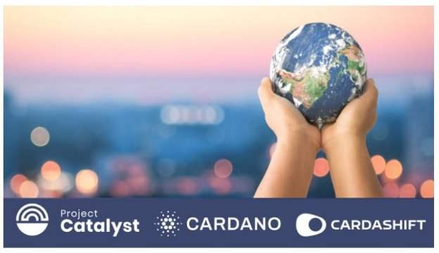
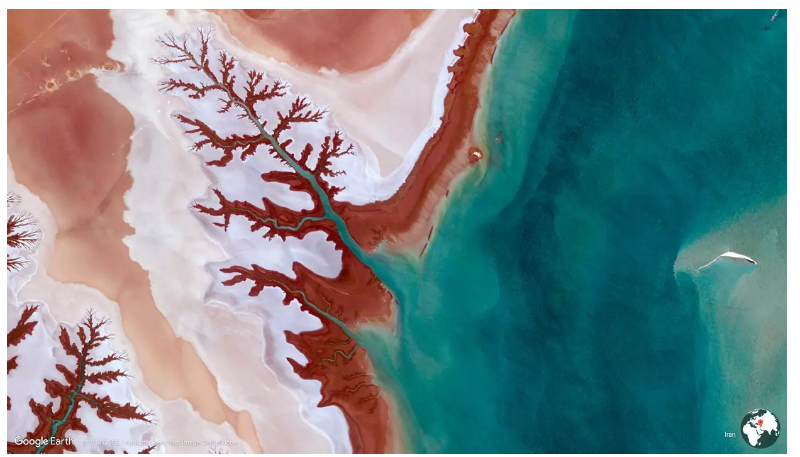

# Fund9 Catalyst Natives Cardashift challenge: demonstrating and monetizing impact
### **Project Catalyst announces Fund9’s Catalyst Natives challenge ‘Demonstrating and monetizing impact’ in conjunction with Cardashift, and a chance to fund up to $200k worth of projects using $CLAP tokens**
 1 June 2022[ Tim Richmond](tmp//en/blog/authors/tim-richmond/page-1/) 5 mins read

### [**Tim Richmond**](tmp//en/blog/authors/tim-richmond/page-1/)
Marketing and Communications Manager

Marketing & Communications

- 
- 

Input Output Global (IOG) is delighted to announce that [Cardashift](https://cardashift.com) will be joining [Fund9](https://bit.ly/Fund9-Launch-Guide) through the [Catalyst Natives](https://iohk.io/en/blog/posts/2021/11/10/introducing-catalyst-natives-how-any-business-can-leverage-the-cardano-innovation-engine) program, with a challenge centered around value creation through positive impact-oriented projects. Cardashift offers up to $200k of $CLAP tokens for selected proposals. This is on top of 12 other challenges in Fund9 where 16m ada is available for funded proposals and community incentives for contributions during the process, 
## **Catalyst Natives**
During Fund7, IOG introduced the pilot [Catalyst Natives program](https://iohk.io/en/blog/posts/2021/11/10/introducing-catalyst-natives-how-any-business-can-leverage-the-cardano-innovation-engine), enabling organizations outside of the Cardano/Catalyst ecosystem to present challenges and offer incentives and rewards to those who meet the challenge with their proposed innovations. 

Catalyst Natives is a fantastic proposition for organizations of all shapes and sizes to access a veritable trove of ideas and those with the skills to realize them. 

Cardashift aims to empower people to build a sustainable world through the Cardano protocol and help start-ups to monetize the impact they generate. To learn more about why Cardashift chose to build on the Cardano blockchain [click here](https://cardashift.medium.com/the-3-reasons-why-we-choose-cardano-to-maximize-our-impact-28b2e914e894).

Cardashift enables and supports changemakers through its ecosystem of products and services and a community-run [launchpad](https://cardashift.com/launchpad) designed to fund and accelerate impact projects. The [$CLAP token](https://cardashift.com/tokenomics) underpins the Cardashift project. Watch Cardashift's ‘[Batch Genesis Demo Day](https://youtu.be/nSt465KIT_I)’.

Cardashift’s focus on providing a foundation of growth for projects with positive, real-world impact aligns with Project Catalyst’s ethos and mission.
## **The Cardashift Challenge - Demonstrating and monetizing impact**
“Today, there is a gap between the value created for society by impact projects and the financial value they capture. Blockchain technology, and especially Cardano protocol, can be a gamechanger on this worldwide mission by bringing three key elements to the infrastructure: tokenization of non-financial value, traceability, and liquid marketplaces” **Yannis Baala, Project Sourcing Lead @Cardashift.**

This challenge combines several themes. Monetizing impact requires the development of an entire ecosystem:

- Actors capable of defining criteria (standard) on what impact means across different contexts (education, carbon cycle, biodiversity, etc.) and geographical locations.
- Services and methods to issue impact credentials in a decentralized way with a peer-to-peer and expert review process
- Certification bodies for analyzing and validating the data points provided by impact-oriented projects
- Mechanisms to give a financial value to impact - reflections on tokenizing impact
- On-chain tools for recording impact proofs and bringing more transparency and traceability
- On-chain marketplaces to connect impact-oriented projects with potential buyers (corporations, states organizations, funds, etc.) for their impact proofs These development paths are interconnected and the research can mix blockchain and non-blockchain approaches.
## **Defining success**
Cardashift’s ambition is to tackle one of the pain points of the impact ecosystem: the lack of financial attractiveness of impact projects. So, they are focusing on impact-oriented solutions and not projects that prioritize only Environmental, Social, and [Governance (ESG) Criteria](https://www.investopedia.com/terms/e/environmental-social-and-governance-esg-criteria.asp#:~:text=Environmental%2C%20social%2C%20and%20governance%20\(ESG\)%20criteria%20are%20a,addressing%20climate%20change%2C%20for%20example.). 

Success for this challenge involves:

- Discovering innovative ways for impact-oriented projects to create financial value from their impact generation, notably by issuing impact tokens. 
- Increasing transparency and traceability of the impact generated by a specific project. 

Other protocols explore the idea of leveraging blockchain technology to build a sustainable world. The most famous example is the [IXO protocol](https://www.ixo.world/protocols), whose Impact Tokens aim to represent real-world outcomes.

The tokenization of verified results through the IXO protocol transforms traditional certificate-based representations of results (e.g., carbon reduction certificates, education certificates, vaccination certificates, biodiversity certificates, or any other certified outcome state) into tradable and investable digital assets. 

However, impact tokenization is still nascent, and the question remains open: What kind of tools, interacting on and off-chain, can we develop to measure and value impact financially?
## **The key metric to measure**
**For impact valuation & monetization projects:**

- Number of proof of concept trials that can run with impact-oriented projects
- Time required to validate the impact value 
- How much financial value can be delivered from impact-oriented projects 
- Scientific robustness of the validation process (e.g. inclusion of expert reviews)

**For any marketplace projects:**
## **During the challenge:**
- Robustness of the revenue model for the marketplace (check with comparables, think it at scale, etc.)
- Design of the transactions system on the platform
- For the longer term
- Number of token issuers and interested buyers on the platform
- Number of transactions made on the platform
## **How to take part in this challenge**
To answer the Cardashift challenge and potentially earn up to $200k worth of $CLAP tokens, please review the [Fund9 Launch Guide](https://bit.ly/Fund9-Launch-Guide), where you will learn more about how to create an [account on the Catalyst collaboration platform](https://cardano.ideascale.com/), Ideascale, along with how to take part in this and all other Fund9 Challenges.
## **Project Catalyst**
[Project Catalyst](https://iohk.io/en/blog/posts/2021/02/12/our-million-dollar-baby-project-catalyst) is Cardano’s turbo-charged innovation engine and one of the world's most decentralized innovation funds. It is a focal point for ecosystem development and innovation, driven by the Cardano community.

Every quarter, Project Catalyst produces a fresh pipeline of technical, business, creative, and community-focused projects - funded to deliver their proposed ideas voted for by the Cardano and Catalyst community.

With [each funding round](https://docs.google.com/spreadsheets/d/1bfnWFa94Y7Zj0G7dtpo9W1nAYGovJbswipxiHT4UE3g/edit#gid=938310766), the community presents challenges across various Cardano-related projects. The community then answers these challenges and offers clearly-defined solutions. The community votes on the proposals and selects projects to receive funding.
## **Find out more about Project Catalyst and the Natives Program**
To learn more about Project Catalyst, please subscribe to the [Catalyst mailing list](https://bit.ly/3dSZJvx) and join the [Discord](https://discord.gg/2RnUtK8) and [Telegram](https://t.me/cardanocatalyst) communities. You may also wish to join the Project Catalyst community every Wednesday at the TownHall, live-streamed on the Project Catalyst [YouTube Channel](https://www.youtube.com/playlist?list=PLnPTB0CuBOByRhpTUdALq4J89m_h7QqLk). 

Are you interested in becoming the next Catalyst Native pilot? Do you have a specific business problem and would like to participate in the next Catalyst Natives pilot? Please [apply here](https://forms.gle/BA8LmtrAWWmHHcY59) and take the next steps toward accessing untapped potential.
