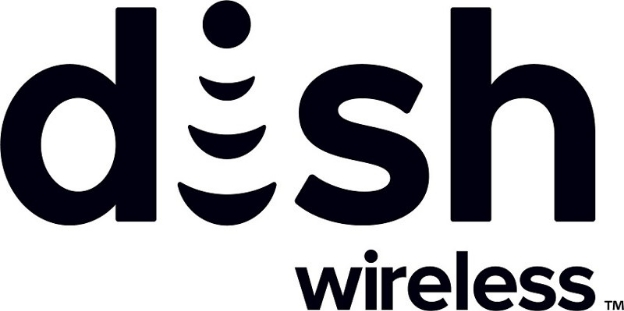

# DISH ra mắt hệ thống nhận dạng phi tập trung và đồng coin cho khách hàng thân thiết được xây dựng trên công nghệ của IOG

### **Sáng kiến này là một phần của sự hợp tác lâu dài giữa DISH và IOG để tạo ra các giải pháp blockchain sáng tạo nhằm thúc đẩy việc áp dụng các công nghệ phi tập trung vào hệ sinh thái DISH**

 7 tháng 6 năm 2022  [Fernando Sanchez](/en/blog/authors/fernando-sanchez/page-1/)  4 phút đọc

### [**Fernando Sanchez**](/en/blog/authors/fernando-sanchez/page-1/)

Technical Writer

Tiếp thị và Truyền thông

- 
- 

Tập đoàn DISH đã thực hiện bước đầu tiên hướng tới việc ra mắt hệ thống nhận dạng phi tập trung và đồng coin cho khách hàng thân thiết được xây dựng trên công nghệ blockchain được thiết kế và phát triển bởi Input Output Global (IOG). Bước đầu tiên này cho phép các khả năng blockchain trong cơ sở hạ tầng của DISH thông qua các dịch vụ nhận dạng của Atala PRISM và các tính năng tài sản gốc của Cardano.

Mục tiêu cuối cùng của sự hợp tác này là tạo ra một nền tảng kỹ thuật số mạnh mẽ đầy đủ và xây dựng trước tiên trên chuỗi khối Cardano khuôn mẫu nhận dạng phi tập trung và khách hàng thân thiết.

DISH là một công ty truyền hình vệ tinh có trụ sở chính tại Colorado, Hoa Kỳ. Trong Hội nghị thượng đỉnh Cardano năm 2021, [Giám đốc điều hành của IOG Charles Hoskinson](https://youtu.be/MPobkiSbx5M)  đã thông báo rằng cả hai công ty sẽ hợp tác để tạo ra các giải pháp blockchain mới nhằm thúc đẩy việc áp dụng công nghệ sổ cái phi tập trung.

MVP (sản phẩm khả dụng) này là một phần của dự án CRONUS, một sự hợp tác lâu dài, sáng tạo giữa IOG và DISH để biến blockchain trở thành một phần cốt lõi của hệ sinh thái DISH và chiến lược tiêu dùng tổng thể của nó trong tương lai.

## **CRONUS MVP hoạt động như thế nào?**

MVP (sản phẩm khả dụng) đại diện cho sự khởi đầu của hành trình hướng tới việc tạo ra một hệ thống khách hàng thân thiết dựa trên mã thông báo được hỗ trợ bởi công nghệ blockchain. Bước đầu tiên trong hành trình đó là cho phép đúc mã thông báo khách hàng thân thiết trên chuỗi khối Cardano để nhân đôi số dư đồng tiền trung thành trong chương trình khách hàng thân thiết BoostOne của DISH.

Cardano theo dõi số dư của các đồng loyalty coin hoặc Boostcoin mà khách hàng tích lũy được và đúc hoặc đốt các mã thông báo khách hàng thân thiết tương ứng. Số dư mã thông báo khách hàng thân thiết được điều chỉnh trong một hoạt động hàng đêm, sử dụng ví do DISH kiểm soát. IOG sẽ không có quyền truy cập vào ví này. Để tránh đưa vào bất kỳ thông tin nhận dạng cá nhân nào của khách hàng, MVP tận dụng thư viện Atala SDK để tạo mã nhận dạng phi tập trung (DID) chưa được xuất bản.

## **Các khả năng của MVP cốt lõi**

Khi ra mắt, MVP sẽ cung cấp các khả năng sau:

- Dữ liệu sổ cái khách hàng thân thiết theo dõi Boostcoins và hiển thị số lượng mã thông báo khách hàng thân thiết cần được đúc/đốt để số dư mã thông báo khớp với số dư đồng loyalty coin.
- API để đúc và kiểm soát token trên mạng chính Cardano.
- Cardano mainnet là nơi token khách hàng thân thiết được đúc và đốt theo dữ liệu được cung cấp bởi cơ sở dữ liệu sổ cái khách hàng thân thiết.
- Ví tổ chức DISH chứa tất cả các Boostcoins. Ví thực hiện các giao dịch đúc và đốt trong quá trình cập nhật hàng đêm.
- Tạo DID chưa được xuất bản cho từng khách hàng. DID này được ánh xạ trong khách hàng tổng thể, nằm bên ngoài MVP. DID được tạo bằng thư viện Atala SDK nhưng không được xuất bản trên chuỗi khối Cardano.

MVP bao gồm hai API:

1. API để đúc và kiểm soát các tokens trên chuỗi khối mainnet của Cardano

- Đúc/Đốt token khách hàng thân thiết
- Truy vấn tổng số mã thông báo đang lưu hành

1. API cho cơ sở dữ liệu sổ cái khách hàng thân thiết

- Thêm đồng loyalty coin vào tài khoản của khách hàng
- Khấu trừ đồng loyalty coin từ tài khoản của khách hàng
- Truy vấn số dư đồng loyalty coin và giao dịch của từng khách hàng

MVP này đại diện cho bước đầu tiên trong hành trình áp dụng blockchain lớn hơn. Bước đầu tiên này là về **kích hoạt blockchain** . DISH sẽ trở thành người tham gia vào Hệ sinh thái Cardano bằng cách chạy các nút khác nhau, phát hành DID, khai thác và đốt các tài sản gốc. Giai đoạn tiếp theo sẽ liên quan đến **việc áp dụng blockchain** , nơi người dùng DISH sẽ được giới thiệu từ từ về các khía cạnh khác nhau của hệ sinh thái blockchain. Bao gồm nhưng không giới hạn khi có ví.

## **MVP: câu chuyện của người dùng**

CRONUS MVP mở ra một loạt cơ hội, cho cả chính DISH và cho đối tác phát triển của nó, IOG. Nhưng cuối cùng, cơ sở khách hàng DISH sẽ nhận được lợi ích lớn nhất. Ví dụ, MVP cho phép người dùng ứng dụng BoostOne xem tổng số dư và giao dịch đồng loyalty coin của họ.

MVP cũng cho phép kiểm soát tốt hơn cho các quản trị viên BoostOne phụ trợ, vì họ có thể:

- Thêm hoặc xóa đồng coin trung thành khỏi tài khoản của người dùng ứng dụng BoostOne nếu cần.
- Đúc hoặc đốt mã thông báo trên Cardano Mainnet nếu cần để cung cấp cho khách hàng của BoostOne số đồng loyalty coin mà họ đã kiếm được.
- Có quyền kiểm soát duy nhất đối với ví token khách hàng thân thiết của Dish vì khách hàng không thể tương tác trực tiếp với token khách hàng thân thiết.
- Tham chiếu DID chưa được xuất bản để xác định khách hàng được liên kết với tài khoản loyalty coin

## **Lời cuối**

MVP tiên phong này thể hiện một bước tiến quan trọng đối với việc tích hợp các hệ thống hỗ trợ blockchain vào hệ sinh thái viễn thông và đặc biệt để tạo ra các chương trình khách hàng thân thiết được cung cấp bởi các sổ cái phi tập trung.

**Bài này được dịch bởi LinhPool với [nguồn tại đây]( https://iohk.io/en/blog/posts/2022/06/07/dish-launches-decentralized-identification-and-loyalty-coin-system-built-on-input-output-global-iog-technology/ )

**Dự án này được tài trợ bới Catalyst**
