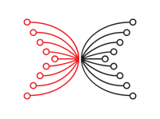

# Trang Tài liệu Cộng đồng về Plutus: một trang tài liệu mới được xây dựng bởi cộng đồng các nhà phát triển, dành cho các nhà phát triển

### **Khi Plutus ngày càng phát triển, một trang web tài liệu vận hành bởi cộng đồng mới sẽ cung cấp nguồn tài liệu có quý giá từ các nhà phát triển dự án trên Cardano**

 8 tháng 6 năm 2022  [Ignacio Calderon de la Barca](/en/blog/authors/gonzalo-ignacio-calderon-de-la-barca-rodo/page-1/)  4 phút đọc

### [**Ignacio Calderon de la Barca**](/en/blog/authors/gonzalo-ignacio-calderon-de-la-barca-rodo/page-1/)

Quản lý cộng đồng kỹ thuật - Plutus

Truyền thông và tiếp thị

- 
- 
- 
- 

Input Output Global (IOG) tìm cách thúc đẩy sự phát triển của mã nguồn mở và do cộng đồng vận hành. Cộng đồng làm phong phú thêm mã nguồn mở này sẽ là nền tảng cho việc ứng dụng công nghệ thành công.

Tương tự như vậy, giá trị của các nguồn lực do cộng đồng - tài liệu, công cụ, v.v. - không thể bị đánh giá thấp. Không một đội ngũ đơn lẻ nào có thể so sánh được với hàng nghìn bộ não từ cộng đồng. Nội dung, tài liệu tốt nhất và có tính phù hợp hơn thường sẽ xuất phát từ những người tạo ra giá trị cho hệ sinh thái.

Blockchain Cardano có danh sách ngày càng tăng các tài nguyên nội dung cộng đồng, được quản lý và tuyển chọn bởi nhiều người tham gia. Kênh Cardano Community Discord đóng vai trò là đầu mối cho cộng đồng nhà phát triển. [Cardano Stack Exchange](https://cardano.stackexchange.com/) tiến một bước xa hơn, được vận hành bởi các thành viên trong cộng đồng với sự đóng góp của một số thành viên trong đội ngũ IOG. [Essential Cardano](https://www.essentialcardano.io/) (hiện đang ở phiên bản beta công khai), cung cấp một nền tảng được quản lý cho nội dung cộng đồng, được hỗ trợ bởi một kho lưu trữ dữ liệu GitHub mở. [Cổng thông tin dành cho nhà phát triển của Cardano Foundation](https://developers.cardano.org/) là một nơi khởi đầu khác để có thể tiếp cận được nhiều nguồn tài nguyên.

[Plutus Community Docs (PCD)](https://plutus-community.readthedocs.io/en/latest/) là phần bổ sung mới nhất cho một danh sách ngày càng gia tăng các nền tảng lấy cộng đồng làm trung tâm, tạo dựng bởi cộng đồng và cho cộng đồng, đáp ứng cho các nhu cầu ngày càng tăng về các nội dung kỹ thuật chi tiết..

PCD sẽ trở thành trung tâm thúc đẩy sự phát triển mã nguồn và thu thập tài liệu có giá trị dành cho nhà phát triển, từ việc thiết lập môi trường đến phát triển ứng dụng phi tập trung, đến các phương pháp thực tiễn tối ưu nhất nhất và các công cụ mã nguồn mở cho cộng đồng.

## **Liên tục đối chiếu nội dung kỹ thuật của Cardano**

Hiện tại có rất nhiều tài liệu liên quan đến Plutus.

Ví dụ: có các kênh YouTube liên quan đến Plutus và hàng trăm kho lưu trữ GitHub do cộng đồng tạo và duy trì.

Đặc điểm thiết kế của Cardano và niềm đam mê của cộng đồng cho phép tập trung mạnh mẽ vào việc xây dựng các giải pháp an toàn cho các tiện ích trong thế giới thực.

Các ngôn ngữ lập trình mới yêu cầu hỗ trợ thông qua tài liệu, chương trình đào tạo, hướng dẫn sử dụng và một cộng đồng các chuyên gia và cố vấn dẫn dắt việc học trên toàn cộng đồng. Đây là một xu hướng đang phát triển kể từ nhóm học tập đầu tiên của Chương trình Plutus Pioneers (chú thích của dịch giả: Plustus Pioneers là chương trình đào tạo dành ngôn ngữ lập trình Plutus). Các sinh viên đã đứng lên và mang theo lá cờ tiên phong với các thành viên nhiệt tình chia sẻ các giải pháp của họ dưới dạng hướng dẫn và các cuộc trò chuyện 1-1 trên Discord.

Do đó, cộng đồng hiện có một danh sách ngày càng nhiều các ghi chú và hướng dẫn hữu ích để học hỏi. IOG đã giúp cộng đồng tổ chức và tập hợp tất cả các nguồn lực này vào một nơi trung tâm. Ở cấp độ cao, trong trang web bạn có thể tìm thấy:

- Thiết lập môi trường - bao gồm các hướng dẫn để chuẩn bị sẵn sàng cho môi trường của bạn, bao gồm các lựa chọn thay thế khác nhau cho các hệ điều hành khác nhau sử dụng Nix.
- Tài liệu về Plutus Pioneer - Hướng dẫn chi tiết để theo dõi các bài giảng của Plutus Pioneer cộng với các giải pháp cho bài tập về nhà.
- Tài liệu của Marlowe Pioneer - sắp ra mắt

## **Lợi ích của Tài liệu cộng đồng Plutus**

Các lợi ích đáng chú ý khác của PCD so với tài liệu chính thức bao gồm:

- **Cập nhật nhanh**: Trang web có thể được cập nhật nhanh và thường xuyên, cho phép phản hồi nhanh và xoay quanh các bản cập nhật ..
- **Nội dung đa dạng**: PCD có thể truy cập vào tất cả các công cụ xây dựng dự án trên Cardano và nó chứa nội dung mới nhất về các phương pháp thực tiễn tối ưu nhất cho sự phát triển.
- **Trở thành cộng tác viên tài liệu và tạo được danh tiếng**: Những đóng góp thường xuyên và quan trọng có thể giúp bạn được mời trở thành cộng tác viên. Điều này mang lại cho bạn danh tiếng trong cộng đồng, một thẻ Discord đặc biệt (Người đóng góp tài liệu cộng đồng) và khả năng thúc đẩy sự phát triển mã nguồn mở.

## **Cơ chế đóng góp**

Khía cạnh quan trọng nhất đối với thành công của sự cộng tác phi tập trung là các cơ chế được thiết lập để đóng góp. Điều này được tóm tắt dưới đây và đề cập đến những ý tưởng quan trọng nhất. Để có mô tả chi tiết hơn về cách đóng góp, hãy tham khảo [hướng dẫn của chúng tôi](https://github.com/input-output-hk/plutus-community/blob/main/CONTRIBUTING.md) .

Vui lòng xác định xem có điều gì bị thiếu trong trang web Tài liệu cộng đồng Plutus mà bạn muốn thêm hoặc cập nhật.

Hãy đọc kỹ trang web và tài liệu có sẵn vì việc xem xét các bài viết này cần thời gian và nỗ lực đáng kể từ các cộng tác viên và người bảo trì trang web.

## **PCD phát triển với mọi đóng góp**

Tất cả các nhà phát triển có thể mong đợi nhiều nội dung hơn trên PCD về Plutus và Marlowe, bao gồm các công cụ mới và hướng dẫn tiêu chuẩn ngành mới để bứt phá trong quá trình phát triển. Nhưng điều này chỉ có thể thực hiện được thông qua sự cộng tác của cộng đồng, do đó bạn được mời [đóng góp](https://github.com/input-output-hk/plutus-community) . IOG sẽ giúp đỡ trong việc tổ chức các thử thách để phổ biến trang web vì lợi ích lớn nhất của cộng đồng Cardano.

***Tôi muốn gửi lời cảm ơn sâu sắc tới tất cả những người tạo tài liệu từ:***

- Nhóm học Plutus Pioneer đầu tiên và thứ hai: [NStankov # 3321](https://github.com/nstankov-bg) , [Rik G # 8569](https://github.com/rikgirbes) , [zarej # 3886](https://github.com/zarej) và [matthias BNR # 0450](https://github.com/mputz86)
- IOG: [dino # 0980](https://github.com/dino-) , [Igodlab # 3499](https://github.com/Igodlab) và [Larry Adames](https://github.com/ladamesny)
- Cộng tác viên của Tài liệu cộng đồng: [Strange3s # 2671](https://github.com/grzegorznowak) , [SIDAN] # 3725, [Deceptikon # 9964](https://github.com/FELIS-CORP) , [ingelran # 8323](https://github.com/bbauer02) , jhampac # 0690, [blackFlyingShark # 4644](http://github.com/thishermit/) , [carleryd # 0762](https://github.com/carleryd) , [R2 # 3029](https://github.com/Roslon) , [selipso # 3964](https://github.com/selipso) , [pgwada # 0227](https://github.com/armada-alliance/armada-alliance) , [stake_pool # 2988](https://github.com/stake-pool) , [WoofPool # 8486](https://github.com/extramileit) , và cảm ơn đặc biệt vì đã nỗ lực nhiều hơn tới [Totes # 5706](https://github.com/Totes5706) và [jmhoms # 7394](https://github.com/jmhoms)
- Bài này được dịch bởi LinhPool [với nguồn tại đây](https://iohk.io/en/blog/posts/2022/06/08/plutus-community-docs-a-new-documentation-site-for-devs-by-devs/)
- *Dự án này được tài trợ bởi Catalyst*
