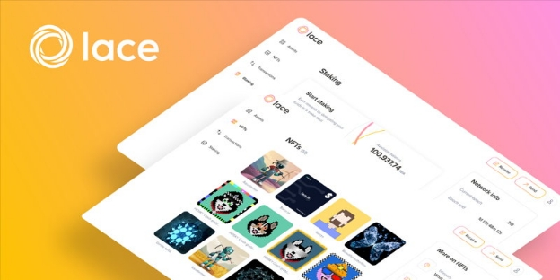

# Lace: tốc độ, đơn giản và thông suốt

### **Ví nhẹ mới của IOG - hiện đang trong quá trình phát triển - sẽ giúp thúc đẩy việc áp dụng bằng cách cung cấp khả năng nâng cao và dễ sử dụng cho người dùng tiền mã hóa**

 Ngày 10 tháng 6 năm 2022[ Olga Hryniuk](/en/blog/authors/olga-hryniuk/page-1/) 3 phút đọc

### [**Olga Hryniuk**](/en/blog/authors/olga-hryniuk/page-1/)

Technical Writer

Marketing &amp; Communications

- 
- 

Ví cho phép người dùng tiền mã hóa lưu trữ và truy cập tài sản kỹ thuật số của họ một cách an toàn. Chúng có nhiều dạng khác nhau, từ các ứng dụng dành cho máy tính để bàn và di động đến các thiết bị phần cứng (giống USB).

Ví [Daedalus](https://daedaluswallet.io/) là node đầy đủ của IOG, và nó là một ứng dụng chạy trên máy tính để bàn, nó đồng bộ hoàn toàn dữ liệu của Blockchain. Mặc dù ví đầy đủ này là sự lựa chọn tốt cho nhiều người dùng hiểu biết về công nghệ, nhưng những loại ví như thế này tiêu tốn một lượng tài nguyên đáng kể và mất nhiều thời gian hơn để đồng bộ hóa vì nó là một bản sao đầy đủ của blockchain. Vì vậy, ví đầy đủ có thể không phù hợp với những người dùng muốn truy cập nhanh vào tài sản của họ. Khi Cardano tiếp cận nhiều người dùng chính thống hơn - và các thị trường đang phát triển - một giải pháp thay thế sẽ cần thiết.

Để đơn giản hóa trải nghiệm cho người sử dụng ví, IOG đang phát triển Lace - một 'cửa hàng duy nhất' cho tất cả các hoạt động của blockchain. Nền tảng mới này sẽ có nhiều tính năng, nhưng nhẹ, giúp sắp xếp hợp lý tài chính trực tuyến. Hoạt động như một cổng thông tin cho Web3.0, Lace sẽ bao gồm các yếu tố phi tập trung thật sự. Điều này có nghĩa là người dùng sẽ có thể tương tác với những người dùng và tổ chức khác một cách ngang hàng, trao đổi dữ liệu và tài sản mà không cần phụ thuộc vào bên thứ ba.

## **Thông tin về Lace**

Để phổ cập rộng rãi hơn thì phải tạo ra một trải nghiệm người dùng tốt hơn. Đó là lý do tại sao IOG thu thập phản hồi của người dùng từ rất sớm trong quá trình phát triển và xây dựng Lace cùng với các yêu cầu về tốc độ, sự đơn giản và thông suốt.

Được thiết kế để phục vụ cho nhiều loại người dùng quan tâm đến việc tận dụng cơ sở hạ tầng của Cardano để tối ưu hóa trải nghiệm ví của họ, Lace sẽ cho phép mọi người trở thành một phần của không gian tiền mã hóa. Ví nhẹ sẽ cung cấp chức năng và bảo mật một cách vượt trội. Vì vậy, cho dù bạn là một người dùng hiểu biết về tiền mã hóa, một người đam mê, một người nắm giữ ada hay một người mới, Lace 1.0 sẽ cung cấp trải nghiệm thân thiện và trực quan để:

- Lưu trữ tiền của bạn một cách an toàn
- Giao dịch và thanh toán
- Lưu trữ và xem các token không thể thay thế (NFTs) của bạn
- Ủy quyền cổ phần
- Tương tác với các DApp khác nhau.

Trong các phiên bản sắp tới, Lace có kế hoạch hỗ trợ nhận dạng và bỏ phiếu trên Cardano - các trụ cột chính để đảm bảo việc bảo vệ dữ liệu cá nhân an toàn theo cách phi tập trung.

Theo thời gian, Lace cũng có ý định sử dụng các sản phẩm Cardano khác nhau để kết hợp một loạt các tính năng gắn liền với trải nghiệm của người dùng. Điều này sẽ bao gồm tích hợp với [Atala PRISM](https://atalaprism.io/) để quản lý danh tính và dữ liệu cá nhân, cùng với [Project Catalyst](https://projectcatalyst.org/) để dễ dàng đăng ký và bỏ phiếu. Các cải tiến khác trong tương lai cũng có thể bao gồm việc tích hợp với EVM sidechains (cho phép các nhà phát triển Ethereum dễ dàng khai thác cơ sở hạ tầng mạnh mẽ và an toàn đáng tin cậy của Cardano) và Hydra - để xử lý giao dịch có thể mở rộng và tiết kiệm chi phí.

Ban đầu, ví nhẹ được xây dựng cho Blockchain Cardano, mục tiêu dài hạn là biến nó trở thành giải pháp dành cho blockchain nói chung. Khả năng tương tác là chìa khóa để đảm bảo việc áp dụng blockchain rộng rãi và do đó Lace có kế hoạch phát triển để hỗ trợ nhiều blockchain khác cùng với nhiều loại tiền mã hóa khác nhau.

## **Cùng tham gia**

Chúng tôi vui mừng thông báo rằng Lace sẽ sớm ra mắt phiên bản beta giới hạn cho một số người dùng để kiểm tra sản phẩm. Như mọi khi, sự tham gia của cộng đồng là chìa khóa để đánh giá chức năng của ví.

Bạn muốn tìm hiểu thêm? Hãy thể hiện quan tâm của bạn tại [www.lace.io](https://hubs.li/Q01d2q6h0) và tìm hiểu khi nào Lace 1.0 ra mắt.

Bài này được dịch bởi Lê Nguyên.Bài vnguồn [tại đây](https://iohk.io/en/blog/posts/2022/06/10/lace-speed-simplicity-and-seamless-flow/)

*Dự án này được tài trợ bới Catalyst*
