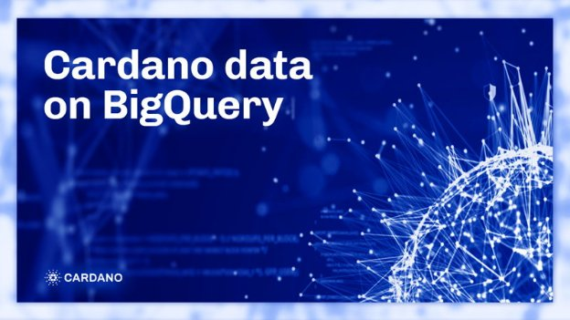

# Dữ liệu Cardano trên BigQuery

### **BigQuery cho phép truy vấn dữ liệu Cardano nhanh chóng, liên tục và với chi phí thấp**

 Ngày 1 tháng 6 năm 2022[ Olga Hryniuk](/en/blog/authors/olga-hryniuk/page-1/) bài đọc 5 phút

### [**Olga Hryniuk**](/en/blog/authors/olga-hryniuk/page-1/)

Technical Writer

Marketing &amp; Communications

- 
- 

Blockchain Cardano đang nhanh chóng trở thành nơi cho các ứng dụng phi tập trung (Dapps) và các giải pháp tài chính phi tập trung (DeFi) phát triển. Với gần một trăm dự án đã hoạt động và hơn một nghìn dự án đang tích cực xây dựng, cơ sở dữ liệu giao dịch của Cardano không ngừng tăng lên.

Truy vấn dữ liệu là điều cần thiết cho các dự án đang hoạt động hoặc các nhà phát triển đang làm việc trên blockchain. Tại sao? Bởi vì độ chính xác của dữ liệu là nền tảng cho cả những hoạt động an toàn và những hoạt động không đáng tin cậy. Hãy nghĩ về ví. Để xử lý một giao dịch, hệ thống cần biết bạn có bao nhiêu tiền và liệu nó có đủ để chi trả cho giao dịch như đã dự định hay không. Bản ghi của giao dịch này sau đó được thêm vào chuỗi, yêu cầu ví phải được đồng bộ hóa hoàn toàn với trạng thái mới nhất của blockchain.

Nếu bạn đang xây dựng trên Cardano, bạn có thể sẽ cần truy vấn dữ liệu blockchain. Và trong bài đăng này, chúng tôi thảo luận về một số tùy chọn bao gồm cách truy vấn dữ liệu Cardano bằng kho dữ liệu Google BigQuery.

## **Truy vấn dữ liệu Cardano**

Hàng nghìn node phi tập trung duy trì mạng Cardano, mỗi node giữ một bản sao đầy đủ của blockchain. Bởi vì kích thước của blockchain liên tục tăng lên cùng với số lượng giao dịch và dữ liệu mới được thêm vào chuỗi, thời gian để đồng bộ hóa toàn bộ lịch sử của blockchain cũng tăng theo.

[Cardano DB Sync](https://docs.cardano.org/cardano-components/cardano-db-sync/about-db-sync) là một trong những thành phần cốt lõi của Cardano, cung cấp một cách thuận tiện để tìm và truy vấn thông tin lịch sử từ blockchain Cardano. DB Sync kết nối với node cục bộ dưới dạng máy khách và đồng bộ hóa với hoạt động trên chuỗi. Tuy nhiên, việc sử dụng DB Sync đòi hỏi kiến ​​thức kỹ thuật sâu hơn để chạy một node và một máy chủ cơ sở dữ liệu cục bộ.

Để giải quyết nhu cầu cung cấp một giải pháp thay thế truy vấn dữ liệu đơn giản hơn, một số giải pháp đã xuất hiện. Tùy thuộc vào chuyên môn kỹ thuật, yêu cầu phần mềm và nhu cầu, người dùng có thể chọn từ một số giải pháp hướng tới cộng đồng nhằm hợp thức hóa việc truy vấn dữ liệu. Ví dụ: [Cardano Blockchain Insights](https://twitter.com/InsightsCardano) cung cấp [dữ liệu blockchain trong các biểu đồ và bảng điều khiển một cách trực quan](https://datastudio.google.com/u/0/reporting/3136c55b-635e-4f46-8e4b-b8ab54f2d460/page/k5r9B) bằng Google Data Studio. [Scrolls](https://github.com/txpipe/scrolls#readme) và [Blockfrost](https://blockfrost.io/#introduction) là một trong những giải pháp khác nhằm mục đích tối ưu hóa hoạt động với dữ liệu blockchain.

IOG đang giới thiệu tùy chọn Google BigQuery để thực hiện với dữ liệu Cardano. Google BigQuery giúp tra cứu dữ liệu dễ dàng hơn mà không cần chạy phần mềm chuyên dụng. Tất cả dữ liệu được tải trực tiếp từ Cardano DB Sync và được xác thực để đảm bảo tính chính xác của nó. Điều này có nghĩa là dù quá trình xác thực dữ liệu phức tạp, người dùng có thể yên tâm về quyền truy cập vào cùng một dữ liệu như trong DB Sync. BigQuery tổ chức dữ liệu Cardano theo số lượng epoch, cho phép truy vấn theo từng epoch dẫn đến chi phí thấp hơn. Ngoài ra, bằng cách sử dụng [Google Data Studio](https://datastudio.google.com/), bạn có thể tạo các bảng điều khiển và các trang hình ảnh trực quan nâng cao dựa trên dữ liệu BigQuery.

## **BigQuery hoạt động như thế nào?**

Đảm bảo bạn đã đăng nhập vào tài khoản [Google Cloud Platform](https://console.cloud.google.com) của mình và đã bật API BigQuery. Sau đó, bắt đầu rất đơn giản:

- Mở hoặc tạo dự án Google BigQuery hoặc Data Studio
- Truy cập [tập dữ liệu phân tích IOG](https://console.cloud.google.com/bigquery?project=iog-data-analytics&supportedpurview=project&ws=!1m4!1m3!3m2!1siog-data-analytics!2scardano_mainnet)

Bây giờ bạn có thể truy vấn dữ liệu blockchain Cardano.

### **Truy vấn**

Sử dụng tập dữ liệu khá đơn giản. Bạn có thể chọn bất kỳ bảng nào bạn quan tâm và nhấp vào 'Truy vấn' để nhận thông tin chi tiết:

Hình 1. Bảng điều khiển phân tích dữ liệu IOG

Bạn cũng có thể nhập dữ liệu đã truy vấn vào [Google Data Studio](https://datastudio.google.com/). Điều này sẽ cho phép bạn tạo các biểu đồ và đồ thị khác nhau để trực quan hóa số liệu thống kê giao dịch hoặc khối. Xem một số ví dụ về [Cardano Blockchain Insights tại đây](https://datastudio.google.com/u/0/reporting/3136c55b-635e-4f46-8e4b-b8ab54f2d460/page/k5r9B) .

### **Quy trình cập nhật dữ liệu**

Có một số điều bạn cần lưu ý khi làm việc với BigQuery:

1. Dữ liệu được lấy và sao chép từ DB Sync sẽ diễn ra hai tiếng một lần.
2. Dữ liệu chỉ được cập nhật cho khoảng 20 blocks cuối cùng trước chiều cao block hiện tại trong DB Sync. Điều này là cần thiết để ngăn chặn việc khôi phục các khối trong trường hợp phân nhánh chuỗi.

### **Chi phí**

Thông thường, chi phí để truy vấn dữ liệu trên BigQuery là $5 cho mỗi terabyte (TB) dữ liệu được xử lý. Ngoài ra còn có một hạn ngạch miễn phí là một TB dữ liệu mỗi tháng. Để tìm hiểu thêm, hãy xem chi tiết [giá của dịch vụ BigQuery](https://cloud.google.com/bigquery/pricing). Điều quan trọng cần lưu ý là các bảng dữ liệu Cardano được chia theo số lượng epoch, điều này giúp bạn có thể truy vấn dữ liệu cho việc lựa chọn epoch một cách chính xác, điều này làm giảm lượng dữ liệu được xử lý và do đó chi phí thấp hơn.

## **Bạn đã sẵn sàng để dùng thử chưa?**

Hiện tại, dự án Cardano BigQuery đang trong bản phát hành beta. Nó không bao gồm tất cả dữ liệu blockchain, đặc biệt là chi tiết về phần đặt cọc và phần thưởng của việc đặt cọc. Nhóm tại IOG hiện đang làm việc để phát triển thêm và trong các phiên bản tương lai, tập dữ liệu phân tích IOG sẽ bao gồm tất cả dữ liệu Cardano từ DB Sync.

Để bắt đầu làm việc với một công cụ, hãy nhớ đọc [tài liệu có hướng dẫn từng bước](https://docs.cardano.org/cardano-components/cardano-db-sync/big-query). Bạn cũng sẽ tìm thấy [các bảng lược đồ khác nhau với các ví dụ về truy vấn dữ liệu](https://docs.cardano.org/cardano-components/cardano-db-sync/big-query/#querytableschemas).

Chúng tôi hoan nghênh phản hồi của bạn, bạn có thể chia sẻ bằng cách gửi email tới **data-analytics@iohk.io.**

*Tôi muốn cảm ơn [Alexander Diemand](https://iohk.io/en/team/alexander-diemand) và [Thomas Kaliakos](https://iohk.io/en/team/thomas-kaliakos) đã đóng góp ý kiến ​​và hỗ trợ trong việc chuẩn bị bài blog này.*

***Tuyên bố từ chối trách nhiệm pháp lý***

*Trong phần này có các liên kết sẽ đưa bạn đến trang web của bên thứ ba, được sở hữu và điều hành bởi một bên độc lập mà công ty Input Output Global không có quyền kiểm soát ("trang web của bên thứ ba"). Bạn phải tuân thủ quy định nếu sử dụng trang web của bên thứ 3 và bất kỳ thông tin nào bạn cung cấp sẽ được điều chỉnh bởi các điều khoản của trang web bên thứ 3, bao gồm những điều khoản liên quan đến tính bảo mật, quyền riêng tư của dữ liệu và sự an toàn.

Bài này được dịch bởi Lê Nguyên [với bài gốc](https://iohk.io/en/blog/posts/2022/07/01/cardano-data-on-bigquery)

*Dự án này được tài trợ bởi Catalyst*
