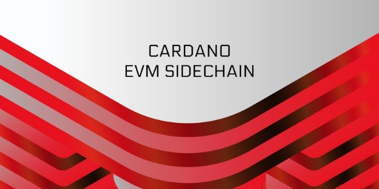
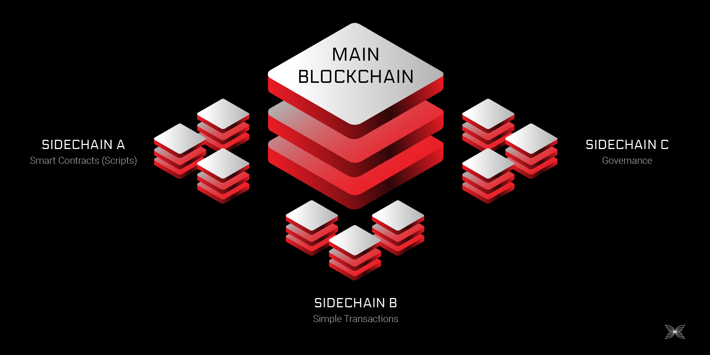

# Giới thiệu về Cardano EVM Sidechain

### **Cardano EVM Sidechain là một giải pháp mở rộng hoàn toàn phi tập trung được IOG triển khai. Hãy cùng tìm hiểu thêm về các tính năng, lợi ích và kế hoạch phát hành**

6 tháng 7 năm 2022[Olga Hryniuk](/en/blog/authors/olga-hryniuk/page-1/)6 phút đọc

### [**Olga Hryniuk**](/en/blog/authors/olga-hryniuk/page-1/)

Technical Writer

Marketing &amp; Truyền thông

- 
- 

Cardano đang phát triển khả năng mở rộng. Bản [nâng cấp Vasil](https://iohk.io/en/blog/posts/2022/07/04/cardano-s-approaching-vasil-upgrade-what-to-expect/) sẽ mở ra nhiều cơ hội hơn nữa để phát triển và sử dụng hiệu quả các sản phẩm DApp và DeFi khác nhau trên Cardano.

Sidechain và các giải pháp Layer 2 là chìa khóa để tăng khả năng mở rộng cho các dự án xây dựng trên Cardano. Trong bài đăng này, chúng tôi thảo luận về Sidechain là gì? Và cách chúng đóng góp vào hệ sinh thái các giải pháp kết nối. Chúng tôi cũng đi sâu hơn vào các tính năng độc đáo của EVM Sidechain. Nó được phát triển bởi Input Output Global, Inc (IOG).

## **Khả năng tương tác**

Trong một [bài đăng trên Blog](https://iog.io/en/blog/posts/2022/04/28/interoperability-is-key-to-blockchain-growth/) trước đó, chúng tôi đã thảo luận về cách cầu nối, Sidechain và bộ chuyển đổi AGIX ERC20 nâng cao khả năng tương tác của Cardano. Nó được định nghĩa là khả năng hiểu và tương tác của sản phẩm hoặc hệ thống này với các sản phẩm hoặc hệ thống khác. Khi một mạng lưới Blockchain có thể tương tác, dữ liệu người dùng và tài sản được tạo trong một mạng lưới có thể được di chuyển giữa các mạng lưới khác nhau.

Khả năng tương tác là một yếu tố quan trọng cần xem xét trong các hệ sinh thái phi tập trung. Khi người dùng có các công cụ đảm bảo quyền sở hữu dữ liệu, họ sẽ cần cơ sở hạ tầng để chia sẻ dữ liệu đó với những người khác trên nhiều mạng lưới được kết nối với nhau. Nền kinh tế toàn cầu yêu cầu Token của người dùng không còn nằm trên bất kỳ Blockchain đơn lẻ nào. Sidechain và giao thức cầu nối là các giải pháp tạo điều kiện cho việc di chuyển dữ liệu tự do hơn trong nền kinh tế kỹ thuật số phi tập trung.

Hình 1. Một ví dụ về các Sidechain khác nhau

### **Gia đình của sidechains**

Blockchain không thể thành công một cách độc lập. Không có Blockchain đơn lẻ nào có thể biến đổi toàn bộ cơ sở hạ tầng kỹ thuật số trở nên tốt hơn, cũng như không có một Blockchain nào có thể cách mạng hóa cách chúng ta chia sẻ dữ liệu, giao dịch hoặc tương tác với những người khác. Theo thời gian, nhu cầu về các Sidechain chuyên dụng cho phép mạng lưới các nhà phát triển đa dạng hơn tham gia vào Cardano và các công cụ cần thiết để hỗ trợ phát triển các ứng dụng cho các trường hợp sử dụng cụ thể.

IOG có kế hoạch tạo ra một "Gia đình" gồm các Sidechain để mang lại khả năng mở rộng, khả năng tương tác và khả năng lập trình cao hơn cho Cardano. Một số đơn vị đóng góp trong hệ sinh thái cũng đang nỗ lực xây dựng các Sidechain của riêng họ để bổ sung thêm nhiều khả năng hơn nữa cho Cardano.

Khi Cardano hỗ trợ kiến trúc hạ tầng đa chuỗi, các nhà phát triển sẽ có thể tận dụng nền tảng theo những cách sau:

- Sử dụng Plutus để tạo các Hợp đồng thông minh và ứng dụng phi tập trung trong một môi trường có tính đảm bảo cao, tiết kiệm tài nguyên.
- Sử dụng EVM Sidechain để phát triển và triển khai các Hợp đồng thông minh tương thích với EVM trên Cardano (mà không phải trả phí Gas cao như thường thấy trên Ethereum).
- Sử dụng các tính năng quản trị của EVM Sidechain để tạo các ứng dụng quản trị phi tập trung nhằm tối ưu hóa trải nghiệm bỏ phiếu và quản trị On-Chain.

## **Cardano EVM Sidechain**

EVM Sidechain sẽ là Sidechain đầu tiên được xây dựng và phát hành bởi IOG với mục tiêu mở rộng Cardano cho các nhà phát triển Solidity. EVM Sidechain sẽ cho phép cộng đồng các nhà phát triển Solidity xây dựng DApp trên nền tảng [thân thiện với môi trường](https://iog.io/en/blog/posts/2021/08/17/why-they-re-calling-cardano-the-green-blockchain/), có phí thấp hơn và tiêu thụ ít năng lượng hơn nhiều so với Blockchain sử dụng cơ chế đồng thuận PoW.

**Nó hoạt động như thế nào?**

Ethereum Virtual Machine (EVM) là một phần mềm được phát triển bởi Ethereum để giúp máy tính chạy các Hợp đồng thông minh. Mỗi Node Ethereum đầy đủ chạy một phiên bản của EVM để xác định trạng thái máy sẽ thay đổi như thế nào với mỗi Block mới được thêm vào Chuỗi. Sidechain được xây dựng bằng EVM cung cấp các tính năng tương đương với Ethereum Blockchain để xử lý và thực thi các Hợp đồng thông minh. Các EVM Sidechain cũng có khả năng triển khai các tính năng mới như một giao thức đồng thuận hoặc mô hình Sổ cái khác, trong khi vẫn giữ được các khả năng tạo tập lệnh EVM cần thiết.

### **Các tính năng chính của Cardano EVM Sidechain**

Các tính năng chính của EVM Sidechain là:

**Khả năng tương thích với Ethereum:**

- **&nbsp;Khả năng tương thích của Hardfork: ** Sidechain EVM sẽ giữ được khả năng tương thích với các Hardfork của Ethereum. Điều này là cần thiết để đảm bảo EVM Sidechain vẫn có thể tương tác với Ethereum cũng như các công cụ và ứng dụng khác được xây dựng trên mạng lưới của nó.
- **Khả năng tương thích của công cụ dành cho nhà phát triển**: Các công cụ dành cho nhà phát triển Ethereum được sử dụng rộng rãi để lưu trữ tài sản, đọc trạng thái của Sổ cái, theo dõi phân tích và hơn thế nữa. Người dùng EVM Sidechain sẽ có quyền truy cập vào các công cụ đó từ hệ sinh thái Cardano. Điều này tạo ra rào cản gia nhập thấp hơn cho các nhà phát triển Solidity đang tìm cách xây dựng trên Cardano.
- **Khả năng tương thích của ví Web3.js**: Công nghệ Web3 cung cấp cho người dùng toàn quyền kiểm soát dữ liệu. Điều này có nghĩa là không có sự tham gia của các bên thứ ba sở hữu dữ liệu cá nhân của người dùng. Ví Web3 có tính năng đảm bảo tính ẩn danh và bảo vệ dữ liệu của người dùng trong khi tương tác với DApp.

**Giao thức đồng thuận Ouroboros**

EVM Sidechain sẽ thay thế thuật toán đồng thuận PoW của Ethereum bằng giao thức đồng thuận Ouroboros Byzantine Fault Tolerance (OBFT). OBFT là một cách triển khai của Ouroboros có thể giải quyết các vấn đề của bài toán Byzantine. OBFT cung cấp khả năng xử lý giao dịch tốt ở tốc độ mạng tối đa và xác nhận giao dịch ngay lập tức với các bằng chứng thanh toán.

Cơ chế đồng thuận thường phụ thuộc vào một số lượng cố định của các Validator (các Node) và giao thức OBFT không cho rằng các Node có thể biến động. EVM Sidechain mở rộng giao thức OBFT ban đầu để cho phép *thiết lập Validator biến động*. Sự biến động sẽ đến từ sự luân chuyển của các nhóm, nhưng kích thước Pool sẽ không đổi. Sổ cái Cardano cho phép tính năng thiết lập Validator biến động bằng cách hoạt động như một nguồn đáng tin cậy duy nhất để giúp lựa chọn các Node tạo Block.

**Cách tiếp cận không được phép**

Phi tập trung là một trong những nền tảng của nền kinh tế kỹ thuật số tin cậy. Tính minh bạch của công nghệ Blockchain hạn chế sự gian lận. Để xây dựng một mạng lưới phi tập trung thực sự, phải đảm bảo rằng đó là một mạng lưới không được phép. Các Blockchain không được phép cung cấp cho mọi người quyền tham gia vào các hoạt động của mạng lưới mà không phụ thuộc vào cơ quan hoặc tổ chức tập trung nào. EVM Sidechain sẽ là một mạng lưới không được phép.

**Tính bảo mật**

EVM Sidechain bao gồm một số tính năng để duy trì sự bảo mật:

- **Quan sát trạng thái**: sau khi tạo một Sidechain Validator Node, các Node này có thể đọc phân phối ủy quyền cổ phần ADA từ chuỗi chính.
- **Lựa chọn Validator**: một thuật toán xác định được chạy cho tất cả các ứng cử viên đủ điều kiện và các nhóm được lựa chọn bởi thuật toán đó.
- **Sản xuất Block**: các Validator được chọn trở thành một phần của nhóm sản xuất Block sẽ nhận được phần thưởng cho công việc của họ.
- **Validator chuyển tiếp**: sau một khoảng thời gian được cài đặt trước, một nhóm mới bắt đầu tạo ra các Block thay thế cho nhóm trước đó (Lựa chọn Validator là thuật toán và xác định).

## **Lộ trình**

EVM Sidechain của Cardano đang được phát triển lặp đi lặp lại. Như với bất kỳ lần ra mắt sản phẩm nào khác, cần có phương pháp tiếp cận lặp đi lặp lại và đánh giá hiệu suất để đảm bảo rằng mọi thứ hoạt động như dự kiến.

Một Testnet độc lập sẽ được sử dụng để đánh giá và kiểm tra EVM Sidechain. Sau đó là giai đoạn khởi chạy Sidechain thụ động và Sidechain chủ động. Cuối cùng là giai đoạn triển khai trên Mainnet:

Hình 2. Các giai đoạn triển khai EVM Sidechain

Chúng tôi sẽ nói chi tiết hơn về Cardano EVM Sidechain trong những tháng tới.

*Trong khi đó, bạn có thể yêu cầu quyền truy cập sớm vào EVM Sidechain Alpha Testnet, bằng cách điền [vào biểu mẫu này](https://alpha-evm-sidechain.iohk.io/) . Kiểm tra [bản Demo](https://www.youtube.com/watch?v=NFxoi3YItEM) EVM Sidechain để xem một Hợp đồng thông minh được triển khai trên Testnet!*

*Tôi muốn cảm ơn Kathryn Stacy và Dominika Bukowska đã đóng góp ý kiến và hỗ trợ trong việc tạo bài đăng trên Blog này.*

Bài này được dịch bởi Nguyễn Văn Tú, Review bởi Tienna,Dang bai boi Nguyen Hieu. [với bài gốc](https://iohk.io/en/blog/posts/2022/07/06/introducing-the-cardano-evm-sidechain)

*Dự án này được tài trợ bởi Catalyst*
