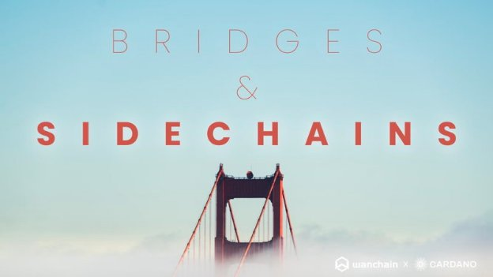
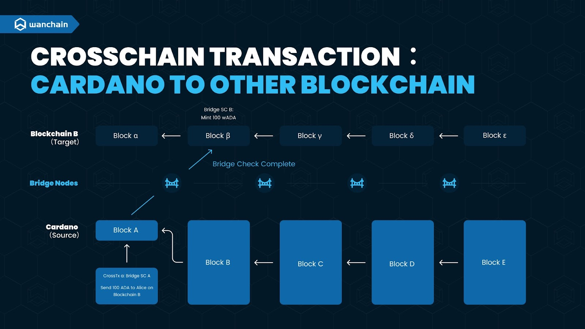
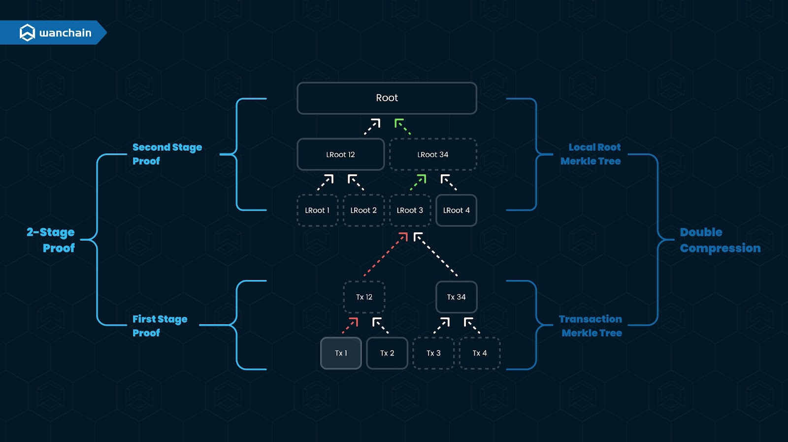
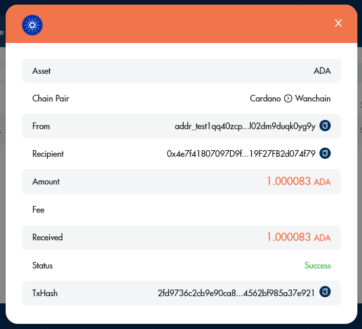
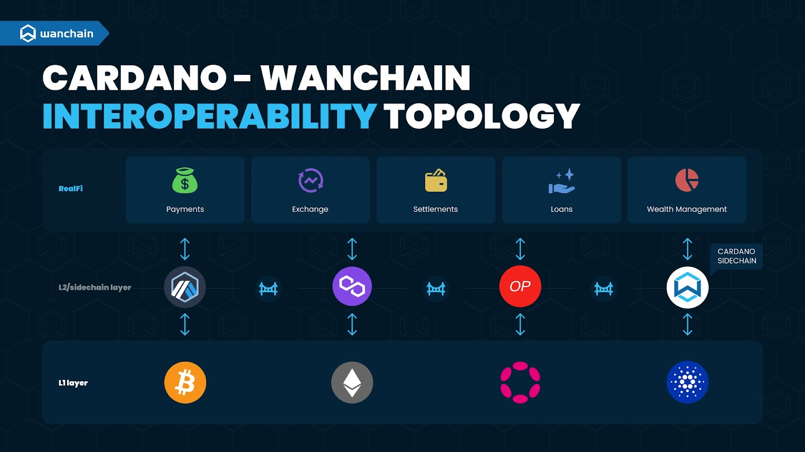

# Cầu nối và những sidechain

Wanchain làm cho Cardano có khả năng tương tác

### **Guest blog này được đăng bởi của Tiến sĩ Weijia Zhang và Temujin Louie**

 Ngày 8 tháng 7 năm 2022[ Tiến sĩ Weijia Zhang](/en/blog/authors/dr-weijia-zhang/page-1/) bài đọc 9 phút

### [**Tiến sĩ Weijia Zhang**](/en/blog/authors/dr-weijia-zhang/page-1/)

VP of engineering, Wanchain

Guest author

- 

Vài tháng trước, một đội ngũ từ [Wanchain](https://www.wanchain.org/) đã liên hệ với công ty Input Output Global (“IOG”) để thảo luận về cách kích hoạt khả năng tương tác giữa Cardano mainnet, các Cardano sidechain và các mạng blockchain không đồng nhất khác.

Mục đích là gì? Là nhằm xây dựng cơ sở hạ tầng cần thiết để kích hoạt các ứng dụng RealFi thực sự trải dài qua nhiều blockchain nhằm thúc đẩy việc ứng dụng hệ sinh thái của Cardano, các giải pháp tương tác blockchain bất khả tri trên mạng của Wanchain và hỗ trợ tương lai của Web3.

Rõ ràng rằng đây là một nhiệm vụ lớn đòi hỏi đầu vào (và đầu ra!) Của nhiều đội. Thật vậy, việc kết nối Cardano với các blockchain không đồng nhất sẽ là một công việc phức tạp, vì Cardano về cơ bản khác với hầu hết các mạng blockchain khác. Do cardano sử dụng:

- Các môi trường hợp đồng thông minh và ngôn ngữ lập trình khác nhau: Cardano sử dụng ngôn ngữ lập trình Plutus và Haskell, không phải EVM và Solidity;
- Các mô hình giao dịch khác nhau: Cardano sử dụng mô hình UTXO (như Bitcoin), không phải mô hình dựa trên tài khoản (như Ethereum);
- Các lược đồ chữ ký và đường cong eliptic khác nhau: Cardano hỗ trợ EdDSA và Curve25519, không hỗ trợ Shnorr và Secp256k1.

Mỗi sự khác biệt này đều xứng đáng để có bài đăng dành riêng cho chúng, nhưng đủ để nói rằng, kết hợp lại, chúng đã đưa ra trở ngại hạn chế tiềm năng tương thíc của Cardano.

May mắn thay, các kỹ sư thích một thử thách hay!

Đội ngũ từ IOG, Wanchain và MLabs (một công ty tư vấn Haskell, Rust, blockchain và AI tốt nhất trong ngành) đã hợp tác để thiết kế một kế hoạch làm cho Cardano có thể tương thích và bây giờ, với nền tảng là giải pháp tương thích dành cho Cardano tại chỗ, thời gian này là phù hợp để chia sẻ một số chi tiết về những gì đã được thực hiện, đây là là một nỗ lực thú vị. 

Trong bài viết này, chúng tôi giải thích cơ sở hạ tầng cơ bản để kết nối Cardano với các mạng blockchain không đồng nhất, tiết lộ một giải pháp sidechain mới và chia sẻ lộ trình dài hạn và lộ trình gần của dự án này.

## **Wanchain: Một mạng lưới những blockchain trên diện rộng**

Đầu tiên, một chút về Wanchain. Wanchain vừa là một blockchain PoS layer 1 bền vững vừa là một giải pháp tương tác blockchain phi tập trung. Blockchain PoS layer 1 của Wanchain là một môi trường giống như Ethereum hoàn chỉnh, hoạt động với các công cụ Ethereum, DApp và các giao thức tiêu chuẩn. Quan trọng là, nó có một số mối quan hệ với Cardano. Wanchain sử dụng [cơ chế đồng thuận Galaxy](https://www.wanchain.org/_files/ugd/9296c5_5205d584ee594e879d4b8b58048b6fac.pdf), một thuật toán đồng thuận bằng chứng cổ phần thúc đẩy nhiều kế hoạch mã hóa khác nhau, bao gồm chia sẻ bí mật phân tán và chữ ký ngưỡng, để cải thiện cơ chế tạo số ngẫu nhiên và tạo khối. Cơ chế đồng thuận Galaxy, được phát triển bởi các nhà nghiên cứu và học giả hàng đầu thế giới, là phần tiếp theo của [Ouroboros](https://eprint.iacr.org/2016/889.pdf) của Cardano.

Trong khi đó, cầu Wanchain là cầu nối phi tập trung, trực tiếp, không giám sát, kết nối cả mạng EVM và không EVM mà không yêu cầu bất kỳ chuỗi chuyển tiếp hoặc mạng trung gian nào. Những cầu nối này sử dụng sự kết hợp giữa tính toán đa bên an toàn (sMPC) và chia sẻ bí mật của Shamir để bảo mật tài sản crosschain. Hiện tại, hơn 15 mạng lưới layer 1 và layer 2 (và đang tiếp tục gia tăng!) được kết nối bởi mạng lưới blockchain diện rộng của Wanchain.

### **Khối cơ sở 1: những cầu nối crosschain của Cardano**

Yếu tố đầu tiên cần thiết để xây dựng giải pháp tương tác crosschain của Cardano là các cầu nối crosschain phân cấp, không giám sát, hai chiều kết nối Cardano với các blockchain layer 1 khác.

Cầu nối crosschain chuyển tài sản và/hoặc dữ liệu từ chuỗi nguồn sang chuỗi mục tiêu. Ở dạng cơ bản nhất, điều này thường được thực hiện bằng cách khóa một tài sản trên chuỗi nguồn và đúc một tài sản đóng gói có cùng giá trị trên chuỗi mục tiêu. Chúng tôi gọi đây là phương pháp Lock-Mint-Burn-Unlock. Để phương pháp Lock-Mint-Burn-Unlock hoạt động, ba hợp đồng thông minh chính được triển khai: một trên chuỗi nguồn để xử lý tài sản nguồn, một trên chuỗi mục tiêu để xử lý tài sản mục tiêu và một trên chuỗi quản lý để xử lý đăng ký và đặt cọc các node cầu nối. 

Đối với những người chưa quen, hình 1 bên dưới minh họa một chuỗi nguồn đến giao dịch chuỗi mục tiêu. Mô tả ngắn gọn: khi giao dịch crosschain do người dùng bắt đầu, chuỗi mục tiêu và địa chỉ mục tiêu được chỉ định. Hợp đồng thông minh của chuỗi nguồn sẽ khóa tài sản nguồn và phát ra sự kiện Lock. Các node cầu nối phát hiện sự kiện Lock và hướng dẫn hợp đồng thông minh của chuỗi mục tiêu tạo ra một token có cùng giá trị trên chuỗi mục tiêu.

*Hình 1. Một giao dịch crosschain cơ bản*

Để đưa token này trở lại chuỗi nguồn, chủ sở hữu token này chỉ cần gửi một giao dịch “mua lại” đến hợp đồng thông minh của chuỗi mục tiêu. Hợp đồng thông minh chuỗi mục tiêu đốt token đã đóng gói và phát ra sự kiện Burn. Các node cầu nối phát hiện sự kiện Burn và hướng dẫn hợp đồng thông minh chuỗi nguồn mở khóa token trên chuỗi nguồn. Các node cầu nối Wanchain là không được phép sử dụng tính toán đa bên và đặt cọc để ngăn chặn sự thông đồng.

Như đã đề cập ở trên, Cardano có một số khác biệt cơ bản làm phức tạp nhiệm vụ triển khai cầu nối crosschain. Đây là cách IOG, Wanchain và MLabs giải quyết những vấn đề này:

*Các máy ảo và ngôn ngữ lập trình khác nhau: Cardano sử dụng Plutus và Haskell, không phải EVM và Solidity*

Chuyên môn của Wanchain là kết nối các blockchain hoàn toàn không đồng nhất. Cơ sở hạ tầng crosschain hiện tại đã bao gồm các blockchain sử dụng EVM (như Ethereum và Wanchain), WebAssembly (như Polkadot) và thậm chí cả các blockchain không có máy ảo (như Bitcoin, XRP Ledger và Litecoin). Khi có thể, chúng tôi giải quyết vấn đề này bằng cách phát triển các hợp đồng thông minh gốc trên cả chuỗi nguồn và chuỗi mục tiêu. Ngược lại, nếu mạng không hỗ trợ hợp đồng thông minh, các nút cầu nối của Wanchain sẽ cùng quản lý một tài khoản khóa chuyên dụng bằng sMPC. Wanchain luôn có lựa chọn thay đổi về các node cầu nối không được phép và sau đó giao tiếp với các hợp đồng thông minh (hoặc khóa tài khoản) trên mỗi chuỗi, nếu cần. 

*Các mô hình giao dịch khác nhau: Cardano sử dụng mô hình UTXO (như Bitcoin), không phải mô hình dựa trên tài khoản (như Ethereum)*

Các nút cầu nối Wanchain có bộ điều hợp để kết nối với các blockchain khác nhau. Các bộ điều hợp có thể xây dựng các giao dịch dựa trên mô hình giao dịch của blockchain dự kiến. Một API cụ thể do IOG cung cấp cho phép Wanchain xác định định dạng giao dịch để gọi các hợp đồng thông minh trên Cardano. 

*Các lược đồ chữ ký và đường cong elip khác nhau: Cardano hỗ trợ EdDSA và Curve25519, không hỗ trợ Shnorr và Secp256k1*

Điều này được chứng minh là sự phụ thuộc lớn nhất đối với giải pháp tương tác của Cardano. Cardano ban đầu hỗ trợ EdDSA và Curve25519, không phải Schnorr và Secp256k1. Theo yêu cầu từ Wanchain và MLabs, Input Output đã phối hợp các nỗ lực nội bộ để giúp Cardano hỗ trợ chữ ký Schnorr và đường cong Secp256k1. Cả hai sẽ [sẵn sàng được công khai sau hard fork Vasil](https://www.youtube.com/watch?v=B0tojqvMgB0&t=1148s) của Cardano.

### **Khối nền tảng 2: Bảo mật bổ sung, Wanchain như một sidechain Cardano**

Người đồng sáng lập Ethereum, Vitalik Buterin gần đây đã nhận xét rằng anh ấy bi quan về các ứng dụng crosschain do những hạn chế bảo mật cơ bản của những cầu nối. Mặc dù [chúng tôi tại Wanchain không đồng ý với kết luận của anh ấy](https://www.altcoinbuzz.io/reviews/crypto-education/vitalik-forgot-one-thing-this-is-why-crosschain-bridges-can-be-safe/), nhưng những lo ngại của anh ấy là có cơ sở. Do đó, việc cân nhắc đặc biệt đang được thực hiện để đảm bảo an toàn cho các cầu nối chuỗi và tối đa hóa tính bảo mật của giải pháp tương tác  của Cardano.

Điều này dẫn đến yếu tố thứ hai cần thiết để xây dựng giải pháp tương tác crosschain của Cardano: các nút cầu nối Wanchain sẽ được nâng cấp để cố định các mạng lưới Wanchain và Cardano nhằm bảo mật hơn nữa các cầu nối và giao dịch crosschain của Cardano. Nói một cách đơn giản hơn, Wanchain sẽ đóng vai trò là một sidechain EVM tương thích với Cardano. 

Việc cố định Cardano-Wanchain dựa trên xác minh hai giai đoạn giao dịch Merkle. Cơ chế bằng chứng này bao gồm các thành phần sau:

- Một hợp đồng quản lý trạng thái được triển khai trên Cardano;
- Các node cầu nối có trách nhiệm xác thực tính hợp lệ của dữ liệu blockchain Wanchain, tính toán các root Merkle và lưu giá trị root Merkle vào Cardano theo các khoảng thời gian đều đặn;
- Một bằng chứng cây Merkle hai giai đoạn.

Bằng chứng cây Merkle hai giai đoạn được sử dụng để chứng minh tính đúng đắn của giao dịch Wanchain bằng cách sử dụng dữ liệu nén được lưu trữ trong Cardano. Bằng chứng hai giai đoạn này có hai thành phần, đó là Bằng chứng giai đoạn đầu (FSP) và Bằng chứng giai đoạn thứ hai (SSP). FSP được sử dụng để chứng minh thực tế rằng tx được lưu trữ trong một số khối Wanchain với bh là root Merkle giao dịch của nó. SSP được sử dụng để chứng minh thực tế rằng bh là một giao dịch root Merkle hợp lệ của một số khối trong Wanchain. Với sự kết hợp của FSP và SSP, chúng ta có thể biết rằng thực tế tx là một giao dịch hợp lệ trong Wanchain. Quy trình này được trình bày dưới đây trong hình 2.

Hình 2. Đường dẫn xác minh của bằng chứng 2 giai đoạn

Để chứng minh tính chính xác của Tx1 , bằng chứng hai giai đoạn được xây dựng như sau:

1. Xây dựng FSP:

*FSP = {Tx1, Tx2, Tx34, LRoot3}*

1. Xây dựng SSP:

*SSP = {LRoot3, LRoot4, LRoot12}*

1. Hợp nhất hai bằng chứng:

*2StageProof={FSP,SSP}*

Bằng chứng 2 giai đoạn là hợp lệ nếu các đẳng thức sau đây đúng:

1. *LRoot3=SHA256(SHA256Tx1,Tx2,Tx34);*
2. *Root=SHA256(LRoot12,SHA256LRoot3,LRoot4);*

Cách tiếp cận mới này không chỉ tối đa hóa tính bảo mật của giải pháp khả năng tương tác của Cardano, nó còn tăng gấp đôi giải pháp *khả năng mở rộng*. Giờ đây, các giao dịch có thể được chuyển khỏi Cardano một cách an toàn, chỉ ghi lại thông tin quan trọng trên blockchain layer 1 để đảm bảo tính bảo mật và tính bất biến. 

## **Lộ trình: gần và xa**

Việc kích hoạt khả năng tương tác đầy đủ giữa Cardano mainnet, các sidechain của Cardano và các mạng lưới blockchain không đồng nhất khác là một dự án dài hạn. Do đó, dự án này sẽ được xác định bằng những cải tiến dần dần, chứ không phải là những bước nhảy vọt triệt để.

Cầu nối Cardano-Wanchain cơ bản đầu tiên đã tồn tại trong môi trường thử nghiệm trong vài tháng, cho phép đúc ada đóng gói trên Wanchain. Sau hard fork Vasil của Cardano, các cầu nối này sẽ được triển khai tới mainnet.

Hình 3. Ada đóng gói trong môi trường thử nghiệm

Trong khi đó, công việc sẽ tiếp tục  thực hiện để biến Wanchain trở thành một sidechain EVM chính thức tương thích với Cardano. Khi xác minh giao dịch Merkle hai giai đoạn được thực hiện, Wanchain sẽ được định vị như một giải pháp khả năng mở rộng cho các ứng dụng hiện đang chạy trên Cardano.

Theo thời gian, cấu trúc liên kết khả năng tương tác đầy đủ của Cardano-Wanchain sẽ hình thành, như trong hình 4 bên dưới.

Hình 4. Cấu trúc liên kết khả năng tương tác Cardano-Wanchain

Lớp dưới cùng của cấu trúc liên kết được hình thành bởi các blockchain layer 1 như Cardano, Ethereum, Cardano, Polkadot hoặc Bitcoin. Tất cả chúng đều được kết nối với nhau bằng các cầu nối crosschain Wanchain hiện có. Các kết nối dọc là cầu nối giữa các mạng lưới layer 1 đến layer 2 và các sidechain như: Arbitrum, Polygon, Optimistic. Layer 2 hay layer sidechain là lý tưởng để lưu trữ các token và các dự án RealFi. Những tài sản đi qua cầu nối trong layer này không cần phải đi qua mạng lưới layer 1 để đến mục tiêu của chúng. Wanchain đã triển khai một số cầu nối layer 1, layer 2 và sidechain-to-sidechain. 

Khi chiến lược sidechain của riêng Cardano tiếp tục phát triển, giải pháp khả năng tương tác mà chúng tôi đang xây dựng ngày hôm nay sẽ có thể phục vụ nhu cầu crosschain và sidechain của Cardano.

## **Về Wanchain**

Wanchain, chuỗi mạng lưới diện rộng, là một giải pháp tương tác blockchain phi tập trung với sứ mệnh thúc đẩy việc áp dụng blockchain thông qua khả năng tương tác bằng cách xây dựng các cầunối hoàn toàn phi tập trung, không giám sát, kết nối nhiều mạng blockchain trên toàn thế giới. Wanchain trao quyền cho các nhà phát triển xây dựng các ứng dụng crosschain phi tập trung để tạo sức mạnh cho tương lai của Web3.

[Website](https://www.wanchain.org/) ***|*** [Bridge](https://bridge.wanchain.org/#/) ***|*** [Documentation](https://www.explorewanchain.org/) ***|*** [Telegram](https://t.me/WanchainCHAT?source=post_page---------------------------)***|*** [Twitter](https://twitter.com/wanchain_org?source=post_page---------------------------) ***|*** [Newsletter](https://wanchain.us17.list-manage.com/subscribe?u=474affe3661620cb14a108d52&id=f76852edbb&source=post_page---------------------------) ***|*** [Blockchain Explorer](http://wanscan.org/) ***|*** [Developer Portal](https://wandevs.org/)

*Tuyên bố từ chối trách nhiệm: Thông tin trong bài viết này chỉ dành cho những hướng dẫn chung về các vấn đề quan tâm. Tài liệu ở đây chỉ được cung cấp với mục đích thông tin và không nên được hiểu là lời khuyên đầu tư.*

Bài này được dịch bởi Le Nguyen [với bài gốc](https://iohk.io/en/blog/posts/2022/07/08/bridges-and-sidechains-wanchain-making-cardano-interoperable)

*Dự án này được tài trợ bới Catalyst*
