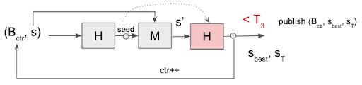

# Giới thiệu Ofelimos : giao thức đồng thuận bằng chứng công việc hữu ích

### **Nghiên cứu của IOG giới thiệu một giao thức đồng thuận mới, an toàn có thể chứng minh được để giảm thiểu sự lãng phí năng lượng của các blockchains bằng chứng công việc**

 16 August 2022[ Olga Hryniuk](/en/blog/authors/olga-hryniuk/page-1/) 11 mins read

### [**Olga Hryniuk**](/en/blog/authors/olga-hryniuk/page-1/)

Technical Writer

Marketing &amp; Communications

- 
- 

Việc giảm thiểu chi phí năng lượng và lượng khí thải carbon của bằng chứng công việc (PoW) là một trong những chủ đề được thảo luận sôi nổi nhất trong không gian tiền điện tử. Việc thay thế nguyên thủy PoW trong giao thức chuỗi dài nhất của Nakamoto bằng một bằng chứng về công việc hữu ích (PoUW) từ lâu đã được lý thuyết là một giải pháp lý tưởng ở nhiều khía cạnh, nhưng cho đến ngày nay, khái niệm này vẫn chưa được xác thực một cách thuyết phục.

Hôm nay, tại hội nghị mật mã quốc tế hàng đầu, [Crypto](https://crypto.iacr.org/2022/) , Input Output Global, Inc (IOG) giới thiệu *Ofelimos* , một giao thức blockchain mới dựa trên PoUW có cơ chế đồng thuận đồng thời nhận ra một trình giải quyết vấn đề tối ưu hóa phi tập trung. Cơ chế đồng thuận sử dụng công việc để giải quyết các vấn đề tính toán quan tâm thực tế để duy trì chuỗi khối.

## **Bằng chứng về công việc so với bằng chứng về công việc hữu ích**

Các giao thức blockchain dựa trên PoW tận dụng công việc được thực hiện bởi những người tham gia giao thức, được gọi là *thợ đào* . PoW đảm bảo tính bảo mật của sổ cái bằng cách khuyến khích các thợ đào cạnh tranh trong việc giải quyết các vấn đề tính toán để đủ điều kiện tạo ra một khối mới. Công việc tính toán này duy trì tính bảo mật của giao thức nhưng yêu cầu sử dụng năng lượng và tài nguyên đáng kể. Tại thời điểm viết bài, Bitcoin có [mức chi tiêu năng lượng hàng năm](https://ccaf.io/cbeci/index) ngang bằng với nhiều quốc gia vừa và nhỏ.

Bằng chứng về công việc *hữu ích* giải quyết vấn đề hiệu quả năng lượng bằng cách tái định vị nỗ lực tính toán cần thiết để duy trì bảo mật giao thức nhằm giải quyết các vấn đề phức tạp *trong thế giới thực,* chẳng hạn như tối ưu hóa hậu cần của công ty hoặc lập lịch sự kiện.

Một trong những thách thức của PoUW là giải quyết tình huống khó xử sau: nếu các vấn đề cần giải quyết thực sự hữu ích (đến từ thế giới thực), kẻ tấn công có thể chỉ đạo hệ thống đặt ra các trường hợp vấn đề có thể giải quyết dễ dàng (hoặc đã được kẻ tấn công giải quyết) . Điều này sẽ tận dụng tài nguyên của kẻ tấn công để tạo ra nhiều khối hơn so với một người tham gia trung thực với cùng một lượng tài nguyên và do đó sẽ làm giảm tính bảo mật của blockchain. Mặt khác, việc giảm thiểu khả năng của kẻ tấn công để tận dụng sản xuất khối của họ có thể yêu cầu đặt ra các trường hợp vấn đề ngẫu nhiên, do đó làm cho các tính toán của hệ thống trở nên vô dụng trong thực tế.

Ofelimos giải quyết tình huống khó xử này cùng với phân tích tính hữu ích và bảo mật chính thức.

## **Tổng quan về Ofelimos**

Khách hàng công bố các vấn đề cần giải quyết và phần thưởng sẽ được trả cho những người khai thác thành công. Cũng giống như trong PoW, các thợ đào giải quyết những vấn đề này để tham gia vào một cuộc xổ số quyết định tính đủ điều kiện để tạo khối.

Trong PoW thuần túy, xổ số này thường bao gồm việc băm lặp đi lặp lại một thử thách (cùng với một bộ đếm) so với một giá trị mục tiêu nhất định. Xổ số sẽ thắng nếu giá trị băm nằm dưới mục tiêu. Lưu ý rằng trong PoW thuần túy, một truy vấn duy nhất nhanh trong khi xác suất đạt được mục tiêu là rất nhỏ.

Vì nhiều lý do, trong PoUW, bạn cũng nên giữ cho một truy vấn (tương đối) nhanh, điều này giảm thiểu xác suất nhiều khối được xuất bản đồng thời, chẳng hạn. Mặt khác, các trường hợp vấn đề của khách hàng phải không nhỏ để giải quyết để việc thuê ngoài tính toán là hấp dẫn. Đối với PoUW, điều tự nhiên là hướng đến các lớp tính toán phức tạp như một tổng thể, nhưng có thể chia thành các bước nhỏ â € ˜uniformâ € ™. Mỗi bước phải yêu cầu cùng một lượng công việc (theo kỳ vọng) và tương ứng với một truy vấn PoW thuần túy.

Tìm kiếm cục bộ ngẫu nhiên (SLS) là một loại tính toán rõ ràng như vậy. Các thuật toán SLS được áp dụng cho các bài toán tối ưu hóa mà không có thuật toán xác định hiệu quả nào được biết đến. Thay vào đó, SLS thực hiện một bước đi ngẫu nhiên trong không gian giải pháp cố gắng tối ưu hóa dần dần giải pháp bằng cách sử dụng một số phương pháp heuristics nhất định. Vì mỗi bước thăm dò trong bước đi ngẫu nhiên là một ví dụ khác nhau của cùng một phép tính, SLS là một ứng cử viên tuyệt vời cho PoUW theo các yêu cầu trên. Hơn nữa, SLS có mức độ liên quan thực tế cao với các ứng dụng kinh tế thực trong các lĩnh vực như lập kế hoạch hậu cần, lập lịch sự kiện, v.v.

## **Chuyển đổi từng bước từ PoW sang PoUW**

Các thợ mỏ tiếp nhận và giải quyết các trường hợp vấn đề của khách hàng được đăng trên blockchain. Các bản cập nhật sự cố liên tục được lưu trữ trong blockchain cho đến khi một số tiêu chí chấm dứt xảy ra, ví dụ: sau một số bước thăm dò cố định hoặc nếu một giải pháp thích hợp đã được tìm thấy.

Bây giờ chúng tôi xây dựng lại cách chuyển đổi PoW thuần túy thành PoUW trong cài đặt này.

1. Trong PoW thuần túy, người khai thác phải mở rộng chuỗi dài nhất của họ bằng một khối mới, băm lặp lại khối mới theo một mục tiêu nhất định (bằng cách thay đổi bộ đếm có trong khối). Bước đầu tiên, chúng tôi thay thế băm lặp lại bằng tính toán lặp lại của bước thăm dò SLS M trên trạng thái thăm dò trước đó được lưu trữ trên chuỗi, trong đó khối xác định hạt giống ngẫu nhiên cho bước thăm dò. Xem Hình 1 (bên phải): Trạng thái thăm dò trước đó được mở rộng bằng bước thăm dò ngẫu nhiên M bằng cách sử dụng hạt giống kết quả từ việc băm khối cùng với trạng thái s, tạo ra trạng thái thăm dò mới (có thể tốt hơn). Quá trình này được lặp lại cho đến khi đáp ứng được điều kiện chưa được chỉ định â € ˜? Â € ™, cho phép người khai thác xuất bản khối. Trong quá trình này, người khai thác theo dõi chất amiăng ở trạng thái tốt nhất đã được tìm thấy trong quá trình lặp đi lặp lại này.

Hình 1: Bắn vào mục tiêu T (PoW, bên trái). Lặp lại bước thăm dò M (PoUW, bên phải).

1. Bây giờ chúng tôi khắc phục tình trạng thiếu thành công â € ˜? Â € ™. Để đạt được các đặc tính ngẫu nhiên tốt mà không bị sai lệch bởi tính toán cụ thể, việc tìm kiếm một khối được tách biệt khỏi chất lượng của trạng thái được tính toán, bằng cách thêm, sau bước thăm dò, một â € ˜post-hashâ € ™ cho bước thăm dò (sử dụng lại hạt giống ban đầu) - xem Hình 2 - và khối đủ điều kiện để xuất bản nếu giá trị băm này thấp hơn một số mục tiêu T3. Bên cạnh giải pháp tốt nhất hiện tại là sbest, điều này giới thiệu sT trạng thái mới phải được xuất bản cùng với khối, trạng thái dẫn đến băm bên dưới T3 - để chứng minh tính đủ điều kiện để xuất bản khối. Lưu ý rằng chỉ sbest đóng vai trò là bản cập nhật trạng thái (sẽ được các thợ mỏ khám phá thêm) trong khi sT chỉ đóng vai trò là nhân chứng để đủ điều kiện xuất bản khối.

Hình 2: Ngẫu nhiên hóa tính đủ điều kiện để xuất bản khối

1. Xét rằng M khó tính hơn H và không phải tất cả các trường hợp của M đều có thể yêu cầu cùng một lượng công việc, đối thủ có thể nghiền những hạt giống cho phép họ tăng tốc độ tính toán M so với một người khai thác trung thực, do đó đạt được một lợi thế trong việc tạo ra các khối nhanh hơn và làm giảm tính bảo mật của hệ thống. Chúng tôi giảm thiểu việc mài như vậy bằng cách yêu cầu băm ban đầu thấp hơn T1 mục tiêu. Ví dụ: trước khi thực hiện bước thăm dò M, người khai thác phải tìm giá trị băm thấp bằng cách thay đổi bộ đếm khối dọc theo các dòng của PoW thuần túy. Xem Hình 3. Cụ thể, T1 được chọn sao cho công việc dự kiến để tìm một giá trị băm dưới mục tiêu T1 tốn ít nhất bằng mức độ phức tạp về thời gian trong trường hợp xấu nhất của tính toán M - việc thực thi mài cho một trường hợp dễ dàng cũng tốn kém như việc tính toán một phiên bản “tiện lợi” của M. Một bộ ba (Bctr, sbest, sT) thỏa mãn các điều kiện trên do đó tạo thành PoUW.

Hình 3: Bảo vệ chống mài bằng cách băm trước đối với mục tiêu T1

1. Trái ngược với PoW thuần túy, chúng tôi không có khả năng để các nút xác minh các PoUW bằng cách lặp lại phép tính M của người khai thác, vì điều này sẽ ngụ ý một lượng lớn tính toán được sao chép và do đó giảm đáng kể phần tính toán thực sự hữu ích trong hệ thống . Để tránh điều này, khi 'tìm thấy một khối có thể xuất bản, người khai thác được yêu cầu tạo một đối số không tương tác ngắn gọn (SNARG) để chứng minh sự thành công đó - với lợi ích là độ phức tạp xác minh trở nên độc lập với độ phức tạp để tính toán M Ngoài ra, tính toán đúng của giải pháp tốt nhất đã được chứng minh. Xem Hình 4.

Hình 4: Giảm thiểu xác minh phân tán bằng cách thêm bằng chứng không tương tác

1. Để tận dụng lợi thế của việc khai thác đồng thời phân tán, cá thể SLS được song song hóa (ví dụ: bằng cách duy trì nhiều đường thăm dò) vì, nếu không, tất cả các thợ đào sẽ đồng thời khám phá cùng một trạng thái, giới thiệu rất nhiều (về cơ bản) các bước thăm dò dư thừa. Lưu ý rằng, vì lý do bảo mật, quá trình sản xuất khối trong PoW tiêu chuẩn â € ˜Nakamotoâ € ™ rất chậm và các bản cập nhật trạng thái gắn liền với các khối. Mặt khác, các cập nhật trạng thái phải tiến hành nhanh chóng để tránh các thợ mỏ khám phá các trạng thái 'lỗi thời'. Do đó, chúng tôi giới thiệu hai loại khối, "khối xếp hạng khó tìm thấy có cùng chức năng như trong sự đồng thuận của Nakamoto và khối đầu vào" dễ tìm "có chức năng giống như các giao dịch cuối cùng được các khối xếp hạng tham chiếu. Bằng cách này, giải pháp tốt nhất của thợ đào có thể được phổ biến tương đối nhanh, do đó giữ cho tất cả các thợ đào luôn cập nhật. Đặc biệt, điều này đạt được bằng cách đánh giá lần đầu tiên băm cuối cùng với â € ˜easyâ € ™ mục tiêu T3. Nếu nó nằm dưới đây, nó đủ điều kiện là một khối có thể xuất bản, nhưng chỉ khi mục tiêu nằm dưới â € ˜harderâ € ™ mục tiêu T2, thì khối đó mới đủ điều kiện là một khối xếp hạng "có liên quan đến điều tra dân số" - nếu không thì nó là được định nghĩa như một khối đầu vào. Xem Hình 5.

Hình 5: Một hậu băm bên dưới T2 đủ điều kiện cho khối đó là khối xếp hạng. Sau băm giữa T2 và T3 đủ điều kiện khối này là khối đầu vào

## **Thuộc tính giao thức**

Việc đưa ra một phân tích kỹ lưỡng về tính bảo mật và tính hữu dụng của giao thức nằm ngoài phạm vi của bài viết này. Vẫn có thể hữu ích khi nhắc lại một số trực giác tại sao giao thức lại an toàn và sau đó kết luận bằng cách kiểm tra hiệu quả của giao thức.

**Bảo mật chuỗi khối:**

- **Nghiền** : đối thủ không có lợi thế bằng cách mài các trường hợp dễ tính toán của M. Điều này đạt được bằng cách điều chỉnh ngưỡng tiền băm T1 sao cho việc tính toán M trên bất kỳ trường hợp nào cũng khó bằng việc tìm một tiền băm mới bên dưới T1 (trong kỳ vọng).
- **Khả năng chống lại lợi thế của đối thủ: Lợi thế** của đối thủ trong việc tính toán PoUW nhanh hơn so với các bên trung thực bị hạn chế. Điều này đạt được bằng cách tách khối thành công khỏi tính toán thực tế và bằng cách băm trước bên dưới mục tiêu T1. Đặc biệt, theo mô hình tiêu chuẩn trong [ [GKL14](https://eprint.iacr.org/2014/765) , [PSS16](https://eprint.iacr.org/2016/454) ] và giả định rằng đối thủ không có lợi thế trong việc tính toán M nhanh hơn so với các bên trung thực, giao thức cho phép đối thủ kiểm soát bất kỳ thiểu số sức mạnh tính toán nào dành riêng cho mạng - như vậy Bitcoin. Ngược lại, ngay cả khi đối thủ có thể tính toán M miễn phí trong mọi trường hợp, giao thức vẫn cho phép đối thủ kiểm soát tới một phần ba tổng số tài nguyên tính toán - như chúng vẫn hoạt động ở " chi phí do quá trình băm trước so với T1.
- Độ **khó thay đổi** : Trong các giao thức đồng thuận PoW / PoUW, độ khó để tìm một khối phải được điều chỉnh liên tục cho phù hợp với mức sức mạnh tính toán hiện tại dành riêng cho hệ thống. Trong Ofelimos, điều này dễ dàng đạt được bằng cách điều chỉnh mục tiêu T2 cho (đơn) sau băm được thực hiện sau bước thăm dò - đủ điều kiện để xuất bản khối xếp hạng.

**Efficiency**:

- **Cập nhật thường xuyên** : Sự tách biệt giữa khối xếp hạng và khối đầu vào đảm bảo rằng các cập nhật trạng thái được phổ biến nhanh chóng.
- **Tính hữu ích** : Theo tính hữu ích, chúng tôi xác định tỷ lệ của công việc tính toán tổng thể được chi cho vấn đề SLS (đây là một sự đơn giản hóa - một định nghĩa và phân tích cẩn thận hơn, có thể được tìm thấy trong [bài báo](https://eprint.iacr.org/2021/1379.pdf) này). Các nguồn chính của hoạt động "không sử dụng" trong hệ thống là quá trình băm trước lặp đi lặp lại đối với T1 và tính toán của SNARG. Lưu ý rằng:
    - quá trình băm sau chỉ được thực hiện một lần cho mỗi lần gọi M và so với độ phức tạp của M, có thể bị bỏ qua vì những lý do thực tế.
    - SNARG chỉ phải được tính toán đối với hai trong số nhiều lệnh gọi M, lệnh này mang lại sT (ngụ ý khối thành công) và sbest (giải pháp tốt nhất). Do đó, chi phí gây ra bởi việc tính toán SNARGs có thể được giảm thiểu bằng cách hạ thấp ngưỡng T3 quyết định sự thành công của khối â € ”để đánh đổi với các cập nhật trạng thái chậm hơn.

Độ hữu dụng phụ thuộc vào các đặc tính của M. Nếu thời gian chạy của M được tập trung đủ, độ cứng trước băm có thể được đặt gần với độ phức tạp trường hợp trung bình của M. Xem xét các quan sát trên, độ hữu dụng khoảng ½ đạt được là người khai thác dành khoảng một nửa thời gian của họ để tính toán M. Nhiều vấn đề SLS cổ điển dường như thuộc loại này. Tuy nhiên, nếu M không phải là "hoạt động tốt", thì mức độ hữu dụng có thể gần bằng không. Do đó, việc lựa chọn các thuật toán SLS cụ thể và các bước thăm dò M của chúng là rất quan trọng để đạt được PoUW với mức độ hữu ích hợp lý.

## **Sự kết luận**

Ofelimos chỉ là bước đầu tiên hướng tới PoUW an toàn và hữu ích. Trong khi công việc hiện tại dễ dàng cung cấp khả năng bảo mật có thể chứng minh được đối với các mức độ tham nhũng cao, thì vẫn cần nghiên cứu thêm về mặt thuật toán để cung cấp các lớp vấn đề tối ưu hóa phù hợp mà tính hữu ích cao có thể được chứng minh một cách rõ ràng.

 € ˜ [Ofelimos: Tối ưu hóa tổ hợp thông qua bài báo nghiên cứu Bằng chứng về công việc hữu ích](https://eprint.iacr.org/2021/1379.pdf) được xuất bản lần đầu tiên vào tháng 10 năm 2021.

*Tôi muốn cảm ơn [Matthias Fitzi](https://iohk.io/en/team/matthias-fitzi) vì những ý kiến đóng góp và hỗ trợ của anh ấy trong việc chuẩn bị bài đăng trên blog này.*
