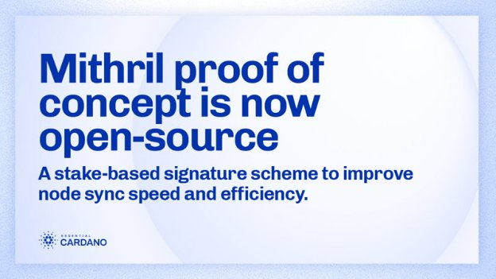

# Mithril bằng chứng POC hiện là mã nguồn mở

### **Mithril là một sơ đồ chữ ký dựa trên cổ phần giúp cải thiện tốc độ và hiệu quả của thời gian đồng bộ hóa cho các node tham gia mạng. Tìm hiểu cách tham gia**

 29 August 2022[ Olga Hryniuk](/en/blog/authors/olga-hryniuk/page-1/) 4 phút đọc

### [**Olga Hryniuk**](/en/blog/authors/olga-hryniuk/page-1/)

Technical Writer

Marketing &amp; Communications

- 
- 

Khi Cardano mở rộng quy mô, các nhóm kỹ sư của Input Output Global (IOG) đang làm việc trên một loạt các giải pháp để tăng hiệu suất mạng. Mithril là một trong những giải pháp như vậy, nhằm hợp lý hóa tốc độ và hiệu quả đồng bộ hóa dữ liệu giữa các ứng dụng.

Trong [chương trình 360 của tháng 7](https://www.youtube.com/watch?v=mHHVaxkHFrE&t=478s) , [Arnaud Bailly](https://iohk.io/en/team/arnaud-bailly) - kiến trúc sư kỹ thuật của IOG - đã chia sẻ bản cập nhật phát triển Mithril.

## **Tầm quan trọng của Mithril đối với các hoạt động của Cardano**

Bằng cách chạy một node Cardano, người dùng có thể tương tác với chuỗi khối Cardano. Mạng kết hợp hàng nghìn node thành một hệ thống thống nhất, nơi chúng giao tiếp với các node khác để chia sẻ thông tin về các block và giao dịch mới.

Vì mỗi node giữ một bản sao đầy đủ của chuỗi khối, nên việc đồng bộ hóa node cần có thời gian - mỗi node mới cần tải xuống và xác minh từng block. Ví dụ: Daedalus là một ví node đầy đủ tải xuống bản sao đầy đủ của chuỗi khối Cardano và xác nhận độc lập mọi giao dịch trong lịch sử của nó. Điều này đòi hỏi các yêu cầu phần mềm và lưu trữ cụ thể, điều này cũng có nghĩa là nó đòi hỏi nhiều thời gian hơn để đồng bộ hóa trạng thái chuỗi.

Mục tiêu của Mithril là tận dụng mạng hiện có để cung cấp ảnh chụp nhanh được chứng nhận của tất cả hoặc một phần trạng thái blockchain. Những ảnh chụp nhanh này có thể hữu ích theo nhiều cách khác nhau. Nhóm IOG đã và đang làm việc trên một ca sử dụng đầu tiên để tận dụng Mithril để khởi động một node Cardano *đầy đủ* một *cách nhanh chóng và hiệu quả* .

## **Mithril hoạt động như thế nào?**

Mithril dựa trên khái niệm cổ phần tương tự cung cấp năng lượng cho giao thức đồng thuận bằng chứng cổ phần của Ouroboros. Với Ouroboros, các bên liên quan được bầu chọn để tạo ra các block một cách ngẫu nhiên với cơ hội tỷ lệ thuận với số cổ phần mà họ sở hữu hoặc ủy quyền. Với Mithril, các bên liên quan có thể ký trạng thái sổ cái hiện tại theo cơ chế xổ số, trong đó xác suất đóng góp cũng tỷ lệ với số tiền của họ. Các chữ ký do các bên liên quan tạo ra sau đó được kết hợp hoặc tổng hợp lại thành một chữ ký đa Mithril, chỉ có thể được tạo ra khi một ngưỡng được xác định trước (số lượng đại biểu qui định - quorum) của tổng số cổ phần được đóng góp. Mithril dựa vào sự đảm bảo về tính duy nhất được cung cấp bởi các nguyên lý mật mã cơ bản để đảm bảo quá trình xổ số.

Mithril hoạt động trên sổ cái chính, đảm bảo không can thiệp vào các hoạt động của mainnet và vì các chữ ký được tạo ra được cô đọng, nó yêu cầu tối thiểu tài nguyên bổ sung và sử dụng băng thông cho các node ký.

Điểm đặc biệt của chứng chỉ Mithril là chúng mang các thuộc tính bảo mật giống như giao thức cơ bản của Cardano - Ouroboros. Tính bảo mật của Mithril chủ yếu dựa vào việc phân phối cổ phần của chính Cardano mà không cần thiết lập đáng tin cậy. Mạng Mithril có thể đạt được mức độ bảo mật cao nhất miễn là tất cả các SPO đều tham gia vào mạng.

## **Tiến trình phát triển**

IOG đã giới thiệu Mithril trong Hội nghị thượng đỉnh Cardano năm 2021. Kể từ đó, nhóm đã có những bước phát triển ổn định.

Nhóm đã làm việc để phát triển thư viện Mithril Core triển khai các tính năng nguyên thủy mật mã đầy đủ của giao thức Mithril. Họ cũng đã làm việc để tạo ra Mạng Mithril, được triển khai trên nền thư viện Mithril Core. Trong mô hình bằng chứng khái niệm (PoC) hiện tại, nó bao gồm các thành phần sau:

- **Mithril Signer**: node hoạt động minh bạch trên các node Cardano của nhà điều hành nhóm cổ phần và ký tên riêng vào trạng thái sổ cái.
- **Mithril Aggregator**: node đáng tin cậy do IOG điều hành, điều phối công việc của các node Mithril Signer và tập hợp các chữ ký riêng lẻ của chúng để tạo ra đa chữ ký Mithril và các chứng chỉ liên quan của chúng. Nó cũng chịu trách nhiệm tạo và lưu trữ kho lưu trữ ảnh chụp trạng thái sổ cái.
- **Mithril Client**: node được sử dụng để khôi phục toàn bộ node Cardano bằng cách truy xuất ảnh chụp nhanh từ xa và chuỗi chứng chỉ của nó từ Mithril Aggregator và bằng cách xác minh tính hợp lệ của ảnh chụp nhanh nhờ các nguyên thủy mật mã Mithril.

Hiện tại, nhóm đang ở giai đoạn cuối cùng của quá trình tối ưu hóa và thử nghiệm Mạng Mithril trong phiên bản tập trung đầu tiên (tức là chạy với Mithril Aggregator do IOG điều hành). Giai đoạn này sẽ cho phép các kỹ sư và nhà nghiên cứu của IOG làm việc để phát hành phiên bản *&nbsp;phi tập trung * hơn của Mạng Mithril trên mạng chính Cardano (nơi các nhà khai thác cổ phần cũng có thể tự chạy Mithril Aggregators). Các trường hợp sử dụng mới sẽ được bổ sung thêm như triển khai Mithril trong các ứng dụng khách và ví nhẹ.

[Kho lưu trữ Mithril hiện là nguồn mở](https://github.com/input-output-hk/mithril) . Nếu bạn muốn tìm hiểu thêm, hãy xem [tài liệu chứng minh khái niệm của Mithril](https://mithril.network/doc/) và tham gia [kênh Discord](https://discord.gg/WmSVtQ5PjZ) này để thảo luận thêm.

*Bài đăng trên blog này đã được chuẩn bị với sự hợp tác của Arnaud Bailly và Jean-Philippe Raynaud.

Bài này được dịch bởi Thái Ngô, review bởi tienna, đắng bài bởi Nguyễn Hiệu

Nguồn bài viết [tại đây](https://iohk.io/en/blog/posts/2022/08/29/mithril-proof-of-concept-is-now-open-source/)

*Dự án này được tài trợ bởi Catalyst*
