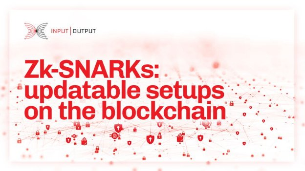

# Zk-SNARKs: thiết lập có thể cập nhật trên blockchain

### **Zk-SNARKs (Bằng chứng không trí thức) đã được chứng minh như là 'Con dao đa năng' cho chuỗi khối và sổ cái phân tán, với các ứng dụng về quyền riêng tư, khả năng tương tác và khả năng mở rộng**

 1 tháng 9 năm 2022  [Thomas Kerber](/en/blog/authors/thomas-kerber/page-1/)  12 phút đọc

### [**Thomas Kerber**](/en/blog/authors/thomas-kerber/page-1/)

Technical Architect

Engineering

- 
- 
- 
- 

Kể từ khi được giới thiệu, các bằng chứng zero-knowledge (ZKPs) đã được sử dụng để hỗ trợ các ứng dụng tiềm năng khác nhau, từ việc có thể kiểm chứng đánh giá nguồn lực thuê bên ngoài đến các thông tin có thể xác thực ẩn danh, có rất nhiều yêu cầu thiết lập sự cân bằng giữa quyền riêng tư và tính toàn vẹn. ZKP cho phép một bên chứng minh với bên khác rằng một bản báo cáo hoặc một tuyên bố nhất định là đúng mà không tiết lộ nội dung của nó. Việc áp dụng ZKP trong nhiều trường hợp sử dụng trên chuỗi góp phần giải quyết các vấn đề về quyền riêng tư, khả năng tương tác và khả năng mở rộng.

Trong bài đăng này, chúng ta sẽ xem xét các loại ZKP khác nhau và các trường hợp sử dụng cụ thể của chúng. Chúng tôi cũng thảo luận về zk-SNARK, biết được một số vấn đề trong ứng dụng của nó và đề xuất một cơ chế blockchain với các đặc điểm an toàn trong các điều kiện tương đồng trong giao thức blockchain. Bài viết dựa trên tài liệu nghiên cứu ' [Khai thác bảo mật: Cách khởi động chuỗi khối Snarky](https://iohk.io/en/research/library/papers/mining-for-privacy-how-to-bootstrap-a-snarky-blockchain/) ' được viết bởi Thomas Kerber, Aggelos Kiayias và Markulf Kohlweiss.

## **Các loại ZKP khác nhau**

Trong thiết lập blockchain, người dùng thường tải xuống và xác minh mọi giao dịch được công khai lên mạng. Điều này có nghĩa là kích thước bằng chứng càng nhỏ và thời gian xác minh càng nhanh là rất quan trọng đối với việc triển khai các giao thức zero-knowledge trong thực tế. Có một số trường hợp thực tế để bạn lựa chọn đánh đổi giữa hiệu suất và các giả định về mật mã:

- **Non-interactive zero-knowledge arguments (NIZKs)** : bằng chứng trao đổi không tương tác không kiến thức. NIZK có thể phức tạp nhưng có lợi, dựa trên các giả định mật mã tiêu chuẩn và thường đáp ứng các đảm bảo an ninh mạnh mẽ.
- **Succinct non-interactive zero-knowledge arguments (SNARGs)** : bằng chứng đạt được sự ngắn gọn với sự đánh đổi các giả định mật mã mạnh hơn dẫn đến các đảm bảo bảo mật thường yếu hơn.
- **Succinct non-interactive zero-knowledge arguments of knowledge (SNARKs or sometimes zk-SNARKs)** : đây là các SNARG cũng là bằng chứng về knowledge và zero-knowledge. Cái tên này cũng được yêu thích vì bài thơ '[The Hunting of the Snark](https://www.poetryfoundation.org/poems/43909/the-hunting-of-the-snark)' của Lewis Carrol
- **Succinct transparent arguments of knowledge (STARKs)** : transparent tính minh bạch ở đây đề cập đến việc chỉ yêu cầu thiết lập một hàm băm đáng tin cậy. Điều này có lợi nhưng có thể đi kèm với chi phí hiệu suất.

Hiện tại, hệ thống bằng chứng đáng chú ý nhất dưới góc độ của người xác minh là succinct non-interactive argument of knowledge, hay gọi tắt là zk-SNARK. Zk-SNARK có kích thước bằng chứng không đổi nhỏ và chi phí xác minh theo thời gian không đổi ngay cả đối với các liên kết lớn tùy ý. Zk-SNARKs đã được chứng minh là 'Con dao đa năng' cho chuỗi khối và sổ cái phân tán, với các ứng dụng về quyền riêng tư, khả năng tương tác và khả năng mở rộng.

### **Các trường hợp được sử dụng**

Các trường hợp khác sử dụng của zk-SNARK để cải thiện hiệu suất và các thuộc tính tinh gọn của hệ thống. Các trường hợp sử dụng khác sử dụng zk-SNARK để cải thiện quyền riêng tư. Một số trường hợp là hỗn hợp, trong đó cả hai khía cạnh đều đóng một vai trò nào đó.

Trong cài đặt blockchain, có tính đến hiệu suất và tính tinh gọn, zk-SNARKS có thể đóng góp rất nhiều vào các trường hợp sử dụng như:

- **Máy khách nhẹ** : để nâng cao hiệu quả của các thông số và cấu trúc tổng thể của các ứng dụng. Các hệ thống bằng chứng hiệu quả (không yêu cầu zero-knowledge) đóng một vai trò quan trọng trong việc khởi động các ứng dụng khách nhẹ. Hệ thống chứng minh đệ quy cũng hoạt động như một kết hợp tốt cho trường hợp sử dụng này để đảm bảo an toàn cho đệ quy không bị ràng buộc cũng như việc sử dụng các hàm bên ngoài (ví dụ, hàm băm) trong các chứng minh đệ quy.
- **Hợp đồng thông minh** : để giảm tắc nghẽn sổ cái có thể xảy ra do thực thi hợp đồng thông minh công khai. Việc biên dịch mã trên chuỗi thành SNARK, với thời gian xác minh không đổi hoặc theo logarit, có thể cho phép các trình xác thực phức tạp hơn.
- **Bằng chứng về công việc hữu ích (PoUW)** : SNARK có thể là chìa khóa để xác minh 'các tính toán hữu ích' được thực hiện bởi các thợ đào, nếu không thì sẽ rất tốn kém để xác thực trên chuỗi.

Từ góc độ quyền riêng tư, nhiều ứng dụng sử dụng bằng chứng zero-knowledge để triển khai các giải pháp thanh toán an toàn, các lựa chọn trao đổi, quản lý danh tính, bỏ phiếu, đấu giá, thống kê có thể xác minh (một dạng oracle của blockchain) hoặc giao tiếp ẩn danh được khuyến khích. Các trường hợp sử dụng có thể bao gồm:

- **Hợp đồng thông minh riêng** : Hiện tại SNARK không thể thiếu trong thiết kế hợp đồng thông minh riêng. Hai điều rất quan trọng: tính phổ biến, để hỗ trợ các hợp đồng thông minh do người dùng triển khai và dễ biên dịch. Tính biểu đạt của hợp đồng thông minh có thể được loại bỏ để giảm các vấn đề về bộ nhớ lưu trữ, các yêu cầu, bằng cách ràng buộc các vòng lặp và đệ quy, do đó không cần thành phần SNARK đệ quy. Về cơ bản, một số tập hợp con của ngôn ngữ hợp đồng cấp cao có thể được biên dịch thành chu trình SNARK.
- **Thanh toán cá nhân** : tài sản có thể được coi là một dạng xác nhận danh tính cụ thể bao gồm mô hình hóa sự hữu hạn. Một đề xuất cho các khoản thanh toán cá nhân cũng có thể hỗ trợ nhiều tài sản và các tokens không thể thay thế, đồng thời kết nối các tokens này với các hợp đồng thông minh.
- **Quản lý danh tính** : Trong bối cảnh thông tin xác thực có thể xác minh, tổ chức phát hành có thể xác nhận các yêu cầu về đối tượng bằng cách tạo các mật mã (credentials). Các đối tượng sau đó xuất trình thông tin đăng nhập của họ cho những người dùng khác đang đóng vai trò là người xác minh. Người xác minh sau đó có thể xác thực rằng một tổ chức phát hành đã xác nhận các tuyên bố về chủ thể xuất trình thông tin xác thực.
- **Bỏ phiếu và kho bạc** : Bằng chứng ZK có thể được sử dụng trong bỏ phiếu kho bạc. Ví dụ, một giao thức [hệ thống kho bạc tiền mã hóa](https://eprint.iacr.org/2018/435.pdf) cung cấp một kế hoạch bỏ phiếu bảo vệ quyền riêng tư, trong đó các lá phiếu của cử tri được mã hóa và sau đó được đối chiếu bằng cách sử dụng tính toán đồng hình. Bằng chứng ZK trong kho bạc là các giao thức Sigma không tương tác dựa trên DLP được sử dụng để chứng minh tính đúng đắn của các thông điệp được mã hóa ở các giai đoạn khác nhau của giao thức (ví dụ: lá phiếu của cử tri được mã hóa có chứa một lá phiếu được soạn chính xác).

Các trường hợp sử dụng hỗn hợp bao gồm:

- **&nbsp;Blockchain oracles**: SNARK có thể giảm chi phí xác minh khi tổng hợp dữ liệu từ nhiều nguồn và chúng có thể giảm kích thước dữ liệu trên chuỗi được đưa lên bằng cách chỉ gồm giá trị tổng hợp và bằng chứng, thay vì tất cả các điểm dữ liệu. Để đạt được hai đặc tính này, các bên phải có khả năng chứng minh một cách ngắn gọn kiến thức về chữ ký trên một số điểm dữ liệu cũng như giá trị trung bình/trung vị/phương sai tương ứng.
- **Sidechains** : một chuỗi trong cấu hình chuỗi chính có thể hoạt động như một ứng dụng máy khách nhẹ đối với chuỗi kia, xác minh các giao dịch xuyên chuỗi trên chuỗi khác mà không cần phải xác minh toàn bộ chuỗi đó. Sự khác biệt là việc neo này thường được duy trì lâu dài, và do đó, các bằng chứng có thể được cung cấp thường xuyên và theo kiểu 'có thể cập nhật'. Xem [Bằng chứng cổ phần Sidechains](https://eprint.iacr.org/2018/1239) để biết thêm thông tin.

### **Các vấn đề đã biết**

Non-interactive zero-knowledge yêu cầu một số ngẫu nhiên được chia sẻ hoặc một chuỗi tham chiếu chung. Đối với nhiều hệ thống ngắn gọn, cần một thuộc tính mạnh hơn:

Không chỉ cần một giá trị ngẫu nhiên được chia sẻ mà còn phải tuân theo một cấu trúc cụ thể. Một chuỗi tham chiếu có cấu trúc (SRS) thường bao gồm các phần tử nhóm có liên quan, ie: g^x^i với mọi i∈𝕫n.

Cách dễ nhất để lấy mẫu một chuỗi tham chiếu như vậy từ ngẫu nhiên công khai cho thấy số mũ được sử dụng - và kiến thức về những giá trị này phá vỡ tính hợp lý của chính hệ thống chứng minh. Để làm cho vấn đề tồi tệ hơn, tính bảo mật của các hệ thống này (cùng những điều khác) thường dựa vào kiến thức về các giả định lũy thừa, trong đó nêu rõ rằng để tạo các phần tử nhóm liên quan theo cách như vậy đòi hỏi phải biết các số mũ cơ bản và do đó bất kỳ trình lấy mẫu SRS nào sẽ phải 'biết' các số mũ được sử dụng và đáng tin cậy để xóa chúng, trong thực tế, trở thành một điểm thất bại duy nhất cho hệ thống cơ bản.

Tính toán nhiều bên độc lập an toàn (MPC) có thể đang được sử dụng sẽ làm giảm sự tin cậy trong thiết lập quy trình như vậy. Tuy nhiên, việc lựa chọn những người tham gia để tính toán an toàn và xác minh việc tạo SRS bằng giao thức MPC giữ lại một yếu tố tập trung. Sử dụng MPC vẫn là một yếu tố gây tranh cãi trong việc thiết lập một hệ thống phi tập trung yêu cầu SNARK.

## **Giải quyết các vấn đề về quyền riêng tư với việc tạo SRS an toàn**

Dãy tham chiếu có cấu trúc có thể cập nhật (updatable structured reference string - uSRS) được khởi tạo an toàn bằng cách sử dụng sổ cái phân tán bằng cách yêu cầu người tạo khối thực hiện cập nhật trên uSRS đang phát triển trong thời gian thiết lập ban đầu. Sau khi chờ thống nhất về uSRS cuối cùng, nó có thể được sử dụng một cách an toàn.

Bằng chứng này dựa trên hoạt động cơ bản của sổ cái kiểu Nakamoto: những người dùng khác nhau có thể mở rộng chuỗi khối nếu họ có thể đáp ứng một số điều kiện, đồng thời kết hợp với các khó khăn làm cho những kẻ tấn công bị hạn chế về số lượng phần mở rộng mà họ có thể thực hiện. Với cấu trúc như vậy, chúng tôi liên kết bản cập nhật uSRS với mỗi khối trước thời điểm 𝛿1. Thời điểm này được chọn sao cho các thuộc tính bảo mật của sổ cái đảm bảo rằng ít nhất một trong các khối là đúng trong mỗi chuỗi cạnh tranh tại thời điểm này.

Điều này có thể được xây dựng từ chức năng cơ bản của sổ cái tương tự bổ sung người lãnh đạo, được lấy từ thông tin mà các thợ đào nhúng vào các khối của họ để mã hóa các bản cập nhật uSRS. Điều này là đủ chung để cho phép các mục đích sử dụng khác. Ý tưởng cơ bản là chỉ ra rằng sổ cái thực hiện cập nhật uSRS ở trạng thái lãnh đạo của nó tương đương với sổ cái không thực hiện cập nhật uSRS, nhưng đi kèm với một uSRS an toàn. Sau thời gian 𝛿1, người dùng đợi thêm một khoảng thời gian 𝛿2 cho đến khi tiền tố chung đảm bảo rằng tất cả các bên đồng ý về chuỗi tham chiếu.

### **Tóm tắt sổ cái được đề xuất**

Việc xây dựng chức năng chuỗi tham chiếu có cấu trúc có thể cập nhật của chúng tôi dựa trên các thuộc tính của *tiền tố chung* , *chuỗi chất lượng * *và chuỗi tăng trưởng* được xác định trong phân tích xương sống Bitcoin của Garay và cộng sự, cho các thuật toán đồng thuận kiểu Nakamoto:

- **Tiền tố chung** . Cho chuỗi hiện tại 𝛱1 và 𝛱2 của hai bên và loại bỏ *k* khối khỏi chuỗi đầu tiên, nó là tiền tố của chuỗi thứ hai: 𝛱1⌊k ≺𝛱2.
- **Tồn tại chuỗi chất lượng**. Đối với chuỗi hiện tại của bất kỳ bên nào 𝛱, bất kỳ khối *l* liên tiếp nào trong chuỗi này sẽ bao gồm ít nhất một khối được tạo bởi một bên thân thiện.
- **Chuỗi tăng trưởng** . Nếu chuỗi của một bên có độ dài *c*, thì *s* khe thời gian sau đó, nó sẽ có độ dài ít nhất là *c + 𝛾* .

### **Xây dựng uSRS phi tập trung**

Cấu trúc được đề xuất của chúng tôi, được trình bày chi tiết trong bài báo [*về Khai thác quyền riêng tư*](https://eprint.iacr.org/2020/401.pdf) , rất đơn giản: mỗi chuỗi được liên kết với một uSRS cụ thể và khi người khai thác mở rộng chuỗi, họ cũng thực hiện cập nhật uSRS. Tại nguồn gốc của chuỗi, có thể sử dụng tính ngẫu nhiên đã biết (hoặc thậm chí không có ngẫu nhiên). Nguyên tắc đằng sau thiết kế này rất đơn giản: khả năng cập nhật của uSRS đảm bảo rằng nếu một cập nhật duy nhất được thực hiện trung thực (cả sử dụng ngẫu nhiên thực sự và xóa ngẫu nhiên này sau khi cập nhật được thực hiện), uSRS kết quả có thể được sử dụng một cách an toàn. Chúng tôi dựa vào thuộc tính *chất lượng chuỗi tồn tại* để đảm bảo điều này - khi *l* khối đã được tạo, ít nhất một trong số này phải được tạo bởi người khai thác trung thực và do đó sau *l* khối, uSRS của chuỗi được bảo mật.

Tuy nhiên, vẫn chưa đủ để biết rằng chuỗi tham chiếu của một chuỗi cụ thể là an toàn - đối với hầu hết các ứng dụng thực tế, chúng tôi muốn tất cả người dùng đồng ý về chuỗi tham chiếu. Điều này được cung cấp bởi thuộc tính *tiền tố chung* , đảm bảo rằng đối với bất kỳ chuỗi nào dài *l + k* khối, tất cả những người dùng khác sẽ có cùng một chuỗi tham chiếu như chuỗi được tạo bởi chuỗi này - miễn là người dùng ngừng cập nhật sau *l* khối!

Cuối cùng, *phát triển chuỗi* đảm bảo rằng sự kiện mà chúng tôi quan tâm - khi mọi người đồng ý về chuỗi tham chiếu - cuối cùng sẽ xảy ra. Nó đảm bảo rằng người dùng cuối cùng sẽ có một chuỗi chiều dài *l + k* . Cụ thể, cứ mỗi *s* đơn vị thời gian, các khối được tạo ra, thì sự kiện sẽ xảy ra chậm nhất tại thời điểm ⌈ ( *l + k* ) / *s* ⌉.

Điều này là tốt trong phần tóm tắt, nhưng để lại các câu hỏi về tính thực tiễn: những phân tích trừu tượng như vậy giả định rằng các bản cập nhật có thể được tạo ra với chi phí thấp hoặc không tốn kém và chúng không ảnh hưởng đến quy trình khai thác tiêu chuẩn. Tuy nhiên, điều này không hoàn toàn đúng với khai thác bằng chứng công việc:

1. Việc cập nhật tương đối tốn kém, mất 5-10 phút để tính toán, tùy thuộc vào kích thước của uSRS mục tiêu.
2. Có thể gian lận trong các bản cập nhật, thực hiện chúng nhanh hơn nhưng không cần thêm tính bảo mật của chuỗi tham chiếu.

Kết hợp lại, các yếu tố này đặt ra một thách thức, đặc biệt là trong thiết lập bằng chứng công việc, nơi cần thực hiện cập nhật *trước khi* người khai thác có thể bắt đầu khai thác một khối. Điều này làm trì hoãn các thợ đào chân chinh, trong khi thợ đào gian lận đã đóng khối!. Do đó, độ khó khai thác (tương ứng với thời gian dự định giữa các khối) không được quá thấp, vì nó càng thấp thì lợi ích của người khai thác gian lận càng lớn. Mặt khác, độ khó cao đương nhiên dẫn đến thời gian đạt được sự đồng thuận lâu hơn. Sự cân bằng này được biểu đồ trong Hình 1.

Với điều kiện độ khó được hiệu chỉnh một cách thích hợp, một phân tích mô phỏng cho thấy rằng hiệu ứng này không làm hỏng bảo mật tổng thể. Tùy thuộc vào xác suất thất bại ( *є* ) mà chúng tôi sẵn sàng chấp nhận và chống lại sức mạnh khai thác của kẻ tấn công ( *а* ) mà chúng tôi muốn bảo vệ, uSRS có thể được tạo an toàn với quy trình trong vòng vài giờ hoặc một kịch bản bi quan hơn trong vài tháng, như trong Hình 1.

Hình 1. Thời gian cần thiết cho đến khi đảm bảo có ít nhất một bản cập nhật đúng, như một chức năng của thời gian đóng khối mục tiêu

*Nguồn: ' [Khai thác quyền riêng tư: Cách khởi động một bài báo nghiên cứu về chuỗi khối Snarky](https://iohk.io/en/research/library/papers/mining-for-privacy-how-to-bootstrap-a-snarky-blockchain/) '*

Một vấn đề tương tự cũng xảy ra khi xem xét hành vi hợp lý - những người khai thác chỉ tìm kiếm lợi nhuận cũng sẽ cố gắng gian lận trong các bản cập nhật của họ, không phải vì ác ý, mà đơn giản là vì họ có thể tạo ra các khối nhanh hơn nếu họ làm vậy. Điều này có thể không xảy ra nếu bổ sung thưởng cho hành vi tốt - thực tế có thể yêu cầu lấy mẫu các thợ đào để cung cấp tính ngẫu nhiên cho các bản cập nhật của họ và chứng minh rằng nó đã được lấy mẫu theo cách thích hợp (ví dụ: sử dụng hàm băm). Nếu họ có thể làm như vậy, họ sẽ nhận được phần thưởng bổ sung, bù đắp bất kỳ tổn thất nào của họ do không gian lận.

Tóm lại, khả năng ứng dụng của zk-SNARK mang lại rất nhiều lợi ích cho các trường hợp sử dụng trên chuỗi khác nhau giải quyết các vấn đề về quyền riêng tư, khả năng tương tác và khả năng mở rộng. Mặc dù thiết lập đáng tin cậy, được yêu cầu đối với nhiều zk-SNARK, dường như trái ngược với bản chất phi tập trung của sổ cái phân tán, nó có thể được thực hiện theo cách phân cấp hoàn toàn cho SNARK với các chuỗi tham chiếu có thể cập nhật. Mặc dù về nguyên tắc, cũng có thể sử dụng SNARK trong suốt như [Halo](https://eprint.iacr.org/2020/1536.pdf) , các kỹ thuật được mô tả ở trên cho phép SNARK như [Plonk](https://eprint.iacr.org/2019/953.pdf) (có thể hiệu quả hơn tùy theo trường hợp), dựa trên các chuỗi tham chiếu có thể cập nhật, cũng được sử dụng một cách an toàn cho- các ứng dụng chuỗi - không còn là trường hợp các thiết lập SNARK quá mờ để tin tưởng, nếu chúng đã từng. Bài này được dịch bởi LinhPool, Review và đăng bài bải Nguyễn Hiệu. Nguồn bài dịch [tại đây](https://iohk.io/en/blog/posts/2022/09/01/zk-snarks-updatable-setups-on-the-blockchain) *Dự án này được tài trợ bới Catalyst*
