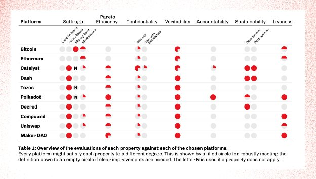

# Hệ thống hóa quản trị blockchain

### **Xem xét nghiên cứu của IOG về 'Quản trị blockchain' và cách thiết lập một hệ thống quản trị mạnh mẽ**

 29 tháng chín 2022 [Philip Lazos](/en/blog/authors/philip-lazos/page-1/) 8 phút đọc

### [**Philip Lazos**](/en/blog/authors/philip-lazos/page-1/)

Nhà nghiên cứu

Nghiên cứu học thuật

- 

Mục tiêu ban đầu của các hệ thống blockchain là đạt được sự đồng thuận phi tập trung đối với các giao dịch tiền tệ. Cho đến nay, điều này đã thành công, với các nền tảng khác nhau cung cấp nhiều cấp độ phi tập trung khác nhau, một số trong số đó khá mạnh mẽ. Kể từ đó, các blockchain đã được mở rộng để có nhiều khả năng hơn những gì Bitcoin dự định ban đầu.

Tuy nhiên, tâm lý 'mã là luật' vẫn phổ biến và thường mâu thuẫn với nhu cầu của cộng đồng. Thông thường, một hard fork sẽ là giải pháp cho sự mâu thuẫn như vậy, một số phận mà cả Bitcoin và Ethereum đều không thể tránh khỏi. Về mặt triết học, người ta có thể khẳng định rằng điều này là hợp lý và có lẽ không thể tránh khỏi. Có lẽ lập trường này sẽ dễ bảo vệ hơn nếu hậu quả của nó ít nghiêm trọng hơn. Tài năng kỹ thuật và tài nguyên tính toán bị chia rẽ, tài sản kỹ thuật số bị trùng lặp và nhiều người dùng mâu thuẫn buộc phải chọn di chuyển, khiến các dự án bị bỏ lại và tạo cơ hội cho gian lận.

Bài đăng trên blog này cung cấp một cái nhìn tổng quan về nghiên cứu của Input Output Global, Inc. (IOG) về 'Quản trị blockchain' và đặc biệt là các cách để hệ thống hóa một lĩnh vực đa dạng như vậy, áp dụng hiểu biết này cho Cardano và một số hướng phát triển tiềm năng cho ngành. Một trong những ấn phẩm đầu tiên trong lĩnh vực này, ' [SoK: Quản trị blockchain](https://arxiv.org/abs/2201.07188) ' các thông tin chi tiết hơn và nhiều nội dung khác sẽ được trình bày trong tương lai.

## **Thiết lập một hệ thống quản trị mạnh mẽ**

Nhiều blockchain hiện đại đã chọn chính thức áp dụng một số hình thức quản trị trên hoặc ngoài chuỗi, đây là một giải pháp thay thế mạnh mẽ và lịch sự hơn. Tất nhiên, có rất nhiều tài liệu đằng sau các hình thức của chính phủ, dân chủ và bầu cử truyền thống có ảnh hưởng đến các thiết kế quản trị hiện tại. Tuy nhiên, có nhiều sự khác biệt giữa các blockchain, ngay cả khi các mục tiêu cuối cùng là tương tự nhau.

Tại IOG, chúng tôi cố gắng chắt lọc phương pháp quản trị bằng **bảy** thuộc tính khác nhau. Như thường xảy ra trong bất kỳ thiết kế phức tạp nào, có sự đánh đổi đáng kể giữa cách tiếp cận như vậy là sự cân bằng phù hợp và mang lại cho mỗi hệ thống quản trị những đặc điểm riêng. Các thuộc tính có thể được nhóm lại thành bốn nhóm, được thể hiện bằng hình ảnh trong hình sau:

Hình 1. Thuộc tính quản trị blockchain

Trước khi tìm hiểu sâu hơn, điều quan trọng cần nhấn mạnh là 'hoạt động bên trong' của một hệ thống quản trị không phải là một phần của quá trình hệ thống hóa này. Chúng tôi chỉ quan tâm đến việc đạt được sự kết hợp tốt giữa các thuộc tính đó: liệu hệ thống cơ bản có sử dụng nền tảng, DAO, token quản trị hay không hay chỉ là một **cơ chế** phục vụ chúng. Hơn nữa, lưu ý rằng các từ khóa *cân nhắc* và *thực hiện* được chuyển sang màu xám. Mặc dù quan trọng đối với bất kỳ hệ thống quản trị nào (ví dụ: để đảm bảo rằng các cử tri được cung cấp đầy đủ thông tin và các quyết định theo kế hoạch được thực hiện), nhưng chúng nằm ngoài phạm vi của chúng tôi, trọng tâm nằm trong quá trình giữa hai thuộc tính này và giả định rằng chúng hoàn toàn phù hợp. Cuối cùng, điều quan trọng cần lưu ý là việc 'đánh dấu' tất cả các thuộc tính đó sẽ không làm cho một hệ thống quản trị trở nên hoàn hảo. Tuy nhiên, điều quan trọng là phải xem xét tất cả chúng và cẩn thận quyết định nên theo đuổi cái nào.

Dưới đây chúng tôi cung cấp một mô tả ngắn gọn về các thuộc tính này.

### **Quyền bầu cử**

Rõ ràng, việc xem xét đầu tiên nên là xác định người dùng nào sẽ có khả năng tham gia quản trị với tư cách là cử tri hoặc đại diện. Mặc dù điều này có vẻ đơn giản (nhưng thực tế là hàng nghìn năm lịch sử loài người đã chứng minh điều ngược lại), nhưng nó khá khó khăn trong một hệ thống blockchain. Có nhiều cách để tương tác với tiền mã hoá, bao gồm tham gia vào giao thức đồng thuận (bằng cách cung cấp tài nguyên cơ bản, chẳng hạn như sức mạnh tính toán hàm băm) hoặc sở hữu cổ phần. Các vai trò này thậm chí có thể đa dạng hơn trong các ứng dụng tài chính phi tập trung (DeFi). Ngoài ra, do tương tác ẩn danh, nên có khả năng xảy ra các cuộc tấn công Sybil và dễ dàng chuyển sang một blockchain khác, những người bỏ phiếu thường không được đối xử bình đẳng mà *được tính trọng số* theo phần chia sẻ của họ đối với một số tài nguyên trên chuỗi. Chúng tôi xác định các loại phổ biến nhất của quyền bầu cử. Là *các loại dựa trên token* và * dựa trên khai thác, chế độ trọng dụng nhân tài (* trong đó các quyền được đảm bảo dựa trên những đóng góp tích cực trước đó) và dựa trên *danh tính* , được liên kết với bằng chứng về tư cách cá nhân và vẫn chưa được khám phá nghiêm túc, do xung đột với tính ẩn danh.

### **Hiệu quả Pareto**

Khi đã xác định được ai sẽ có thể bỏ phiếu, bước tiếp theo là biến sở thích của họ thành hành động. Đúng như dự đoán, điều này nói thì dễ hơn làm, với những rào cản cả về mặt thực tế và toán học. Về mặt lý thuyết, nó đã được chứng minh là không thể *xác định* được kết quả 'tốt nhất' (hoặc *mong muốn* nhất) sẽ là gì. Giả định điển hình là mọi cử tri đều có thứ hạng chứa mọi phương án thay thế, thứ hạng này thậm chí có thể được liên kết với điểm số mô tả mức độ hạnh phúc của cử tri đó nếu được chọn. Những lựa chọn thay thế này có thể là ứng cử viên, kết quả của cuộc trưng cầu dân ý, v.v. Theo trực giác, người ta có thể định nghĩa 'tối ưu' là ứng cử viên giành chiến thắng trong tất cả các cuộc bầu cử *theo cặp* (hoặc đối đầu). Ứng cử viên này được gọi là người chiến thắng *Condorcet* nhưng không phải lúc nào cũng tồn tại. Trên thực tế, khi có ba lựa chọn thay thế trở lên, sẽ không có cơ chế bỏ phiếu lý tưởng: nói một cách đại khái, cử tri sẽ được hưởng lợi bằng cách trình bày sai sở thích của họ một cách chiến lược hoặc một số đặc tính cơ bản hơn nhiều (hơn là không chọn người chiến thắng Condorcet) sẽ bị vi phạm. Có nhiều kết quả như vậy, [trong đó Định lý Arrow là](https://en.wikipedia.org/wiki/Arrow%27s_impossibility_theorem) nổi tiếng nhất.

Thay vào đó, các quy tắc bỏ phiếu cố gắng nắm bắt một số đảm bảo yếu hơn. Hiệu quả Pareto được cho là yếu nhất. Một quy tắc bỏ phiếu thỏa mãn nó nếu phương án được chọn không *hoàn toàn* tệ hơn phương án khác. Tệ hơn nữa, chúng tôi muốn nói rằng mọi cử tri đều thờ ơ hoặc thích một số lựa chọn thay thế khác. Một hệ thống quản trị có nhiều quy tắc bỏ phiếu (chẳng hạn như trưng cầu dân ý hoặc bầu cử hội đồng), vì vậy trọng tâm của chúng tôi là xác định khả năng một phương án rõ ràng dưới mức tối ưu được chọn là bao nhiêu và khả năng đó có thể tồi tệ đến mức nào.

### **Bảo mật và Kiểm chứng**

Hai thuộc tính được ghép nối này đều nhằm mục đích hợp pháp hóa kết quả và hỗ trợ niềm tin mà người dùng đặt vào hệ thống quản trị. Ở cấp độ cao, cả hai đều đơn giản. Tính bảo mật có thể được chia nhỏ thành bí mật (nếu đối thủ không thể học được bất cứ điều gì bằng cách quan sát phiếu bầu) và chống cưỡng chế, trong đó cử tri thực sự có thể đánh lừa kẻ tấn công về hành động của họ, trong khi bí mật bỏ phiếu mà họ muốn. Cả hai thuộc tính này đều là thách thức về mặt kỹ thuật và thường chỉ thỏa mãn một hình thức bảo mật yếu, giả sử rằng các bút danh của cử tri không thể được kết nối lại với chúng. Những thuộc tính này mâu thuẫn với khả năng kiểm chứng. Một cuộc bỏ phiếu càng an toàn thì càng khó xác minh kết quả một cách độc lập mà không làm rò rỉ thông tin.

### **Trách nhiệm giải trình và tính bền vững**

Cho đến nay, các thuộc tính trước đó áp dụng trong một 'vòng' quản trị duy nhất. Trách nhiệm giải trình và tính bền vững là hai thuộc tính bổ sung khuyến khích sự tham gia lâu dài và hiệu quả. Đặc biệt, trách nhiệm giải trình liên quan đến việc quy trách nhiệm cho cử tri (hoặc những người ra quyết định nói chung) về những thay đổi mà họ mang lại. Để điều này xảy ra, không cần thiết phải đánh giá chất lượng của kết quả, nhưng có thể áp dụng một hình thức nhẹ nhàng hơn. Chẳng hạn, những cử tri ủng hộ một số đề xuất có thể không thể rút tiền của họ hoặc bỏ phiếu cho một thay đổi khác trong một khoảng thời gian nhất định. Mặt khác, một hệ thống quản trị sẽ bền vững nếu việc tham gia vào nó (bằng cách bỏ phiếu, quản lý hoặc phát triển nó) được khen thưởng. Những khía cạnh này đòi hỏi đầu tư về thời gian và vật chất và có thể được khen thưởng trực tiếp mà không chỉ dựa vào giá trị của đồng coin tăng lên. Thông thường, cách tiếp cận ngân quỹ trên chuỗi được sử dụng cho mục đích này.

### **Tính sống động**

Mảnh ghép cuối cùng đến từ tính sống động, đó là khả năng của hệ thống quản trị kết hợp các thông tin đầu vào khẩn cấp. Cho đến nay, cả hai trường hợp đã diễn ra: vụ [hack DAO](https://www.coindesk.com/learn/2016/06/25/understanding-the-dao-attack/) (một phần) được kích hoạt bởi phản ứng quản trị chậm chạp, trong khi vụ [khai thác Beanstalk](https://cointelegraph.com/news/beanstalk-farms-loses-182m-in-defi-governance-exploit) được kích hoạt bởi một điều khoản hành động ngay lập tức. Rõ ràng từ đa số những ví dụ cụ thể này chỉ ra rằng sự sống động là một thuộc tính cần thiết thường phải đi kèm với trả giá. Để tránh bất kỳ trường hợp bất ngờ không lường trước nào, thường chỉ chức năng tắt khẩn cấp được cung cấp. Điều này sẽ cung cấp cho người dùng thời gian cần thiết để phản ứng mà không làm tăng đáng kể phạm vi tấn công của hệ thống blockchain.

### **Sự đánh giá**

Trong bảng sau, bạn có thể tìm thấy đánh giá về khía cạnh quản trị của một số blockchain nổi bật, đã được chọn để đại diện cho nhiều cách tiếp cận hiện tại, bao gồm token quản trị, bầu cử hội đồng, kho bạc, v.v.:

Cuối cùng, để thiết lập một hệ thống quản trị mạnh mẽ, điều quan trọng là đạt được sự kết hợp tốt giữa các đặc tính được thảo luận ở trên trong khi xem xét từng loại nhưng chủ yếu tập trung vào một loại phù hợp hơn với thiết kế hệ thống cụ thể.

Để biết tổng quan chi tiết, hãy xem '[SoK: Quản trị blockchain](https://iohk.io/en/research/library/papers/sok-blockchain-governance/) ' của Giáo sư Aggelos Kiayias và Philip Lazos. Bài báo này cũng đã được trình bày tại hội nghị ACM lần thứ tư về Những tiến bộ trong Công nghệ Tài chính (AFT'22) vào ngày 19-21 tháng 9 năm 2022, được tổ chức tại MIT Media Lab. Bài này được dịch bởi Quang Pham, Review và biên tập bởi Nguyễn Hiệu . Bài viết nguồn [tại đây:](https://iohk.io/en/blog/posts/2022/09/29/systematizing-blockchain-governance)
