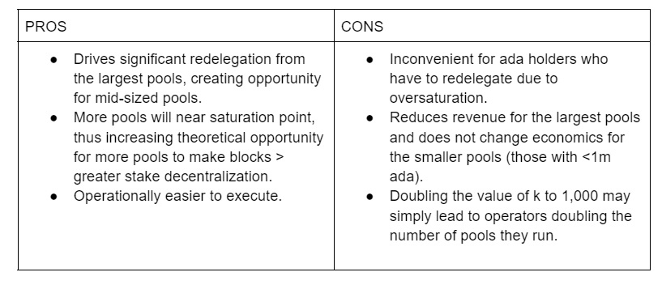
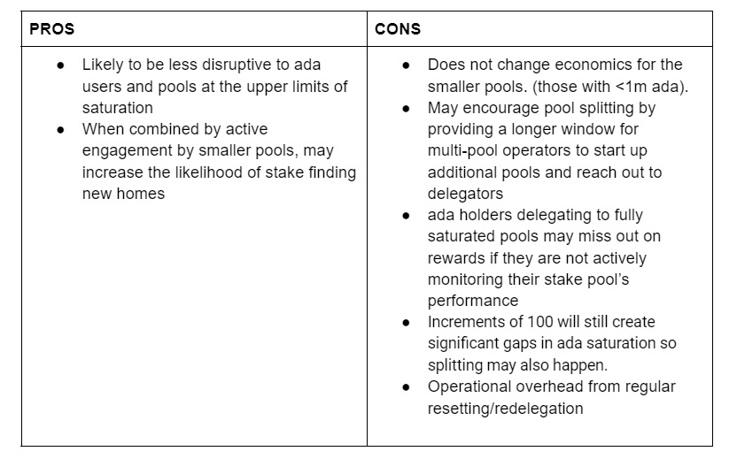
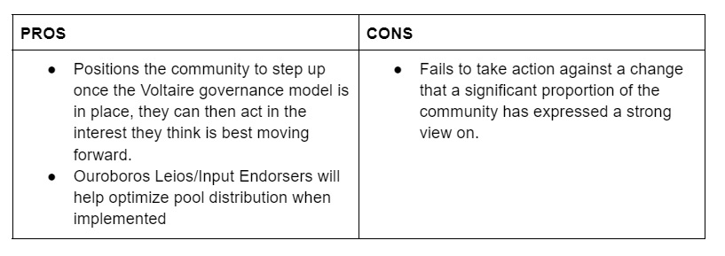
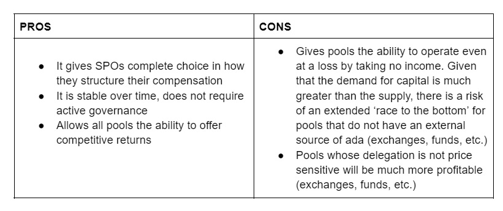
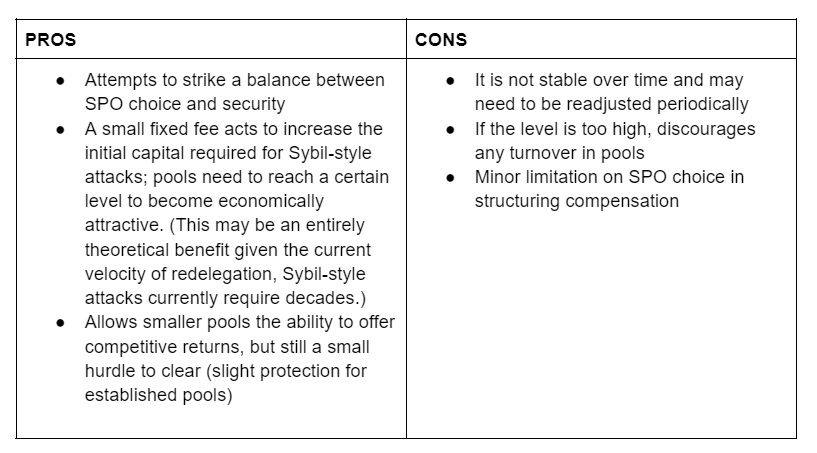
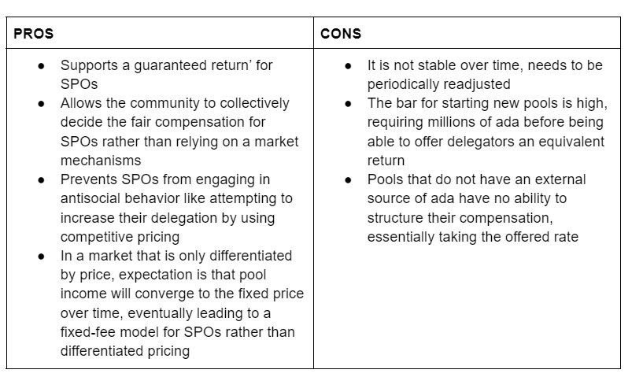

# Tham số đặt cược và tối ưu hóa mạng – Nơi tiếp theo của tham số k và phí tối thiểu?

### **Ưu và nhược điểm của các cách tiếp cận khác nhau để điều chỉnh tham số k và phí pool tối thiểu**

 27 tháng mười 2022  [Rebecca Hopwood](/en/blog/authors/rebecca-hopwood-1/page-1/)  9 phút đọc

### [**Rebecca Hopwood**](/en/blog/authors/rebecca-hopwood-1/page-1/)

Community Coordinator

Marketing and Communications

- 
- 

Một tập hợp các tham số được sử dụng để xác định hành vi của giao thức Cardano. Một số tham số ổn định và có thể ít nhiều không thay đổi vô thời hạn. Những yếu tố khác liên quan đến các hoạt động trên chuỗi năng động hơn ( như môi trường đặt cược hoặc giá của ada) và do đó có thể cần điều chỉnh định kỳ cho những thay đổi và biến động của các yếu tố này.

Hai biến số cụ thể tiếp tục tạo ra cuộc tranh luận trong cộng đồng nhà điều hành nhóm cổ phần (SPO) vì các thay đổi đối với một trong hai (hoặc cả hai) có thể có tác động đến phân cấp, lợi nhuận và các khía cạnh khác của trải nghiệm Cardano. Đó là tham số *k* , xác định mức mà tại đó một pool trở nên 'bão hòa' với tiền đặt cược và do đó không nhận được thêm phần thưởng nào nữa và phí pool tối thiểu, là số tiền cố định được trả cho một pool trước khi phần thưởng được chia cho người ủy quyền.

Đầu năm nay, một cuộc khảo sát đã được thực hiện trong cộng đồng SPO Cardano về cách những điều này có thể được điều chỉnh và kết quả của nó có thể được xem [tại đây](https://input-output.typeform.com/report/Row2tnqQ/HSCUwpltfMyJ7yp7) .

Kết quả cho thấy nhiều người trong cộng đồng SPO ủng hộ việc thay đổi  *k* và mức phí tối thiểu, nhưng vẫn còn một số tranh cãi. Mặc dù có mức độ linh hoạt cao trong việc tự thay đổi các tham số, nhưng quá trình ra quyết định lại kém rõ ràng hơn. Vì vậy, điều quan trọng là phải rõ ràng về các yêu cầu để điều chỉnh một trong hai tham số. Việc thay đổi chúng về cơ bản là một quyết định của cộng đồng nhưng mối quan tâm hàng đầu đối với tất cả mọi người phải là sức khỏe tổng thể và sự phi tập trung của mạng lưới.

Để phù hợp với tính minh bạch và khách quan, trước tiên, phần này cố gắng cung cấp tổng quan ngắn gọn về tham số k và phí tối thiểu, phác thảo một số cách khác nhau để điều chỉnh hai tham số này cũng như ưu và nhược điểm của từng phương pháp.

### **Tham số k: Tổng quan ngắn gọn**

Tham số k xác định số tiền đặt cược tối đa trong một pool để nhận được phần thưởng, về bản chất là tạo ra một 'mức vốn hóa mềm' trên quy mô pool. Quy mô này thay đổi theo thời gian và được định nghĩa là tỷ lệ phần trăm của nguồn cung ada tối đa (45 tỷ) trừ đi bất kỳ số tiền nào còn lại trong quỹ dự trữ. Tính đến kỷ nguyên 370, đó là 35 tỷ ada.

Quy mô pool tối đa = (45 tỷ - dự trữ) / *k* = ( 35 tỷ / 500 ) = 70m

Trong tài liệu về Cardano, một pool đạt đến kích thước tối đa được cho là đã bão hòa. Nhóm bão hòa mang lại phần thưởng cao nhất cho người ủy quyền và sinh lợi nhiều nhất cho người điều hành, trong khi nhóm quá bão hòa mang lại phần thưởng thấp hơn. Do đó, hệ thống khuyến khích những người được ủy quyền chuyển cổ phần của họ sang một nhóm chứa ít ada hơn, để duy trì lợi nhuận của họ và do đó khuyến khích sự phân cấp của mạng lưới.

Kể từ tháng 10 năm 2022, giá trị của *k* là 500. Trước đây, IOG đã gợi ý rằng giá trị này có thể được tăng lên 1.000 một cách an toàn, nhưng mọi quyết định cuối cùng đều bị hoãn lại do ba yếu tố: i) khảo sát cộng đồng không đưa ra kết quả cuối cùng ; ii) hoạt động của IOG tập trung vào việc cung cấp khả năng của Vasil; iii) và có thể có tác động gián đoạn đối với người dùng ada ủy quyền cho các pool gần mức bão hòa hiện tại nên cần phải lập kế hoạch và truyền thông phù hợp.

### **Ý nghĩa của việc thay đổi *k***

Mặc dù *k* hoàn toàn không phải là thuốc chữa bách bệnh để phân phối cổ phần công bằng hơn, nhưng giá trị của nó có một số tác động tích cực đối với một số pool. Nó giảm kích thước tối đa của các pool, cho phép nhiều pool hơn nằm trong phạm vi tối ưu để tạo block. Nếu thay đổi này đi kèm với thay đổi về ủy quyền (và hành vi của chủ sở hữu ada là chìa khóa ở đây), thì nó có khả năng tạo ra một môi trường đặt cược đa dạng hơn. Đây là những gì chúng ta đã thấy với sự thay đổi trước đó từ *k* =150 đến mức hiện tại là 500; một số pool lớn đã ngừng cạnh tranh để giành được quyền đại diện công khai, cho phép cổ phần đó được chuyển cho các nhà điều hành khác.

Tình huống chuyển sang *k* = 1.000 ít rõ ràng hơn. Chúng tôi mong đợi các pool tư nhân (chẳng hạn như các pool được điều hành bởi các sàn giao dịch, công ty tài chính hoặc những người nắm giữ ada lớn) sẽ chia cổ phần hiện tại của họ thành các pool nhỏ hơn. Pool tư nhân chiếm khoảng 35% tổng số cổ phần trong hệ sinh thái và chúng tôi ước tính điều này sẽ dẫn đến 150 stake pool khác được tạo ra. Chúng tôi không mong đợi bất kỳ ủy quyền nào trong số đó chuyển sang các pool công cộng vì phần thưởng ada ròng được tạo cho các pool tư nhân lớn cao hơn.

Theo tính toán của IOG, có khoảng 100 pool công cộng sẽ bị ảnh hưởng khi chuyển sang *k* = 1.000, tương ứng với khoảng 2 tỷ ada sẽ cần được chuyển hạng lại (8% nguồn cung). Để duy trì khả năng sinh lời hiện tại, các pool này sẽ có xu hướng tách ra. Hoạt động stake pool cốt lõi là một hoạt động sản xuất – chỉ có một sự khác biệt nhỏ về phần thưởng khi đặt cược cho các pool khác nhau đang tạo ra các block, đó là cách mà giao thức được dự định. Tuy nhiên, nhiều pool trong số này được công nhận tên tuổi mạnh mẽ, đôi khi thông qua hồ sơ theo dõi lâu đời và/hoặc bằng cách tạo nội dung và hoạt động truyền thông xã hội tốt. Kinh nghiệm với những người điều hành pool có thể có nghĩa là những pool này có thể giữ một tỷ lệ lớn những người được ủy quyền của họ trong bất kỳ pool mới được tạo nào.

Các pool trong khoảng 10 triệu ada trở lên sẽ có thể đưa ra mức phần thưởng tương đương, do đó, kỳ vọng là các pool này sẽ là những người hưởng lợi chính từ bất kỳ thay đổi nào; chiếm phần lớn các pool không được giữ lại bởi các pool bị chia tách. (Trong số 2 tỷ ada đó, IOG ước tính một phần ba đến một nửa trong số đó sẽ di chuyển khắp nơi.)

Điểm mấu chốt ở đây là mặc dù có thể có sự gia tăng vừa phải về tính đa dạng của mạng lưới thông qua việc thay đổi tham số *k* , nhưng tác động được dự đoán là ít rõ rệt hơn nhiều so với thay đổi trước đó.

### **Ba cách tiếp cận tiềm năng để thay đổi *k***

IOG đã xác định ba kịch bản tiềm năng để cộng đồng xem xét.

**Tùy chọn 1: Tăng  ngay lập tức *k* lên 1.000**

**Tùy chọn 2: Tăng dần *k* lên 1.000 (ví dụ: theo hệ số 100 mỗi tháng)**

**Tùy chọn 3: Không thay đổi – giữ nguyên giá trị hiện tại của *k* (500)**

### **Phí tối thiểu: Tổng quan ngắn gọn**

Stake pool thực hiện một chức năng quan trọng trong hệ sinh thái Cardano. Chúng tạo ra các block mới và góp phần phân cấp mạng.

Đổi lại, các pool được chi trả theo hai cách:

- Phí cố định, là số tiền cố định được chi trả nếu có bất kỳ block mới nào được sản xuất.
- Phí biến đổi, là tỷ lệ phần trăm của tổng số phần thưởng được trả cho một pool.

Mặc dù pool được tự do đặt bất kỳ khoản phí biến đổi nào mà họ chọn, quy tắc sổ cái chỉ xác định mức phí cố định tối thiểu.

Phí tối thiểu đóng vai trò như một lớp bảo vệ bổ sung chống lại các cuộc tấn công Sybil (một nỗ lực nhằm chiếm lấy mạng bằng cách tạo ra một số lượng lớn các pool không tính phí). Việc bãi bỏ hoặc giảm các khoản phí tối thiểu này sẽ loại bỏ lớp bảo vệ này và có thể khiến Cardano cởi mở hơn trước một số hình thức tấn công kinh tế. Phân tích của IOG về hành vi đặt cược và giảm hạng cho thấy mối quan tâm này hiện có thể là một vấn đề lý thuyết hơn là một vấn đề thực tế. Cardano đã vượt qua điểm có đủ ủy quyền để thực hiện một cuộc tấn công hiệu quả trong khoảng thời gian chưa đầy vài năm.

Mặt khác, việc đặt ra một mức phí tối thiểu cố định khiến các pool nhỏ mới bắt đầu khó cạnh tranh về mặt kinh tế với các pool lớn hơn đã được thành lập cho đến khi chúng đạt đến một quy mô nhất định. Khoản phí này cần phải được đáp ứng trước khi một pool có thể bắt đầu trả lại phần thưởng cho những người được ủy quyền và có thể cộng lại thành một tỷ lệ hiệu quả có thể lớn hơn nhiều lần so với tỷ lệ phần trăm dễ thấy hơn mà các pool quảng cáo. Việc ủy quyền cho một pool nhỏ hơn thường là một kết quả tồi tệ hơn nhiều đối với người ủy quyền và gánh nặng chi phí bổ sung được trả bởi những người ủy quyền ban đầu cho một pool.

Ngoài ra, phí tối thiểu đóng vai trò là động cơ khuyến khích một SPO có uy tín tạo ra các pool mới, vì có một 'thu nhập' được đảm bảo từ việc làm như vậy.

### **Ý nghĩa của việc thay đổi mức phí tối thiểu**

Không có tùy chọn nào được trình bày bên dưới có tác động trực tiếp đến chủ sở hữu ada. Với mức phí tối thiểu được hạ xuống, pool sẽ không phải thực hiện bất kỳ thay đổi nào ngay lập tức. Trong ngắn hạn, khả năng mang lại lợi nhuận cạnh tranh sẽ mang lại lợi ích cho các SPO nhỏ hơn đang tìm cách thu hút sự ủy quyền và việc duy trì quyền kiểm soát đối với các khoản phí sẽ giúp các pool nhỏ hơn tồn tại lâu hơn.

### **Ba cách tiếp cận tiềm năng để thay đổi mức phí tối thiểu**

Tương tự như với tham số *k* , IOG cũng đưa ra ba lựa chọn tiềm năng để cộng đồng xem xét.

**Tùy chọn 1: Đặt phí tối thiểu thành 0**

**Tùy chọn 2: Giảm phí tối thiểu đáng kể (ví dụ xuống 40 ada)**

**Tùy chọn 3: Giữ nguyên phí tối thiểu**

### **Kết luận**

Xem xét thông tin ở trên, việc thay đổi một trong hai hoặc cả hai tham số này cần được xem xét cẩn thận. Mặc dù các thay đổi không có khả năng tạo ra sự khác biệt đáng kể đối với việc phân phối cổ phần, nhưng một thay đổi được xem xét đúng đắn sẽ vẫn chuyển chỉ số theo hướng tích cực về mặt hỗ trợ các pool nhỏ hơn và hỗ trợ tiếp tục phân cấp mạng.

Và việc thay đổi riêng các thông số này chỉ là một phần của việc xem xét rộng hơn để mở rộng mức độ phân bổ cổ phần trên toàn hệ sinh thái SPO. Một số đề xuất cải tiến do cộng đồng tạo ra (bao gồm [CIP7](https://cips.cardano.org/cips/cip7/) , [CIP23](https://cips.cardano.org/cips/cip23/) và [CIP50](https://github.com/cardano-foundation/CIPs/pull/242) ) tiếp tục được thảo luận và đánh giá cùng với chủ đề này.

Mạng lưới Cardano và môi trường chung đã thay đổi đáng kể trong năm qua. Trong tương lai, tối ưu hóa tham số sẽ là thành phần chính của bất kỳ mô hình quản trị kỹ thuật nào. Với suy nghĩ này, IOG có kế hoạch thành lập một nhóm tư vấn tham số với sự cộng tác của một nhóm nhỏ các SPO và Cardano Foundation. Điều này sẽ triển khai khi cần thiết để đáp ứng cấu trúc quản trị Cardano mới.

Một cuộc khảo sát mới phác thảo ba tùy chọn cho số lượng pool mục tiêu và chi phí pool tối thiểu sẽ được phân phối cho các SPO trong tuần này để nắm bắt lộ trình ưu tiên của họ. Kết quả sẽ được xem xét bởi nhóm thông số mới. Sau đó, một quyết định sẽ được đưa ra và thông báo, với lịch trình cho bất kỳ thay đổi nào sẽ tính đến nhu cầu hoạt động của các SPO và những người dùng mạng khác.

Cộng đồng hiện có cơ hội xem xét các tùy chọn được đưa ra ở đây. Khảo sát/biểu mẫu sẽ được chia sẻ ngay hôm nay với các SPO qua [email](https://mailchi.mp/iohk/spo) và kênh [Thông báo của SPO](https://t.me/SPOannouncements) .

*Cảm ơn Colin Edwards, Kevin Hammond, Fernando Sanchez, Tim Harrison và Giáo sư Aggelos Kiayias vì những đóng góp của họ cho blog này. Bài này được dịch bởi Quang Pham, Review, biên tập bởi Nguyễn Hiệu . Bài viết nguồn [tại đây:](https://iohk.io/en/blog/posts/2022/10/27/staking-parameters-and-network-optimization-where-next-for-k-and-min-fee). Dự án này được tài trợ bởi Catalyst.*
