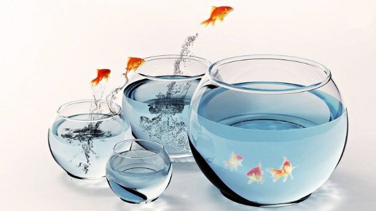

# Tái định vị Project Catalyst trước vòng tài trợ tiếp theo

### **Catalyst tạm dừng chiến thuật để đánh giá kết quả của Fund9 trước khi bắt đầu vòng lặp tiếp theo**

 1 tháng 11 năm 2022  [Tim Richmond](/en/blog/authors/tim-richmond/page-1/)  3 phút đọc

### [**Tim Richmond**](/en/blog/authors/tim-richmond/page-1/)

Marketing and Communications Manager

Marketing &amp; Communications

- 
- 

Đổi mới và hợp tác là hai nguyên tắc sáng lập của Project Catalyst. Thông qua mỗi vòng tài trợ, Input Output Global, Inc. (IOG) tạo điều kiện cho Catalyst hỗ trợ những người có dự án và ý tưởng có thể tạo ra tác động tích cực trong thế giới thực.

IOG tin tưởng vào việc trao quyền cho mọi người khám phá và phát triển ý tưởng của họ. Sự hợp tác này dẫn đến sự đổi mới và tăng trưởng theo cấp số nhân và thường mở ra những cơ hội mới thay đổi cuộc sống.

Project Catalyst đã đạt được nhiều điều tuyệt vời. Nó đã nhận và xử lý hơn 6,1 nghìn đề xuất, đạt được hơn 1,7 triệu phiếu bầu và tài trợ cho khoảng 1,2 nghìn dự án (800 dự án vào năm 2022). Những thành tựu này là minh chứng cho niềm đam mê và niềm tin vào Project Catalyst và hệ sinh thái Cardano.

## **Kết quả Fund9**

Fund9 có 205 đề xuất được chọn để tài trợ, cùng với 10 thách thức sẽ được thực hiện trong vòng tài trợ tiếp theo và đã nhận được hơn 364 nghìn phiếu bầu, tăng 53% so với Fund8! Và 9 dự án đã được phê duyệt để tham gia Thử thách dành cho người bản xứ của [Cardashift Catalyst](https://iohk.io/en/blog/posts/2022/06/01/fund9-catalyst-natives-cardashift-challenge-demonstrating-and-monetizing-impact/) .

Project Catalyst cũng đang thử nghiệm báo cáo dựa trên cột mốc cho các dự án được tài trợ. Các dự án được tài trợ trong Thử thách Dapps, Sản phẩm và Tích hợp cũng như các dự án đã yêu cầu tài trợ trị giá trên 75 nghìn đô la, hiện yêu cầu phải báo cáo dựa trên các mốc quan trọng rõ ràng và cung cấp tuyên bố về các mốc quan trọng cũng như bằng chứng về thành tích để tiếp tục nhận được tài trợ.

Việc chuyển sang cơ chế báo cáo dựa trên cột mốc sẽ củng cố niềm tin vào dự án và thể hiện sự tiến bộ đối với cộng đồng. Ngoài ra, nó còn là một lớp bảo vệ bổ sung cho Kho bạc Cardano và cộng đồng, đảm bảo rằng các dự án sẽ triển khai theo đúng kế hoạch trước khi nhận được số tiền được yêu cầu.

## **Thời gian hồi phục: thời gian để tạm dừng và phản ánh**

Khi Fund9 sắp kết thúc, có một sự công nhận rộng rãi rằng các quy trình cần phải hoàn thiện, đơn giản hóa, trở nên tự chủ hơn, duy trì tính toàn diện và tiếp tục thể hiện giá trị đối với hệ sinh thái Cardano rộng lớn hơn. Do đó, một số thay đổi và cập nhật quan trọng sắp diễn ra.

Chậm lại cho phép những người tham gia Catalyst xem xét các quy trình, phản ánh các cơ hội cải tiến và lặp lại một cách có ý nghĩa. Một trong những lý do quan trọng để có thời gian hồi phục là để cho phép tập thể đó rõ ràng mà không cần phải vội vã hướng tới thời hạn tiếp theo. Thay vào đó, hãy tập trung vào tập hợp các kết quả.

Xem xét những điều trên, Fund10 vẫn chưa có ngày bắt đầu. Vì vậy, thay vào đó, Project Catalyst sẽ xem xét tất cả các tín hiệu và kinh nghiệm trước khi chuyển sang chu kỳ cấp vốn tiếp theo. Các blog sắp tới sẽ thảo luận về những thay đổi và đặt ra các kế hoạch trong tương lai.

## **Lặp đi lặp lại và tiếp cận trong tương lai**

Project Catalyst là một tổ chức hữu cơ dựa vào các cá nhân để kết hợp với nhau và đổi mới hướng tới một mục tiêu chung. Do đó, điều quan trọng là phải duy trì tính trôi chảy và năng động để đáp ứng nhu cầu của một môi trường luôn thay đổi và có nhịp độ nhanh. Việc vạch ra lộ trình hướng tới mục tiêu sẽ trở nên dễ dàng hơn nếu có một đích đến rõ ràng. Phần quan trọng nhất của quá trình này là trao đổi thông tin giữa tất cả các bên liên quan và những người quan tâm.

Cộng đồng Catalyst được hoan nghênh và khuyến khích thảo luận cũng như tổ chức các phiên trao đổi cũng như ghi lại và chia sẻ kết quả. Hiện đã có [biểu mẫu phản hồi cho Fund9](https://bit.ly/Fund9-Feedback) . Sử dụng biểu mẫu này để giúp xác định các thiếu xót và các khu vực cần chú ý.

Kết quả khảo sát sẽ được chia sẻ công khai với tất cả thông tin chi tiết chính. Bạn có thể xem [phiên bản Fund8 tại đây](https://bit.ly/F8-Feedback) để tham khảo.

## **Làm thế nào để tham gia?**

Bạn có muốn tham gia tích cực vào Project Catalyst không? Bước đầu tiên là [tạo một tài khoản](https://cardano.ideascale.com/) trên nền tảng cộng tác Catalyst, Ideascale.

Để cập nhật thường xuyên về tiến độ của [Project Catalyst](https://bit.ly/ProjectCatalyst) , vui lòng đăng ký [danh sách gửi thư](https://bit.ly/3dSZJvx) của Catalyst và tham gia cộng đồng [Discord](https://discord.gg/2RnUtK8) và [Telegram](https://discord.gg/2RnUtK8). Bài này được dịch bởi Quang Pham, Review bởi , biên tập bởi . Bài viết nguồn tại đây: https://iohk.io/en/blog/posts/2022/11/01/repositioning-project-catalyst-ahead-of-the-next-funding-round/
