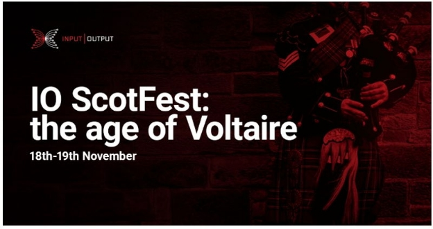

# Công bố IO ScotFest: Kỷ nguyên Voltaire

### **Tham gia cùng IOG để ăn mừng thành tích của Cardano và tìm hiểu thêm về các kế hoạch trong tương lai**

 4 tháng 11 năm 2022  [Tim Harrison](/en/blog/authors/tim-harrison/page-1/)  4 phút đọc

### [**Tim Harrison**](/en/blog/authors/tim-harrison/page-1/)

VP of Community &amp; Ecosystem

Communications

- 
- 
- 
- 

Edinburgh – thủ đô của Scotland và là nơi ra đời của giao thức Ouroboros của Cardano – sẽ là nơi tổ chức IO ScotFest: Kỷ nguyên Voltaire trong tháng này. Được tổ chức tại trường đại học nổi tiếng của thành phố vào ngày 18 và 19 tháng 11, nhóm Input Output Global (IOG) sẽ phát trực tiếp các bài phát biểu, thuyết trình, cập nhật dự án và thông báo từ một sự kiện ảo đặc biệt để tôn vinh Cardano, blockchain bằng chứng cổ phần hàng đầu thế giới và đánh dấu hơn 5 năm hoạt động thành công.

ScotFest sẽ diễn ra tại [hội nghị thượng đỉnh được tổ chức bởi Cardano Foundation](https://summit.cardano.org/) ở Thụy Sĩ trong hai ngày tới.

Tại ScotFest, IOG sẽ trình bày những thành tựu của mình với tư cách là công ty phát triển Cardano và vạch ra các kế hoạch trong tương lai.

## **Kỷ nguyên Voltaire**

Lộ trình phát triển của Cardano bắt đầu vào tháng 9 năm 2017 với kỷ nguyên Byron, công ty đã thiết lập chuỗi khối và tiền điện tử ada. Kể từ đó, các giai đoạn Shelley, Goguen và Basho đã giới thiệu đặt cược và ủy quyền, mã thông báo gốc, hỗ trợ hợp đồng thông minh và một loạt công nghệ để tăng hiệu suất và thông lượng mạng.

Giờ đây, khi hệ sinh thái tiếp tục phát triển, chúng ta đang bước vào Kỷ nguyên Voltaire, đặt nền móng cho việc ra quyết định phi tập trung.

Edinburgh, tâm điểm của thời kỳ Khai sáng ở Châu Âu, là một địa điểm thích hợp để tổ chức lễ kỷ niệm của IOG. Đối với nhà triết học người Pháp François-Marie Arouet - viết 'Voltaire' - là người dẫn đường cho Thời kỳ Khai sáng, một thời kỳ đáng kinh ngạc của thành tựu trí tuệ và khoa học kéo dài từ thế kỷ 18 đến thế kỷ 19. Ông đánh giá cao những lời chỉ trích và lập luận cho sự tách biệt giữa nhà thờ và nhà nước. Vì vậy, Voltaire đã được chọn làm một cái tên đầy cảm hứng cho chủ đề quản trị của Cardano, với sự nhấn mạnh vào tính bền vững lâu dài và việc ra quyết định dân chủ trao quyền cho cộng đồng.

Đại học Edinburgh và Hiệp hội Hoàng gia Edinburgh là những tổ chức quan trọng trong thời kỳ Khai sáng, khuyến khích sự nghiệp của Adam Smith – phép ẩn dụ về “bàn tay vô hình” của ông vẫn được các nhà kinh tế học trích dẫn cho đến ngày nay – và David Hume, một triết gia có ảnh hưởng đến nhiều người như Immanuel Kant và Albert Einstein. Vì vậy, [Giáo sư Aggelos Kiayias](https://iohk.io/en/team/aggelos-kiayias) , nhà khoa học trưởng tại IOG, đã nói đây là một lựa chọn lý tưởng để khởi động ScotFest. Là Giáo sư tại Đại học Edinburgh và là thành viên của Hiệp hội Hoàng gia Edinburgh, Giáo sư Kiayias đã lãnh đạo nhóm tạo ra Ouroborous và hướng dẫn các nhà nghiên cứu học thuật của IOG trên toàn cầu. Nghiên cứu đã giúp Cardano trở thành công ty hàng đầu về blockchain bằng chứng cổ phần vào năm 2017.

## **Có gì trong chương trình nghị sự?**

Trong vòng hai ngày, bạn sẽ có thể theo dõi hơn 20 bài phát biểu và bản trình bày, với các thông báo mới và cập nhật dự án. Tất cả đều thể hiện những gì đã đạt được cho đến nay và kỷ niệm những gì đang được xây dựng cho tương lai.

- **Nghiên cứu** – chúng tôi sẽ công bố các sáng kiến và sự hợp tác mới thúc đẩy Cardano và ngành công nghiệp blockchain rộng lớn hơn tiến lên phía trước
- **Quản trị** – cách hỗ trợ sự phát triển liên tục của một hệ sinh thái phi tập trung, lấy cộng đồng làm đầu
- **Phi tập trung và khả năng mở rộng** – xây dựng một blockchain phù hợp cho tương lai
- **RealFi và việc áp dụng** – thúc đẩy và hỗ trợ các trường hợp sử dụng trong thế giới thực và giới thiệu người dùng mới
- **Hệ sinh thái** – Nghe chia sẻ từ một số dự án thú vị  của #BuildingOnCardano

Trong một bài phát biểu quan trọng đặc biệt, [Charles Hoskinson](https://iohk.io/en/team/charles-hoskinson) , giám đốc điều hành của IOG, nói về hành trình đến kỷ nguyên Voltaire, quản trị và tương lai của Cardano. Bạn sẽ nghe cập nhật về một số đóng góp của IOG cho nhóm công nghệ cốt lõi của Cardano, bao gồm các chủ đề như giải pháp khả năng mở rộng Mithril và Hydra cũng như Input endorsers. Và trong sự kiện trở về quê hương cũng sẽ có một bản cập nhật về ngôn ngữ  hợp đồng thông minh Plutus của Cardano; ngôn ngữ đã được ra mắt ở đây tại PlutusFest vào tháng 12 năm 2018.

## **Tham gia với chúng tôi!**

Sự kiện này sẽ được phát trực tiếp tới cộng đồng trên các kênh chính thức của IOG để bạn có thể xem và tham gia xuyên suốt. Đăng ký [kênh YouTube](https://www.youtube.com/channel/UCBJ0p9aCW-W82TwNM-z3V2w) của chúng tôi và nhấn chuông để trở thành người đầu tiên tham gia ngay khi chúng tôi bắt đầu vào sáng (UTC) ngày 18 tháng 11.

Sự kiện chính sẽ chỉ diễn ra dưới dạng kỹ thuật số, nhưng nếu bạn là người địa phương ở Edinburgh, không thể đến Lausanne để tham dự hội nghị thượng đỉnh hoặc chỉ thích một chuyến đi đến bonnie Scotland, bạn có thể tham gia cùng chúng tôi tại một buổi gặp mặt cộng đồng đặc biệt trên vào tối ngày 18 tháng 11. Bạn có thể [đăng ký buổi gặp mặt tại đây](https://www.meetup.com/iohk-meetup/events/289331789/) . Số lượng có hạn và được cung cấp trên cơ sở ai đến trước được phục vụ trước – vì vậy đừng chậm trễ.

Nếu bạn không ở Vương quốc Anh nhưng muốn tham gia một trong những cuộc gặp mặt trực tiếp vào cuối tuần của hội nghị thượng đỉnh Cardano, hãy xem danh sách các sự kiện do cộng đồng tổ chức diễn ra trên khắp thế giới. Bài này được dịch bởi Quang Pham, Review và biên tập bởi Nguyễn Hiệu. 

Bài viết nguồn [tại đây:](https://iohk.io/en/blog/posts/2022/11/04/announcing-io-scotfest-the-age-of-voltaire)

Dự án này được tài trợ bởi Catalyst.
