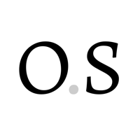

# Hydra for Payments – giới thiệu công cụ dành cho nhà phát triển để mở khóa các khoản thanh toán vi mô trên Cardano

### **Một bài đăng trên blog bởi nhóm Obsidian Systems Hydra**

 10 tháng 11 năm 2022  [Hệ thống Obsidian](/en/blog/authors/obsidian-systems/page-1/)  6 phút đọc

### [**Obsidian Systems**](/en/blog/authors/obsidian-systems/page-1/)

Blockchain developer

Guest author

*IOG đang cộng tác với nhóm Obsidian Systems để thúc đẩy sự phát triển của các trường hợp sử dụng dựa trên giao thức Hydra Head. Hydra for Payments là một trong những trường hợp sử dụng như vậy.*

## **Giới thiệu**

Khả năng mở rộng là chìa khóa để đảm bảo rằng một blockchain có thể xử lý hàng triệu giao dịch mà không làm tăng phí và thời gian giải quyết giao dịch. Giải quyết các vấn đề về khả năng mở rộng là một trong những nguyên tắc sáng lập của Cardano và là trọng tâm phát triển của kỷ nguyên [Basho](https://www.essentialcardano.io/glossary/basho) .

Nền tảng Cardano sẽ mở rộng quy mô bằng cách cải thiện sức mạnh xử lý của chuỗi chính bằng cách triển khai các cải tiến layer 1 và bổ sung sức mạnh xử lý hoạt động ngoài chuỗi bằng các giải pháp layer 2. Cùng với nhau, [các giải pháp này](https://www.essentialcardano.io/article/layer-1-and-layer-2-all-you-need-to-know) giúp tăng hiệu suất mạng, cung cấp thông lượng cao hơn và chi phí xử lý giao dịch thấp hơn.

Nhóm giao thức Hydra là một trong những thành phần chính trong hành trình mở rộng quy mô layer 2 của Cardano. [*Hydra Head*](https://hydra.family/head-protocol/) là phần đầu tiên trong bộ giao thức này. Nó cung cấp nền tảng để xây dựng khả năng mở rộng hơn nữa. Hydra Head là sổ cái ngoài chuỗi giữa một nhóm người tham gia tương đối nhỏ, hoạt động tương tự nhưng nhanh hơn sổ cái chính trên chuỗi.

Ở đây chúng tôi giới thiệu Hydra for Payments – công cụ dành cho nhà phát triển nguồn mở để triển khai các giải pháp thanh toán trong hệ sinh thái Cardano.

## **Giới thiệu Hydra for Payments**

Hydra for Payments sẽ đơn giản hóa việc sử dụng giao thức Hydra Head cho nhiều trường hợp sử dụng thanh toán khác nhau. Giống như thế hệ đầu tiên của chức năng ví nhẹ đóng vai trò là công cụ hỗ trợ truy cập mạng cơ bản, Hydra for Payments sẽ mở khóa sức mạnh của các khoản thanh toán vi mô trong hệ sinh thái Cardano.

Hydra for Payments sẽ cung cấp bộ công cụ cho các nhà phát triển ví nhẹ để liên tục tận dụng dòng giao thức Hydra để xây dựng các sản phẩm phục vụ tốt hơn nhu cầu của người dùng, giảm chi phí vận hành và cho phép thông lượng cao hơn trên mạng Cardano đang phát triển.

Các nỗ lực sẽ được thực hiện để đảm bảo trải nghiệm của nhà phát triển quen thuộc trong khi vẫn đủ linh hoạt để đáp ứng các nhà cung cấp ví đa dạng của Cardano.

Trong các giai đoạn sau, Hydra for Payments sẽ bao gồm giao diện hỗ trợ cơ bản mà các nhà cung cấp ví nhẹ sẽ yêu cầu để:

- Duy trì dịch vụ Hydra Head của riêng họ
- Kiểm tra cơ sở hạ tầng node của họ
- Mở rộng quy mô hoạt động đáng kể
- Cung cấp một dịch vụ như vậy cho người khác

Giống như Hydra chỉ là một phần trong chiến lược khả năng mở rộng tổng thể của Cardano, Hydra for Payments cũng sẽ tạo thành một *phần* của khả năng mở rộng ví nhẹ layer 2 lớn hơn.

### **Các tính năng của Hydra for Payments**

- **Có sẵn** : Hydra for Payments có mã nguồn mở và có thể truy cập ngay hôm nay.
- **Thân thiện** : Tương tác với layer 1 rất đơn giản và không có lưu ý hoặc kỹ thuật mới quan trọng nào để các nhà phát triển thành thạo.
- **Nhanh chóng** : Các giao dịch có xu hướng chỉ bị hạn chế bởi tốc độ của mạng mà các node giao tiếp.
- **Đơn giản** : Do tính chất đẳng cấu của Hydra, Hydra for Payments không gây ra sự phức tạp đáng kể nào để triển khai cho các nhà phát triển.
- **Đẳng cấu** : Thiết kế đẳng cấu cũng cho phép sử dụng lại các công cụ dành cho nhà phát triển hiện có mà không cần sửa đổi nhiều.

Trong suốt quá trình phát triển bộ công cụ Hydra for Payments, hai quan điểm sẽ cùng tồn tại và phát triển song song:

- Đầu tiên, các nguyên tắc cơ bản về kỹ thuật được mô tả trong giao thức [Hydra Head](https://hydra.family/head-protocol/) chung sẽ được xác thực liên tục để đảm bảo chúng được lưu giữ trong Hydra for Payments. Điều này đặc biệt quan trọng vì nó liên quan đến các đảm bảo xung quanh sự tin cậy, bảo mật và tính chính xác.
- Thứ hai, những cân nhắc thực tế của các nhà phát triển ví nhẹ sẽ tham gia vào toàn bộ bộ công cụ. Các tính năng sẽ luôn được thiết kế hợp lý để phát triển, triển khai và bảo trì. Sau khi được tích hợp, Hydra for Payments sẽ cải thiện đáng kể chi phí hoạt động của các nhà phát triển ví nhẹ, khả năng giám sát cơ sở hạ tầng của họ và nâng cao trải nghiệm của người dùng.

Hình 1. Tích hợp ví nhẹ cơ bản với Hydra for Payments và Hydra Heads

Một loạt các giải pháp layer 2 đa dạng hiện đang tồn tại hoặc đang được thiết kế và phát triển. Nhiều cách tiếp cận được thảo luận sôi nổi hoặc tán thành nhưng vẫn còn lâu mới được thực hiện hoặc triển khai.

Sidechains và rollups là những ứng cử viên tuyệt vời để giải quyết các nhóm vấn đề cụ thể trong khi đưa ra các đánh đổi khác nhau về chi phí phát triển, thời gian đưa ra thị trường, bảo mật và sự phức tạp của quá trình triển khai ban đầu. Ví dụ, một sự đánh đổi là một số giải pháp này yêu cầu các cầu nối tài sản rõ ràng, làm tăng phạm vi tấn công tổng thể để nhà phát triển xem xét. Tương tự, các giải pháp không đẳng cấu cũng làm tăng chi phí hoạt động của nhà phát triển bằng cách khác với ngữ nghĩa của mạng chính.

## **Lộ trình của Hydra for Payments**

Ban đầu, API sẽ ánh xạ trực tiếp các nguyên mẫu và miền của giao thức Hydra Head và cung cấp thao tác thuận tiện cho các Head. Theo thời gian và để đáp ứng việc các nhà phát triển tích hợp Hydra for Payments, chúng tôi sẽ thêm các tính năng chuyên biệt hoặc phụ trợ phục vụ cho các trường hợp sử dụng thanh toán vi mô cụ thể.

### **Q4 2022**

Công cụ Hydra for Payments sẽ dần dần ra mắt để hỗ trợ các nhà phát triển quản lý thông tin xác thực, quản lý toàn bộ vòng đời của Hydra Head và tương tác với các Head thông qua một giao diện thuận tiện chung.

Giao thức Hydra Head đang trải qua một số cải tiến quan trọng trong Q4, điều này sẽ không ảnh hưởng ngay lập tức đến giao diện Hydra for Payments ban đầu.

Phần demo chức năng của Hydra for Payments sẽ tập trung vào hệ thống thanh toán nhanh hạn chế cho phép một nhóm người chọn tham gia Head và chuyển tài sản với tốc độ và chi phí chưa từng có.

### **Tiêu chuẩn**

Giống như các nhà phát triển ví nhẹ được hưởng lợi từ [tiêu chuẩn CIP-30](https://cips.cardano.org/cips/cip30/) cho kết nối DApp đa năng nhẹ, các giải pháp dựa trên Hydra sẽ được hưởng lợi từ việc hình thành các tiêu chuẩn để quản lý cơ sở hạ tầng Hydra. Điều này cuối cùng sẽ cho phép tương tác với các DApp layer 2 để đáp ứng nhu cầu của người dùng cuối.

Ngoài việc tham gia thảo luận và hình thành các tiêu chuẩn như vậy, Hydra for Payments sẽ đóng góp bằng cách triển khai và tạo tài liệu tham khảo được chia sẻ để đảm bảo rằng các tiêu chuẩn đang phát triển là thực tế.

### **2023**

Trong tương lai, chúng ta sẽ tiếp tục thấy các tính năng mới, cải tiến đối với các giao thức Hydra và việc sử dụng chúng một cách nhiệt tình trong Hydra for Payments. Một ví dụ ban đầu sẽ là triển khai Hydra for Payments đầy đủ, bổ sung khả năng *cam kết* và *hủy cam kết* tiền trong các Head mở hiện có. Điều này sẽ cho phép các kênh thanh toán luôn mở trong khi người dùng thêm hoặc rút tài sản của họ.

Việc triển khai tham chiếu trong thế giới thực trong tương lai có thể chứng kiến sự tích hợp đầy đủ của Hydra for Payments vào ví nhẹ dành cho người dùng hiện có. Điều này có khả năng đi kèm với việc ra mắt sản phẩm Hydra-Head-as-a-Service chuyên dụng, để tiếp tục giảm thời gian tiếp thị cho các nhà phát triển ví nhẹ trong khi vẫn giữ chi phí vận hành tổng thể tương đối thấp.

Khi chúng tôi tiếp tục xác thực các tính năng mới tương tác với một Head duy nhất, chúng tôi có thể xem xét chuyển đổi sang triển khai bước đầu và sử dụng cấu trúc liên kết Mạng hình ngôi sao. Các bài học rút ra từ giai đoạn Hydra Head ban đầu sẽ được áp dụng để đảm bảo rằng Hydra for Payments nhanh chóng được mở rộng để tích hợp chức năng mới như giao tiếp giữa các Head. Một ví dụ ban đầu về điều này có thể là khả năng kết nối các Hydra Head để tạo thành một mạng Hydra Head phù hợp, mang lại trải nghiệm người dùng được cải thiện cho gần như tất cả các trường hợp sử dụng thanh toán.

Cuối cùng, để bộ công cụ phát triển cùng với hệ sinh thái Cardano đang phát triển, điều quan trọng là phải tích lũy phản hồi, thảo luận và *đóng góp* từ cộng đồng.

Nếu bạn muốn tìm hiểu thêm, hãy tham gia kênh Hydra Discord để thảo luận thêm. Bài này được dịch bởi Quang Pham, Review v biên tập bởi Nguyễn Hiệu. 
Bài viết nguồn [tại đây:](https://iohk.io/en/blog/posts/2022/11/10/hydra-for-payments-introducing-developer-tooling-to-unlock-micropayments-on-cardano)

Dự án này được tài trợ bới Catalyst.
