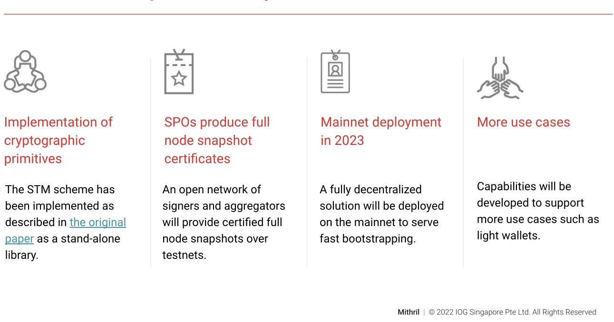

# Tăng thời gian đồng bộ hóa nút với Mithril

### **Mithril là một giải pháp nhẹ, nhanh và hiệu quả để khởi động an toàn các nút Cardano**

 11 tháng một 2023  [Olga Hryniuk](/en/blog/authors/olga-hryniuk/page-1/)  4 phút đọc

### [**Olga Hryniuk**](/en/blog/authors/olga-hryniuk/page-1/)

Nhà văn kỹ thuật cao cấp

Tiếp thị &amp; Truyền thông

- 
- 

Mithril là một giải pháp cho phép người dùng có được trạng thái hiện tại của chuỗi khối Cardano mà không cần truy xuất toàn bộ lịch sử của nó. Các bài đăng trước đây đã thảo luận về cách [thức hoạt động của giao thức Mithril](https://iohk.io/en/blog/posts/2021/10/29/mithril-a-stronger-and-lighter-blockchain-for-better-efficiency/) và cập nhật cộng đồng về việc phát hành [bằng chứng về khái niệm](https://iohk.io/en/blog/posts/2022/08/29/mithril-proof-of-concept-is-now-open-source/) .

Tại IO ScotFest ở Edinburgh, Jean-Philippe Raynaud, trưởng nhóm kỹ thuật tại PaloIT và Iñigo Querejeta Azurmendi, kỹ sư mật mã trưởng của Cardano tại IOG, [đã trình bày về Mithril](https://www.youtube.com/watch?v=VyxsqwNWZt4) tiết lộ thêm về lợi ích, ứng dụng và lộ trình của nó.

## **Đạt được khả năng mở rộng lớn hơn**

Một trong những thách thức để đạt được khả năng mở rộng và áp dụng hàng loạt công nghệ chuỗi khối là tương tác nhanh và an toàn với chuỗi. DApp và ví hoạt động trên một nút đầy đủ có thể xác thực độc lập mọi giao dịch trong lịch sử của chuỗi khối, mang lại mức độ bảo mật cao. Tuy nhiên, điều này mất nhiều thời gian hơn và đòi hỏi các yêu cầu lưu trữ và phần mềm cụ thể.

Mithril là một giải pháp. Nó vừa là giao thức vừa là mạng dựa trên công nghệ được gọi là lược đồ đa chữ ký (STM) dựa trên ngưỡng cổ phần. Giao thức cho phép các nút trong mạng Mithril thiết lập các tương tác nhẹ và hiệu quả với Cardano theo cách minh bạch, an toàn và không tin cậy.

Các tương tác ví nhẹ hiện tại yêu cầu dựa vào bên thứ ba để truy xuất trạng thái chuỗi. Các tương tác này cũng dựa trên việc đánh đổi bảo mật hoặc phân quyền. Mặt khác, Mithril đảm bảo cả hai và có khả năng mở khóa các trường hợp sử dụng như:

- **Khởi động nhanh nút đầy đủ** : một nút có thể đồng bộ hóa với lịch sử chuỗi nhanh hơn 4-6 lần so với trước đây, như được đánh giá trên mạng thử nghiệm xem trước.
- **Ví 'nhẹ' đáng tin cậy : ví** nhẹ không cần dựa vào bên thứ ba để đồng bộ hóa lịch sử chuỗi khối. Giao thức Mithril cho phép đồng bộ hóa nhanh trong khi dựa vào các thuộc tính bảo mật chuỗi chính của Cardano.
- **Hệ thống bỏ phiếu hiệu quả** : Mithril cho phép thiết lập một hệ thống bỏ phiếu nhanh và có độ tin cậy cao trong các trường hợp sử dụng quản trị.

Các trường hợp sử dụng được đề cập ở trên cho thấy rằng để Mithril mở rộng quy mô, cần phải thiết lập cơ sở hạ tầng để hỗ trợ các loại dữ liệu khác nhau. Đây là lúc quy trình phát triển hợp tác và cởi mở bắt đầu. Việc tận dụng sức mạnh của cộng đồng sẽ cho phép phát triển nhiều ứng dụng sáng tạo cho Mithril. Do đó, Mithril sẽ cung cấp khả năng nhanh chóng bao gồm các loại [dữ liệu đã ký](https://iohk.io/en/blog/posts/2022/08/29/mithril-proof-of-concept-is-now-open-source/) mới khi có nhu cầu.

Jean-Philippe Raynaud bình luận:

Mithril có thể giúp ký bất kỳ loại dữ liệu nào có thể được tính toán một cách xác định hoặc được chứng kiến bởi các bên liên quan của chuỗi khối bằng chứng cổ phần (PoS). Điều này chứng tỏ các đảm bảo bảo mật tương tự như trên chuỗi chính Cardano cũng như cùng mức độ phân cấp mà không phụ thuộc vào thực thể bên thứ ba.

## **lộ trình**

Hình 1: Lộ trình phát triển Mithril

Mithril là một dự án nguồn mở hiện đang hoạt động như một bằng chứng về khái niệm. Việc triển khai các nguyên hàm mật mã là bước đầu tiên hướng tới việc thiết lập một thư viện độc lập, không liên quan đến chuỗi khối, mà các nhà phát triển có thể sử dụng để triển khai các trường hợp sử dụng chứng nhận phi tập trung của riêng họ trong bối cảnh PoS.

Hiện tại, mạng thử nghiệm của Mithril bao gồm một số SPO được đưa vào làm người ký để liên tục thử nghiệm mạng Mithril. Nhóm Mithril và cộng đồng đang liên tục cải thiện bằng chứng về khái niệm để làm cho nó sẵn sàng cho việc phát hành mainnet. Họ phân phối các nút người ký, trình tổng hợp và máy khách trong các bản phân phối được phát hành hai tuần một lần. Các bản phân phối này được thử nghiệm và đủ điều kiện với các SPO tiên phong trong quy trình nhiều giai đoạn trên mạng [thử nghiệm xem trước](https://docs.cardano.org/cardano-testnet/getting-started/#environments) để sau đó được phát hành trên mạng thử nghiệm tiền sản xuất trên Cardano.

Khi quá trình thử nghiệm hoàn tất, Mithril sẽ được triển khai trên mạng chính, cung cấp giải pháp phi tập trung hoàn toàn để khởi động nút hiệu quả.

Jean-Philippe Raynaud cho biết thêm:

Mithril đã chứng minh tính hiệu quả của mình với việc khởi động nhanh các nút Cardano, theo tiêu chuẩn của chúng tôi, giúp giảm đáng kể thời gian đồng bộ hóa của nó. Đây là một công nghệ rất linh hoạt sẽ cho phép và giúp mở rộng quy mô cho nhiều trường hợp sử dụng khác trong tương lai.

Cuối cùng, để theo dõi sự phát triển của Mithril, hãy xem các [bản cập nhật phát triển cấp cao trên Essential Cardano](https://www.essentialcardano.io/development-update) hoặc [các báo cáo kỹ thuật](https://input-output-hk.github.io/cardano-updates/archive/) chuyên sâu hơn tại đây.
