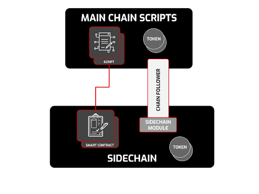

# IOG ra mắt bộ công cụ để phát triển sidechains tùy chỉnh trên Cardano

### **Xây dựng sidechains trên Cardano: tài liệu, thành phần và ví dụ hoạt động**

 12 tháng một 2023  [Neil Burgess](/en/blog/authors/neil-burgess/page-1/)  7 phút đọc

### [**Neil Burgess**](/en/blog/authors/neil-burgess/page-1/)

Nhà văn kỹ thuật

Tiếp thị &amp; Truyền thông

- 
- 

Input Output Global (IOG) đã tập hợp một nhóm kỹ sư chuyên gia sử dụng nền tảng vững chắc của Cardano để xây dựng bộ công cụ xây dựng các sidechain tùy chỉnh. Bằng cách sử dụng bộ công cụ, họ đã xây dựng một mạng thử nghiệm công khai sidechain tương thích với máy ảo Ethereum (EVM) như một bằng chứng về khái niệm. Sidechains làm cho Cardano có thể mở rộng và có khả năng mở rộng hơn mà không ảnh hưởng đến tính ổn định hoặc bảo mật của chuỗi chính.

## **Mở rộng Cardano với sidechains**

Cardano là một chuỗi khối thế hệ thứ ba, dựa trên nghiên cứu học thuật và được viết bằng Haskell để chứng minh tính đúng đắn của toán học.

Tính phi tập trung, bảo mật và khả năng mở rộng của giao thức đồng thuận Ouroboros đã được chứng minh ở quy mô và khối lượng bởi [hàng nghìn nhóm cổ phần độc lập](https://www.statista.com/statistics/1279280/cardano-ada-biggest-staking-pool-groups/) và [hàng triệu địa chỉ ví](https://cardanofeed.com/cardano-active-wallets-skyrocket-past-3-million-a-striking-1000-year-on-year-increase-45346) trong hơn [5 năm](https://roadmap.cardano.org/en/byron/) . Mạng đã hoạt động liên tục kể từ khi thành lập vào năm 2017.

Phân cấp và khả năng tương tác là chìa khóa cho tương lai của blockchain. Các tính năng này đảm bảo rằng không có cá nhân hoặc tổ chức nào có thể kiểm soát chuỗi khối hoặc bị hạn chế chỉ trong một hệ sinh thái. Để phát triển, từ cả khía cạnh kỹ thuật và xã hội, hầu hết các ứng dụng và cộng đồng cần được trao quyền với các lựa chọn thiết kế và chủ quyền của riêng họ.

Để kích hoạt môi trường có thể tương tác này, IOG đã nghiên cứu tạo ra một bộ công cụ để xây dựng một nhóm các chuỗi bên. Với bộ công cụ này, bất kỳ ai cũng có thể bắt đầu tận dụng cơ sở hạ tầng và bảo mật của Cardano để tạo các sidechain dành riêng cho nhiệm vụ. [EVM sidechain](https://iohk.io/en/blog/posts/2022/07/06/introducing-the-cardano-evm-sidechain/) chứng minh tính khả thi của khái niệm này. Tất cả công việc này đang được chia sẻ với cộng đồng Cardano và sẽ là nguồn mở hoàn toàn. Giai đoạn đầu tiên là trình diễn ứng dụng EVM tại [IO ScotFest](https://iohk.io/en/blog/posts/2022/11/04/announcing-io-scotfest-the-age-of-voltaire/) ở Edinburgh vào cuối tháng 11 năm 2022. Hôm nay, chúng tôi sẽ cung cấp đợt [tài liệu chính thức](https://docs.cardano.org/cardano-sidechains/sidechain-toolkit/introduction) đầu tiên .

## **Về bộ công cụ**

Sidechain đơn giản là một chuỗi khối phụ thuộc vào chuỗi chính của nó và được kết nối với nó.

Bộ công cụ cho phép sidechain có các tính năng và thuật toán đồng thuận của riêng mình. Sidechain được kết nối với chuỗi chính thông qua một cây cầu cho phép chuyển tài sản giữa các chuỗi. Tính hữu hạn của các khối được xác định thông qua cơ chế đồng thuận dựa trên tính bảo mật của chuỗi chính.

Bộ công cụ được tạo thành từ:

- **Tập lệnh Plutus chuỗi chính** . Các tập lệnh này chạy trên chuỗi chính của Cardano, cho phép giao dịch chuỗi chéo an toàn và di chuyển mã thông báo, đồng thời tận dụng các chính sách đúc tiền để hỗ trợ mã thông báo của sidechain.
- **Một người theo chuỗi** . Người theo dõi chuỗi theo dõi dữ liệu chuỗi chính và các sự kiện chi phối chuỗi phụ. Trong bản phát hành bộ công cụ v1, đây là phiên bản [đồng bộ hóa cơ sở](https://docs.cardano.org/cardano-components/cardano-db-sync/about-db-sync) hạ tầng Cardano .
- **Mô-đun sidechain** . Mô-đun này là một phần của ứng dụng sidechain. Nó giải thích dữ liệu chuỗi chính và thực hiện các điều chỉnh sổ cái cần thiết.

Hình 1. Các thành phần của bộ công cụ Sidechain

Bộ công cụ cũng đi kèm với một [tài liệu đặc tả kỹ thuật](https://docs.cardano.org/cardano-sidechains/sidechain-toolkit/introduction/#technicalspecification) chứa phần giới thiệu và hướng dẫn về sidechains Cardano. Các khối xây dựng của bộ công cụ được thiết kế để trao quyền cho các nhà phát triển. Vài ví dụ:

- di chuyển dữ liệu và nội dung giữa chuỗi chính và chuỗi bên tùy chỉnh
- hỗ trợ các giao thức đồng thuận, quy tắc sổ cái và ngôn ngữ khác nhau
- ra mắt sidechain an toàn
- chuỗi nhỏ an toàn
- cho phép thí nghiệm, ươm tạo và nghiên cứu.

Ứng dụng sidechain EVM vẫn đang được kiểm tra và nó sẽ có sẵn dưới dạng mạng thử nghiệm công khai vào cuối tháng 1 năm 2023. Các nhà phát triển sẽ có thể dùng thử bằng cách chạy một vài ứng dụng Solidity để cảm nhận tiềm năng của nó. Các nhà phát triển DApp sử dụng chuỗi bên EVM nên lưu ý rằng dữ liệu cần được coi là cuối cùng trên chuỗi chính trước khi nó được chuyển sang chuỗi bên.

## **Sử dụng các thành phần của bộ công cụ sidechain**

Các nhà phát triển chuỗi khối, nhà phát triển ứng dụng phân tán (DApp), nhà điều hành nhóm cổ phần (SPO) và người dùng DApp đều có thể hưởng lợi từ các sidechain tùy chỉnh. Các nhà phát triển có thể sử dụng bộ công cụ để tạo chuỗi khối cho các trường hợp sử dụng cụ thể dựa trên tính bảo mật và phân cấp của Cardano.

Các chuỗi khối được tạo theo cách này có thể tận dụng sự hỗ trợ của cộng đồng SPO hiện có và hưởng lợi từ cộng đồng nhiệt tình của những người theo dõi Cardano.

Đối với các nhà phát triển DApp, sidechains tùy chỉnh mang lại lợi thế về khả năng tương tác, khả năng mở rộng, khả năng kiểm tra và khả năng tương thích.

**khả năng tương tác**

Hình thức giao tiếp cơ bản nhất giữa chuỗi chính và chuỗi phụ là trao đổi tài sản. Bởi vì tài sản vẫn giữ nguyên bản chất của chúng khi được chuyển sang sidechain, nên chúng có thể được chuyển trở lại một cách dễ dàng. Một cơ chế cầu cho phép giao tiếp này. Miễn là cả hai chuỗi đều được bảo mật, thì bảo mật này được áp dụng cho chuyển khoản hai chiều.

Giao tiếp giữa chuỗi chính và chuỗi bên cho phép chúng giữ các giao thức đồng thuận (có thể được sửa đổi) và các định dạng khối của riêng chúng nhưng vẫn hoạt động cùng nhau, mở ra nhiều ứng dụng hơn.

**khả năng mở rộng**

Giống như người quản lý dự án có quyền lựa chọn tốt, nhanh hoặc rẻ (chọn bất kỳ hai), một chuỗi khối có quyền lựa chọn ba mục tiêu cạnh tranh – phân cấp, bảo mật và khả năng mở rộng.

Bởi vì các sidechains có thể dành riêng cho một miền ứng dụng, các giao dịch có thể được hoàn thành nhanh hơn, giảm bớt gánh nặng cho chuỗi chính này. Việc cải thiện khả năng mở rộng của sidechains không ảnh hưởng đến bảo mật và không cần ảnh hưởng đến việc phân cấp.

**khả năng kiểm tra**

Các nhà phát triển có thể thử nghiệm các DApp thí điểm trên các chuỗi bên chuyên dụng. Nếu xảy ra lỗi yêu cầu khởi động lại hoặc sửa đổi giao diện của chuỗi, thì chỉ chuỗi phụ bị ảnh hưởng chứ không phải chuỗi chính. Giai đoạn này hoạt động như một bước trung gian giữa vận hành testnet và phát hành mainnet đầy đủ cho các tính năng thử nghiệm và ứng dụng mới.

**khả năng tương thích**

Sidechains có thể hiển thị cùng một giao diện chương trình ứng dụng (API) như một chuỗi hiện có và sử dụng tính bảo mật và hiệu quả của các giao thức đồng thuận của Cardano. Ví dụ: sidechain Cardano EVM cung cấp môi trường thực thi Solidity không yêu cầu công cụ khai thác nhưng vẫn phục vụ các phương thức Ethereum JSON RPC. Hợp đồng thông minh Ethereum có thể chạy không thay đổi, với mức phí gas thấp hơn đáng kể.

### **Đối với SPO**

Chuỗi bên cung cấp cơ hội cho các SPO bằng cách cho phép nhóm của họ trao nhiều mã thông báo hơn là chỉ ada nếu họ quyết định chạy một nút chuỗi bên. Các mã thông báo dành riêng cho sidechain này có thể phục vụ các mục đích khác nhau và lần lượt thu hút những người được ủy quyền tham gia vào mạng. Tùy thuộc vào cách phần thưởng được thiết lập trên sidechain, những người tạo khối sidechain có thể được thưởng bằng các mã thông báo mới để xây dựng các khối, xác thực chúng và đóng góp vào bảo mật của mạng. Bất kỳ Cardano SPO nào cũng có thể chọn xác thực các khối trên sidechain. Nếu làm như vậy, họ có thể hưởng lợi từ doanh thu tăng thêm do cung cấp các dịch vụ bổ sung và sử dụng nhiều tài nguyên hơn.

Nếu một SPO chọn xác thực các khối sidechain, họ sẽ cần cung cấp thêm tài nguyên. Cần có một số dung lượng đĩa để lưu trữ sidechain và chúng phải chạy thêm hai quy trình nữa; một người theo dõi chuỗi và một nút sidechain.

### **Đối với người dùng DApp**

Khả năng tương tác tốt hơn giữa các chuỗi, quy trình phát triển được đơn giản hóa, nhiều nền tảng phát triển hơn và giảm phí giao dịch có xu hướng làm tăng số lượng và sự đa dạng của DApps. Nhiều sidechains Cardano hơn có nghĩa là nhiều thiết kế blockchain sáng tạo hơn, các trường hợp sử dụng và tổng phần thưởng đặt cược cao hơn, có xu hướng thu hút nhiều SPO và người ủy quyền hơn, do đó đảm bảo tăng cường bảo mật và phân cấp cao hơn. Đó là tiềm năng của hệ sinh thái sidechains.

## **Phần kết luận**

Bộ công cụ sidechain là bản phân phối mới nhất trên lộ trình Cardano trong Basho, giai đoạn mở rộng quy mô, giới thiệu khả năng lập trình, khả năng tương tác và khả năng mở rộng cao hơn. Sự phát triển của Sidechains mở đường cho việc áp dụng hàng loạt Cardano bằng cách cho phép thông lượng cao hơn nhiều mà không làm giảm tính phi tập trung hoặc bảo mật. Các nhà phát triển chuỗi khối có thể dễ dàng tạo các sidechain tùy chỉnh hơn. Cuối cùng, IOG hy vọng sẽ thấy một nhóm Cardano sidechains và chuỗi đối tác nổi lên.

Mạng thử nghiệm công khai EVM sidechain sẽ được phát hành vào tháng 1 năm 2023 cho phép cộng đồng triển khai DApps, tạo hợp đồng thông minh và di chuyển mã thông báo giữa các chuỗi môi trường thử nghiệm.

Bộ công cụ được phát hành vào tháng Giêng không phải là một giải pháp hoàn chỉnh. Có một số lĩnh vực đã biết để cải thiện, như trải nghiệm cầu nối, cơ chế phần thưởng SPO và mô hình bảo mật. Tất cả những lĩnh vực này sẽ được thực hiện với cộng đồng khi chúng tôi tiến hành - cẩn thận và đều đặn - cộng tác để nhận phản hồi, suy nghĩ và đề xuất.

Có rất nhiều cải tiến có thể được thực hiện và có rất nhiều cách khác nhau để chạy một sidechain. Tuy nhiên, chúng tôi hy vọng những gì chúng tôi đã phát triển nội bộ tại IOG sẽ cung cấp một bộ khả năng cốt lõi và đặt nền móng vững chắc để xây dựng một bộ công cụ cũng như cải tiến hơn nữa khi cộng tác với cộng đồng.

Các tài liệu và video hướng dẫn khác sẽ có sẵn trong thời gian tới. Như mọi khi, hãy theo dõi [mạng xã hội của IOG](https://twitter.com/InputOutputHK) để cập nhật thông tin mới nhất.

Đọc thông số [kỹ thuật](https://docs.cardano.org/cardano-sidechains/sidechain-toolkit/introduction/#technicalspecification) và [tài liệu phát triển](https://docs.cardano.org/cardano-sidechains/sidechain-toolkit/introduction) của sidechains và [tham gia Cộng đồng kỹ thuật của IOG Discord](https://discord.gg/inputoutput) để thảo luận thêm. Chúng tôi sẽ sớm tổ chức giai đoạn Discord dành cho các nhà phát triển quan tâm, vì vậy hãy nhớ đăng ký nhận bản tin dành cho [nhà phát triển](https://mailchi.mp/iohk/devdigest) của IOG để được thông báo. Đối với các yêu cầu về thương mại và quan hệ đối tác, hãy liên hệ với IOG qua [trang liên hệ](https://iohk.io/en/contact-commercial) .
