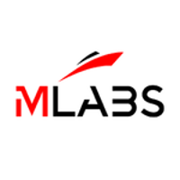

# Triển khai các dự án đấu giá bằng Hydra(P2)

### **Một bài báo của IOG và MLabs trình bày cách xử lý các cuộc đấu giá bằng Hydra**

 20 tháng một 2023  [MLabs](/en/blog/authors/mlabs/page-1/)  33 phút đọc

### [**MLabs**](/en/blog/authors/mlabs/page-1/)

Tư vấn Haskell và Rust

tác giả khách mời

- 

Dự án này là sự hợp tác giữa Input Output Global, Inc. (IOG) và MLabs Ltd. (MLabs) để phát triển triển khai tham chiếu của phiên đấu giá sử dụng giao thức Hydra. Mục đích của việc này là gấp đôi:

1. Để chứng minh rằng giờ đây có thể phát triển các ứng dụng quan trọng cho trường hợp sử dụng có giá trị với việc triển khai hiện tại của Hydra.
2. Để xác định một cách xây dựng và điều chỉnh thiết kế giao thức Hydra Head với các trường hợp sử dụng cụ thể hiện có trong hệ sinh thái Cardano và đơn giản hóa việc các nhà phát triển áp dụng giao thức.

Hy vọng là dự án này và các dự án tương tự tập trung vào các trường hợp sử dụng khác, sẽ mở đường cho cộng đồng Cardano bắt đầu sử dụng Hydra cho khả năng mở rộng trong thực tế phổ biến.

## **Giao thức Hydra Head**

Hydra là một nhóm các giao thức nhằm cung cấp giải pháp khả năng mở rộng lớp 2 (L2) cho Cardano. Giao thức Hydra Head là giao thức đầu tiên trong dòng này – nó là một bộ phần mềm và hợp đồng thông minh cho phép bất kỳ nhóm người tham gia nào thiết lập các kênh trạng thái đa bên, đẳng cấu (Hydra Heads) với nhau. Giao thức Hydra Head sẽ được sử dụng trong dự án này.

Hydra Heads cho phép những người tham gia giao dịch với nhau, sử dụng số tiền mà họ đã mang vào các kênh trạng thái mà không phải gửi các giao dịch này đến mạng chính của Cardano (L1). Kết quả cuối cùng của những tương tác này giữa những người tham gia Hydra Head có thể được đưa trở lại Cardano L1 bằng cách đóng Hydra Head, giải phóng tiền bên trong Hydra Head để sử dụng trong các Hydra Head khác hoặc trên Cardano L1.

Các giao dịch trong Hydra Head có cùng định dạng và thuộc tính như các giao dịch trên Cardano L1 - chúng là *đẳng cấu* . Về nguyên tắc, điều này cho phép Cardano DApps sử dụng lại một phần đáng kể cơ sở mã của họ khi chuyển đổi một số hợp đồng thông minh của họ sang sử dụng Hydra.

Một ngoại lệ đối với thuộc tính đẳng cấu này là việc đúc/đốt mã thông báo trong Hydra Head không thể ảnh hưởng đến Cardano L1. Điều duy nhất mà Hydra Head có thể đạt được trên Cardano L1 là phân phối lại các mã thông báo hiện có từ UTXO đã cam kết với Hydra Head sang UTXO mới. Điều này được thực hiện theo các giao dịch mà người tham gia đã đồng ý thực hiện bên trong Hydra Head.

Cũng có một số khác biệt giữa các giao thức đồng thuận của Cardano L1 và Hydra L2. Điều này có thể yêu cầu các DApp Cardano hiện tại điều chỉnh thiết kế của chúng để chúng có thể duy trì hành vi mong muốn trong môi trường Hydra Head. Đặc biệt, không giống như Cardano L1, tất cả những người tham gia Hydra Head phải duy trì trực tuyến và phản hồi lẫn nhau trong quá trình hoạt động của Hydra Head và tất cả những người tham gia phải thừa nhận và đồng ý với từng giao dịch trong Hydra Head để nó có hiệu lực.

Các ứng dụng có thể được chạy trong một Đầu duy nhất hoặc chúng có thể được trải rộng trên một mạng các Đầu Hydra. Khi một ứng dụng được trải rộng trên mạng các Đầu Hydra, trạng thái toàn cầu của nó có thể được phát triển thông qua giao tiếp giữa các Đầu Hydra (bỏ qua L1) hoặc bằng cách đồng bộ hóa các trạng thái đầu cục bộ với L1 và giải quyết chúng ở đó.

Có một danh mục đang phát triển về cấu trúc liên kết mạng Hydra Head, mỗi cấu trúc liên kết đều có những lợi ích/giới hạn của nó. Danh mục dự kiến sẽ mở rộng khi nhiều ứng dụng sẽ được xây dựng trên Hydra. Một số cấu trúc liên kết này được sử dụng trong các thiết kế đấu giá dựa trên Hydra mà chúng tôi thảo luận bên dưới.

Thông tin thêm [về Hydra có tại đây](https://hydra.family/head-protocol/) .

# **Phân tích kinh doanh dự án đấu giá**

Trong giai đoạn *khám phá* của dự án này, một phân tích kinh doanh đã được tiến hành để hiểu rõ hơn về không gian đấu giá trên Cardano và cách nó có thể tận dụng công nghệ mở rộng quy mô của Hydra.

IOG và MLabs đã khảo sát một nhóm rộng lớn các dự án Cardano xây dựng đấu giá và thị trường NFT, từ đó một nhóm nhỏ hơn gồm bốn dự án đã được chọn để phỏng vấn chuyên sâu về:

- các chi tiết cụ thể của trường hợp sử dụng đấu giá của họ
- đánh giá của họ về những lợi ích và hạn chế của Hydra
- sở thích của họ về một số sự đánh đổi nhất định có thể được yêu cầu trong quá trình chuyển đổi hợp đồng thông minh đấu giá L1 sang môi trường Hydra Head

## **Trường hợp sử dụng đấu giá kiểu Anh**

Chúng tôi phát hiện ra rằng có sự đồng thuận rộng rãi giữa những người được phỏng vấn rằng một phiên đấu giá kiểu Anh với các tính năng tiêu chuẩn nên được nhắm mục tiêu khi triển khai tham chiếu trong dự án này. Tất cả những người được phỏng vấn đều có kế hoạch sử dụng một cuộc đấu giá như vậy trong các nền tảng tương ứng của họ.

Các tính năng cốt lõi của đấu giá kiểu Anh như sau:

- Người bán cung cấp một sản phẩm sẽ được bán tại cuộc đấu giá ("lô đấu giá") - ví dụ: NFT.
- Khi cuộc đấu giá bắt đầu, những người đấu giá có thể bắt đầu đặt giá thầu, giá này phải cao hơn giá khởi điểm do người bán xác định.
- Người trúng đấu giá phải trả giá thầu của mình. Điều này có thể được đảm bảo bằng cách yêu cầu các khoản đặt cọc dự thầu để hỗ trợ đầy đủ cho mỗi hồ sơ dự thầu, nếu không, nó có thể được thực thi yếu hơn bằng cách áp đặt các hình phạt tiền tệ hoặc uy tín đối với các nhà thầu không tôn trọng hồ sơ dự thầu của họ.
- Trong quá trình đấu giá, mỗi người đặt giá thầu có thể tăng giá thầu của mình ít nhất bằng mức tăng giá thầu tối thiểu do người bán xác định.
- Khi kết thúc cuộc đấu giá:
    - người trả giá có giá thầu cao nhất sẽ nhận được lô đấu giá,
    - các nhà thầu khác sẽ nhận được tiền hoàn lại của bất kỳ khoản đặt cọc đấu giá nào mà họ đã thực hiện trong cuộc đấu giá, và
    - người bán sẽ nhận được số tiền thu được từ giá thầu cao nhất sau khi đã khấu trừ các khoản phí thích hợp.

Các tính năng hữu ích bổ sung có thể được bao gồm trong đấu giá kiểu Anh:

- Giá mua ngay lập tức - người bán có thể đặt giá mà lô đấu giá có thể được mua ngay lập tức trong cuộc đấu giá, kết thúc cuộc đấu giá có lợi cho người mua ngay lập tức.
- Bỏng ngô đấu thầu – thời hạn đấu giá có thể được kéo dài nếu vẫn có hồ sơ dự thầu được gửi gần thời hạn.
- Giá dự trữ bí mật - trước khi cuộc đấu giá bắt đầu, người bán có thể đặt một mức giá bí mật phải vượt quá giá thầu cao nhất để giá thầu đó thắng cuộc đấu giá. Vào cuối cuộc đấu giá, giá khởi điểm được tiết lộ và nếu nó không bị vượt quá bởi bất kỳ giá thầu nào, thì lô đấu giá vẫn chưa bán được.
- Một chuỗi các lô đấu giá - khi kết thúc đấu giá trên một lô đấu giá, những người đặt giá thầu có thể tiếp tục tham gia cuộc đấu giá khi lô đấu giá tiếp theo trong chuỗi được đưa ra đấu giá.

Một trong những người được phỏng vấn cũng đang tìm cách triển khai đấu giá kiểu Hà Lan, ngoài đấu giá kiểu Anh mà họ sẽ sử dụng ở những nơi khác trên nền tảng của họ. Trong đấu giá kiểu Hà Lan, giá đấu giá bắt đầu cao và sau đó tự động giảm dần theo thời gian, cho đến khi người đấu giá đồng ý mua lô đấu giá ở mức giá hiện tại - thắng đấu giá. Mặc dù hợp đồng thông minh cho đấu giá kiểu Hà Lan khác với hợp đồng đấu giá kiểu Anh, nhưng chúng có chung hầu hết các giới hạn của Hydra đối với đấu giá. Do đó, việc triển khai tham khảo đấu giá kiểu Anh giảm thiểu đúng các hạn chế của Hydra cũng sẽ hữu ích cho đấu giá kiểu Hà Lan.

Cuối cùng, sở thích của những người được phỏng vấn là ưu tiên triển khai đấu giá dựa trên Hydra cung cấp các tính năng đấu giá cốt lõi bằng tiếng Anh trong khi giảm thiểu đủ các hạn chế của Hydra cho trường hợp sử dụng đấu giá. Các tính năng bổ sung cũng sẽ rất tuyệt nếu có, nhưng chúng có thể được thêm vào bởi chính các dự án khi chúng điều chỉnh việc triển khai tham chiếu của chúng tôi theo nhu cầu riêng của chúng. Vấn đề chính mà họ hy vọng chúng tôi sẽ giải quyết là làm thế nào để triển khai một phiên đấu giá tiếng Anh chức năng với các tính năng cốt lõi của Hydra.

# **Lợi ích và hạn chế của Hydra cho các cuộc đấu giá kể từ tháng 11 năm 2022**

Trong cả bảng câu hỏi khảo sát và các cuộc phỏng vấn chuyên sâu, những người được hỏi đều được hỏi về những lợi ích và hạn chế của giao thức Hydra Head đối với các dự án của họ. Trong các cuộc phỏng vấn sâu, những người được phỏng vấn đã được cung cấp một bản tóm tắt tiêu chuẩn về Hydra để đảm bảo rằng họ được cung cấp thông tin chính xác về cách thức hoạt động của công nghệ khi đưa ra câu trả lời về lợi ích và hạn chế.

## **Hạn chế của Cardano L1**

Những người trả lời khảo sát đã xác định những hạn chế sau khi chạy các ứng dụng chung trên mạng chính Cardano:

1. Thông lượng giao dịch không đủ cho các tương tác của người dùng với tần suất/số lượng lớn.
2. Thời gian tất toán giao dịch quá chậm.
3. Chi phí giao dịch quá cao.
4. Dung lượng lưu trữ dữ liệu quá thấp đối với các ứng dụng giàu dữ liệu.
5. Thật khó để xâu chuỗi các giao dịch giữa một số người tham gia một cách đáng tin cậy.

Ba hạn chế đầu tiên đặc biệt ảnh hưởng đến khả năng mở rộng và khả năng kinh doanh của các dự án đấu giá trên Cardano:

- Thông lượng giao dịch thấp có thể hạn chế số lượng giá thầu trong các phiên đấu giá, điều này có thể khiến chúng không đạt được giá bán đầy đủ.
- Thời gian hoàn tất giao dịch chậm có thể làm chậm nhịp điệu của các cuộc đấu giá, làm giảm sự hào hứng/thích thú mà người đặt giá cảm nhận được khi tham gia đấu giá.
- Chi phí giao dịch cao có thể cắt giảm lợi nhuận của người bán và nhà đấu giá hoặc tăng chi phí tham gia cho người dùng.

## **Lợi ích của Hydra cho các cuộc đấu giá**

Những người được phỏng vấn hy vọng nhận ra những lợi ích sau khi sử dụng Hydra trong các dự án đấu giá của họ:

1. Thông lượng cao hơn và kết thúc giao dịch nhanh hơn sẽ cho phép tăng tần suất đặt giá thầu trong các cuộc đấu giá.
2. Phí giao dịch rẻ hơn (có thể bằng không) sẽ giảm chi phí cho người đặt giá thầu, người bán và nhà đấu giá.
3. Hợp đồng thông minh đẳng cấu sẽ cho phép tái sử dụng đáng kể các hợp đồng thông minh L1 trong L2 và có khả năng triển khai linh hoạt giữa L1 và L2. Điều này có thể làm giảm chi phí phát triển và kiểm toán.

## **Hạn chế của Hydra cho đấu giá**

Những người được phỏng vấn đã xác định những hạn chế sau đây hiện đang ngăn cản họ tự mình theo đuổi việc triển khai đấu giá dựa trên Hydra.

Đầu tiên, không rõ cách chạy các trò chơi có tổng bằng 0 trong Hydra Head. Trong giao thức head được đơn giản hóa (hiện được triển khai trong [kho lưu trữ hydra-poc GitHub](https://github.com/input-output-hk/hydra-poc) ), bất kỳ người tham gia Head nào vào bất kỳ lúc nào cũng có thể phủ quyết sự phát triển tiếp theo của Hydra Head. Việc thực hiện quyền phủ quyết này khiến những người tham gia khác không còn lựa chọn nào khác ngoài việc đóng Hydra Head thành L1 với trạng thái Head cuối cùng mà tất cả những người tham gia đã cố gắng đồng ý trước khi có quyền phủ quyết.

Đối với một cuộc đấu giá diễn ra trong một Hydra Head duy nhất, quyền phủ quyết này đặc biệt có vấn đề vì nó có thể ngăn cuộc đấu giá không có bất kỳ giá thầu nào được thừa nhận. Thật vậy, không có động cơ nội tại nào để bất kỳ người đấu giá nào ký vào bất kỳ hồ sơ dự thầu nào do bất kỳ người đấu giá nào khác gửi trong Hydra Head vì giá thầu của người đấu giá khác làm tăng mức giá mà người đấu giá đó sẽ phải trả để thắng cuộc đấu giá.

Thứ hai, chỉ những người tham gia được liệt kê trong quá trình khởi tạo Hydra Head mới có thể tham gia vào Hydra Head (tức là không có người tham gia mới nào có thể tham gia) và mọi người tham gia Head phải duy trì hoạt động và phản hồi với những người tham gia khác để Hydra Head tiếp tục hoạt động (tức là không người tham gia nào có thể rời đi mà không đóng Hydra Head cho tất cả những người tham gia). Đây là một hạn chế đáng kể đối với đấu giá một người đứng đầu vì rất mong muốn cho phép những người đặt giá thầu mới tham gia các cuộc đấu giá đang diễn ra. Hơn nữa, những người đặt giá thầu không muốn bị mắc kẹt trong các cuộc đấu giá mà họ không còn hứng thú, điều này thậm chí có thể khiến họ sử dụng quyền phủ quyết để đóng Hydra Head sớm - một kết quả không mong muốn đối với các cuộc đấu giá một người đứng đầu.

Thứ ba, những người tham gia Hydra Head chỉ có thể sử dụng số tiền mà họ đã cam kết với Hydra Head trước khi mở. Giới hạn này tồn tại trong quá trình triển khai Hydra ( [kho lưu trữ hydra-poc](https://github.com/input-output-hk/hydra-poc) ) hiện tại, nhưng nó sẽ được dỡ bỏ khi các lần cam kết/không cam kết gia tăng được triển khai sau này trong lộ trình Hydra. Hiện tại, giới hạn này thực sự giới hạn mức giá tối đa có thể đạt được trong bất kỳ phiên đấu giá dựa trên Hydra nào yêu cầu giá thầu phải được hỗ trợ đầy đủ bằng tiền đặt cọc của người đặt giá thầu. Hơn nữa, nó tiết lộ giá thầu tối đa có thể có của mỗi người đặt giá thầu, giá thầu này có thể được khai thác bởi những người đặt giá thầu khác có nhiều tiền hơn đã cam kết với Hydra Head.

Những người được phỏng vấn chỉ ra rằng cả ba hạn chế này sẽ phải được giảm thiểu đầy đủ để phiên đấu giá dựa trên Hydra có thể khả thi như một sản phẩm được tung ra trên Cardano, nhưng điều đặc biệt quan trọng là phải khắc phục hạn chế đầu tiên để họ xem xét cung cấp một Đấu giá dựa trên Hydra trên nền tảng của họ.

# **Thiết kế đấu giá trên một Head duy nhất**

## **Đấu giá một đầu cơ bản**

Trong thiết kế cơ sở này cho một phiên đấu giá Người đứng đầu duy nhất, người bán và tất cả những người đặt giá thầu tạo thành một tập hợp những người tham gia Người đứng đầu Hydra mà họ mở cho phiên đấu giá. Một số cách để giảm thiểu các hạn chế của Hydra đối với phiên đấu giá một người đứng đầu đã được xem xét.

Quyền phủ quyết của người tham gia với một Hydra Head duy nhất có thể được giảm thiểu bằng cách:

- tiếp thị đấu giá một đầu như một dịch vụ cao cấp cho phép đặt giá thầu tần suất cao hơn
- liệt kê các sản phẩm thú vị/có giá trị hơn để bán trong các cuộc đấu giá này

Quyền truy cập vào dịch vụ cao cấp này sẽ được cung cấp cho những người dùng đã được KYC đầy đủ có uy tín cao và khoản đặt cọc có thể bị người bán đấu giá cắt giảm nếu có hành vi xấu. Các nhà thầu được khuyến khích tham gia một cách thiện chí trong các cuộc đấu giá một người đứng đầu, để tránh làm giảm danh tiếng của họ, mất quyền truy cập vào tính năng cao cấp này và/hoặc bị cắt giảm tiền đặt cọc.

Có thể giảm thiểu yêu cầu đối với những người tham gia phải luôn hoạt động và phản hồi với tất cả những người tham gia trong Hydra Head bằng cách sử dụng [cấu trúc liên kết Head được quản lý](https://hydra.family/head-protocol/topologies/managed/) , trong đó nhà đấu giá cung cấp cơ sở hạ tầng để phát các giao dịch và chữ ký của Hydra Head giữa những người tham gia Head và thậm chí để chạy một số giao dịch Phần mềm Hydra Head thay mặt cho những người tham gia. Theo cấu trúc liên kết này, những người tham gia vẫn duy trì quyền từ chối sự đồng ý đối với bất kỳ giao dịch nào trong Hydra Head, nhưng giờ đây, nhà đấu giá có khả năng kiểm duyệt thông tin liên lạc giữa những người tham gia.

Để giảm thiểu tác động của việc chỉ các khoản tiền được cam kết trước mới có sẵn trong phiên đấu giá (trước khi các khoản cam kết/không cam kết gia tăng khả dụng trên Hydra):

- Yêu cầu tất cả các nhà thầu gửi số tiền như nhau vào Hydra Head để không nhà thầu nào có lợi thế thông tin hơn các nhà thầu khác về khả năng thanh toán.
- Sử dụng tính năng "giá mua ngay lập tức" và đặt giá đó thành yêu cầu đặt cọc cố định cho những người đặt giá thầu tham gia đấu giá. Dù sao thì không có nhà thầu hợp lý nào sẽ trả giá cao hơn giá mua lại ngay lập tức, vì vậy một cuộc đấu giá như vậy sẽ thực sự không bị hạn chế bởi giới hạn Hydra này.

Một số người được phỏng vấn chỉ ra rằng biến thể giảm thiểu này của thiết kế đấu giá một đầu có thể khả thi trên nền tảng của họ.

## **Đấu giá bí mật một đầu**

Thiết kế này có thể chỉ hữu ích trong một ứng dụng khá thích hợp của đấu giá, nhưng nó được đưa vào đây như một ví dụ minh họa vì về mặt kỹ thuật, nó có thể loại bỏ hầu hết các động cơ hợp lý để một người đặt giá thầu thực hiện quyền phủ quyết của mình đối với những người đặt giá thầu khác trong Hydra Head .

Tại đây, những người đặt giá thầu được yêu cầu đặt giá thầu bí mật ban đầu tương ứng của họ khi cuộc đấu giá đang được thiết lập trước khi Hydra Head mở ra. Khi Hydra Head mở và cho đến khi cuộc đấu giá kết thúc, những người đặt giá thầu được phép thay đổi giá thầu bí mật của riêng họ để lấy giá thầu mới, giá thầu này có thể thấp hơn hoặc cao hơn giá thầu trước đó của họ. Theo cách này, các nhà thầu nói chung sẽ có rất ít động lực để phủ quyết các hồ sơ dự thầu của nhau, bởi vì họ không biết liệu các hồ sơ dự thầu mới thấp hơn hay cao hơn trước.

Tất nhiên, tính bí mật của các giá thầu trong cuộc đấu giá này bị giới hạn (như một giới hạn trên) bởi số tiền mà mỗi người đặt giá thầu cam kết với Hydra Head. Tuy nhiên, hạn chế này có thể được giảm thiểu bằng các kỹ thuật tương tự như đối với đấu giá một người đứng đầu thông thường.

Những người được phỏng vấn không đặc biệt hào hứng với thiết kế này vì nó không cho phép người tham gia biết giá thầu cao nhất là bao nhiêu vào bất kỳ thời điểm nào trước khi cuộc đấu giá kết thúc và vì không rõ giá trị của nó đối với người dùng khi có thể điều chỉnh giá thầu bí mật trong suốt cuộc đấu giá. một khoảng thời gian nào đó.

## **Ủy thác bán đấu giá**

Trong thiết kế này, một nhóm đại biểu sẽ giám sát lô đấu giá và tiền đặt cọc của người đấu giá vào cuộc đấu giá. Các nhà thầu nộp hồ sơ dự thầu của họ cho Hydra Head theo ủy quyền thông qua các đại biểu và tất cả các đại biểu phải ký vào hồ sơ dự thầu để hồ sơ có hiệu lực. Mọi giá thầu phải được hỗ trợ bởi tiền của người đặt giá thầu trong Hydra Head.

Một lợi thế đáng kể của thiết kế này là nó loại bỏ yêu cầu người bán và người đặt giá thầu phải luôn trực tuyến và phản hồi những người tham gia Hydra Head để phiên đấu giá tiếp tục diễn ra. Hơn nữa, mỗi nhà thầu chỉ cần ký tên vào các hồ sơ dự thầu mà anh ta gửi đến cuộc đấu giá. Chỉ những người được ủy quyền điều hành sự đồng thuận của Hydra Head cho cuộc đấu giá mới được yêu cầu phải trực tuyến và phản hồi trong suốt cuộc đấu giá và họ có thể được trả tiền để cung cấp dịch vụ này một cách đáng tin cậy.

Những người đặt giá thầu có thể ngoại tuyến và không hoạt động miễn là họ không muốn đặt bất kỳ giá thầu mới nào và không cần sự tham gia của người bán sau khi lô đấu giá được gửi vào Hydra Head. Đây có thể là một trải nghiệm người dùng dễ chịu hơn nhiều so với trong các cuộc đấu giá dựa trên Hydra không giam giữ, nơi người bán và người đặt giá thầu phải ký vào mọi giao dịch mà họ nhận được trong Hydra Head của họ.

Một ưu điểm khác của thiết kế này là nó loại bỏ quyền phủ quyết của người đặt giá thầu vì người đặt giá thầu không phải là người tham gia trực tiếp vào Hydra Head và do đó không thể giữ lại chữ ký của họ để đạt được sự đồng thuận đối với giá thầu của những người đặt giá thầu khác trong cuộc đấu giá.

Thật không may, việc trao quyền giám sát cho các đại biểu đối với lô đấu giá và tiền đặt cọc của người đặt giá thầu cho phép các đại biểu thông đồng để ăn cắp các khoản tiền này từ cuộc đấu giá. Người dùng có thể miễn cưỡng bán NFT có giá trị cao hoặc tham gia với số tiền đặt cọc cao trong một cuộc đấu giá lưu ký. Bản thân dịch vụ nhà đấu giá có thể phải đối mặt với gánh nặng pháp lý bổ sung và trách nhiệm pháp lý tiềm ẩn nếu tổ chức đấu giá lưu ký.

Một số người được phỏng vấn không ủng hộ việc tổ chức các cuộc đấu giá lưu ký trên Hydra, cho rằng các cuộc đấu giá này không khác nhiều so với việc chạy các cuộc đấu giá trên Web2 truyền thống. Những người được phỏng vấn khác chỉ ra rằng họ có thể cân nhắc chạy đấu giá lưu ký nếu những cải thiện về trải nghiệm người dùng vượt trội hơn những nhược điểm của việc lưu ký.

## **đấu giá phiếu mua hàng**

Thiết kế này được [mô tả trên trang web Hydra](https://hydra.family/head-protocol/use-cases/nft-auction/) . Nó không bắt buộc phải thanh toán giá thắng thầu, nhưng nó cho phép các nhà thầu đặt giá thầu vượt quá số tiền mà họ đã cam kết tương ứng với Hydra Head.

Nhà đấu giá giả mạo và phân phối NFT “mã thông báo mái chèo đặt giá thầu” cho từng người đặt giá thầu, cho phép người đặt giá thầu đặt giá thầu trong Hydra Head của phiên đấu giá. Cuộc đấu giá diễn ra theo các quy tắc kiểu Anh tiêu chuẩn, không yêu cầu tiền đặt cọc, và sau đó người đấu giá thắng cuộc sẽ được cấp một phiếu thưởng trên L1 khi cuộc đấu giá kết thúc. Người đấu giá thắng cuộc có thể chọn đổi phiếu thưởng của mình để đổi lấy lô đấu giá trên L1, bằng cách thanh toán số tiền đấu giá thắng cuộc.

Một lợi thế lớn của thiết kế đấu giá này là nó yêu cầu rất ít giao dịch để mở và đóng Hydra Head, dẫn đến chi phí thiết lập rất thấp và có thể hỗ trợ nhiều người tham gia Hydra Head hơn:

- Chỉ các mã thông báo mái chèo đấu thầu mới cần được gửi vào Hydra Head trong giai đoạn cam kết. Tiền của người đặt giá thầu và lô đấu giá của người bán nằm ngoài Hydra Head, mặc dù lô đấu giá cần phải được khóa theo hợp đồng thông minh để có thể mua lại bằng phiếu thưởng.
- Giao dịch xuất phát duy nhất cần thiết khi Hydra Head đóng cửa là thanh toán phiếu thưởng cho người chiến thắng phiên đấu giá trên L1.

Đổi phiếu mua hàng là tùy chọn đối với người đấu giá thắng cuộc, điều đó có nghĩa là người bán không được đảm bảo sẽ được thanh toán ngoài cuộc đấu giá. Hơn nữa, nó cho phép những người đặt giá thầu đưa ra những giá thầu phù phiếm và cao bất hợp lý mà họ không có ý định tôn trọng, gây trở ngại cho những người đặt giá thầu trung thực và có khả năng phá hoại hoàn toàn cuộc đấu giá.

Một cách để giảm thiểu vấn đề đấu thầu không trung thực này là yêu cầu mỗi nhà thầu nộp một khoản tiền đặt cọc được khấu trừ vào giá trúng thầu nếu nhà thầu thắng, và sẽ được hoàn lại nếu nhà thầu thua. Nếu người đấu giá thắng nhưng không đổi chứng từ của mình, người bán sẽ giữ lại khoản tiền đặt cọc được khấu trừ. Khoản tiền đặt cọc được khấu trừ có thể loại bỏ động cơ hợp lý của nhà thầu để đưa ra giá thầu không trung thực trừ khi lợi nhuận của họ từ việc đấu thầu không trung thực vượt quá khoản khấu trừ.

Vấn đề đặt giá thầu không trung thực của đấu giá chứng từ có thể được giảm thiểu hơn nữa giống như cách mà quyền phủ quyết của người đặt giá thầu được giảm thiểu trong đấu giá một người đứng đầu cơ bản. Nếu phiên đấu giá phiếu thưởng được tiếp thị dưới dạng dịch vụ cao cấp chỉ dành cho người dùng đã KYC có uy tín cao, thì người dùng có thể tránh đặt giá thầu không trung thực nếu việc từ chối giá thầu chiến thắng sẽ dẫn đến hình phạt đủ nghiêm trọng về uy tín trên nền tảng. Thật vậy, theo một trong những người được phỏng vấn, người thường xuyên tham gia các cuộc đấu giá NFT dựa trên Discord, nguy cơ bị phạt về uy tín thường đủ để buộc những người thắng thầu phải tôn trọng giá thầu của họ.

## **Đấu giá chứng từ ủy nhiệm**

Thiết kế này kết hợp đấu giá phiếu thưởng với Hydra Head do các đại biểu điều hành. Điều này giảm thiểu rủi ro mà những người được ủy quyền có thể thông đồng để trực tiếp ăn cắp tiền từ người bán và/hoặc người đặt giá thầu vì lô đấu giá và tiền của người đặt giá thầu vẫn nằm ngoài Hydra Head.

Phiên đấu giá trong thiết kế này hoạt động theo cách tương tự như trong đấu giá chứng từ, ngoại trừ việc những người đặt giá thầu gửi giá thầu của họ vào phiên đấu giá theo ủy quyền thông qua các đại biểu của Hydra Head và cần có nhiều chữ ký của đại biểu để các giá thầu ảnh hưởng đến trạng thái đấu giá bên trong Đầu Hydra. Khi phiên đấu giá kết thúc, người đấu giá thắng cuộc sẽ nhận được một phiếu thưởng có thể tùy ý đổi lấy lô đấu giá trên Cardano L1.

Thiết kế đấu giá này kế thừa các lợi ích thuận tiện cho người dùng từ đấu giá giám sát được ủy quyền và thừa hưởng chi phí thiết lập Hydra Head thấp và khả năng đặt giá thầu cao từ đấu giá chứng từ. Hơn nữa, với các cam kết/không cam kết gia tăng, các đại biểu có thể gửi phiếu thưởng cho người chiến thắng trong một phiên đấu giá và sau đó sử dụng lại mã thông báo mái chèo đặt giá thầu cho những người đặt giá thầu mới trong phiên đấu giá tiếp theo mà không cần đóng phiên đấu giá. Đầu thủy lực. Do đó, các đại biểu có thể có một mô hình kinh doanh khả thi vận hành một Head kiên trì và cho thuê thời gian trên Hydra Head cho các cuộc đấu giá khác nhau.

Như trong đấu giá chứng từ đơn giản, vấn đề đặt giá thầu không trung thực có thể được giảm thiểu bằng cách yêu cầu mỗi người đặt giá thầu đặt cọc khoản tiền này sẽ được khấu trừ vào giá trúng thầu nếu người đặt giá thầu thắng và mua lại lô đấu giá, được hoàn lại nếu người đặt giá thầu thua và bị tịch thu cho người bán nếu người đấu giá trúng và không mua lại lô đấu giá.

Một điểm khác biệt chính giữa thiết kế này và đấu giá chứng từ đơn giản là những người đấu giá không còn tham gia trực tiếp vào Hydra Head nữa. Điều này có nghĩa là chữ ký của những người đặt giá thầu không bắt buộc phải cho phép bất kỳ chuyển đổi trạng thái nào trong Hydra Head và do đó, những người được ủy quyền có thể cho phép các giao dịch khai báo sai giá thầu mà những người đặt giá thầu không gửi. Tất nhiên, người thắng thầu có thể chọn không tôn trọng một giá thầu sai như vậy; tuy nhiên, nếu yêu cầu đặt cọc khấu trừ được đưa vào cuộc đấu giá để chống lại việc đặt giá thầu không trung thực, thì người thắng thầu sẽ phải mất khoản đặt cọc của mình khi từ chối giá thầu sai. Ví dụ: những người được ủy quyền có thể thông đồng với người bán để chia tiền đặt cọc bị tịch thu của người đấu giá trúng thầu.

Để loại bỏ nguy cơ đặt giá thầu sai từ thiết kế này, mỗi giao dịch giá thầu trong Hydra Head có thể tạo ra một dữ liệu UTXO bao gồm chữ ký của người đặt giá thầu cho giá thầu đó và chữ ký giá thầu của người đặt giá thầu chiến thắng phải được lưu giữ trong tất cả các dữ liệu. cách phát hành chứng từ cho người trúng thầu trên L1. Phiếu mua hàng sẽ chỉ hợp lệ nếu dữ liệu UTXO của nó có chữ ký hợp lệ của người đặt giá thầu cho giá thầu tương ứng; nếu không thì phiếu không hợp lệ và kết quả đấu giá bị hủy bỏ.

Một rủi ro khác nảy sinh từ việc tin tưởng các đại biểu thực hiện cuộc đấu giá trong Hydra Head là họ có thể gian lận cuộc đấu giá để một giá thầu khác với giá thầu cao nhất sẽ thắng cuộc đấu giá. Tuy nhiên, các đại biểu có thể sẽ phải đối mặt với các hình phạt nghiêm trọng về mặt uy tín khi tham gia vào gian lận đấu giá như vậy, điều này sẽ ảnh hưởng đến khả năng tiếp tục cung cấp dịch vụ tổ chức đấu giá của họ trong tương lai.

Giảm thiểu hơn nữa đối với rủi ro gian lận đấu giá đại biểu sẽ là yêu cầu họ giữ một bản sao sổ cái của Hydra Head về các giao dịch đấu giá dẫn đến kết quả đấu giá cụ thể đã được chốt trên L1. Bản sao sổ cái đấu giá này thậm chí có thể được lưu trữ trong một khoảng thời gian đủ trên các chuỗi khối được tối ưu hóa lưu trữ (ví dụ: Arweave) hoặc các giải pháp L2 (ví dụ: Logosphere). Nếu một người đặt giá thầu tranh chấp kết quả đấu giá với cáo buộc gian lận đấu giá, thì những người được ủy quyền có thể trình bày sổ cái đấu giá làm bằng chứng trong quy trình giải quyết tranh chấp ngoài chuỗi.

Nhìn chung, thiết kế này tạo ra sự cân bằng phù hợp giữa thiết kế giám sát được ủy quyền và thiết kế đấu giá chứng từ.

# **Thiết kế đấu giá trên mạng của Hydra Heads**

## **đấu giá hình ngôi sao**

Thiết kế này sử dụng cấu trúc liên kết [mạng Head hình ngôi sao](https://hydra.family/head-protocol/topologies/star-shaped/) được mô tả trên trang web của Hydra. Tại đây, một nhà đấu giá tập trung sẽ mở một Đầu theo cặp riêng biệt với từng người đặt giá thầu trong phiên đấu giá. Người đấu giá cam kết với Hydra Head số tiền mà anh ta muốn sử dụng trong cuộc đấu giá, trong khi người điều hành cuộc đấu giá không giao bất kỳ khoản tiền nào vào Hydra Head mà thay vào đó chỉ ở đó để chứng kiến và đánh dấu thời gian trả giá của người đấu giá bằng chữ ký của anh ta. Người điều hành phiên đấu giá có thể chọn tính phí cung cấp dịch vụ này cho những người tham gia đấu giá.

Trường hợp sử dụng đấu giá có thể được triển khai trên cấu trúc liên kết mạng Hydra hình ngôi sao *mà không* yêu cầu chuyển tiền giữa các đầu mối thông qua [hợp đồng bị khóa thời gian băm (HTLC)](https://docs.lightning.engineering/the-lightning-network/multihop-payments/hash-time-lock-contract-htlc) . Thay vào đó, khi kết thúc phiên đấu giá, mỗi Đầu theo cặp được đóng lại với giá thầu cao nhất của người đặt giá thầu được đưa trở lại Cardano L1 và sau đó giá thầu chiến thắng có thể được giải quyết một cách hiệu quả trong quá trình phân phát từ mỗi Đầu. Có khả năng, có thể có một cơ chế để giải quyết những người thua cuộc đấu giá trong Hydra Heads của họ trong cuộc đấu giá, cho phép những người đấu giá thua cuộc sớm thoát khỏi cuộc đấu giá nếu họ không còn muốn tiếp tục đấu giá.

Những lợi ích chính của đấu giá hình ngôi sao so với đấu giá một người đứng đầu là:

- **Không có quyền phủ quyết của nhà thầu.** Những người đặt giá thầu không còn có thể phủ quyết các giá thầu của nhau vì những người đặt giá thầu được phân bổ trong các Trưởng Hydra riêng biệt.
- **Đấu giá viên không giam giữ.** Người bán đấu giá trong các Trụ Hydra theo cặp này không thể ăn cắp tiền của người đặt giá thầu, bởi vì chữ ký của mỗi người đặt giá thầu là bắt buộc đối với mọi giao dịch trong Đầu tương ứng của anh ta.
- **Thoải mái đáp ứng yêu cầu.** Những người đặt giá thầu không nhất thiết phải luôn trực tiếp và phản hồi trong Hydra Heads của họ, bởi vì bản thân người bán đấu giá không bao giờ gửi các giao dịch của mình trong Hydra Heads và do đó không bao giờ đợi những người đặt giá thầu ký vào giao dịch của mình. Nếu một người đặt giá thầu ngoại tuyến trong một thời gian, người điều hành phiên đấu giá có thể bình tĩnh giữ nguyên trạng thái không hoạt động cho đến khi người đặt giá thầu kết nối lại.

Ngược lại, vì chữ ký của người điều hành đấu giá cũng được yêu cầu trong mỗi đầu theo cặp, nên người điều hành cuộc đấu giá có quyền điều hành cuộc đấu giá:

- **Kiểm duyệt.** Người điều hành cuộc đấu giá có thể ngăn người đấu giá đặt giá thầu bằng cách từ chối ký tên vào giá thầu của anh ta, gian lận cuộc đấu giá chống lại người đấu giá đó và có lợi cho những người đấu giá khác mà người điều hành cuộc đấu giá không kiểm duyệt. Điều này tương tự như quyền phủ quyết của người đặt giá thầu trong cuộc đấu giá một người đứng đầu, nhưng nó chỉ được nắm giữ bởi người điều khiển cuộc đấu giá trong cuộc đấu giá hình ngôi sao.
- **Thông đồng để làm mất uy tín của một cuộc đấu thầu.** Người điều hành cuộc đấu giá có thể cho phép người trả giá từ chối trả giá của mình, bằng cách:
    - Cho phép người trả giá thay thế giá thầu của mình bằng giá thầu thấp hơn trong cuộc đấu giá; hoặc là
    - Không phản đối nỗ lực của người đặt giá thầu để đóng Đầu theo cặp với giá thầu khác với giá thầu cao nhất mà người đặt giá thầu đã thực hiện trong Đầu Hydra trong phiên đấu giá.
- **Thông đồng để đấu thầu bí mật.** Người điều hành cuộc đấu giá có thể cho phép người trả giá bí mật trả giá cao hơn mức trả giá cao nhất đã được thông báo cho tất cả những người trả giá cho đến nay. Điều này có nghĩa là những người trả giá khác sẽ nhầm lẫn về giá thầu cao nhất hiện tại là gì và ai là người trả giá cao nhất hiện tại cho đến khi phiên đấu giá kết thúc hoặc người trả giá bí mật tiết lộ mình là người trả giá cao nhất.

Hai quyền thông đồng của đấu giá viên không tồn tại trong đấu giá một người đứng đầu. Người đặt giá thầu trong một người đứng đầu không thể từ chối giá thầu của mình vì người bán sẽ không ký vào giao dịch giá thầu sẽ hạ thấp giá thầu hiện tại của người đặt giá thầu. Người đặt giá thầu không thể đặt giá thầu bí mật trong cuộc đấu giá một người đứng đầu, bởi vì mọi người tham gia Hydra Head phải xem và ký tên vào giá thầu để nó có hiệu lực. Do đó, sức mạnh thông đồng của người bán đấu giá tập trung của đấu giá hình ngôi sao là nhược điểm chính của nó so với đấu giá một người đứng đầu.

## **Đấu giá lược đồ chòm sao**

Thiết kế này là sự khái quát hóa của phiên đấu giá hình ngôi sao chia người bán đấu giá thành nhiều bên trung lập trong đầu của mỗi người đặt giá thầu. Hơn nữa, nó chỉ yêu cầu M trong số N của các bên trung lập (M &lt; N) ký các giao dịch trong Head của người đặt giá thầu, ngoài chữ ký của người đặt giá thầu.

Ví dụ: giả sử rằng Alice, Bob và Charlie là những người trả giá trong một cuộc đấu giá; và rằng Oskar, Patricia, Quentin, Rupert và Sally là những bên trung lập tiềm năng. Nếu chúng ta đặt (M = 2) và (N = 3), thì chúng ta có thể thiết lập người đặt giá thầu Hydra Heads cho phiên đấu giá như sau:

- Alice's Head bao gồm Alice, Oskar, Quentin và Rupert. Mọi giao dịch trong Đầu này đều yêu cầu chữ ký của Alice và 2 trong số 3 chữ ký của Oskar, Quentin và Rupert.
- Bob's Head bao gồm Bob, Patricia, Rupert và Sally. Mọi giao dịch trong Head này đều yêu cầu chữ ký của Bob và 2 trong số 3 chữ ký của Patricia, Rupert và Sally.
- Charlie's Head bao gồm Charlie, Oskar, Patricia và Sally. Mọi giao dịch trong Head này đều yêu cầu chữ ký của Charlie và 2 trong số 3 chữ ký của Oskar, Patricia và Sally.

Thiết kế này giảm thiểu khả năng gian lận đấu giá tập trung từ đấu giá hình ngôi sao:

- Thông đồng với người đặt giá thầu để làm mất uy tín hoặc không tiết lộ giá thầu bị giảm giá trị vì người đặt giá thầu phải thông đồng với các bên trung lập hơn để cùng nhau thao túng cuộc đấu giá có lợi cho mình.
    - Mặt khác, sơ đồ chữ ký M của N làm cho việc nhà thầu thông đồng với các bên trung lập dễ dàng hơn so với sự đồng ý nhất trí, vì vậy M không nên nhỏ hơn nhiều so với N.
- Việc kiểm duyệt hồ sơ dự thầu giảm đi vì nó yêu cầu (N - M + 1) bên trung lập từ chối chữ ký của họ trong hồ sơ dự thầu.

Hơn nữa, lược đồ chữ ký M trên N có thể nới lỏng các yêu cầu về khả năng phản hồi của các bên trung lập, bởi vì tối đa (N - M) các bên trung lập có thể ngoại tuyến trong thời gian ngắn mà không nhất thiết phải ngăn một giá thầu có nhiều chữ ký trong Hydra Head.

Chúng tôi cũng có thể bỏ qua việc lựa chọn ngẫu nhiên các bên trung lập cho mỗi Người đứng đầu Hydra của người đặt giá thầu, thay vào đó sử dụng một nhóm cố định các bên trung lập độc lập trong mỗi Người đứng đầu. Chẳng hạn, đây có thể là một liên đoàn gồm những người đấu giá độc lập sẽ giữ cho nhau trung thực trong các phiên đấu giá mà họ đồng tổ chức cho người dùng.

Để giảm hơn nữa khả năng gian lận đấu giá của các bên trung lập, họ có thể được chọn ngẫu nhiên cho Người đứng đầu của mỗi người đặt giá thầu từ một nhóm lớn các bên trung lập tiềm năng, có lẽ tương tự như xổ số dựa trên chức năng ngẫu nhiên có thể xác minh (VRF) được sử dụng trên Cardano L1 để chọn người đứng đầu vị trí cho thêm các khối vào chuỗi.

Theo một nghĩa nào đó, xổ số Hydra Head này có thể được coi là sự tổng quát tự nhiên của xổ số dẫn đầu vị trí của Cardano từ L1 đến L2. Trong lớp đầu tiên, các nhà lãnh đạo vị trí được chọn ngẫu nhiên để thêm các khối giao dịch do người dùng ký vào chuỗi chính. Ở lớp thứ hai, các bên trung lập được chọn ngẫu nhiên để làm trung gian cho các giao dịch tạm thời trong Hydra Head và sau đó giúp đưa kết quả cuối cùng trở lại chuỗi chính. Thật vậy, mạng lưới lớn các nhóm cổ phần trên Cardano có thể được khai thác để cung cấp các dịch vụ của bên trung lập trên lớp 2, như một nguồn doanh thu khác sử dụng tài nguyên máy tính hiện có của họ.

# **Thiết kế đấu giá dựa trên Hydra đã chọn của chúng tôi cho giai đoạn triển khai**

Đối với giai đoạn triển khai của dự án này, thiết kế đấu giá chứng từ được ủy quyền đã được chọn vì nó giảm thiểu đáng kể ba hạn chế chính của giao thức Hydra Head mà những người được phỏng vấn cho biết đang ngăn cản họ theo đuổi các giải pháp dựa trên Hydra. Dựa trên phân tích kinh doanh của chúng tôi, việc triển khai tham chiếu dựa trên thiết kế này có thể được điều chỉnh một cách khả thi thành dịch vụ đấu giá trên mạng chính Cardano.

Hơn nữa, thiết kế này có thể chứng minh cho cộng đồng Cardano rằng nếu họ vượt qua mô hình một đầu cơ bản, phạm vi trường hợp sử dụng rộng hơn sẽ trở nên khả thi bằng cách áp dụng các kỹ thuật như:

- Quản lý thông tin chứ không phải tiền trong Hydra Head (ví dụ: phiếu mua hàng có thể đổi được).
- Ủy quyền các nghĩa vụ tham gia của Hydra để giảm bớt gánh nặng/sự bất tiện cho người dùng.

Về các thiết kế đấu giá lược đồ hình ngôi sao và chòm sao, chúng là những thiết kế thú vị và khá hấp dẫn đối với những người được phỏng vấn. Tuy nhiên, chúng cũng phức tạp hơn đáng kể so với thiết kế đấu giá chứng từ được ủy quyền. Hơn nữa, chúng yêu cầu phải có sẵn các tính năng Hydra Head chưa được triển khai để lợi ích của những thiết kế này được thể hiện rõ ràng trong phần trình diễn triển khai tham chiếu. Do đó, họ nên được xem xét cho một dự án đấu giá dựa trên Hydra trong tương lai, thậm chí có thể bởi một số người trả lời phân tích kinh doanh nếu dự án hiện tại của chúng tôi mang lại cho họ niềm tin rằng họ có thể theo đuổi các dự án DApp dựa trên Hydra của riêng họ.

## **Phạm vi của giai đoạn thực hiện**

Trong giai đoạn triển khai, IOG và MLabs sẽ ưu tiên chỉ triển khai các tính năng đấu giá kiểu Anh cốt lõi trong thiết kế chứng từ được ủy quyền. Sau khi những tính năng này được triển khai, các tính năng đấu giá kiểu Anh bổ sung có thể được theo đuổi dưới dạng các tính năng hữu ích. Lý do cho sự ưu tiên này là những người trả lời và người được phỏng vấn trong phân tích kinh doanh chỉ ra rằng họ muốn thấy các hạn chế của Hydra được giải quyết đúng cách cho trường hợp sử dụng đấu giá, giám sát các tính năng không cốt lõi được triển khai trong phiên đấu giá dựa trên Hydra.

Vào cuối giai đoạn này, việc triển khai đấu giá sẽ cung cấp các tính năng sau:

- Một nhóm đại biểu có thể mở một Hydra Head có khả năng tổ chức đấu giá cho tài sản NFT do người bán cung cấp.
- Người bán có thể phân phối quyền tham gia (ví dụ: thông qua mã thông báo tham gia) trong cuộc đấu giá cho những người đặt giá thầu tiềm năng đã khóa tiền gửi khấu trừ của họ cho cuộc đấu giá.
- Mỗi người đặt giá thầu có thể gửi giá thầu cho cuộc đấu giá bằng cách gửi nó cho một trong những người được ủy quyền, người này sau đó sẽ phát nó cho những người được ủy quyền còn lại.
- Các đại biểu có thể xác nhận chung các giá thầu bằng cách ký nhiều lần thông qua giao thức Hydra Head, do đó bao gồm các giá thầu trong trạng thái sổ cái Hydra Head.
- Khi thời hạn đấu giá trôi qua, các đại biểu có thể giải quyết dứt khoát các giá thầu trong Hydra Head để xác định giá thầu chiến thắng.
- Các đại biểu có thể đóng Hydra Head:
    - Nếu cuộc đấu giá được giải quyết, thì một phiếu thưởng có thể được cấp cho người đấu giá thắng cuộc, cho phép người đấu giá thắng cuộc mua lại tài sản NFT của người bán để đổi lấy số tiền đấu thầu.
    - Nếu cuộc đấu giá không được giải quyết, các giá thầu của nó có thể được giải quyết trên L1 để xác định giá thầu trúng thầu và sau đó phiếu mua hàng có thể được cấp cho người đấu giá thắng cuộc.
- Những người đấu giá thua cuộc có thể đổi lại khoản tiền đặt cọc được khấu trừ của họ khi Hydra Head của cuộc đấu giá đóng cửa và cuộc đấu giá được giải quyết.
- Người đấu giá thắng cuộc có thể sử dụng số tiền trong khoản tiền gửi được khấu trừ của mình để thanh toán cho người bán tài sản NFT.
- Khi chứng từ được cấp cho người đấu giá thắng cuộc, thời hạn được đặt để mua lại tài sản NFT của người bán. Nếu người thắng đấu giá không mua lại tài sản NFT của người bán trước thời hạn, người bán có thể yêu cầu khoản đặt cọc được khấu trừ của người đấu giá thắng.
- Phiếu thưởng UTXO chỉ có thể được sử dụng bởi người đấu giá thắng cuộc để đổi lấy NFT của người bán hoặc bởi người bán để yêu cầu khoản đặt cọc được khấu trừ của người đấu giá thắng cuộc sau thời hạn đổi thưởng.

Chúng tôi cũng sẽ phát triển một đặc điểm kỹ thuật để tăng cường việc thực hiện trên với các hồ sơ dự thầu do nhà thầu ký, theo đó:

- Người tham gia đấu giá ký tên vào nội dung trả giá (Mã số cuộc đấu giá, số tiền đặt giá, thời điểm trả giá) khi nộp hồ sơ tham gia cuộc đấu giá.
- Chữ ký của mỗi giá thầu từ người đặt giá thầu của nó được lưu giữ trong dữ liệu UTXO trên sổ cái Hydra Head, miễn là giá thầu đang hoạt động trong phiên đấu giá.
- Một chứng từ hợp lệ chỉ có thể được phát hành bằng UTXO có chứa chữ ký giá thầu của người đặt giá thầu thắng cuộc trong mốc thời gian của nó. Chỉ một phiếu thưởng hợp lệ mới có thể được sử dụng để đổi tài sản NFT của người bán.

## **Những cải tiến tiềm năng trong tương lai đối với việc triển khai đấu giá**

Việc triển khai đấu giá ở trên sẽ giải quyết đáng kể ba hạn chế chính của Hydra Head đối với trường hợp sử dụng đấu giá. Tuy nhiên, một số cải tiến hơn nữa có thể được thực hiện để làm cho nó thậm chí còn phù hợp hơn như một sản phẩm trong thế giới thực. Chúng tôi không cam kết triển khai chúng như một phần của phạm vi dự án này, nhưng đề cập đến chúng ở đây và sẽ tiếp tục nghĩ về nhiều cải tiến hơn, để các nhà phát triển trong tương lai có thể có tầm nhìn rõ ràng về cách thực hiện phiên đấu giá dựa trên Hydra tốt nhất có thể cho người dùng của họ.

Việc thực hiện đấu giá sẽ phải có chữ ký của người tham gia đấu giá để ủy quyền bỏ giá, nhằm ngăn chặn các đại biểu bỏ giá giả nhưng không thể ngăn chặn các đại biểu cùng nhau gian lận đấu giá để người trả giá cao nhất không trúng đấu giá. Một cải tiến trong tương lai đối với việc triển khai đấu giá sẽ là cung cấp các công cụ lưu giữ sổ cái giao dịch đấu giá của Hydra Head của người được ủy quyền, để tạo điều kiện thuận lợi cho việc giải quyết tranh chấp ngoài chuỗi với người bán và người đặt giá thầu. Hơn nữa, có lẽ thông tin bổ sung (ví dụ: bằng chứng ZKP) có nguồn gốc từ sổ cái Hydra Head có thể được đưa trở lại L1 trong quá trình thanh toán đấu giá và phát hành chứng từ.

Một cải tiến khác đối với phiên đấu giá là cho phép Hydra Head vẫn mở trong khi kết quả của một phiên đấu giá được giải quyết thành L1 và một phiên đấu giá khác được đưa vào đấu giá. Điều này có thể sẽ yêu cầu tính năng cam kết/hủy cam kết gia tăng được lên kế hoạch trên lộ trình giao thức Hydra Head.

Cải tiến thứ ba đối với phiên đấu giá sẽ là cho phép mỗi người đặt giá thầu đơn phương khóa tiền của mình trên L1 dưới dạng tiền gửi đặc biệt đối với phiên đấu giá và sau đó cung cấp bằng chứng về các khoản tiền bị khóa này khi gửi giá thầu trong phiên đấu giá. Các khoản đặt cọc thay đổi này có thể cung cấp tài sản thế chấp đầy đủ cho tất cả các giá thầu trong phiên đấu giá, do đó loại bỏ nhu cầu về khoản đặt cọc khấu trừ cố định trả trước từ mỗi người đặt giá thầu.

Cuối cùng, việc triển khai đấu giá có thể được cải thiện bằng cách cho phép nới lỏng ngưỡng đồng thuận của các đại biểu đối với một số cuộc đấu giá – từ sự nhất trí sang sơ đồ chữ ký M trên N. Điều này sẽ làm cho cuộc đấu giá trở nên mạnh mẽ hơn trước việc một đại biểu duy nhất bị mất kết nối hoặc cố ý phá hoại Hydra Head, mặc dù nó sẽ kém an toàn hơn một chút so với ngưỡng đồng ý nhất trí chống lại sự thông đồng tập thể của những người đại diện chống lại người bán và/hoặc người đặt giá thầu.

# **Các cải tiến được đề xuất cho giao thức Hydra Head để tạo điều kiện thuận lợi hơn cho các cuộc đấu giá**

Khi IOG và MLabs khám phá không gian thiết kế cho phiên đấu giá dựa trên Hydra, tầm quan trọng của một số tính năng giao thức Hydra Head nhất định để tạo điều kiện cho các thiết kế đấu giá tốt hơn đã được nhận ra. Một số trong số này đã có trong lộ trình của Hydra Head dưới dạng tính năng đã lên kế hoạch, trong khi những tính năng khác là tính năng mới mà chúng tôi đã khám phá ra khi lên ý tưởng thiết kế đấu giá.

Tính năng sau chưa được triển khai cho giao thức Hydra Head, nhưng nó đang trong lộ trình:

- Cam **kết/hủy cam kết gia tăng** của UTXO đối với Đầu Hydra sẽ cho phép các thiết kế DApp sử dụng Đầu Hydra lâu dài hơn. Đối với các cuộc đấu giá, thay vì mở và đóng một Đầu Hydra (hoặc mạng của các Đầu Hydra) mỗi khi tổ chức đấu giá, các Đầu tương tự có thể được tiếp tục chạy, với kết quả của mỗi phiên đấu giá không được cam kết với chuỗi chính và UTXO cho cuộc đấu giá tiếp theo dành cho Hydra Head.
    - Tính năng này sẽ có lợi cho các thiết kế đấu giá không có chứng từ, chỉ cho phép những người đặt giá thầu đặt giá thầu bằng số tiền mà họ đã cam kết với Hydra Head trong quá trình khởi tạo. Các khoản cam kết/không cam kết gia tăng sẽ cho phép những người đặt giá thầu tăng số tiền đó trong quá trình đấu giá, cho phép họ đặt giá thầu cao hơn.
    - Tính năng này cũng sẽ có lợi cho phiên đấu giá phiếu thưởng được ủy quyền, bằng cách cho phép Hydra Head tiếp tục mở khi nó kết thúc một phiên đấu giá (gửi phiếu thưởng cho người chiến thắng trên L1) và thiết lập để tổ chức phiên đấu giá tiếp theo.

Các tính năng sau đây nên được xem xét cho lộ trình Hydra Head, vì chúng sẽ tạo điều kiện thuận lợi cho một số thuộc tính mong muốn cho các cuộc đấu giá và các DApp tương tự được xây dựng trên Hydra:

- **Tư cách thành viên năng động trong một Hydra Head.** Riêng đối với các cuộc đấu giá, người tham gia có thể tự do ra vào Trụ Hydra, khi họ không bắt buộc phải ở lại với tư cách là người trả giá cao nhất trong cuộc đấu giá. Nếu những người tham gia cảm thấy như họ đang bị nhốt bên trong Đầu Hydra, điều đó có thể tạo động lực cho họ đóng Đầu Hydra để có thể thoát ra ngoài. Thay vào đó, nếu họ có thể rời đi một cách duyên dáng mà không đóng Hydra Head cho những người tham gia khác, thì đó sẽ là một cải tiến trong UX ứng dụng.
    - Tính năng này sẽ có lợi cho hầu hết các thiết kế đấu giá, đặc biệt là những thiết kế mà những người đặt giá thầu tham gia trực tiếp vào Hydra Heads.
- Vai trò **của nhóm trung lập** trong Hydra Head, với ngưỡng **ký M trên N** cho các nhóm trung lập. Như đã giải thích trong thiết kế lược đồ chòm sao ở trên, tính năng này sẽ cho phép chúng tôi chia một bên đáng tin cậy tập trung trong Hydra Head (ví dụ: người bán đấu giá trong phiên đấu giá hình ngôi sao) thành một nhóm các bên trung lập, đồng thời điều chỉnh mức độ mạnh mẽ chống lại sự thông đồng và kiểm duyệt bởi các bên trung lập.
    - Tính năng này sẽ có lợi cho thiết kế đấu giá lược đồ chòm sao. Nó cũng có thể mang lại lợi ích cho các thiết kế đấu giá được ủy quyền, trong đó ngưỡng chữ ký M trên N có thể cải thiện độ tin cậy đối với một cá nhân đại biểu bị mất kết nối hoặc phá hoại Trưởng phòng Hydra bằng cách giữ lại chữ ký của anh ta.

Trong số các tính năng trên, chỉ cam kết/không cam kết gia tăng mới cải thiện đáng kể đấu giá phiếu thưởng được ủy quyền mà chúng tôi đã chọn để triển khai. Phần còn lại của các tính năng sẽ khuếch đại hiệu quả của các thiết kế thay thế mà chúng tôi đã xem xét.
