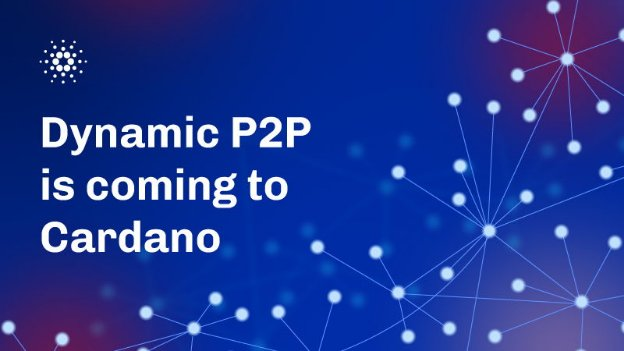

# P2P động khả dụng trên mạng chính

### **Kết nối mạng ngang hàng (P2P) động đi kèm với việc phát hành nút v.1.35.6. Những người tham gia mạng hiện có thể kiểm tra giao tiếp nút tự động mà không cần cấu hình tĩnh**

 16 tháng ba 2023 [Olga Hryniuk](/en/blog/authors/olga-hryniuk/page-1/) 6 phút đọc

###

[**Olga Hryniuk**](/en/blog/authors/olga-hryniuk/page-1/)

Nhà văn kỹ thuật cao cấp

Tiếp thị &amp; Truyền thông

- 
- 

Mạng P2P động là một sự phát triển quan trọng đối với Cardano và tăng cường hơn nữa hiệu suất, khả năng phục hồi và phân cấp của mạng. Bằng cách tự động hóa quy trình lựa chọn ngang hàng, P2P động cho phép giao tiếp nâng cao giữa các nút phân tán và đơn giản hóa quy trình chạy chuyển tiếp hoặc nút tạo khối. Điều này giúp loại bỏ nhu cầu về cấu hình tĩnh và đầu vào thủ công của người điều hành nhóm cổ phần (SPO).

P2P động có chức năng tích hợp sẵn với bản phát hành nút v.1.35.6 ngày hôm nay. Cộng đồng SPO hiện được khuyến khích thử nghiệm chức năng P2P bằng cách cập nhật *một* trong các rơle của họ để sử dụng chế độ cấu trúc liên kết P2P. Trong vài tuần tới, các nhóm IOG và CF cùng với cộng đồng SPO sẽ đánh giá khả năng kết nối mạng để đảm bảo triển khai suôn sẻ chức năng Dynamic P2P.

Dưới đây là thông tin thêm về sự phát triển của mạng Cardano và các tính năng mà Dynamic P2P mang lại.

## **Kết nối**

[Các giao thức mạng của Cardano](https://iohk.io/en/blog/posts/2021/04/06/boosting-network-decentralization-with-p2p/) kết hợp các nút và tương tác của chúng thành một hệ thống thống nhất sử dụng cơ sở hạ tầng truyền thông tiêu chuẩn. Mạng phân phối thông tin về các giao dịch và khối cho tất cả các nút đang hoạt động.

Có hai cách để định cấu hình nút Cardano:

1. Là **nút tạo khối** chịu trách nhiệm tạo khối trên chuỗi khối Cardano. SPO chạy các nút tạo khối yêu cầu các kết nối đến để nhận thông tin khối và các kết nối đi để truyền các khối được tạo. P2P sẽ cho phép sử dụng hai chiều mỗi kết nối, vì vậy thứ tự của các kết nối sẽ không thành vấn đề.
2. Là một **nút chuyển tiếp** , chịu trách nhiệm giao tiếp với các rơle khác trong mạng và phát các khối từ các nút tạo khối. Các nút chuyển tiếp cũng hoạt động như một “lớp phòng thủ” cho các nhà sản xuất khối để đảm bảo rằng các nhà sản xuất khối không tiếp xúc trực tiếp với toàn bộ internet.

## **Đảm bảo độ trễ giao tiếp tối thiểu và khả năng phục hồi tối đa**

Thiết kế của mạng nhằm mục đích giảm thiểu sự chậm trễ trong giao tiếp và tối đa hóa khả năng phục hồi của mạng trước các lỗi, hạn chế về dung lượng hoặc hành vi nguy hiểm.

IOG luôn khuyến nghị các SPO triển khai ***ít nhất hai*** nút chuyển tiếp cho mỗi nút tạo khối để đảm bảo rằng hệ thống thêm khối và xác minh giao dịch một cách hiệu quả. Điều này tăng cường bảo mật và ngăn chặn các cuộc tấn công từ chối dịch vụ (DoS).

Như đã đề cập trong [bài trước](https://iohk.io/en/blog/posts/2021/05/11/cardano-decentralization-continues/) , mạng của Cardano đã phát triển từ cấu trúc liên kết ban đầu sang mô hình P2P kết hợp và hiện tại. Mạng sẽ tiếp tục phát triển với các bổ sung trong tương lai như [Ouroboros Genesis](https://iohk.io/en/blog/posts/2023/02/09/ouroboros-genesis-enhanced-security-in-a-dynamic-environment/) và chia sẻ ngang hàng:

1. **Liên kết** : được giới thiệu trong [giai đoạn phát triển Byron vào năm 2017](https://www.essentialcardano.io/article/what-iog-has-delivered-for-cardano-byron-the-foundation-of-cardano) , lõi IOG và các nút chuyển tiếp duy trì mạng và kết nối người dùng, ví và sàn giao dịch.
2. **Kết hợp** : kể từ [giai đoạn phát triển Shelley vào năm 2020](https://www.essentialcardano.io/article/what-iog-has-delivered-for-cardano-shelley-decentralizing-the-blockchain) , các nút tạo khối gửi và nhận thông tin liên lạc thông qua các rơle đáng tin cậy và/hoặc một công cụ quản lý và phát triển thủ công do cộng đồng gọi là [trình cập nhật cấu trúc liên kết](https://github.com/cardano-community/guild-operators/blob/alpha/docs/Scripts/topologyupdater.md) .
3. **Dynamic P2P** : hiện đang được phát hành, Dynamic P2P cung cấp khả năng tự động hóa và khả năng phục hồi để tối ưu hóa hiệu suất mạng. Rơle SPO có thể tự động kết nối với nhau thông qua tự khám phá và tối ưu hóa.
4. [**Ouroboros Genesis**](https://iohk.io/en/blog/posts/2023/02/09/ouroboros-genesis-enhanced-security-in-a-dynamic-environment/) : đang được phát triển. Bất kỳ ai chạy nút hoặc ví Daedalus của riêng họ sẽ kết nối với một mạng hoàn toàn phi tập trung và tự tổ chức.
5. **Chia sẻ ngang hàng** : đang phát triển. Chia sẻ ngang hàng sẽ tạo điều kiện phát hiện ra các đồng nghiệp tiềm năng chưa được đăng ký trên chuỗi trong mạng nút Cardano tổng thể. Giai đoạn này cũng sẽ cho phép mọi người đóng góp vào việc vận hành mạng, thay vì chỉ sử dụng tài nguyên từ SPO.

## **Trạng thái mạng hiện tại: chế độ kết hợp**

Hiện tại, các nút tạo khối yêu cầu cả kết nối vào và ra để nhận và truyền các khối. Tuy nhiên, việc lựa chọn (trong cấu hình) các kết nối này là một tác vụ thủ công được thực hiện bằng [công cụ cập nhật cấu trúc liên kết](https://github.com/cardano-community/guild-operators/blob/alpha/docs/Scripts/topologyupdater.md) . Công cụ này giúp SPO định cấu hình các nút của họ để kết nối với các nút khác trong mạng và cũng nhận được các bản cập nhật về các thay đổi của mạng (ví dụ: cổ phần, hiệu suất hoặc tính khả dụng).

SPO cần dành thời gian và công sức để chạy công cụ theo cách thủ công. Khi cập nhật các chuyển tiếp của họ, SPO cũng cần đảm bảo rằng các nút tạo khối của họ được kết nối với mạng, nếu không, họ có thể bỏ lỡ một vị trí tạo khối và bất kỳ phần thưởng nào.

## **P2P động tự động kết nối**

P2P động cho phép tự động kết nối các rơle SPO với nhau thông qua tự khám phá và tối ưu hóa, do đó loại bỏ nhu cầu về cấu hình tĩnh và bảo trì SPO thủ công theo yêu cầu của thiết lập kết hợp. P2P làm cho mạng hoạt động hiệu quả hơn và linh hoạt hơn trước những thay đổi như lỗi nút hoặc định tuyến, đồng thời hợp lý hóa luồng thông tin giữa hàng nghìn nút phân tán.

### **P2P động hoạt động như thế nào?**

P2P không chỉ tự động hóa việc lựa chọn cấu hình tĩnh, nó còn năng động hơn thế. Hiện tại, các SPO có thể định cấu hình một nút để kết nối với, chẳng hạn như 50 nút SPO khác. Đây là một con số khá lớn, vì nhiều nút có thể ngoại tuyến, thay đổi địa chỉ, v.v. Trong khi 20 kết nối là đủ để liên lạc hiệu quả, các SPO có thể phải dự phòng quá mức do cấu hình tĩnh.

Trong thiết lập Dynamic P2P, SPO có thể nhắm mục tiêu để định cấu hình 20 kết nối, có thể được chọn từ hàng nghìn rơle SPO, không chỉ 50. Và nếu có bất kỳ kết nối nào đang ngoại tuyến hoặc chuyển sang ngoại tuyến, thiết lập sẽ tự động chọn những kết nối mới để đáp ứng yêu cầu đã đặt mục tiêu. Điều này có nghĩa là cấu hình không còn bị giới hạn trong nhóm tĩnh gồm 50 đồng nghiệp.

P2P cũng cho phép cấu hình tinh vi hơn cho các sắp xếp ngang hàng trực tiếp giữa các SPO. Ví dụ: nếu hai SPO muốn duy trì kết nối giữa các rơle của họ và mỗi bên có hai rơle, thì họ có thể định cấu hình một nhóm ngang hàng liệt kê hai rơle của các SPO khác nhưng với mục tiêu phải có ít nhất một kết nối. Điều này có nghĩa là không cần dự phòng quá mức và SPO vẫn nhận được chuyển đổi dự phòng tự động nếu một rơle gặp sự cố. Với cấu hình tĩnh, người ta phải chọn giữa việc chỉ liệt kê một và do đó không nhận được khả năng phục hồi hoặc liệt kê cả hai và cung cấp quá mức (sử dụng nhiều tài nguyên hơn).

Cuối cùng, P2P tối ưu hóa việc lựa chọn các đồng nghiệp để giảm thiểu thời gian khuếch tán tổng thể trong toàn bộ mạng. Nó làm điều này liên tục và tự động. Nghiên cứu nội bộ của IOG cho thấy rằng một chính sách hoàn toàn dựa trên thông tin địa phương có thể đạt được kết quả toàn cầu gần như tối ưu. Nó đo tần suất mà các đồng nghiệp là người đầu tiên cung cấp tiêu đề khối mà sau này kết thúc trong chuỗi. Các ứng dụng ngang hàng ít hữu ích nhất theo số liệu này sẽ được 'loại bỏ' định kỳ và được thay thế bằng các ứng dụng ngang hàng được chọn ngẫu nhiên khác. Kết quả mô phỏng cho thấy rằng phương pháp quy trình tối ưu hóa đơn giản này đạt được kết quả gần như tối ưu toàn cầu trong một số lần lặp lại tương đối nhỏ, theo thứ tự 24 giờ.

Xem [thông số kỹ thuật](https://input-output-hk.github.io/ouroboros-network/pdfs/network-spec/network-spec.pdf) này để biết thêm chi tiết.

 *Chúng tôi đang tiếp tục chia sẻ thêm các bản cập nhật với cộng đồng SPO và mời mọi người tham gia [nhóm SPO Telegram](https://t.me/SPOannouncements) và [kênh Discord](https://discord.com/invite/inputoutput) để thảo luận kỹ thuật.*
